# マルチテナント実装ガイド

## 概要

このドキュメントは、SaaS管理アプリケーションにおける複数テナント所属対応、管理会社内/外ユーザー区別、グローバル権限システムの実装ガイドです。

## アーキテクチャ概要

### コアコンセプト

1. **複数テナント所属**: 1ユーザーが複数のテナント（顧客組織）に所属可能
2. **管理会社内/外ユーザー**: ログイン可否とメールドメイン制限を区別
3. **テナント固有権限**: テナントごとに異なるロール・権限を付与
4. **グローバル権限**: 全テナント横断でアクセス可能な管理者権限

## データモデル

### 1. TenantUsers コンテナ（新規）

ユーザーとテナントの多対多リレーションを管理する中間テーブル。

```typescript
interface TenantUser {
  id: string;                    // "tenantuser-{uuid}"
  userId: string;                 // パーティションキー
  tenantId: string;
  roles: string[];                // テナント固有のロール
  permissions: string[];          // テナント固有の権限
  status: 'active' | 'inactive';
  joinedAt: string;               // ISO 8601
  createdAt: string;
  updatedAt: string;
  createdBy: string;
  updatedBy: string;
}
```

**パーティションキー**: `/userId`

**インデックス戦略**:
- ユーザーの所属テナント一覧取得: 単一パーティションクエリ（高速）
- テナントのユーザー一覧取得: クロスパーティションクエリ（Redisキャッシング推奨）

### 2. Users コンテナ（拡張）

```typescript
interface User {
  // 既存フィールド
  id: string;
  tenantId: string;               // パーティションキー（プライマリテナント）
  email: string;
  username: string;
  // ... その他既存フィールド

  // 新規フィールド
  userType: 'internal' | 'external';  // 管理会社内/外
  primaryTenantId: string;            // プライマリテナント（通常はsystem-internal）
}
```

**userType別の動作**:
- `internal`: システムログイン可能、複数テナント所属可能、メールドメイン制限あり
- `external`: システムログイン不可、単一テナントのみ所属可能

**プライマリテナント**:
- 管理会社内ユーザー: `system-internal`
- 管理会社外ユーザー: 所属テナントID

### 3. Services コンテナ（新規）

サービスカタログを管理。

```typescript
interface Service {
  id: string;                     // "service-{uuid}"
  tenantId: string;               // パーティションキー（"system-internal"）
  name: string;                   // "ファイル管理", "外部共有", "AIエージェント"
  displayName: string;
  description: string;
  category: string;               // "storage", "collaboration", "ai"
  status: 'active' | 'inactive';
  requiredPlan: string[];         // ["basic", "professional", "enterprise"]
  features: {
    key: string;
    displayName: string;
    enabled: boolean;
  }[];
  createdAt: string;
  updatedAt: string;
}
```

### 4. Tenants コンテナ（拡張）

```typescript
interface Tenant {
  // 既存フィールド
  id: string;
  tenantId: string;
  name: string;
  status: string;
  subscription: { /* ... */ };
  
  // 新規フィールド
  settings: {
    timezone: string;
    locale: string;
    features: { /* ... */ };
    allowedDomains: string[];     // ["@company.com", "@partner.co.jp"]
  };
}
```

## 権限システム

### グローバル権限 vs テナント固有権限

#### 優先順位ロジック

```python
def check_permission(user: User, tenant_id: str, permission: str) -> bool:
    # 1. グローバル権限チェック（Users.permissions with scope='global'）
    if has_global_permission(user, permission):
        return True
    
    # 2. テナント固有権限チェック（TenantUsers.permissions）
    tenant_user = get_tenant_user(user.id, tenant_id)
    if tenant_user and has_tenant_permission(tenant_user, permission):
        return True
    
    return False

def has_global_permission(user: User, permission: str) -> bool:
    """
    scope='global'の権限をチェック
    例: system.*, admin.*, users.*（グローバルスコープ）
    """
    for perm in user.permissions:
        if perm.scope == 'global' and matches_permission(perm.name, permission):
            return True
    return False

def has_tenant_permission(tenant_user: TenantUser, permission: str) -> bool:
    """
    テナント固有の権限をチェック
    例: tenants.{tenant-123}.users.create
    """
    for perm in tenant_user.permissions:
        if matches_permission(perm, permission):
            return True
    return False
```

#### 権限スコープ

| スコープ | 説明 | 使用例 |
|---------|------|--------|
| `global` | 全テナント横断 | `system.*`, `admin.*` with scope='global' |
| `tenant` | 特定テナント内のみ | `users.create` in TenantUsers |
| `own` | 自分のリソースのみ | `profile.update` |

### ロールと権限のマッピング

#### グローバル管理者（Users.roles）

```typescript
{
  roles: ['global-admin'],
  permissions: [
    { name: 'system.*', scope: 'global' },
    { name: 'tenants.*', scope: 'global' },
    { name: 'users.*', scope: 'global' }
  ]
}
```

#### テナント管理者（TenantUsers.roles）

```typescript
{
  roles: ['tenant-admin'],
  permissions: [
    'tenants.read',
    'tenants.update',
    'users.*',
    'services.*'
  ]
}
```

## 認証フロー

### 1. ログイン時の検証

```mermaid
sequenceDiagram
    participant User
    participant Frontend
    participant AuthService
    participant CosmosDB

    User->>Frontend: POST /auth/login
    Frontend->>AuthService: email, password
    AuthService->>CosmosDB: ユーザー検索
    CosmosDB-->>AuthService: User + userType
    
    alt userType == 'external'
        AuthService-->>Frontend: 401 Unauthorized
        Frontend-->>User: ログイン不可メッセージ
    else userType == 'internal'
        AuthService->>CosmosDB: 所属テナント一覧取得（TenantUsers）
        CosmosDB-->>AuthService: TenantUser[]
        AuthService-->>Frontend: JWT + tenants[]
        Frontend-->>User: テナント選択画面
    end
```



### 2. テナント選択フロー

```typescript
// JWTクレーム構造
interface JWTPayload {
  sub: string;              // user.id
  email: string;
  userType: 'internal' | 'external';
  primaryTenantId: string;
  selectedTenantId: string; // ユーザーが選択したテナント
  tenants: {
    id: string;
    name: string;
    roles: string[];
  }[];
  permissions: {
    name: string;
    scope: 'global' | 'tenant' | 'own';
  }[];
  iat: number;
  exp: number;
}
```

### 3. テナント切り替え

```typescript
// POST /auth/switch-tenant
interface SwitchTenantRequest {
  tenantId: string;
}

interface SwitchTenantResponse {
  accessToken: string;      // 新しいJWT（selectedTenantId更新）
  tenant: {
    id: string;
    name: string;
    roles: string[];
    permissions: string[];
  };
}
```

## メールドメイン検証

### バックエンド実装

```python
# user-management-service
from fastapi import HTTPException

def validate_email_domain(email: str, tenant: Tenant) -> bool:
    """
    管理会社内ユーザーのメールドメインを検証
    """
    if not tenant.settings.get('allowedDomains'):
        raise HTTPException(
            status_code=400,
            detail="テナントに許可ドメインが設定されていません"
        )
    
    domain = email.split('@')[1] if '@' in email else None
    if not domain:
        raise HTTPException(status_code=400, detail="無効なメールアドレス")
    
    allowed = [f"@{d}" if not d.startswith('@') else d 
               for d in tenant.settings['allowedDomains']]
    
    if f"@{domain}" not in allowed:
        raise HTTPException(
            status_code=400,
            detail=f"許可されたドメイン（{', '.join(allowed)}）のメールアドレスを使用してください"
        )
    
    return True

# ユーザー作成時
@router.post("/api/users")
async def create_user(user_data: UserCreate):
    if user_data.userType == 'internal':
        tenant = await get_tenant('system-internal')
        validate_email_domain(user_data.email, tenant)
    
    # ユーザー作成処理
    # ...
```

### フロントエンド実装

```typescript
// リアルタイム検証
const validateEmailDomain = async (email: string) => {
  const response = await api.post('/api/users/validate-email', { email });
  return response.data.valid;
};

// フォームバリデーション
const schema = yup.object({
  email: yup.string()
    .email('有効なメールアドレスを入力してください')
    .test('domain-check', '許可されたドメインではありません', async (value) => {
      if (!value) return false;
      return await validateEmailDomain(value);
    })
});
```

## Redisキャッシング戦略

### キャッシュ対象

1. **TenantUsersクエリ結果** (TTL: 5分)
2. **サービス設定** (TTL: 10分)
3. **権限定義** (TTL: 15分)

### 実装例

```python
import redis
import json
from typing import List

redis_client = redis.Redis(host='localhost', port=6379, decode_responses=True)

async def get_user_tenants(user_id: str) -> List[TenantUser]:
    cache_key = f"user:tenants:{user_id}"
    
    # キャッシュチェック
    cached = redis_client.get(cache_key)
    if cached:
        return json.loads(cached)
    
    # CosmosDBクエリ
    query = f"SELECT * FROM c WHERE c.userId = @user_id AND c.status = 'active'"
    items = list(container.query_items(
        query=query,
        parameters=[{"name": "@user_id", "value": user_id}],
        partition_key=user_id
    ))
    
    # キャッシュ保存（5分）
    redis_client.setex(cache_key, 300, json.dumps(items))
    
    return items

async def invalidate_user_tenants_cache(user_id: str):
    """TenantUsers更新時にキャッシュ無効化"""
    redis_client.delete(f"user:tenants:{user_id}")
```

## フロントエンド実装

### テナント選択ドロップダウン

```tsx
// components/TenantSelector.tsx
import { useState } from 'react';
import { useAuth } from '@/contexts/AuthContext';

export const TenantSelector = () => {
  const { user, selectedTenant, tenants, switchTenant } = useAuth();
  const [isOpen, setIsOpen] = useState(false);

  const handleSwitch = async (tenantId: string) => {
    await switchTenant(tenantId);
    setIsOpen(false);
  };

  return (
    <div className="relative">
      <button
        onClick={() => setIsOpen(!isOpen)}
        className="flex items-center gap-2 px-4 py-2 bg-white border rounded-lg"
      >
        <BuildingIcon className="w-5 h-5" />
        <span>{selectedTenant?.name || 'テナント選択'}</span>
        <ChevronDownIcon className="w-4 h-4" />
      </button>

      {isOpen && (
        <div className="absolute top-full mt-2 w-64 bg-white border rounded-lg shadow-lg">
          {tenants.map((tenant) => (
            <button
              key={tenant.id}
              onClick={() => handleSwitch(tenant.id)}
              className={`w-full px-4 py-3 text-left hover:bg-gray-50 ${
                selectedTenant?.id === tenant.id ? 'bg-blue-50' : ''
              }`}
            >
              <div className="font-medium">{tenant.name}</div>
              <div className="text-sm text-gray-500">
                {tenant.roles.join(', ')}
              </div>
            </button>
          ))}
        </div>
      )}
    </div>
  );
};
```

### 複数テナント紐付けUI

```tsx
// pages/users/[id]/tenants.tsx
export const UserTenantsPage = () => {
  const [availableTenants, setAvailableTenants] = useState<Tenant[]>([]);
  const [userTenants, setUserTenants] = useState<TenantUser[]>([]);

  const addTenant = async (tenantId: string, roles: string[]) => {
    await api.post(`/api/users/${userId}/tenants`, {
      tenantId,
      roles,
      permissions: []
    });
    // 再取得
  };

  const removeTenant = async (tenantId: string) => {
    await api.delete(`/api/users/${userId}/tenants/${tenantId}`);
    // 再取得
  };

  return (
    <div className="space-y-6">
      <h2>所属テナント管理</h2>
      
      {/* 既存の所属テナント */}
      <div className="space-y-2">
        {userTenants.map((tu) => (
          <div key={tu.tenantId} className="flex items-center justify-between p-4 border rounded">
            <div>
              <div className="font-medium">{tu.tenant.name}</div>
              <div className="text-sm text-gray-500">
                ロール: {tu.roles.join(', ')}
              </div>
            </div>
            <button onClick={() => removeTenant(tu.tenantId)}>削除</button>
          </div>
        ))}
      </div>

      {/* テナント追加 */}
      <button onClick={() => setShowAddModal(true)}>
        テナント追加
      </button>
    </div>
  );
};
```

## セキュリティ考慮事項

### 1. テナント間データ漏洩防止

- 全APIリクエストで`selectedTenantId`を検証
- CosmosDBクエリに必ずパーティションキー（tenantId）を含める
- グローバル権限を持つユーザーのみクロステナントクエリ許可

### 2. 権限エスカレーション防止

```python
@require_permission("users.update")
async def update_user_tenant_roles(user_id: str, tenant_id: str, new_roles: List[str]):
    # 自分より上位のロールを付与できないようにする
    current_user_roles = get_current_user_roles(tenant_id)
    max_role_level = get_max_role_level(current_user_roles)
    
    for role in new_roles:
        if get_role_level(role) > max_role_level:
            raise HTTPException(403, "自分より上位のロールは付与できません")
    
    # 更新処理
    # ...
```

### 3. セッション管理

- JWT有効期限: 1時間
- リフレッシュトークン: 7日間
- テナント切り替え時に新しいJWT発行
- ログアウト時に全トークンを無効化

## パフォーマンス最適化

### 1. クエリ最適化

```sql
-- ❌ 非効率: クロスパーティションクエリ
SELECT * FROM c WHERE c.tenantId = 'tenant-123'

-- ✅ 効率的: 単一パーティションクエリ
SELECT * FROM c WHERE c.userId = 'user-456'
```

### 2. バッチ処理

複数ユーザーのテナント追加は一括処理:

```python
async def bulk_add_users_to_tenant(tenant_id: str, user_ids: List[str]):
    operations = []
    for user_id in user_ids:
        tenant_user = TenantUser(
            id=f"tenantuser-{uuid4()}",
            userId=user_id,
            tenantId=tenant_id,
            # ...
        )
        operations.append(('create', tenant_user))
    
    # CosmosDB bulk insert
    await container.execute_batch_operations(operations)
```

### 3. フロントエンド最適化

- テナント一覧はログイン時に取得し、ローカルキャッシュ
- 頻繁にアクセスする権限情報はメモリキャッシュ
- 大量データはページネーション+仮想スクロール

## トラブルシューティング

### Q: ユーザーがテナントAでログインできない

**チェックポイント**:
1. TenantUsersテーブルにレコードが存在するか
2. status が 'active' か
3. userType が 'internal' か
4. JWTのtenants配列にテナントAが含まれているか

### Q: 権限チェックが失敗する

**チェックポイント**:
1. グローバル権限とテナント固有権限の優先順位を確認
2. 権限名が正しいか（ワイルドカードマッチを考慮）
3. スコープ（global/tenant/own）が正しいか
4. 権限キャッシュが古くなっていないか

### Q: メールドメイン検証が通らない

**チェックポイント**:
1. Tenant.settings.allowedDomainsが設定されているか
2. ドメイン形式が正しいか（@付きか、なしか）
3. 大文字小文字を区別しているか（区別しないべき）

## 関連ドキュメント

- [CosmosDB スキーマ](./database/SCHEMA.md)
- [スキーマ移行ガイド](./database/SCHEMA_MIGRATION_V2.md)
- [権限システム ADR](./adr/005-dot-notation-permission-system.md)
- [開発計画](../DEVELOPMENT_PLAN.md)

## Issue参照

- **#021**: Schema Extension - TenantUsers, Services, userType Field
- **#022**: Seed Data Reconstruction
- **#023**: Auth Service Extension
- **#024**: Permission System Extension
- **#026**: User & TenantUsers Management API
