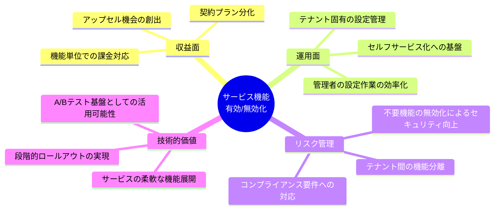
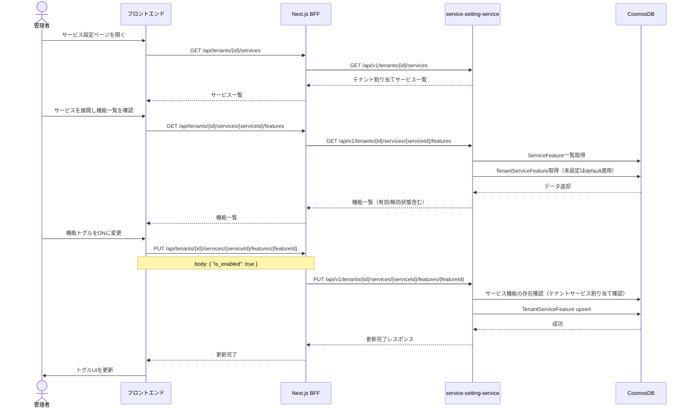
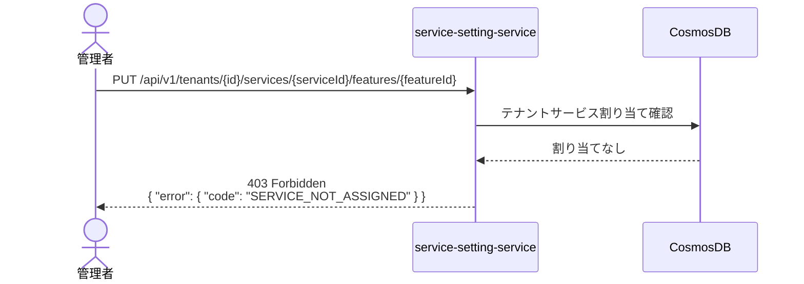
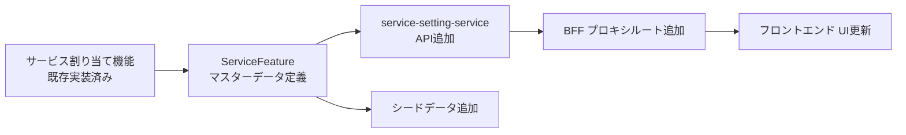

# 01 — 概要とビジネス要件

## ドキュメント情報

| 項目 | 値 |
|---|---|
| **ドキュメントID** | SPEC-SFM-01 |
| **バージョン** | 1.0.0 |
| **作成日** | 2026-02-19 |
| **ISO 29148 分類** | StRS (Stakeholder Requirements Specification) |
| **ステータス** | Draft |

---

## 目次

1. [機能の目的と背景](#1-機能の目的と背景)
2. [ビジネスインパクト](#2-ビジネスインパクト)
3. [ステークホルダー要件](#3-ステークホルダー要件)
4. [ユースケース](#4-ユースケース)
5. [スコープと前提条件](#5-スコープと前提条件)
6. [優先度と依存関係](#6-優先度と依存関係)

---

## 1. 機能の目的と背景

### 1.1 背景

本システムはマルチテナントSaaSプラットフォームとして複数のサービスをテナントに提供する。現状、テナントへのサービスの割り当て（有効/無効化）は実装済みであるが、**サービス内部の個別機能の有効/無効を制御する仕組みが存在しない**。

同一サービスを利用するテナントであっても、契約プラン・セキュリティポリシー・運用ニーズに応じて利用可能な機能を細かく制御したいというニーズが発生している。

例として：
- テナントAはファイル管理サービスを契約しているが、外部共有機能は契約外のため無効化したい
- テナントBは認証認可サービスでMFAを必須化する運用ポリシーがある
- テナントCは小規模のためバックアップの増分バックアップ機能を有効にしていない

### 1.2 目的

- サービスマスターに紐づく機能定義（`ServiceFeature`）を管理する
- テナントごとに各機能の有効/無効状態（`TenantServiceFeature`）を管理する
- 管理者がUIから機能の有効/無効を切り替えられる操作インターフェースを提供する
- テナントが利用可能なサービスのみ機能設定対象とする（サービス未割り当て時は機能設定不可）

### 1.3 機能が必須とされる理由

| 理由 | 詳細 |
|---|---|
| **契約プラン対応** | 契約内容に応じて利用可能な機能を制限することで、段階的な課金モデルへの移行が可能になる |
| **セキュリティポリシー準拠** | テナントごとのセキュリティポリシー（MFA強制・監査ログ必須化等）をシステムで強制できる |
| **サービス品質保証** | テナントに不要な機能を無効化することで、誤操作や不要なデータ生成を防止する |
| **段階的展開** | 新機能のロールアウトをテナント単位で制御できる（早期アクセスプログラム等） |
| **PoCの拡張性** | 現行PoCから商用プロダクトへ進化させる際の course correction コストを削減する |

---

## 2. ビジネスインパクト

### 2.1 直接的インパクト

### 2.2 KPIへの貢献

| KPI | 期待される効果 |
|---|---|
| テナント解約率 | 契約に合った機能のみ提供することで不要なクレームが減少 |
| 管理者作業コスト | UIからの直接操作により設定変更のためのサポート対応が減少 |
| セキュリティインシデント | 不必要な機能の無効化によりアタックサーフェスが縮小 |
| 新機能展開速度 | 機能フラグ基盤として活用することで安全なロールアウトが可能 |

---

## 3. ステークホルダー要件

### 3.1 ステークホルダー一覧

| ステークホルダー | ロール | 関心事 |
|---|---|---|
| **SaaS事業者（特権テナント）** | システム全体管理者 | 全テナントの機能設定の一元管理、サービス機能マスターの定義 |
| **テナント管理者** | テナント内管理者 | 自テナントの機能有効/無効の確認・変更 |
| **テナントユーザー** | エンドユーザー | 有効化された機能のみを操作できること |
| **セキュリティ担当者** | コンプライアンス管理 | テナントポリシーに沿った機能制限の保証 |
| **開発チーム** | 実装・運用 | 拡張性のある設計、既存機能への影響最小化 |

### 3.2 ステークホルダー要件定義

#### STK-01: SaaS事業者の要件

| ID | 要件 | 優先度 |
|---|---|---|
| STK-01-01 | サービスマスターに機能を登録・管理できる | Must |
| STK-01-02 | 任意のテナントの任意のサービス機能を有効/無効化できる | Must |
| STK-01-03 | 機能のデフォルト有効/無効状態を設定できる | Must |
| STK-01-04 | テナントに割り当てられていないサービスの機能は設定できない | Must |

#### STK-02: テナント管理者の要件

| ID | 要件 | 優先度 |
|---|---|---|
| STK-02-01 | 自テナントが利用するサービスの機能一覧を確認できる | Must |
| STK-02-02 | 各機能の現在の有効/無効状態を確認できる | Must |
| STK-02-03 | UIから機能の有効/無効を切り替えられる | Must |
| STK-02-04 | 他のテナントの機能設定は閲覧・変更できない | Must |

#### STK-03: テナントユーザーの要件

| ID | 要件 | 優先度 |
|---|---|---|
| STK-03-01 | 無効化されている機能には操作できない（モックサービスの場合はUIで表示しない） | Should |

---

## 4. ユースケース

### 4.1 ユースケース一覧

| ID | ユースケース | アクター | 頻度 |
|---|---|---|---|
| UC-01 | サービス機能マスター一覧の確認 | 管理者 | 低 |
| UC-02 | テナントのサービス機能設定一覧の確認 | 管理者 | 中 |
| UC-03 | テナントのサービス機能の有効化 | 管理者 | 中 |
| UC-04 | テナントのサービス機能の無効化 | 管理者 | 中 |
| UC-05 | サービス未割り当て時の機能設定拒否 | システム自動 | 低 |

### 4.2 主要ユースケース詳細

#### UC-03: テナントのサービス機能の有効化

#### UC-05: サービス未割り当て時の拒否フロー

---

## 5. スコープと前提条件

### 5.1 スコープ

**対象（In-Scope）**:
- `ServiceFeature` モデルの定義と初期データ登録（全7サービス、合計17機能）
- `TenantServiceFeature` モデルの定義と初期サンプルデータ登録
- service-setting-service への3エンドポイント追加
- Next.js BFFへのプロキシルート追加
- フロントエンド サービス設定ページへの機能一覧&トグルUI追加

**対象外（Out-of-Scope）**:
- 各モックサービス（service-004〜007）内部での機能フラグ判定処理（モックのため実動作への影響なし）
- 課金プランとの自動紐付け
- 機能のロールアウト履歴管理

### 5.2 前提条件

| 前提 | 詳細 |
|---|---|
| サービス割り当て済み | テナントへのサービス割り当て機能が動作していること |
| 認証認可済み | JWT認証が動作しており、`global_admin` / `admin` ロールが識別可能なこと |
| CosmosDB接続 | 開発環境の CosmosDB Emulator が稼働していること |
| `services` コンテナ | パーティションキー `/id` の `services` コンテナが存在すること |
| `tenant_services` コンテナ | パーティションキー `/tenant_id` の `tenant_services` コンテナが存在すること |

### 5.3 制約事項

| 制約 | 詳細 |
|---|---|
| 機能はサービスマスターに事前定義 | 動的な機能追加はUIからは不可（シードデータまたはDB操作で管理） |
| 割り当て解除時の機能設定の扱い | サービスをテナントから削除した場合、`TenantServiceFeature` レコードは残存するが参照できない |
| PoCのため機能数は固定 | 本番化時には機能の動的追加APIの整備が必要 |

---

## 6. 優先度と依存関係

### 6.1 機能優先度

| 機能 | MoSCoW | 理由 |
|---|---|---|
| ServiceFeature マスターデータ定義 | Must | 他すべての機能の前提 |
| テナント別機能設定 API | Must | 機能の核心 |
| フロントエンドトグルUI（機能一覧表示） | Must | 管理者操作の主経路 |
| フロントエンド UI（有効/無効切り替え） | Must | 必須操作 |
| サービス未割り当て時の拒否制御 | Must | データ整合性保証 |
| デフォルト値の自動適用（未設定時） | Should | UX改善 |
| モックサービスでの機能フラグ反映 | Could | PoCのため現時点では影響範囲外 |

### 6.2 依存関係

---

## 変更履歴

| バージョン | 日付 | 変更内容 | 作成者 |
|---|---|---|---|
| 1.0.0 | 2026-02-19 | 初版作成 | Copilot |
