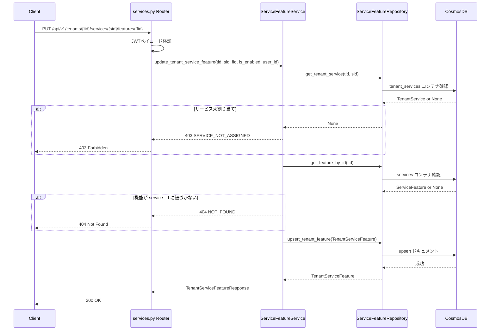

# 04 — API仕様

## ドキュメント情報

| 項目 | 値 |
|---|---|
| **ドキュメントID** | SPEC-SFM-04 |
| **バージョン** | 1.0.0 |
| **作成日** | 2026-02-19 |
| **ISO 29148 分類** | SyRS — Interface Specification |
| **ステータス** | Draft |

---

## 目次

1. [API概要](#1-api概要)
2. [service-setting-service API](#2-service-setting-service-api)
3. [BFF APIルート (Next.js)](#3-bff-apiルート-nextjs)
4. [フロントエンドクライアント](#4-フロントエンドクライアント)
5. [エラー定義](#5-エラー定義)

---

## 1. API概要

### 1.1 新規追加エンドポイント一覧

| サービス | メソッド | パス | 説明 |
|---|---|---|---|
| service-setting-service | GET | `/api/v1/services/{service_id}/features` | サービス機能マスター一覧取得 |
| service-setting-service | GET | `/api/v1/tenants/{tenant_id}/services/{service_id}/features` | テナント別機能設定一覧取得 |
| service-setting-service | PUT | `/api/v1/tenants/{tenant_id}/services/{service_id}/features/{feature_id}` | テナント別機能の有効/無効切り替え |
| BFF (Next.js) | GET | `/api/services/{id}/features` | BFF プロキシ |
| BFF (Next.js) | GET | `/api/tenants/{id}/services/{serviceId}/features` | BFF プロキシ |
| BFF (Next.js) | PUT | `/api/tenants/{id}/services/{serviceId}/features/{featureId}` | BFF プロキシ |

### 1.2 共通事項

- **認証**: 全エンドポイントで JWT Bearer 認証必須
- **ベースURL**: `http://localhost:8003` (service-setting-service)
- **Content-Type**: `application/json`
- **バージョニング**: `/api/v1/` プレフィックス

---

## 2. service-setting-service API

### 2.1 GET `/api/v1/services/{service_id}/features`

サービスマスターに紐づく機能定義一覧を取得する。

#### リクエスト

```http
GET /api/v1/services/{service_id}/features
Authorization: Bearer {JWT_TOKEN}
```

**パスパラメータ**:

| パラメータ | 型 | 必須 | 説明 |
|---|---|---|---|
| `service_id` | string | ✓ | サービスID（例: `service-004`） |

#### レスポンス

**200 OK**:

```json
{
  "service_id": "service-004",
  "features": [
    {
      "id": "feature-service-004-01",
      "service_id": "service-004",
      "feature_key": "version_control",
      "feature_name": "バージョン管理",
      "description": "ファイルのバージョン履歴を管理する機能",
      "default_enabled": true,
      "created_at": "2026-01-01T00:00:00Z"
    },
    {
      "id": "feature-service-004-02",
      "service_id": "service-004",
      "feature_key": "file_sharing",
      "feature_name": "ファイル外部共有",
      "description": "組織外へのファイル共有リンクを生成・管理する機能",
      "default_enabled": false,
      "created_at": "2026-01-01T00:00:00Z"
    },
    {
      "id": "feature-service-004-03",
      "service_id": "service-004",
      "feature_key": "auto_backup",
      "feature_name": "自動バックアップ",
      "description": "ファイルデータを定期的に自動バックアップする機能",
      "default_enabled": true,
      "created_at": "2026-01-01T00:00:00Z"
    }
  ]
}
```

**エラーレスポンス**:

| コード | エラーコード | 条件 |
|---|---|---|
| 401 | `UNAUTHORIZED` | JWT 未提供・invalid |
| 404 | `NOT_FOUND` | `service_id` が存在しない |

---

### 2.2 GET `/api/v1/tenants/{tenant_id}/services/{service_id}/features`

テナントの特定サービスについて、機能ごとの有効/無効設定一覧を取得する。テナント設定が未登録の機能については `ServiceFeature.default_enabled` の値を返す。

#### リクエスト

```http
GET /api/v1/tenants/{tenant_id}/services/{service_id}/features
Authorization: Bearer {JWT_TOKEN}
```

**パスパラメータ**:

| パラメータ | 型 | 必須 | 説明 |
|---|---|---|---|
| `tenant_id` | string | ✓ | テナントID |
| `service_id` | string | ✓ | サービスID |

#### レスポンス

**200 OK**:

```json
{
  "tenant_id": "tenant-sample-001",
  "service_id": "service-004",
  "features": [
    {
      "feature_id": "feature-service-004-01",
      "service_id": "service-004",
      "feature_key": "version_control",
      "feature_name": "バージョン管理",
      "description": "ファイルのバージョン履歴を管理する機能",
      "is_enabled": true,
      "is_default": true,
      "updated_at": null,
      "updated_by": null
    },
    {
      "feature_id": "feature-service-004-02",
      "service_id": "service-004",
      "feature_key": "file_sharing",
      "feature_name": "ファイル外部共有",
      "description": "組織外へのファイル共有リンクを生成・管理する機能",
      "is_enabled": true,
      "is_default": false,
      "updated_at": "2026-02-01T10:30:00Z",
      "updated_by": "admin-user-001"
    },
    {
      "feature_id": "feature-service-004-03",
      "service_id": "service-004",
      "feature_key": "auto_backup",
      "feature_name": "自動バックアップ",
      "description": "ファイルデータを定期的に自動バックアップする機能",
      "is_enabled": true,
      "is_default": true,
      "updated_at": null,
      "updated_by": null
    }
  ]
}
```

| フィールド | 説明 |
|---|---|
| `is_default` | `true` = テナント設定未登録でデフォルト値を返している, `false` = テナント設定済み |
| `updated_at` | テナント設定が存在する場合のみ値あり |
| `updated_by` | テナント設定が存在する場合のみ値あり |

**エラーレスポンス**:

| コード | エラーコード | 条件 |
|---|---|---|
| 401 | `UNAUTHORIZED` | JWT 未提供・invalid |
| 403 | `SERVICE_NOT_ASSIGNED` | テナントにサービスが割り当てられていない |
| 404 | `NOT_FOUND` | `tenant_id` または `service_id` が存在しない |

---

### 2.3 PUT `/api/v1/tenants/{tenant_id}/services/{service_id}/features/{feature_id}`

テナントの特定サービス機能の有効/無効状態を更新する。

#### リクエスト

```http
PUT /api/v1/tenants/{tenant_id}/services/{service_id}/features/{feature_id}
Authorization: Bearer {JWT_TOKEN}
Content-Type: application/json
```

**パスパラメータ**:

| パラメータ | 型 | 必須 | 説明 |
|---|---|---|---|
| `tenant_id` | string | ✓ | テナントID |
| `service_id` | string | ✓ | サービスID |
| `feature_id` | string | ✓ | 機能ID |

**リクエストボディ**:

```json
{
  "is_enabled": true
}
```

| フィールド | 型 | 必須 | 説明 |
|---|---|---|---|
| `is_enabled` | boolean | ✓ | 設定後の有効/無効状態 |

> **冪等性**: 同一リクエストを複数回送信しても結果は変わらない（Upsert 実装のため安全）。

#### レスポンス

**200 OK**:

```json
{
  "feature_id": "feature-service-004-02",
  "service_id": "service-004",
  "feature_key": "file_sharing",
  "feature_name": "ファイル外部共有",
  "description": "組織外へのファイル共有リンクを生成・管理する機能",
  "is_enabled": true,
  "is_default": false,
  "updated_at": "2026-02-19T12:00:00Z",
  "updated_by": "user-uuid-of-caller"
}
```

**エラーレスポンス**:

| コード | エラーコード | 条件 |
|---|---|---|
| 400 | `VALIDATION_ERROR` | リクエストボディ不正（`is_enabled` が boolean でない等） |
| 401 | `UNAUTHORIZED` | JWT 未提供・invalid |
| 403 | `FORBIDDEN` | ロール不足（`global_admin` または `admin` でない） |
| 403 | `SERVICE_NOT_ASSIGNED` | テナントにサービスが割り当てられていない |
| 404 | `NOT_FOUND` | `feature_id` が指定の `service_id` に紐づかない |

#### シーケンス図



---

## 3. BFF APIルート (Next.js)

BFF は認証（`getSession()`によるJWT取得）後、service-setting-service にリクエストをプロキシする。

### 3.1 GET `/api/services/[id]/features`

**ファイル**: `src/front/app/api/services/[id]/features/route.ts`

```typescript
// GET /api/services/{id}/features
// → Proxy: GET http://service-setting-service:8003/api/v1/services/{id}/features
```

### 3.2 GET `/api/tenants/[id]/services/[serviceId]/features`

**ファイル**: `src/front/app/api/tenants/[id]/services/[serviceId]/features/route.ts`

```typescript
// GET /api/tenants/{id}/services/{serviceId}/features
// → Proxy: GET http://service-setting-service:8003/api/v1/tenants/{id}/services/{serviceId}/features
```

### 3.3 PUT `/api/tenants/[id]/services/[serviceId]/features/[featureId]`

**ファイル**: `src/front/app/api/tenants/[id]/services/[serviceId]/features/[featureId]/route.ts`

```typescript
// PUT /api/tenants/{id}/services/{serviceId}/features/{featureId}
// body: { "is_enabled": boolean }
// → Proxy: PUT http://service-setting-service:8003/api/v1/tenants/{id}/services/{serviceId}/features/{featureId}
```

---

## 4. フロントエンドクライアント

### 4.1 TypeScript 型定義追加 (`types/index.ts`)

```typescript
/** サービス機能マスター */
interface ServiceFeature {
  id: string;
  serviceId: string;
  featureKey: string;
  featureName: string;
  description: string;
  defaultEnabled: boolean;
  createdAt: string;
}

/** テナント別機能設定（マスターとマージ済みレスポンス） */
interface TenantServiceFeature {
  featureId: string;
  serviceId: string;
  featureKey: string;
  featureName: string;
  description: string;
  isEnabled: boolean;
  isDefault: boolean;       // true = テナント設定未登録でデフォルト値
  updatedAt: string | null;
  updatedBy: string | null;
}
```

### 4.2 API クライアントメソッド追加 (`lib/api-client.ts`)

```typescript
// サービス機能マスター取得
async getServiceFeatures(serviceId: string): Promise<ServiceFeature[]>

// テナント別機能設定一覧取得
async getTenantServiceFeatures(
  tenantId: string, serviceId: string
): Promise<TenantServiceFeature[]>

// テナント別機能設定更新
async updateTenantServiceFeature(
  tenantId: string, serviceId: string, featureId: string,
  isEnabled: boolean
): Promise<TenantServiceFeature>
```

---

## 5. エラー定義

### 5.1 新規エラーコード

既存のエラーコード体系（[API共通仕様](../../../arch/api/api-specification.md) 1.4参照）に以下を追加:

| コード | HTTP Status | 説明 |
|---|---|---|
| `SERVICE_NOT_ASSIGNED` | 403 | テナントに対象サービスが割り当てられていないため機能設定不可 |

### 5.2 エラーレスポンス例

```json
{
  "error": {
    "code": "SERVICE_NOT_ASSIGNED",
    "message": "Service 'service-004' is not assigned to tenant 'tenant-sample-001'",
    "timestamp": "2026-02-19T12:00:00Z",
    "request_id": "request-uuid"
  }
}
```

---

## 変更履歴

| バージョン | 日付 | 変更内容 | 作成者 |
|---|---|---|---|
| 1.0.0 | 2026-02-19 | 初版作成 | Copilot |
| 1.0.1 | 2026-02-19 | レビュー指摘対応: PUT 冪等性の明記追加 | Copilot |
