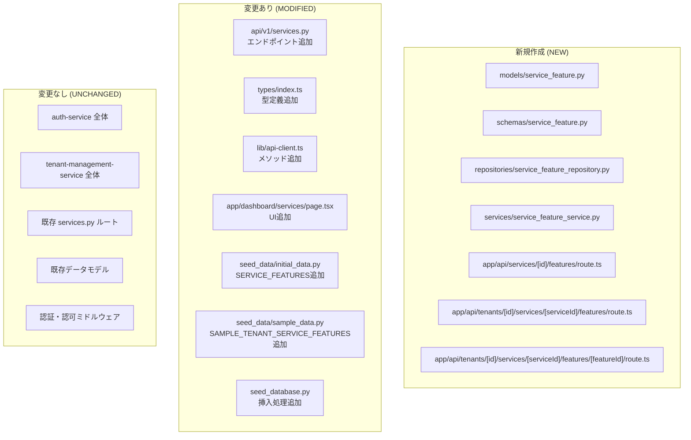
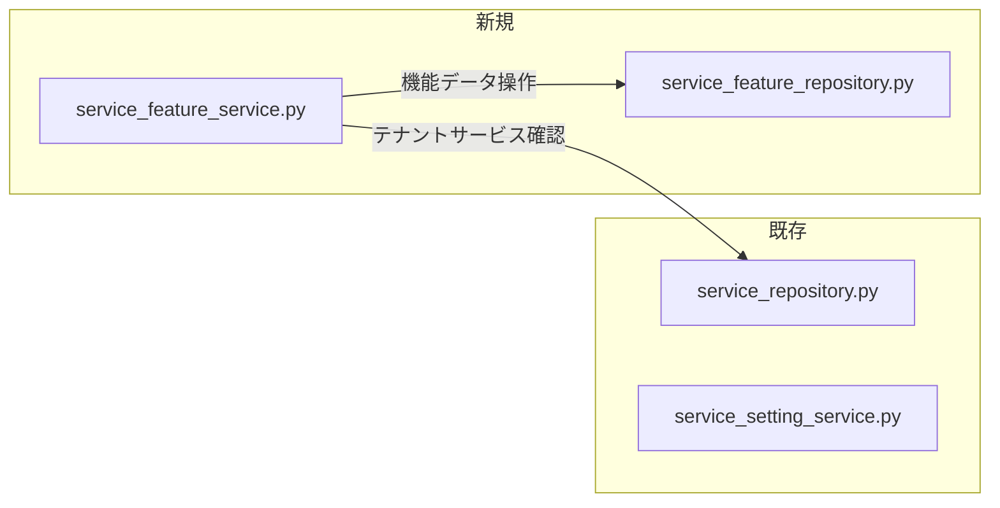

# 05 — 影響範囲分析

## ドキュメント情報

| 項目 | 値 |
|---|---|
| **ドキュメントID** | SPEC-SFM-05 |
| **バージョン** | 1.0.0 |
| **作成日** | 2026-02-19 |
| **ISO 29148 分類** | SyRS — Traceability / Impact Analysis |
| **ステータス** | Draft |

---

## 目次

1. [影響範囲サマリー](#1-影響範囲サマリー)
2. [service-setting-service への影響](#2-service-setting-service-への影響)
3. [フロントエンド (Next.js) への影響](#3-フロントエンド-nextjs-への影響)
4. [スクリプト・シードデータへの影響](#4-スクリプトシードデータへの影響)
5. [CosmosDB への影響](#5-cosmosdb-への影響)
6. [横断的影響](#6-横断的影響)
7. [変更不要コンポーネント](#7-変更不要コンポーネント)

---

## 1. 影響範囲サマリー



**変更ファイル数**: 新規作成 7ファイル、既存変更 8ファイル（`setup_database.sh` 追加）、合計 15ファイル

---

## 2. service-setting-service への影響

### 2.1 新規作成ファイル

#### `src/service-setting-service/app/models/service_feature.py`

| 項目 | 内容 |
|---|---|
| **種別** | 新規作成 |
| **目的** | `ServiceFeature` / `TenantServiceFeature` CosmosDB ドキュメントモデル |
| **依存** | `pydantic`, `datetime` |
| **下流影響** | `repositories/service_feature_repository.py`, `services/service_feature_service.py` が依存 |

#### `src/service-setting-service/app/schemas/service_feature.py`

| 項目 | 内容 |
|---|---|
| **種別** | 新規作成 |
| **目的** | `ServiceFeatureResponse` / `TenantServiceFeatureResponse` / `UpdateTenantServiceFeatureRequest` API スキーマ |
| **依存** | `pydantic`, `datetime` |
| **下流影響** | `api/v1/services.py` が依存 |

#### `src/service-setting-service/app/repositories/service_feature_repository.py`

| 項目 | 内容 |
|---|---|
| **種別** | 新規作成 |
| **目的** | CosmosDB CRUD 操作（async）|
| **依存** | `azure-cosmos`（async版）, `models/service_feature.py`, `config.py` |
| **利用先** | `services/service_feature_service.py` |
| **CosmosDB** | `services` コンテナ（GET）, `tenant_services` コンテナ（GET / UPSERT） |

#### `src/service-setting-service/app/services/service_feature_service.py`

| 項目 | 内容 |
|---|---|
| **種別** | 新規作成 |
| **目的** | ビジネスロジック（割り当て確認、マスターとテナント設定のマージ） |
| **依存** | `repositories/service_feature_repository.py`, `repositories/service_repository.py` |
| **主要ロジック** | `get_service_features()`, `get_tenant_service_features()`, `update_tenant_service_feature()` |

### 2.2 変更ファイル

#### `src/service-setting-service/app/api/v1/services.py`

| 項目 | 内容 |
|---|---|
| **種別** | 既存ファイル変更 |
| **変更内容** | 3エンドポイント追加 |
| **既存への影響** | 既存エンドポイントの変更なし。追加のみ |
| **追加エンドポイント** | `GET /services/{service_id}/features`, `GET /tenants/{tenant_id}/services/{service_id}/features`, `PUT /tenants/{tenant_id}/services/{service_id}/features/{feature_id}` |

> 既存の `get_services()`, `get_service()`, `get_tenant_services()`, `assign_service()`, `unassign_service()` ハンドラは**変更なし**。

### 2.3 既存コードとの相互作用



`service_feature_service.py` はテナントへのサービス割り当て確認のために、既存の `service_repository.py` の `get_tenant_service()` メソッドを呼び出す。**既存コードの変更なし**。

---

## 3. フロントエンド (Next.js) への影響

### 3.1 新規作成ファイル

#### `src/front/app/api/services/[id]/features/route.ts`

| 項目 | 内容 |
|---|---|
| **種別** | 新規作成 |
| **目的** | サービス機能マスター一覧の BFF プロキシ |
| **実装パターン** | 既存の `app/api/services/route.ts` に準拠 |

#### `src/front/app/api/tenants/[id]/services/[serviceId]/features/route.ts`

| 項目 | 内容 |
|---|---|
| **種別** | 新規作成 |
| **目的** | テナント別機能設定一覧の BFF プロキシ |
| **実装パターン** | 既存の `app/api/tenants/[id]/services/route.ts` に準拠 |

#### `src/front/app/api/tenants/[id]/services/[serviceId]/features/[featureId]/route.ts`

| 項目 | 内容 |
|---|---|
| **種別** | 新規作成 |
| **目的** | テナント別機能の有効/無効切り替え BFF プロキシ |
| **実装パターン** | 既存の `app/api/tenants/[id]/services/[serviceId]/route.ts` に準拠 |

### 3.2 変更ファイル

#### `src/front/types/index.ts`

| 項目 | 内容 |
|---|---|
| **種別** | 既存ファイル変更 |
| **変更内容** | `ServiceFeature`, `TenantServiceFeature` インターフェース追加 |
| **既存への影響** | 追加のみ。既存の `Service`, `TenantService` 型は変更なし |

#### `src/front/lib/api-client.ts`

| 項目 | 内容 |
|---|---|
| **種別** | 既存ファイル変更 |
| **変更内容** | `getServiceFeatures()`, `getTenantServiceFeatures()`, `updateTenantServiceFeature()` メソッド追加 |
| **既存への影響** | 追加のみ。既存メソッドの変更なし |

#### `src/front/app/dashboard/services/page.tsx`

| 項目 | 内容 |
|---|---|
| **種別** | 既存ファイル変更（主要な変更） |
| **変更内容** | サービス行の展開機能と機能一覧 UI の追加 |
| **既存への影響** | 既存の「サービス割り当て/解除」機能は変更なし。UI の追加のみ |

**UIの変更箇所**:

```
[変更前のサービス設定テーブル]
┌────────────────────────────────────────────────────────────┐
│ サービス名 │ 利用可能なロール │ ステータス │ 操作         │
├────────────────────────────────────────────────────────────┤
│ ファイル管理│ admin / user   │ 割り当て済 │ [解除]        │
└────────────────────────────────────────────────────────────┘

[変更後のサービス設定テーブル]
┌────────────────────────────────────────────────────────────┐
│ サービス名 │ 利用可能なロール │ ステータス │ 操作         │
├────────────────────────────────────────────────────────────┤
│ ▼ ファイル管理│ admin / user │ 割り当て済 │ [解除]        │
│  └── 機能設定                                              │
│      ├ バージョン管理    ● ON    (デフォルト)             │
│      ├ ファイル外部共有  ◯ OFF   (カスタム設定)           │
│      └ 自動バックアップ  ● ON    (デフォルト)             │
└────────────────────────────────────────────────────────────┘
```

---

## 4. スクリプト・シードデータへの影響

### 4.1 変更ファイル

#### `scripts/setup_database.sh`

| 項目 | 内容 |
|---|---|
| **変更内容** | `services` コンテナの作成定義のパーティションキーを `/id` から `/partitionKey` に変更 |
| **既存への影響** | 開発環境の DB 初期化時にコンテナが再作成される。Post-create スクリプトにより自動実行されるため、DevContainer 再起動で自動有効 |

#### `scripts/seed_data/initial_data.py`

| 項目 | 内容 |
|---|---|
| **変更内容** | `SERVICE_FEATURES` リスト（19件）を追加。また `SERVICES` リスト内の全 `Service` ドキュメントに `partitionKey: id` フィールドを追加 |
| **既存への影響** | `SERVICES` データにフィールド追加のみ。既存サービス定義値は変更なし |

#### `scripts/seed_data/sample_data.py`

| 項目 | 内容 |
|---|---|
| **変更内容** | `SAMPLE_TENANT_SERVICE_FEATURES` リスト追加 |
| **既存への影響** | 既存のサンプルデータは変更なし |

#### `scripts/seed_database.py`

| 項目 | 内容 |
|---|---|
| **変更内容** | `ServiceFeature` および `TenantServiceFeature` のデータ挿入ロジックを追加 |
| **既存への影響** | 既存の挿入ロジックは変更なし |

---

## 5. CosmosDB への影響

### 5.1 コンテナ変更サマリー

| コンテナ | 変更種別 | 内容 |
|---|---|---|
| `services` | コンテナ再作成 + データ追加 | パーティションキーを `/partitionKey` に変更するためコンテナを再作成しなおす。その後 `type: "service_feature"` ドキュメント 19件および既存 `Service` ドキュメントを再投入 |
| `tenant_services` | データ追加 | `type: "tenant_service_feature"` ドキュメント追加（サンプルデータ） |
| `tenants` | **変更なし** | — |
| `users` | **変更なし** | — |
| `roles` | **変更なし** | — |

### 5.2 推定データ量

| データ | 件数 | 1件あたりサイズ | 合計 |
|---|---|---|---|
| `ServiceFeature` マスター | 19件 | ~300 bytes | ~6 KB |
| `TenantServiceFeature`（サンプル） | 約60件（10テナント × 各2サービス × 3機能） | ~250 bytes | ~15 KB |

**合計追加データ**: ~21 KB（既存データ ~1 MB に対して微小）

### 5.3 RUコスト影響

| 操作 | RU増加 | 頻度 |
|---|---|---|
| 機能マスター取得 | +2〜5 RU/req | 低（管理者の画面開示時） |
| テナント別機能設定取得 | +3〜7 RU/req | 低（同上） |
| 機能設定更新 | +8〜15 RU/req | 低 |

既存の 400 RU/s 設定に対して追加負荷は軽微。

---

## 6. 横断的影響

### 6.1 認証認可サービスへの影響

**影響なし**。新機能は service-setting-service 内で完結し、認証認可サービスのデータモデル・APIは変更しない。

### 6.2 テナント管理サービスへの影響

**影響なし**。

### 6.3 モックサービス（service-004〜007）への影響

**影響なし（PoCフェーズ）**。モックサービスのレスポンスは機能フラグの設定を参照しない。フロントエンドのUIに機能の有効/無効が表示されるが、実際のモックAPIの動作には変化がない。

> **本番化時の将来課題（現時点での対応必須事項ではない）**: 機能フラグを実際のサービス動作に反映させるには、各サービスが service-setting-service を参照する仕組みの追加が必要（影響ファイル数: 各モックサービス 1ファイル程度、実質 APIエンドポイントの引数追加）。モックサービス 4サービス分の対応が必要になる見込み。

### 6.4 テスト環境への影響

| テスト種別 | 影響 |
|---|---|
| 既存ユニットテスト | 変更なし（既存コードを変更しないため） |
| 既存 E2E テスト | 変更なし（既存画面の動作は変わらない） |
| 新規テスト | `service-setting-service/tests/` に新規テストファイル追加が必要 |

---

## 7. 変更不要コンポーネント

以下のコンポーネントは今回の機能追加において**変更不要**:

| コンポーネント | 理由 |
|---|---|
| `src/auth-service/` 全体 | 認証認可ロジックに変更なし |
| `src/tenant-management-service/` 全体 | テナント管理ロジックに変更なし |
| `infra/` (Bicep) | インフラ変更なし（新規コンテナ作成なし） |
| `src/service-setting-service/app/utils/auth.py` | 既存の `has_role()` をそのまま使用 |
| `src/service-setting-service/app/utils/dependencies.py` | 変更なし |
| `src/service-setting-service/app/models/service.py` | 変更なし |
| `src/service-setting-service/app/repositories/service_repository.py` | 変更なし（読み取りのみ呼び出し） |
| `src/front/middleware.ts` | 変更なし |
| `src/front/app/(auth)/` | 変更なし |
| `src/front/app/dashboard/tenants/` | 変更なし |
| `src/front/app/dashboard/users/` | 変更なし |
| `src/front/app/api/mock/` | 変更なし（PoCフェーズのため） |

---

## 変更履歴

| バージョン | 日付 | 変更内容 | 作成者 |
|---|---|---|---|
| 1.0.0 | 2026-02-19 | 初版作成 | Copilot |
| 1.0.1 | 2026-02-19 | レビュー指摘対応: 5.1 コンテナ再作成の影響を明記、setup_database.sh の変更をスクリプト影響一覧に追加、6.3 将来課題と概算を明記 | Copilot |
