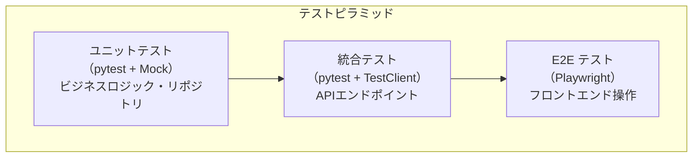
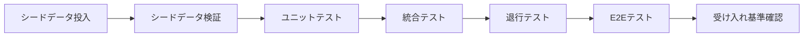

# 06 — 検証計画

## ドキュメント情報

| 項目 | 値 |
|---|---|
| **ドキュメントID** | SPEC-SFM-06 |
| **バージョン** | 1.0.0 |
| **作成日** | 2026-02-19 |
| **ISO 29148 分類** | V&V Plan (Verification and Validation) |
| **ステータス** | Draft |

---

## 目次

1. [検証方針](#1-検証方針)
2. [受け入れ基準](#2-受け入れ基準)
3. [ユニットテスト計画](#3-ユニットテスト計画)
4. [統合テスト計画](#4-統合テスト計画)
5. [E2E テスト計画](#5-e2e-テスト計画)
6. [シードデータ検証](#6-シードデータ検証)
7. [退行テスト](#7-退行テスト)
8. [テスト環境](#8-テスト環境)

---

## 1. 検証方針

### 1.1 テスト戦略



### 1.2 テスト優先度

| テスト種別 | 優先度 | 実施タイミング |
|---|---|---|
| ユニットテスト（サービス層） | 高 | 実装直後 |
| 統合テスト（API エンドポイント） | 高 | 実装直後 |
| シードデータ検証 | 高 | データ投入直後 |
| 退行テスト（既存機能） | 高 | 実装完了後 |
| E2E テスト（UI操作） | 中 | フロントエンド実装後 |

---

## 2. 受け入れ基準

### 2.1 機能受け入れ基準

| ID | 基準 | 検証方法 |
|---|---|---|
| AC-01 | `GET /api/v1/services/{service_id}/features` がサービスの機能一覧を返す | API テスト |
| AC-02 | `GET /api/v1/tenants/{tenant_id}/services/{service_id}/features` がテナント設定とマスターをマージして返す | API テスト |
| AC-03 | テナント設定が未登録の機能は `default_enabled` の値が `is_enabled` として返る | ユニットテスト |
| AC-04 | `PUT` で機能を有効化後、`GET` でその変更が反映される | API テスト（シーケンステスト） |
| AC-05 | サービス未割り当てテナントへの PUT は `403 SERVICE_NOT_ASSIGNED` を返す | API テスト |
| AC-06 | 存在しない `feature_id` への PUT は `404 NOT_FOUND` を返す | API テスト |
| AC-07 | `admin` 未満の権限での PUT は `403 FORBIDDEN` を返す | API テスト |
| AC-08 | シードデータ投入後、全19件の `ServiceFeature` が CosmosDB に存在する | シードデータ検証 |
| AC-09 | フロントエンドで機能一覧トグルが表示され操作できる | E2E テスト |
| AC-10 | 既存のサービス割り当て/解除機能が引き続き正常動作する | 退行テスト |

---

## 3. ユニットテスト計画

### 3.1 テストファイル: `tests/test_service_feature_service.py`

**テスト対象**: `app/services/service_feature_service.py`

#### TC-U-01: `get_service_features` — 正常系

```python
async def test_get_service_features_returns_list():
    """
    前提: service-004 に3件のServiceFeatureが存在する
    操作: get_service_features("service-004") を呼び出す
    期待: 3件の ServiceFeatureResponse が返る
    """
```

#### TC-U-02: `get_service_features` — 存在しないサービス

```python
async def test_get_service_features_not_found():
    """
    前提: "service-999" は存在しない
    操作: get_service_features("service-999") を呼び出す
    期待: HTTPException(404, NOT_FOUND) が発生する
    """
```

#### TC-U-03: `get_tenant_service_features` — テナント設定あり

```python
async def test_get_tenant_service_features_with_custom_settings():
    """
    前提:
      - feature-service-004-02 のデフォルトは False
      - tenant-001 の feature-service-004-02 は True に設定済み
    操作: get_tenant_service_features("tenant-001", "service-004") を呼び出す
    期待:
      - feature-service-004-02 は is_enabled=True, is_default=False
      - 他の機能は is_default=True
    """
```

#### TC-U-04: `get_tenant_service_features` — テナント設定なし（全デフォルト）

```python
async def test_get_tenant_service_features_all_defaults():
    """
    前提: tenant-002 はサービス設定が一切ない
    操作: get_tenant_service_features("tenant-002", "service-004") を呼び出す
    期待: 全機能の is_enabled = default_enabled, is_default = True
    """
```

#### TC-U-05: `get_tenant_service_features` — サービス未割り当て

```python
async def test_get_tenant_service_features_service_not_assigned():
    """
    前提: tenant-002 に service-004 が割り当てられていない
    操作: get_tenant_service_features("tenant-002", "service-004") を呼び出す
    期待: HTTPException(403, SERVICE_NOT_ASSIGNED) が発生する
    """
```

#### TC-U-06: `update_tenant_service_feature` — 正常系（新規upsert）

```python
async def test_update_tenant_service_feature_creates_new():
    """
    前提: TenantServiceFeature が未登録の機能
    操作: update_tenant_service_feature("tenant-001", "service-004", "feature-service-004-02", True, "admin-001")
    期待:
      - CosmosDB に新規ドキュメントが作成される
      - 返却値の is_enabled = True, updated_by = "admin-001"
    """
```

#### TC-U-07: `update_tenant_service_feature` — 正常系（既存upsert）

```python
async def test_update_tenant_service_feature_updates_existing():
    """
    前提: TenantServiceFeature (is_enabled=True) が登録済み
    操作: update_tenant_service_feature(..., is_enabled=False, ...)
    期待: 既存ドキュメントが上書きされ is_enabled = False になる
    """
```

#### TC-U-08: `update_tenant_service_feature` — 存在しない feature_id

```python
async def test_update_tenant_service_feature_invalid_feature():
    """
    前提: "feature-service-004-99" は service-004 に存在しない
    操作: update_tenant_service_feature(..., "feature-service-004-99", ...)
    期待: HTTPException(404, NOT_FOUND) が発生する
    """
```

### 3.2 テストファイル: `tests/test_service_feature_repository.py`

**テスト対象**: `app/repositories/service_feature_repository.py`

#### TC-U-09: `get_features_by_service_id` — CosmosDB クエリ確認

```python
async def test_get_features_by_service_id_queries_correct_container():
    """
    CosmosDB クライアントが services コンテナに対して
    type='service_feature' AND service_id=@serviceId のクエリを発行することを確認
    """
```

#### TC-U-10: `upsert_tenant_feature` — id 生成確認

```python
async def test_upsert_tenant_feature_uses_compound_id():
    """
    upsert 時に id = "{tenant_id}_{feature_id}" が設定されることを確認
    """
```

---

## 4. 統合テスト計画

### 4.1 テストファイル: `tests/test_api_service_features.py`

**テスト対象**: FastAPI エンドポイント（`TestClient` 使用、CosmosDB はモック）

#### TC-I-01: GET `/api/v1/services/{service_id}/features` 正常系

```
前提: services コンテナにservice-004の機能データが存在
リクエスト: GET /api/v1/services/service-004/features (JWT: 認証済みユーザー)
期待:
  - HTTP 200
  - レスポンスに service_id, features[] が含まれる
  - features の各要素に id, feature_key, feature_name, description, default_enabled が含まれる
```

#### TC-I-02: GET `/api/v1/services/{service_id}/features` 401

```
リクエスト: GET /api/v1/services/service-004/features (JWT: なし)
期待: HTTP 401, { "error": { "code": "UNAUTHORIZED" } }
```

#### TC-I-03: GET `/api/v1/services/{service_id}/features` 404

```
リクエスト: GET /api/v1/services/service-999/features
期待: HTTP 404, { "error": { "code": "NOT_FOUND" } }
```

#### TC-I-04: GET `/api/v1/tenants/{tenant_id}/services/{service_id}/features` 正常系

```
前提:
  - tenant-sample-001 に service-004 が割り当て済み
  - feature-service-004-02 のテナント設定あり (is_enabled=true)
リクエスト: GET /api/v1/tenants/tenant-sample-001/services/service-004/features
期待:
  - HTTP 200
  - features[0].is_default = true (設定なし → デフォルト)
  - features[1].is_enabled = true, is_default = false (設定あり → テナント値)
```

#### TC-I-05: GET `/api/v1/tenants/{tenant_id}/services/{service_id}/features` 403 (未割り当て)

```
前提: tenant-sample-001 に service-006 が未割り当て
リクエスト: GET /api/v1/tenants/tenant-sample-001/services/service-006/features
期待: HTTP 403, { "error": { "code": "SERVICE_NOT_ASSIGNED" } }
```

#### TC-I-06: PUT 正常系

```
前提: テナント・サービス・機能が全て有効
リクエスト: PUT /api/v1/tenants/tenant-sample-001/services/service-004/features/feature-service-004-02
  body: { "is_enabled": false }
  JWT: global_admin 権限
期待:
  - HTTP 200
  - レスポンスの is_enabled = false
  - updated_by = JWT の user_id
```

#### TC-I-07: PUT 403 — 権限不足

```
リクエスト: PUT ... (JWT: viewer ロールのみ)
期待: HTTP 403, { "error": { "code": "FORBIDDEN" } }
```

#### TC-I-08: PUT 403 — サービス未割り当て

```
リクエスト: PUT /api/v1/tenants/tenant-sample-001/services/service-006/features/feature-service-006-01
  body: { "is_enabled": true }
期待: HTTP 403, { "error": { "code": "SERVICE_NOT_ASSIGNED" } }
```

#### TC-I-09: PUT 404 — 存在しない feature_id

```
リクエスト: PUT /api/v1/tenants/tenant-sample-001/services/service-004/features/feature-service-004-99
  body: { "is_enabled": true }
期待: HTTP 404, { "error": { "code": "NOT_FOUND" } }
```

#### TC-I-10: PUT 400 — バリデーションエラー

```
リクエスト: PUT ... body: { "is_enabled": "yes" }  (boolean でない)
期待: HTTP 422, { "error": { "code": "VALIDATION_ERROR" } }
```

---

## 5. E2E テスト計画

### 5.1 テストファイル: `tests/e2e/service_features.spec.ts`

**実行環境**: Playwright + 開発環境（CosmosDB Emulator、全サービス起動済み）

#### TC-E-01: 機能一覧の表示確認

```
前提: admin@system.local でログイン済み
手順:
  1. /dashboard/services にアクセス
  2. テナントを選択
  3. 割り当て済みサービスの展開ボタンをクリック
期待:
  - 機能一覧テーブルが表示される
  - 各機能に feature_name, 有効/無効トグルが表示される
```

#### TC-E-02: 機能の有効化

```
前提: admin@system.local でログイン済み、feature-service-004-02 が無効
手順:
  1. ファイル管理サービスの機能一覧を開く
  2. "ファイル外部共有" のトグルをクリックして有効化
期待:
  - トグルが ON に変わる
  - PUT リクエストが成功する（Network タブで確認）
  - ページリロード後も ON 状態が維持される
```

#### TC-E-03: 機能の無効化

```
前提: feature-service-004-01 が有効 (デフォルト)
手順: トグルをクリックして無効化
期待: トグルが OFF になり、変更が永続化される
```

#### TC-E-04: 権限なしユーザーのトグル非活性確認

```
前提: viewer ロールのユーザーでログイン
手順: 機能一覧を開く
期待: 全トグルが disabled（操作不可）表示になる
```

#### TC-E-05: サービス未割り当て時の機能設定非表示

```
前提: service-006 が未割り当てのテナントを選択
手順: サービス一覧確認
期待: service-006 の機能設定セクションが表示されない（またはグレーアウトされる）
```

---

## 6. シードデータ検証

### 6.1 検証スクリプト

シードデータ投入後に以下を確認:

```python
# scripts/test_cosmos_connection.py に追加

async def verify_service_features():
    """
    検証1: ServiceFeature が19件存在すること
    検証2: 各サービスの機能数が正しいこと
    検証3: feature_key がサービス内でユニークであること
    """
    container = ...  # services コンテナ
    features = list(container.query_items(
        "SELECT * FROM c WHERE c.type = 'service_feature'",
        enable_cross_partition_query=True
    ))
    assert len(features) == 19, f"Expected 19, got {len(features)}"

    from collections import Counter
    by_service = Counter(f["service_id"] for f in features)
    assert by_service["service-001"] == 2
    assert by_service["service-002"] == 3
    assert by_service["service-003"] == 2
    assert by_service["service-004"] == 3
    assert by_service["service-005"] == 3
    assert by_service["service-006"] == 3
    assert by_service["service-007"] == 3
```

### 6.2 手動確認チェックリスト

| 確認項目 | 確認方法 | 期待値 |
|---|---|---|
| `ServiceFeature` 件数 | Cosmos Emulator UI または クエリ | 19件 |
| 各サービスの機能件数 | サービス別グループ集計 | 上記定義通り |
| `feature_key` の重複 | サービス別にユニーク確認 | 重複なし |
| `default_enabled` の値 | 各機能の設定値確認 | 設計値と一致 |
| サンプルテナント設定 | `TenantServiceFeature` 件数確認 | 各テナントに設定あり |

---

## 7. 退行テスト

### 7.1 既存機能の動作確認（変更なしの確認）

| テストケース | 確認内容 | 期待動作 |
|---|---|---|
| RT-01 | `GET /api/v1/services` | 変更前と同じレスポンス構造・データ |
| RT-02 | `GET /api/v1/services/{service_id}` | 変更前と同じレスポンス |
| RT-03 | `GET /api/v1/tenants/{tenant_id}/services` | 変更前と同じ |
| RT-04 | `POST /api/v1/tenants/{tenant_id}/services` | サービス割り当てが正常動作 |
| RT-05 | `DELETE /api/v1/tenants/{tenant_id}/services/{service_id}` | サービス解除が正常動作 |
| RT-06 | テナント管理サービス全API | 変更なし |
| RT-07 | 認証認可サービス全API | 変更なし |
| RT-08 | フロントエンド サービス設定ページ（割り当て/解除） | 変更前と同じ動作 |
| RT-09 | フロントエンド テナント管理ページ | 変更なし |
| RT-10 | フロントエンド ユーザー管理ページ | 変更なし |

### 7.2 退行テスト実行コマンド

```bash
# service-setting-service の既存テスト実行
cd src/service-setting-service
pytest tests/ -v -k "not service_feature"

# フロントエンド E2E（既存シナリオ）
cd src/front
npx playwright test --grep-invert "service_features"
```

---

## 8. テスト環境

### 8.1 環境要件

| 項目 | 要件 |
|---|---|
| CosmosDB Emulator | 起動済み、シードデータ投入済み |
| service-setting-service | ポート 8003 で起動 |
| auth-service | ポート 8001 で起動（JWT発行のため） |
| Next.js | ポート 3000 で起動（E2Eテストのため） |
| Python | 3.11 以上 |
| pytest | 最新安定版 |
| Playwright | 最新安定版 |

### 8.2 テスト実行順序



### 8.3 テスト合否判定

| 判定区分 | 基準 |
|---|---|
| **合格** | 全ユニットテスト・統合テスト Pass、受け入れ基準 AC-01〜AC-10 全て満足、退行テスト RT-01〜RT-10 全て Pass |
| **条件付き合格** | E2Eテストに軽微な失敗があるが、機能仕様は満たす場合 |
| **不合格** | 統合テストまたは退行テストに1件以上の失敗がある場合 |

---

## 変更履歴

| バージョン | 日付 | 変更内容 | 作成者 |
|---|---|---|---|
| 1.0.0 | 2026-02-19 | 初版作成 | Copilot |
