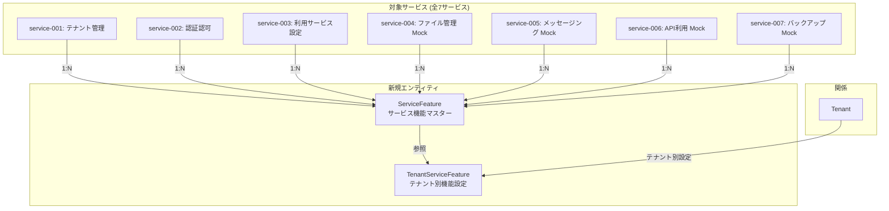

# サービス特有機能の有効/無効化機能 — ドキュメントインデックス

## ドキュメント情報

| 項目 | 値 |
|---|---|
| **機能名** | サービス特有機能の有効/無効化機能 |
| **仕様バージョン** | 1.0.0 |
| **作成日** | 2026-02-19 |
| **ステータス** | Draft |
| **準拠標準** | ISO/IEC/IEEE 29148:2018 |

---

## 概要

本機能は、マルチテナントSaaSプラットフォームにおいて **テナントごとにサービスの特有機能を有効/無効に切り替える** 仕組みを提供する。サービスマスターに紐づく形で機能が定義され、テナントに割り当て済みのサービスに限って機能の有効化/無効化が設定可能。

---

## ドキュメント一覧

| No. | ドキュメント | ISO 29148 対応分類 | 説明 |
|---|---|---|---|
| 01 | [概要とビジネス要件](./01-概要とビジネス要件.md) | StRS (Stakeholder Requirements) | ビジネスインパクト、ステークホルダー要件、機能必要性の根拠 |
| 02 | [システム要件仕様](./02-システム要件仕様.md) | SyRS (System Requirements) | 機能要件・非機能要件・制約条件 |
| 03 | [データモデル設計](./03-データモデル設計.md) | SyRS — Data | 新規データモデル、CosmosDB設計、マイグレーション |
| 04 | [API仕様](./04-API仕様.md) | SyRS — Interface | 追加エンドポイント仕様、リクエスト/レスポンス定義 |
| 05 | [影響範囲分析](./05-影響範囲分析.md) | SyRS — Traceability | 既存コード・データへの影響、変更対象ファイル一覧 |
| 06 | [検証計画](./06-検証計画.md) | V&V Plan | テストケース、検証方法、受け入れ基準 |

---

## 機能スコープ概要

---

## 関連ドキュメント

- [アーキテクチャ概要](../../../arch/overview.md)
- [既存データモデル](../../../arch/data/data-model.md)
- [API共通仕様](../../../arch/api/api-specification.md)
- [サンプルデータ](../../../サンプルデータ.md)
