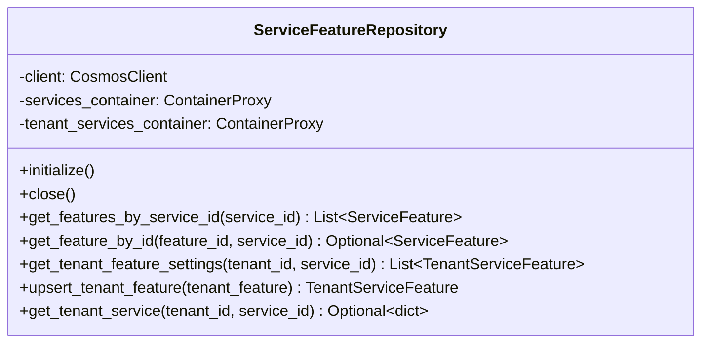

# 03 — バックエンドリポジトリ実装

## 概要

`ServiceFeatureRepository` を新規作成し、`services` コンテナと `tenant_services` コンテナに対する ServiceFeature / TenantServiceFeature 関連の CRUD 操作を実装する。

## 背景・目的

サービス機能管理の API エンドポイントに必要な CosmosDB データアクセス層を実装する。既存の `ServiceRepository` の非同期パターン（`azure.cosmos.aio`）に準拠し、新規リポジトリクラスとして独立させる。既存の `ServiceRepository` からは `services` コンテナと `tenant_services` コンテナのクライアントを共有利用する。

## 対象リポジトリ

- `src/service-setting-service/` — リポジトリファイルの新規作成

## タスク詳細

### 実装内容

1. **`src/service-setting-service/app/repositories/service_feature_repository.py` の新規作成**

   以下のメソッドを実装する:

   - `initialize()` — CosmosDB クライアント初期化（`services` コンテナと `tenant_services` コンテナの参照取得）
   - `close()` — クライアントクローズ
   - `get_features_by_service_id(service_id: str) -> List[ServiceFeature]`
     - `services` コンテナから `type = 'service_feature' AND service_id = @serviceId` でクエリ
     - パーティションキー `service_id` を指定
   - `get_feature_by_id(feature_id: str, service_id: str) -> Optional[ServiceFeature]`
     - `services` コンテナから `read_item` で取得（`partition_key=service_id`）
   - `get_tenant_feature_settings(tenant_id: str, service_id: str) -> List[TenantServiceFeature]`
     - `tenant_services` コンテナから `type = 'tenant_service_feature' AND tenant_id = @tenantId AND service_id = @serviceId` でクエリ
     - パーティションキー `tenant_id` を指定
   - `upsert_tenant_feature(tenant_feature: TenantServiceFeature) -> TenantServiceFeature`
     - `tenant_services` コンテナに upsert
     - `model_dump(mode='json')` で datetime を ISO 文字列に変換してから upsert
   - `get_tenant_service(tenant_id: str, service_id: str) -> Optional[dict]`
     - `tenant_services` コンテナから `type = 'tenant_service' AND tenant_id = @tenantId AND service_id = @serviceId` でクエリ（1件返却）
     - テナントへのサービス割り当て確認用（既存 `ServiceRepository` のメソッドを使わず独自実装することで疎結合を保つ）

2. **グローバルインスタンスの定義**
   - モジュール末尾に `service_feature_repository = ServiceFeatureRepository()` を定義

3. **`src/service-setting-service/app/main.py` の修正**
   - アプリケーション起動時の `startup` イベントに `service_feature_repository.initialize()` を追加
   - `shutdown` イベントに `service_feature_repository.close()` を追加

### 参照ドキュメント

- [03-データモデル設計.md](../03-データモデル設計.md) — セクション 5（クエリパターン）
- [04-API仕様.md](../04-API仕様.md) — セクション 2.3（PUT シーケンス図内のリポジトリ呼び出し）
- 既存コード: `src/service-setting-service/app/repositories/service_repository.py`（実装パターンの参考）

### 影響範囲

- `src/service-setting-service/app/repositories/service_feature_repository.py` — 新規作成
- `src/service-setting-service/app/main.py` — startup/shutdown にリポジトリ初期化を追加

## 完了条件（Success Criteria）

- [ ] `src/service-setting-service/app/repositories/service_feature_repository.py` が存在し、上記 6 メソッドが実装されている
- [ ] `ServiceFeatureRepository` が `azure.cosmos.aio.CosmosClient` を使用した非同期実装になっている
- [ ] `main.py` の startup/shutdown イベントに `service_feature_repository` の初期化・クローズが追加されている
- [ ] グローバルインスタンス `service_feature_repository` がモジュールからインポート可能
- [ ] `from app.repositories.service_feature_repository import service_feature_repository` が正常に動作する
- [ ] ビルドエラーが発生しない

## 依存関係

- **前提タスク:** 01-DBスキーマ変更とシードデータ整備（パーティションキー変更）、02-バックエンドモデルとスキーマ定義
- **後続タスク:** 04-バックエンドサービス層とAPIエンドポイント

## 備考

- 既存 `ServiceRepository` の `initialize()` パターン（`CosmosClient` 初期化、`connection_verify`、`Gateway` モード等）をそのまま踏襲する
- `get_feature_by_id` では `read_item` によるポイントリード（1 RU）を使用し、効率的にアクセスする
- `upsert_tenant_feature` は冪等に動作する（仕様書の PUT 冪等性要件に対応）

