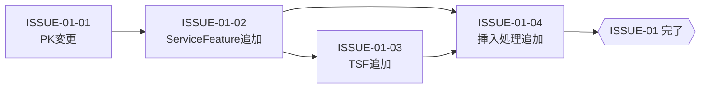

# ISSUE-01: [データ基盤整備] サービス機能管理 — CosmosDB・シードデータ整備

## 概要

サービス機能管理機能の実装に先立ち、CosmosDB のコンテナ設計変更およびシードデータの投入処理を整備する。  
本タスクはすべての後続実装タスクが依存する基盤であり、最初に着手・完了する必要がある。

## タスク種別

**親Issue**

## Sub-Issues

| Sub-Issue | タイトル | 依存 |
|---|---|---|
| [ISSUE-01-01](./ISSUE-01-01_servicesコンテナPK変更.md) | `services` コンテナ パーティションキー変更 | なし |
| [ISSUE-01-02](./ISSUE-01-02_ServiceFeatureシードデータ追加.md) | `ServiceFeature` シードデータ追加 (initial_data.py) | ISSUE-01-01 |
| [ISSUE-01-03](./ISSUE-01-03_TenantServiceFeatureサンプルデータ追加.md) | `TenantServiceFeature` サンプルデータ追加 (sample_data.py) | ISSUE-01-02 |
| [ISSUE-01-04](./ISSUE-01-04_seed_database挿入処理追加.md) | `seed_database.py` 挿入処理追加 | ISSUE-01-02, ISSUE-01-03 |

## 完了条件

- [ ] `services` コンテナのパーティションキーが `/partitionKey` になっている
- [ ] `ServiceFeature` 19件が CosmosDB `services` コンテナに存在する
- [ ] `TenantServiceFeature` サンプルデータが CosmosDB `tenant_services` コンテナに存在する
- [ ] DevContainer 再起動後、DB初期化が正常完了する

## 依存関係

## 後続タスクへの影響

- ISSUE-02（バックエンド実装）はデータ定義が確定していれば並走可能。DB動作確認（ISSUE-01完了）はISSUE-04（統合テスト）の前提
- ISSUE-03（フロントエンド）はISSUE-01完了を必須としない（型定義は独立）

## 参照仕様

- [03-データモデル設計.md](../03-データモデル設計.md)
- [02-システム要件仕様.md](../02-システム要件仕様.md) §4.3 シードデータ要件
- [05-影響範囲分析.md](../05-影響範囲分析.md) §4, §5
