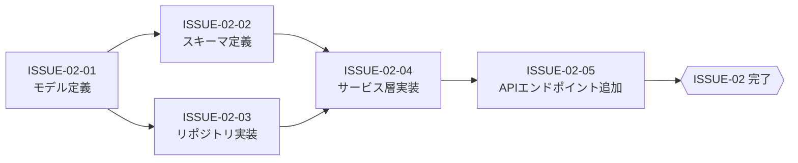
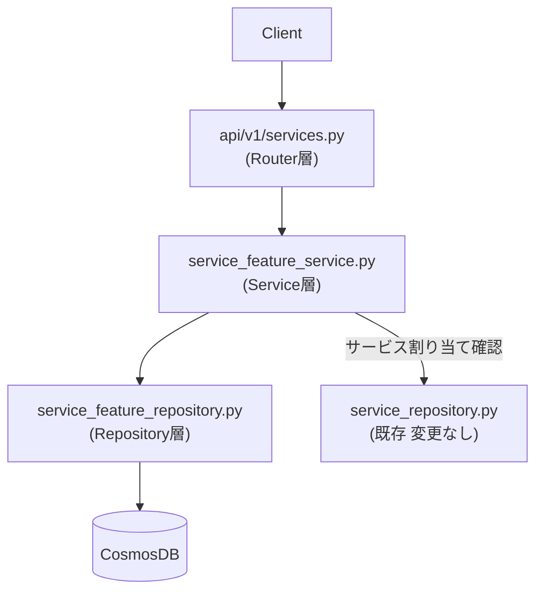

# ISSUE-02: [バックエンド実装] サービス機能管理 — service-setting-service

## 概要

`service-setting-service` に `ServiceFeature` / `TenantServiceFeature` の CRUD を実装する。  
新規作成4ファイル＋既存ファイル変更1ファイルの計5作業で構成される。

## タスク種別

**親Issue**

## Sub-Issues

| Sub-Issue | タイトル | 依存 |
|---|---|---|
| [ISSUE-02-01](./ISSUE-02-01_モデル定義.md) | モデル定義 (`models/service_feature.py`) | なし（ISSUE-01と並走可） |
| [ISSUE-02-02](./ISSUE-02-02_スキーマ定義.md) | スキーマ定義 (`schemas/service_feature.py`) | ISSUE-02-01 |
| [ISSUE-02-03](./ISSUE-02-03_リポジトリ実装.md) | リポジトリ実装 (`repositories/service_feature_repository.py`) | ISSUE-02-01 |
| [ISSUE-02-04](./ISSUE-02-04_サービス層実装.md) | サービス層実装 (`services/service_feature_service.py`) | ISSUE-02-02, ISSUE-02-03 |
| [ISSUE-02-05](./ISSUE-02-05_APIエンドポイント追加.md) | API エンドポイント追加 (`api/v1/services.py`) | ISSUE-02-04 |

## 完了条件

- [ ] `GET /api/v1/services/{service_id}/features` が正常応答する
- [ ] `GET /api/v1/tenants/{tenant_id}/services/{service_id}/features` が正常応答する（デフォルトマージ含む）
- [ ] `PUT /api/v1/tenants/{tenant_id}/services/{service_id}/features/{feature_id}` が正常応答する
- [ ] 認可制御（ロール・テナント間分離・サービス割り当て確認）が実装されている
- [ ] 既存エンドポイントに影響がない

## 内部依存関係

## 外部依存・並走情報

- ISSUE-01（データ基盤）と **並走可能**（モデル・スキーマ・リポジトリはDB構築完了前に記述可能）
- ISSUE-03（フロントエンド）は ISSUE-02-05 完了後に統合確認が可能（型定義・BFF実装は並走可）
- ISSUE-04（テスト）は ISSUE-02-04 完了後にユニットテスト着手可能

## 三層アーキテクチャ

## 参照仕様

- [02-システム要件仕様.md](../02-システム要件仕様.md)
- [03-データモデル設計.md](../03-データモデル設計.md) §4 Pythonモデル定義
- [04-API仕様.md](../04-API仕様.md) §2
- [05-影響範囲分析.md](../05-影響範囲分析.md) §2
