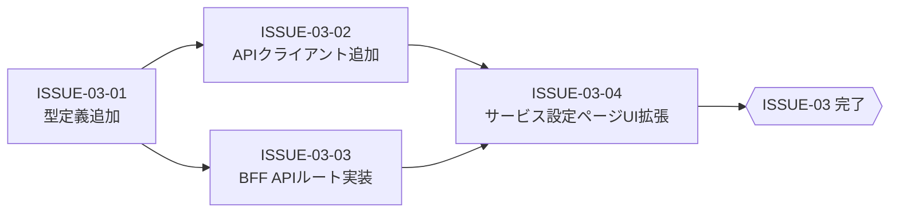

# ISSUE-03: [フロントエンド実装] サービス機能管理 — Next.js BFF・UI

## 概要

フロントエンド（Next.js）に対して以下を実装する：
1. TypeScript型定義の追加
2. API クライアントメソッドの追加
3. BFF プロキシルートの追加（3ファイル新規）
4. サービス設定ページへの機能設定UI追加（メインUI変更）

## タスク種別

**親Issue**

## Sub-Issues

| Sub-Issue | タイトル | 依存 |
|---|---|---|
| [ISSUE-03-01](./ISSUE-03-01_型定義追加.md) | 型定義追加 (`types/index.ts`) | なし（ISSUE-02と並走可） |
| [ISSUE-03-02](./ISSUE-03-02_APIクライアント追加.md) | API クライアントメソッド追加 (`lib/api-client.ts`) | ISSUE-03-01 |
| [ISSUE-03-03](./ISSUE-03-03_BFF_APIルート実装.md) | BFF API ルート実装（3ファイル新規作成） | ISSUE-03-01 |
| [ISSUE-03-04](./ISSUE-03-04_サービス設定ページUI拡張.md) | サービス設定ページ UI 拡張 (`app/dashboard/services/page.tsx`) | ISSUE-03-02, ISSUE-03-03 |

## 完了条件

- [ ] `ServiceFeature`, `TenantServiceFeature` の TypeScript 型定義が存在する
- [ ] BFF ルート3本が実装されている（GET×2、PUT×1）
- [ ] サービス設定ページでサービス行を展開すると機能一覧が表示される
- [ ] `admin` ロールのみトグル操作ができ、それ以外は disabled 表示になる
- [ ] 既存のサービス割り当て/解除 UI に影響がない

## 内部依存関係



## 外部依存・並走情報

- ISSUE-03-01〜03-03 は **ISSUE-02 完了前から着手可能**（型とBFF構造はバックエンド完成前に設計・実装できる）
- ISSUE-03-04（UI拡張）は実装後にバックエンド（ISSUE-02完了）との結合確認が必要
- ISSUE-04（E2Eテスト）は ISSUE-03-04 完了後に着手

## UI変更イメージ

```
[変更前]
┌─────────────────────────────────────┐
│ サービス名  │ ステータス │ 操作      │
├─────────────────────────────────────┤
│ ファイル管理│ 割り当て済 │ [解除]    │
└─────────────────────────────────────┘

[変更後]
┌─────────────────────────────────────┐
│ サービス名  │ ステータス │ 操作      │
├─────────────────────────────────────┤
│ ▼ ファイル管理│ 割り当て済 │ [解除]  │
│   └── 機能設定                       │
│       ┌ バージョン管理   ● ON       │
│       ├ ファイル外部共有 ◯ OFF      │
│       └ 自動バックアップ ● ON       │
└─────────────────────────────────────┘
```

## 参照仕様

- [02-システム要件仕様.md](../02-システム要件仕様.md) §3.2〜3.3 UI/BFF要件
- [04-API仕様.md](../04-API仕様.md) §3〜4
- [05-影響範囲分析.md](../05-影響範囲分析.md) §3
