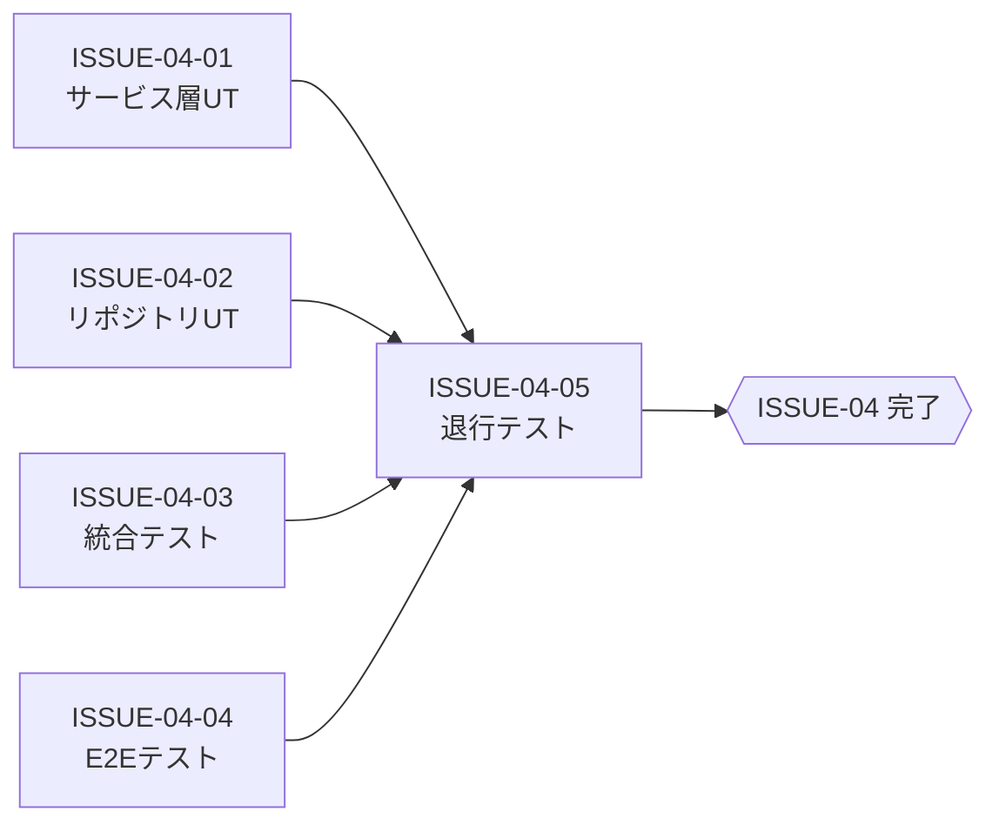

# ISSUE-04: [テスト実装・検証] サービス機能管理 — ユニット・統合・E2E・退行テスト

## 概要

仕様書「06-検証計画」に基づき、すべてのテストレベルのテストコードを実装・実行・合格させる。

## タスク種別

**親Issue**

## Sub-Issues

| Sub-Issue | タイトル | 依存 |
|---|---|---|
| [ISSUE-04-01](./ISSUE-04-01_サービス層ユニットテスト.md) | サービス層ユニットテスト実装 (`test_service_feature_service.py`) | ISSUE-02-04 |
| [ISSUE-04-02](./ISSUE-04-02_リポジトリユニットテスト.md) | リポジトリユニットテスト実装 (`test_service_feature_repository.py`) | ISSUE-02-03 |
| [ISSUE-04-03](./ISSUE-04-03_統合テスト実装.md) | 統合テスト実装 (`test_api_service_features.py`) | ISSUE-02-05, ISSUE-01 |
| [ISSUE-04-04](./ISSUE-04-04_E2Eテスト実装.md) | E2E テスト実装 (Playwright) | ISSUE-03-04, ISSUE-02-05 |
| [ISSUE-04-05](./ISSUE-04-05_退行テスト実行.md) | 退行テスト実行・確認 | ISSUE-02-05, ISSUE-03-04 |

## 完了条件

- [ ] ユニットテスト TC-U-01〜TC-U-10 が全件 PASS
- [ ] 統合テスト（API テスト）が全件 PASS
- [ ] E2E テストが正常に実行される
- [ ] 既存の退行テストが全件 PASS（新機能による既存機能への影響がない）
- [ ] 受け入れ基準 AC-01〜AC-10 のすべてが検証済み

## 内部依存関係

## 並走可能なテスト実装

- ISSUE-04-01 と ISSUE-04-02 は **同時並走可能**（それぞれ独立したファイル）
- ISSUE-04-03 は ISSUE-01（DB）と ISSUE-02-05（API）完了が前提
- ISSUE-04-04 は ISSUE-03-04（UI）と ISSUE-02-05（API）完了が前提

## テスト対象と件数

| テスト種別 | ファイル | テストケース数 |
|---|---|---|
| ユニット（サービス層） | `test_service_feature_service.py` | TC-U-01〜08（8件） |
| ユニット（リポジトリ） | `test_service_feature_repository.py` | TC-U-09〜10（2件） |
| 統合 | `test_api_service_features.py` | AC-01〜AC-07相当 |
| E2E | Playwright テストファイル | AC-09相当 |
| 退行 | 既存テストスイート実行 | AC-10相当 |

## 参照仕様

- [06-検証計画.md](../06-検証計画.md)
