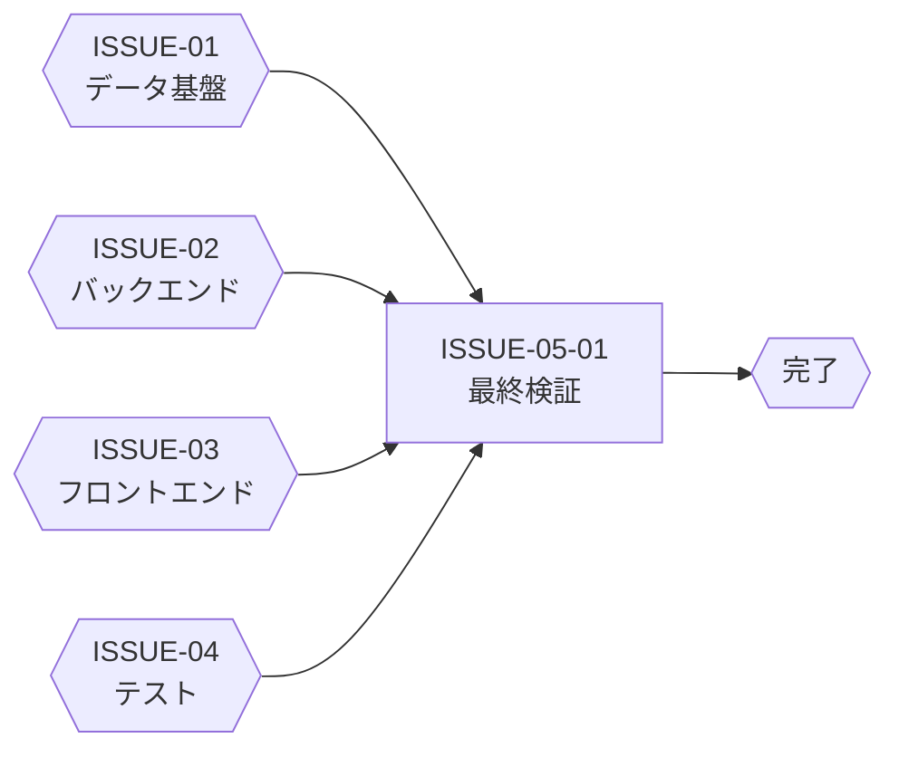

# ISSUE-05: [統合検証・リリース確認] サービス機能管理 — 受け入れ基準最終チェック

## 概要

全実装・全テストが完了した後、受け入れ基準（AC-01〜AC-10）を最終確認し、本機能を完了とする。

## タスク種別

**親Issue**

## Sub-Issues

| Sub-Issue | タイトル | 依存 |
|---|---|---|
| [ISSUE-05-01](./ISSUE-05-01_受け入れ基準最終検証.md) | 受け入れ基準（AC-01〜AC-10）最終検証 | ISSUE-04 全件完了 |

## 完了条件

- [ ] 受け入れ基準 AC-01〜AC-10 が全件グリーン
- [ ] 性能要件（P95: GET 500ms以内、PUT 800ms以内）を満たす
- [ ] セキュリティ要件（SEC-01〜SEC-04）の確認が完了
- [ ] DevContainer を初回起動した状態で DB 初期化から UI 動作まで一通り確認できる

## 外部依存

## 受け入れ基準チェックリスト

| 基準ID | 内容 | 確認方法 |
|---|---|---|
| AC-01 | `GET /api/v1/services/{service_id}/features` がサービスの機能一覧を返す | API テスト |
| AC-02 | `GET .../features` がテナント設定とマスターをマージして返す | API テスト |
| AC-03 | テナント設定未登録の機能は `default_enabled` が `is_enabled` として返る | ユニットテスト |
| AC-04 | PUT 後の GET で変更が反映される | API シーケンステスト |
| AC-05 | サービス未割り当てへの PUT は `403 SERVICE_NOT_ASSIGNED` | API テスト |
| AC-06 | 存在しない `feature_id` への PUT は `404 NOT_FOUND` | API テスト |
| AC-07 | admin 未満での PUT は `403 FORBIDDEN` | API テスト |
| AC-08 | シードデータ投入後、全19件の ServiceFeature が CosmosDB に存在する | シードデータ検証 |
| AC-09 | フロントエンドで機能一覧トグルが表示・操作できる | E2E テスト |
| AC-10 | 既存のサービス割り当て/解除機能が引き続き正常動作する | 退行テスト |

## 参照仕様

- [06-検証計画.md](../06-検証計画.md) §2 受け入れ基準
