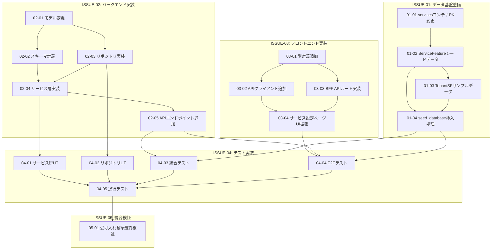
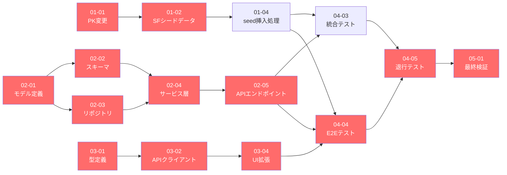

# サービス機能管理 — 開発タスク サマリーレポート

## 概要

| 項目 | 値 |
|---|---|
| **機能名** | サービス特有機能の有効/無効化機能 |
| **対象仕様バージョン** | 1.0.0 |
| **作成日** | 2026-02-19 |
| **総タスク数** | 親Issue 5件 / Sub-Issue 19件 / 合計 24件 |
| **変更ファイル数** | 新規作成 7ファイル、既存変更 8ファイル、計 15ファイル |

---

## タスク一覧

### 親Issue

| ID | タイトル | Sub-Issue数 |
|---|---|---|
| [ISSUE-01](./ISSUE-01_データ基盤整備.md) | データ基盤整備（CosmosDB・シードデータ） | 4 |
| [ISSUE-02](./ISSUE-02_バックエンド実装.md) | バックエンド実装（service-setting-service） | 5 |
| [ISSUE-03](./ISSUE-03_フロントエンド実装.md) | フロントエンド実装（Next.js BFF・UI） | 4 |
| [ISSUE-04](./ISSUE-04_テスト実装・検証.md) | テスト実装・検証 | 5 |
| [ISSUE-05](./ISSUE-05_統合検証・リリース確認.md) | 統合検証・リリース確認 | 1 |

### Sub-Issue 全件一覧

| ID | タイトル | 依存 | 並走可否 |
|---|---|---|---|
| [ISSUE-01-01](./ISSUE-01-01_servicesコンテナPK変更.md) | servicesコンテナ PK変更 | なし | 02-01と並走可 |
| [ISSUE-01-02](./ISSUE-01-02_ServiceFeatureシードデータ追加.md) | ServiceFeature シードデータ追加 | 01-01 | — |
| [ISSUE-01-03](./ISSUE-01-03_TenantServiceFeatureサンプルデータ追加.md) | TenantServiceFeature サンプルデータ追加 | 01-02 | 01-04と並走可 |
| [ISSUE-01-04](./ISSUE-01-04_seed_database挿入処理追加.md) | seed_database 挿入処理追加 | 01-02, 01-03 | — |
| [ISSUE-02-01](./ISSUE-02-01_モデル定義.md) | モデル定義 | なし | 01-01と並走可 |
| [ISSUE-02-02](./ISSUE-02-02_スキーマ定義.md) | スキーマ定義 | 02-01 | 02-03と並走可 |
| [ISSUE-02-03](./ISSUE-02-03_リポジトリ実装.md) | リポジトリ実装 | 02-01 | 02-02と並走可 |
| [ISSUE-02-04](./ISSUE-02-04_サービス層実装.md) | サービス層実装 | 02-02, 02-03 | — |
| [ISSUE-02-05](./ISSUE-02-05_APIエンドポイント追加.md) | API エンドポイント追加 | 02-04 | — |
| [ISSUE-03-01](./ISSUE-03-01_型定義追加.md) | 型定義追加 | なし | 02-01と並走可 |
| [ISSUE-03-02](./ISSUE-03-02_APIクライアント追加.md) | API クライアントメソッド追加 | 03-01 | 03-03と並走可 |
| [ISSUE-03-03](./ISSUE-03-03_BFF_APIルート実装.md) | BFF API ルート実装（3ファイル） | 03-01 | 03-02と並走可 |
| [ISSUE-03-04](./ISSUE-03-04_サービス設定ページUI拡張.md) | サービス設定ページ UI 拡張 | 03-02, 03-03 | — |
| [ISSUE-04-01](./ISSUE-04-01_サービス層ユニットテスト.md) | サービス層ユニットテスト | 02-04 | 04-02と並走可 |
| [ISSUE-04-02](./ISSUE-04-02_リポジトリユニットテスト.md) | リポジトリユニットテスト | 02-03 | 04-01と並走可 |
| [ISSUE-04-03](./ISSUE-04-03_統合テスト実装.md) | 統合テスト実装 | 02-05, ISSUE-01完了 | 04-04と並走可 |
| [ISSUE-04-04](./ISSUE-04-04_E2Eテスト実装.md) | E2E テスト実装 (Playwright) | 03-04, 02-05, ISSUE-01完了 | 04-03と並走可 |
| [ISSUE-04-05](./ISSUE-04-05_退行テスト実行.md) | 退行テスト実行・確認 | 04-01〜04-04 | — |
| [ISSUE-05-01](./ISSUE-05-01_受け入れ基準最終検証.md) | 受け入れ基準（AC-01〜AC-10）最終検証 | ISSUE-04 全件 | — |

---

## 全体依存関係図

---

## クリティカルパス

最短完了を阻む依存チェーンは以下の経路である。

**クリティカルパス（最長依存チェーン）**:
`01-01 → 01-02 → 01-04` と `02-01 → 02-02/03 → 02-04 → 02-05` が収束する統合テスト以降が最長経路

---

## 並行実行可能タスクの整理

効率的な開発進行のために、以下のタスクは同時着手が可能である。

### フェーズ1（開始直後に並走可能）

| ストリーム | タスク |
|---|---|
| A（DB/インフラ） | ISSUE-01-01 `services` コンテナ PK変更 |
| B（バックエンド設計） | ISSUE-02-01 モデル定義 |
| C（フロントエンド設計） | ISSUE-03-01 型定義追加 |

### フェーズ2（フェーズ1完了後）

| ストリーム | 前提 | タスク |
|---|---|---|
| A | 01-01完了 | ISSUE-01-02 シードデータ追加 |
| B-1 | 02-01完了 | ISSUE-02-02 スキーマ定義 |
| B-2 | 02-01完了 | ISSUE-02-03 リポジトリ実装 |
| C-1 | 03-01完了 | ISSUE-03-02 API クライアント |
| C-2 | 03-01完了 | ISSUE-03-03 BFF ルート実装 |

### フェーズ3（フェーズ2完了後）

| ストリーム | 前提 | タスク |
|---|---|---|
| A | 01-02完了 | ISSUE-01-03 サンプルデータ |
| B | 02-02, 02-03完了 | ISSUE-02-04 サービス層実装 |
| C | 03-02, 03-03完了 | ISSUE-03-04 UI拡張 |

### フェーズ4（フェーズ3完了後）

| ストリーム | 前提 | タスク |
|---|---|---|
| A | 01-02, 01-03完了 | ISSUE-01-04 seed挿入処理 |
| B | 02-04完了 | ISSUE-02-05 API エンドポイント追加 |

### フェーズ5（フェーズ4完了後）

| ストリーム | 前提 | タスク |
|---|---|---|
| T-1 | 02-04完了 | ISSUE-04-01 サービス層UT |
| T-2 | 02-03完了 | ISSUE-04-02 リポジトリUT |

### フェーズ6（フェーズ5完了後）

| ストリーム | 前提 | タスク |
|---|---|---|
| T-3 | 02-05, ISSUE-01完了 | ISSUE-04-03 統合テスト |
| T-4 | 03-04, 02-05, ISSUE-01完了 | ISSUE-04-04 E2E テスト |

### フェーズ7（フェーズ6完了後）

| タスク | 前提 |
|---|---|
| ISSUE-04-05 退行テスト | 04-01〜04-04完了 |

### フェーズ8（フェーズ7完了後）

| タスク | 前提 |
|---|---|
| ISSUE-05-01 最終検証 | ISSUE-04全件完了 |

---

## タイムライン推定

```mermaid
gantt
    title サービス機能管理 開発スケジュール（参考）
    dateFormat  D
    axisFormat  Day%d

    section DB基盤
    01-01 PK変更          :db01, 1, 1d
    01-02 SF シードデータ :db02, after db01, 1d
    01-03 TSF サンプルデータ :db03, after db02, 1d
    01-04 seed挿入処理    :db04, after db03, 0.5d

    section バックエンド
    02-01 モデル定義      :be01, 1, 0.5d
    02-02 スキーマ定義    :be02, after be01, 0.5d
    02-03 リポジトリ実装  :be03, after be01, 1d
    02-04 サービス層実装  :be04, after be02, 1.5d
    02-05 API エンドポイント :be05, after be04, 0.5d

    section フロントエンド
    03-01 型定義追加      :fe01, 1, 0.5d
    03-02 API クライアント :fe02, after fe01, 0.5d
    03-03 BFF ルート実装  :fe03, after fe01, 1d
    03-04 UI 拡張         :fe04, after fe02, 2d

    section テスト
    04-01 サービス層UT    :t01, after be04, 1d
    04-02 リポジトリUT    :t02, after be03, 0.5d
    04-03 統合テスト      :t03, after be05, 1d
    04-04 E2E テスト      :t04, after fe04, 1.5d
    04-05 退行テスト      :t05, after t01, 0.5d

    section 最終検証
    05-01 最終検証        :v01, after t05, 0.5d
```

> ⚠️ 上記は参考値（1名体制の場合）。並走可能なタスクを複数名で担当することで大幅な短縮が可能。

---

## リスクと留意事項

| リスク | 影響 | 対策 |
|---|---|---|
| `services` コンテナ PK変更（ISSUE-01-01）で DB 初期化手順が複雑化 | ISSUE-01 全体の遅延 | DevContainer 再起動前に手順を事前確認する |
| バックエンドのマージロジック（ISSUE-02-04）の実装複雑度 | ISSUE-02-05, ISSUE-04 への波及 | TC-U-03, TC-U-04 のユニットテストで早期に動作確認 |
| フロントエンドのトグル権限制御（ISSUE-03-04）の仕様理解 | E2E テスト (ISSUE-04-04) での不具合 | `admin` / `viewer` の JWT を使った手動確認を先行する |
| 既存テスト（退行）への影響（ISSUE-04-05） | リリース判断の遅延 | 実装後すぐに既存テストを実行し早期に問題を検出する |

---

## 参照ドキュメント

| ドキュメント | 内容 |
|---|---|
| [01-概要とビジネス要件](../01-概要とビジネス要件.md) | ステークホルダー要件・ユースケース |
| [02-システム要件仕様](../02-システム要件仕様.md) | 機能/非機能要件・受け入れ基準 |
| [03-データモデル設計](../03-データモデル設計.md) | エンティティ設計・CosmosDB設計 |
| [04-API仕様](../04-API仕様.md) | エンドポイント詳細・シーケンス図 |
| [05-影響範囲分析](../05-影響範囲分析.md) | 変更ファイル一覧・横断的影響 |
| [06-検証計画](../06-検証計画.md) | テスト戦略・テストケース |
