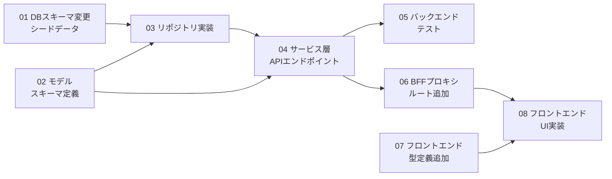

# 開発タスクリスト: サービス機能管理

## サマリ

| 項目 | 値 |
|---|---|
| **機能名** | サービス機能管理（サービス特有機能の有効/無効化機能） |
| **総タスク数** | 8 |
| **作成日** | 2026-02-23 |

## タスク一覧

| No | タスク | 対象リポジトリ | 依存関係 | ステータス |
|---|---|---|---|---|
| 1 | [DBスキーマ変更とシードデータ整備](./01-DBスキーマ変更とシードデータ整備.md) | `scripts/` | なし | ✅ 完了 |
| 2 | [バックエンドモデルとスキーマ定義](./02-バックエンドモデルとスキーマ定義.md) | `src/service-setting-service/` | なし | ✅ 完了 |
| 3 | [バックエンドリポジトリ実装](./03-バックエンドリポジトリ実装.md) | `src/service-setting-service/` | #1, #2 完了後 | ✅ 完了 |
| 4 | [バックエンドサービス層とAPIエンドポイント](./04-バックエンドサービス層とAPIエンドポイント.md) | `src/service-setting-service/` | #2, #3 完了後 | ✅ 完了 |
| 5 | [バックエンドテスト](./05-バックエンドテスト.md) | `src/service-setting-service/` | #4 完了後 | ✅ 完了 |
| 6 | [BFFプロキシルート追加](./06-BFFプロキシルート追加.md) | `src/front/` | #4 完了後 | ✅ 完了 |
| 7 | [フロントエンド型定義追加](./07-フロントエンド型定義追加.md) | `src/front/` | なし | ✅ 完了 |
| 8 | [フロントエンドUI実装](./08-フロントエンドUI実装.md) | `src/front/` | #6, #7 完了後 | ✅ 完了 |

## 依存関係図



## 並行実行可能なタスク

| フェーズ | 並行実行可能なタスク | 備考 |
|---|---|---|
| フェーズ1 | #1, #2, #7 | DB変更、モデル定義、フロントエンド型定義は独立して実施可能 |
| フェーズ2 | #3 | #1, #2 完了後にリポジトリ実装 |
| フェーズ3 | #4 | #3 完了後にサービス層+API実装 |
| フェーズ4 | #5, #6 | バックエンドテストとBFFルート追加は並行実施可能 |
| フェーズ5 | #8 | #6, #7 完了後にUI実装 |

## クリティカルパス

```
#1(DB変更) → #3(リポジトリ) → #4(サービス層+API) → #6(BFF) → #8(UI実装)
```

または:

```
#2(モデル定義) → #3(リポジトリ) → #4(サービス層+API) → #6(BFF) → #8(UI実装)
```

最長パスは **5タスク** で構成される。

## ステータス凡例

- 🔲 未着手
- 🔄 実装中
- 👀 レビュー中
- ✅ 完了
- ❌ ブロック中
