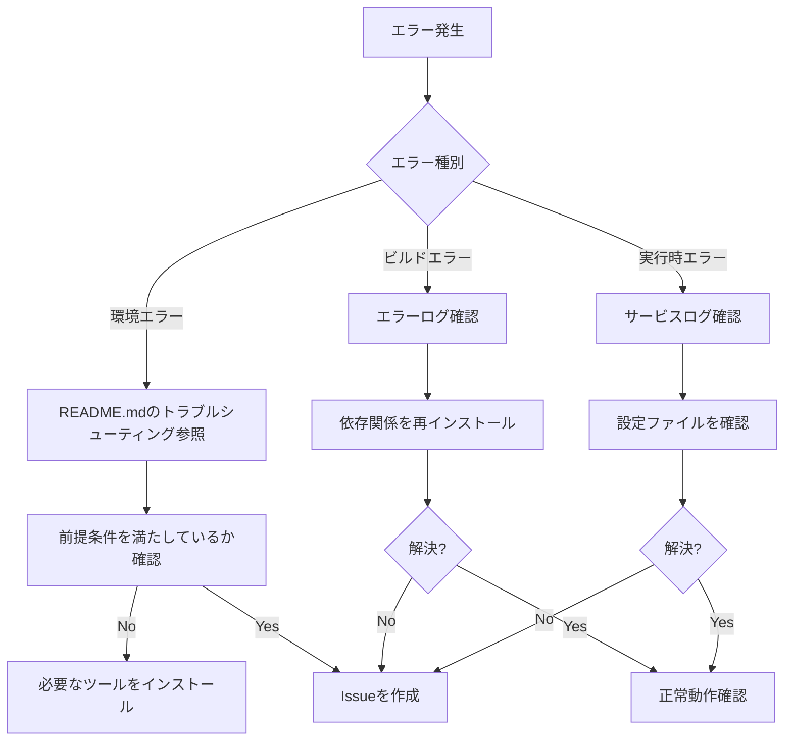

# 機能仕様書: プロジェクト基盤構築

## ドキュメント情報

- **バージョン**: 1.0.0
- **作成日**: 2024年
- **ステータス**: Draft
- **対象タスク**: タスク01 - プロジェクト基盤構築
- **関連ドキュメント**: 
  - [タスク詳細](../01-プロジェクト基盤構築.md)
  - [アーキテクチャ概要](../../arch/overview.md)

---

## 1. はじめに

### 1.1 目的

本仕様書は、複数サービス管理PoCアプリケーションの開発基盤を構築するための要件を定義します。
開発チーム全体が統一された環境で効率的に開発を開始できる状態を実現し、プロジェクトの初期段階から品質と生産性を確保することを目的とします。

### 1.2 スコープ

本仕様が対象とする範囲：
- リポジトリの基本構造の構築
- 開発環境（DevContainer）のセットアップ
- フロントエンド（Next.js）プロジェクトの初期化
- バックエンドサービス（FastAPI × 3サービス）の雛形作成
- ローカル開発環境の動作確認基盤
- 共通設定ファイルとドキュメントの整備

本仕様が対象外とする範囲：
- ビジネスロジックの実装
- Azureインフラストラクチャの構築（タスク02で実施）
- CI/CDパイプラインの構築（タスク14で実施）
- 機能要件の実装

### 1.3 用語定義

| 用語 | 定義 |
|------|------|
| **DevContainer** | VS CodeのDev Containers機能を使用した、Dockerベースの開発環境 |
| **BFF** | Backend for Frontend。フロントエンド専用のバックエンド層 |
| **雛形（スキャフォールド）** | 基本的なディレクトリ構造と最小限の機能を持つプロジェクトテンプレート |
| **Cosmos DB Emulator** | Azure Cosmos DBのローカル開発用エミュレーター |
| **マイクロサービス** | 独立してデプロイ可能な小規模サービス単位のアーキテクチャスタイル |
| **IaC** | Infrastructure as Code。インフラをコードで管理する手法 |

---

## 2. ビジネス要件

### 2.1 ビジネス目標

#### 2.1.1 開発生産性の最大化

**目標**: 開発者がセットアップに費やす時間を最小化し、ビジネスロジックの実装に集中できる環境を提供する

**ビジネス価値**:
- 開発開始までの時間を従来の数時間から15分以内に短縮
- 新規メンバーのオンボーディング時間を80%削減
- 環境差異によるトラブルシューティングコストの削減

#### 2.1.2 品質の標準化

**目標**: すべての開発者が同一の開発環境を使用することで、コード品質とテスト品質を担保する

**ビジネス価値**:
- "私の環境では動く"問題の撲滅
- コードレビューの効率化（環境依存の議論を排除）
- バグの早期発見と修正コストの削減

#### 2.1.3 スケーラブルな基盤の構築

**目標**: 将来的な機能拡張や新規サービス追加に柔軟に対応できる拡張可能な構造を確立する

**ビジネス価値**:
- 新規サービス追加時の開発コスト削減
- アーキテクチャの一貫性による保守性の向上
- 技術的負債の最小化

### 2.2 ユーザーストーリー

#### US-01: 開発者の環境セットアップ

**As a** 開発者  
**I want** リポジトリをクローンして、VS CodeでDevContainerを起動するだけで開発を開始できる  
**So that** 環境構築に時間を取られず、すぐにコーディングに取り掛かれる

**受入条件**:
- [ ] VS CodeでリポジトリをDevContainerで開ける
- [ ] 必要なツール（Node.js, Python, Azure CLI）がインストールされている
- [ ] VS Code拡張機能が自動でインストールされる
- [ ] 環境構築手順がREADME.mdに明記されている

#### US-02: フロントエンドの動作確認

**As a** フロントエンド開発者  
**I want** Next.jsアプリケーションをローカルで起動して動作確認できる  
**So that** UI実装とバックエンド統合のベースラインを確認できる

**受入条件**:
- [ ] `npm run dev`でNext.jsアプリが起動する
- [ ] `http://localhost:3000`でアクセスできる
- [ ] TypeScriptとTailwind CSSが使用可能である
- [ ] 環境変数の設定方法が文書化されている

#### US-03: バックエンドサービスの動作確認

**As a** バックエンド開発者  
**I want** 各FastAPIサービスをローカルで起動してヘルスチェックできる  
**So that** APIエンドポイントの実装基盤が整っていることを確認できる

**受入条件**:
- [ ] 認証認可サービス（ポート8001）が起動する
- [ ] テナント管理サービス（ポート8002）が起動する
- [ ] 利用サービス設定サービス（ポート8003）が起動する
- [ ] 各サービスの`/health`エンドポイントにアクセスできる

#### US-04: データベース接続の確認

**As a** バックエンド開発者  
**I want** Cosmos DB Emulatorに接続できることを確認する  
**So that** データベースを使用した機能実装の準備が整う

**受入条件**:
- [ ] Cosmos DB Emulatorがローカルで起動する
- [ ] エミュレーターのエンドポイント（https://localhost:8081）にアクセスできる
- [ ] 各サービスからエミュレーターへの接続設定が文書化されている

#### US-05: 新規メンバーのオンボーディング

**As a** プロジェクトマネージャー  
**I want** 新規参画メンバーが迅速に開発に参加できる  
**So that** チームの生産性を維持しながらスケールできる

**受入条件**:
- [ ] READMEに前提条件と起動手順が記載されている
- [ ] トラブルシューティングガイドが用意されている
- [ ] アーキテクチャドキュメントへのリンクが明記されている

### 2.3 ビジネス制約

#### 2.3.1 時間制約

- **制約**: タスク完了期限は5営業日以内
- **理由**: 後続の機能実装タスクを予定通り開始するため
- **影響**: 最小限の機能に絞ったMVP（Minimum Viable Product）アプローチを採用

#### 2.3.2 コスト制約

- **制約**: ローカル開発環境は無償ツールのみ使用
- **理由**: PoCフェーズであり、開発環境への投資を最小化
- **影響**: 商用ツールは使用せず、OSS（オープンソース）を活用

#### 2.3.3 技術制約

- **制約**: 既存の技術スタック（Next.js, FastAPI, Cosmos DB）の使用
- **理由**: アーキテクチャ設計で決定済み
- **影響**: 新規技術の評価・導入は行わない

---

## 3. 機能要件

### 3.1 機能概要

プロジェクト基盤構築は以下の5つの主要機能から構成されます：

1. **リポジトリ構造の構築**: 標準化されたディレクトリ構造の作成
2. **DevContainer環境のセットアップ**: Docker + VS Codeによる開発環境
3. **フロントエンドプロジェクトの初期化**: Next.jsアプリケーション雛形
4. **バックエンドサービスの雛形作成**: FastAPI × 3サービス
5. **共通設定とドキュメント整備**: .gitignore, README, 環境変数テンプレート

### 3.2 機能詳細

#### 3.2.1 リポジトリ構造の構築

##### 説明
標準化されたモノレポ構成のディレクトリ構造を作成します。

##### 入力
- なし（新規作成）

##### 処理
1. ルートディレクトリに以下の構造を作成：
   ```
   /
   ├── .devcontainer/          # DevContainer設定
   ├── .github/                # GitHub設定
   │   └── workflows/          # CI/CD（後続タスク用）
   ├── docs/                   # ドキュメント（既存）
   ├── infra/                  # IaC（後続タスク用）
   ├── src/                    # ソースコード
   │   ├── front/              # Next.js
   │   ├── auth-service/       # 認証認可サービス
   │   ├── tenant-management-service/
   │   └── service-setting-service/
   ├── .gitignore
   ├── README.md
   └── docker-compose.yml
   ```

2. 各ディレクトリに`.gitkeep`を配置（空ディレクトリの保持）

##### 出力
- 構造化されたディレクトリツリー
- バージョン管理対象の初期ファイル群

##### 検証基準
- [ ] すべてのディレクトリが作成されている
- [ ] Gitで追跡されている（.gitkeepを含む）

#### 3.2.2 DevContainer環境のセットアップ

##### 説明
Docker Composeを使用した統合開発環境を構築します。

##### 入力
- `.devcontainer/devcontainer.json`: VS Code設定
- `.devcontainer/Dockerfile`: コンテナイメージ定義
- `docker-compose.yml`: サービス構成
- `.devcontainer/post-create.sh`: 初期化スクリプト

##### 処理

**1. Dockerfileの作成**
```dockerfile
FROM mcr.microsoft.com/devcontainers/python:3.11

# Node.js 18.x インストール
RUN curl -fsSL https://deb.nodesource.com/setup_18.x | bash - \
    && apt-get install -y nodejs

# Azure CLI インストール
RUN curl -sL https://aka.ms/InstallAzureCLIDeb | bash

# Python開発ツール
RUN pip install --upgrade pip \
    && pip install black pylint pytest pytest-asyncio httpx

WORKDIR /workspace
```

**2. devcontainer.jsonの作成**
- VS Code拡張機能の自動インストール設定
  - Python（ms-python.python）
  - Pylance（ms-python.vscode-pylance）
  - Bicep（ms-azuretools.vscode-bicep）
  - ESLint（dbaeumer.vscode-eslint）
  - Prettier（esbenp.prettier-vscode）
  - Tailwind CSS IntelliSense（bradlc.vscode-tailwindcss）
- エディタ設定
  - Format on Save有効化
  - Python フォーマッタ: Black
  - Import自動整理
- ポートフォワーディング設定（3000, 8001, 8002, 8003）

**3. docker-compose.ymlの作成**
- workspaceサービス: 開発用メインコンテナ
- cosmosdbサービス: Cosmos DB Emulator
- ネットワーク設定: poc-network（bridge）

**4. 初期化スクリプト（post-create.sh）**
```bash
#!/bin/bash
echo "=== DevContainer セットアップ開始 ==="

# Python依存関係インストール
for service in auth-service tenant-management-service service-setting-service; do
  if [ -f "/workspace/src/$service/requirements.txt" ]; then
    pip install -r "/workspace/src/$service/requirements.txt"
  fi
done

# Node.js依存関係インストール
if [ -f "/workspace/src/front/package.json" ]; then
  cd /workspace/src/front && npm install
fi

echo "=== セットアップ完了 ==="
```

##### 出力
- 構成済みDevContainer環境
- 起動可能なCosmos DB Emulator
- インストール済み開発ツール

##### 検証基準
- [ ] VS CodeでDevContainerが起動する
- [ ] コンテナビルドがエラーなく完了する
- [ ] 必要なツール（node, python, az）が使用可能
- [ ] VS Code拡張機能がインストールされている
- [ ] Cosmos DB Emulatorが起動する（`docker ps`で確認）

#### 3.2.3 フロントエンドプロジェクトの初期化

##### 説明
Next.js 14（App Router）を使用したフロントエンドプロジェクトを作成します。

##### 入力
- create-next-appコマンドオプション
- 追加パッケージ要件

##### 処理

**1. Next.jsプロジェクト作成**
```bash
cd src
npx create-next-app@latest front \
  --typescript \
  --tailwind \
  --app \
  --no-src-dir \
  --import-alias "@/*"
```

**2. 追加パッケージインストール**
```bash
cd front
npm install axios @tanstack/react-query
```

**3. ディレクトリ構造の整備**
```
src/front/
├── app/
│   ├── api/                  # BFF API Routes
│   ├── (auth)/
│   │   └── login/            # ログインページ
│   ├── (dashboard)/
│   │   ├── tenants/          # テナント管理
│   │   ├── users/            # ユーザー管理
│   │   └── services/         # サービス設定
│   ├── layout.tsx
│   └── page.tsx
├── components/
│   ├── ui/                   # 汎用コンポーネント
│   └── features/             # 機能別コンポーネント
├── lib/
│   ├── api-client.ts
│   └── auth.ts
└── types/
    └── index.ts
```

**4. 環境変数テンプレート作成**
```bash
# .env.local.example
NEXT_PUBLIC_AUTH_SERVICE_URL=http://localhost:8001
NEXT_PUBLIC_TENANT_SERVICE_URL=http://localhost:8002
NEXT_PUBLIC_SERVICE_SETTING_URL=http://localhost:8003
JWT_SECRET=your-development-secret-key-change-in-production
```

**5. 基本ページの作成**
- `app/page.tsx`: ルートページ（一時的なウェルカムメッセージ）
- `app/layout.tsx`: ルートレイアウト（メタデータ設定）

##### 出力
- 起動可能なNext.jsアプリケーション
- TypeScript + Tailwind CSS環境
- BFF用ディレクトリ構造

##### 検証基準
- [ ] `npm run dev`でアプリが起動する
- [ ] http://localhost:3000 にアクセスできる
- [ ] TypeScriptのコンパイルが正常に完了する
- [ ] Tailwind CSSのスタイルが適用される
- [ ] .env.local.exampleが存在する

#### 3.2.4 バックエンドサービスの雛形作成

##### 説明
3つのFastAPIサービス（認証認可、テナント管理、利用サービス設定）の基本構造を作成します。

##### 入力
- サービス名とポート番号
- Cosmos DB接続情報（ローカルエミュレーター）

##### 処理

各サービスに対して以下を実施：

**1. ディレクトリ構造作成**
```
src/{service-name}/
├── app/
│   ├── __init__.py
│   ├── main.py               # FastAPIアプリ
│   ├── config.py             # 設定管理
│   ├── models/               # データモデル
│   │   └── __init__.py
│   ├── schemas/              # Pydanticスキーマ
│   │   └── __init__.py
│   ├── repositories/         # データアクセス
│   │   └── __init__.py
│   ├── services/             # ビジネスロジック
│   │   └── __init__.py
│   ├── api/                  # エンドポイント
│   │   └── v1/
│   │       └── __init__.py
│   └── utils/                # ユーティリティ
│       └── __init__.py
├── tests/
│   └── __init__.py
├── requirements.txt
├── Dockerfile
└── .env.example
```

**2. requirements.txt作成**
```txt
fastapi==0.104.1
uvicorn[standard]==0.24.0
pydantic==2.5.0
pydantic-settings==2.1.0
azure-cosmos==4.5.1
python-jose[cryptography]==3.3.0
passlib[bcrypt]==1.7.4
python-multipart==0.0.6
pytest==7.4.3
pytest-asyncio==0.21.1
httpx==0.25.2
```

**3. main.py初期実装**
```python
from fastapi import FastAPI
from fastapi.middleware.cors import CORSMiddleware

app = FastAPI(
    title="{サービス名}",
    description="{サービス説明}",
    version="1.0.0"
)

# CORS設定
app.add_middleware(
    CORSMiddleware,
    allow_origins=["http://localhost:3000"],
    allow_credentials=True,
    allow_methods=["*"],
    allow_headers=["*"],
)

@app.get("/health")
async def health_check():
    return {
        "status": "healthy",
        "service": "{service-name}",
        "version": "1.0.0"
    }

if __name__ == "__main__":
    import uvicorn
    uvicorn.run(app, host="0.0.0.0", port={PORT})
```

**4. Dockerfile作成**
```dockerfile
FROM python:3.11-slim

WORKDIR /app

COPY requirements.txt .
RUN pip install --no-cache-dir -r requirements.txt

COPY app/ ./app/

EXPOSE {PORT}

CMD ["uvicorn", "app.main:app", "--host", "0.0.0.0", "--port", "{PORT}"]
```

**5. .env.example作成**
```bash
SERVICE_NAME={service-name}
PORT={port}
COSMOS_DB_ENDPOINT=https://localhost:8081
COSMOS_DB_KEY=C2y6yDjf5/R+ob0N8A7Cgv30VRDJIWEHLM+4QDU5DE2nQ9nDuVTqobD4b8mGGyPMbIZnqyMsEcaGQy67XIw/Jw==
COSMOS_DB_DATABASE={database-name}
JWT_SECRET=your-development-secret-key
JWT_ALGORITHM=HS256
JWT_EXPIRATION_HOURS=24
```

**サービス別設定**

| サービス | ポート | データベース名 |
|---------|--------|--------------|
| auth-service | 8001 | auth_management |
| tenant-management-service | 8002 | tenant_management |
| service-setting-service | 8003 | service_management |

##### 出力
- 3つの起動可能なFastAPIサービス
- ヘルスチェックエンドポイント
- テスト用ディレクトリ構造

##### 検証基準
- [ ] 各サービスが起動する
  - [ ] auth-service: `uvicorn app.main:app --port 8001`
  - [ ] tenant-management-service: `uvicorn app.main:app --port 8002`
  - [ ] service-setting-service: `uvicorn app.main:app --port 8003`
- [ ] ヘルスチェックが成功する
  - [ ] http://localhost:8001/health
  - [ ] http://localhost:8002/health
  - [ ] http://localhost:8003/health
- [ ] レスポンスがJSON形式である
- [ ] CORS設定が機能する

#### 3.2.5 共通設定とドキュメント整備

##### 説明
プロジェクト全体で使用する共通設定ファイルとドキュメントを整備します。

##### 入力
- プロジェクト構成情報
- 技術スタック情報

##### 処理

**1. .gitignore作成**
```gitignore
# Dependencies
node_modules/
__pycache__/
*.pyc
.Python
env/
venv/

# Environment variables
.env
.env.local

# IDE
.vscode/
.idea/
*.swp
*.swo

# Build outputs
dist/
build/
.next/
*.egg-info/

# Tests
.pytest_cache/
coverage/
.coverage

# OS
.DS_Store
Thumbs.db

# Logs
*.log
logs/

# Azure
.azure/
```

**2. README.md作成**

必須セクション：
- プロジェクト概要
- アーキテクチャ概要
- 前提条件
- 開発環境セットアップ手順
- ローカル起動手順
  - フロントエンド起動方法
  - 各バックエンドサービス起動方法
- ドキュメントへのリンク
- トラブルシューティング

**3. .editorconfig作成**
```ini
root = true

[*]
charset = utf-8
end_of_line = lf
insert_final_newline = true
indent_style = space
indent_size = 2

[*.py]
indent_size = 4

[*.md]
trim_trailing_whitespace = false
```

**4. .env.exampleの検証**
- すべてのサービスに.env.exampleが存在する
- 必要なすべての環境変数が記載されている
- コメントで説明が追加されている

##### 出力
- .gitignore
- README.md
- .editorconfig
- 各サービスの.env.example

##### 検証基準
- [ ] .gitignoreが機能する（不要ファイルが追跡されない）
- [ ] README.mdの手順に従って環境構築できる
- [ ] .editorconfigが適用される
- [ ] 環境変数テンプレートが各サービスに存在する

### 3.3 画面仕様

本タスクでは画面実装は含まれませんが、Next.jsの初期ページ構成を定義します。

#### 3.3.1 初期ページ（app/page.tsx）

**目的**: 環境構築が正常に完了したことを視覚的に確認

**表示内容**:
- プロジェクト名: "PoCアプリ - マルチサービス管理システム"
- ステータス: "開発環境構築完了"
- サービスステータス表示:
  - フロントエンド: ✓ Next.js 起動中
  - 認証認可サービス: 接続確認ボタン
  - テナント管理サービス: 接続確認ボタン
  - 利用サービス設定サービス: 接続確認ボタン
- ドキュメントリンク

**技術要件**:
- Tailwind CSSでスタイリング
- クライアントサイドでのAPI接続確認機能（fetch）

### 3.4 API仕様

#### 3.4.1 ヘルスチェックエンドポイント

各バックエンドサービスが提供する共通エンドポイント。

**エンドポイント**: `GET /health`

**リクエスト**:
- パラメータ: なし
- ヘッダー: なし

**レスポンス**:
```json
{
  "status": "healthy",
  "service": "auth-service",
  "version": "1.0.0"
}
```

**ステータスコード**:
- 200 OK: サービス正常
- 503 Service Unavailable: サービス異常（将来実装）

**説明**:
ロードバランサーやモニタリングツールがサービスの稼働状況を確認するために使用します。

---

## 4. 非機能要件

### 4.1 パフォーマンス要件

| 項目 | 要件 | 測定方法 |
|------|------|---------|
| DevContainerビルド時間 | 10分以内 | `docker build`実行時間 |
| DevContainer起動時間 | 2分以内 | VS Code起動からコンテナReady |
| Next.js起動時間 | 30秒以内 | `npm run dev`実行から起動完了 |
| FastAPI起動時間 | 各サービス5秒以内 | `uvicorn`実行から起動完了 |

### 4.2 可用性要件

- **ローカル開発環境**: 開発者のマシン上で動作するため、サービスレベルの可用性要件なし
- **再起動容易性**: すべてのサービスは30秒以内に再起動可能であること

### 4.3 セキュリティ要件

#### 4.3.1 開発環境のセキュリティ

- **Cosmos DB Emulator**: ローカルネットワークのみアクセス可能
- **デフォルト認証情報**: 開発用の既知の認証情報を使用（本番では使用不可）
- **ポート公開**: ローカルホストのみバインド

#### 4.3.2 シークレット管理

- 環境変数は`.env`ファイルで管理
- `.env`ファイルは`.gitignore`に含める（リポジトリにコミットしない）
- `.env.example`をテンプレートとして提供

### 4.4 保守性要件

#### 4.4.1 コードの可読性

- **Python**: PEP 8準拠、型ヒント必須
- **TypeScript**: ESLint + Prettier使用
- **コメント**: 主要な設定には説明コメントを追加

#### 4.4.2 ドキュメント

- README.mdは常に最新状態を維持
- 環境構築手順は新規メンバーが理解できるレベルで記述
- トラブルシューティングセクションを含める

### 4.5 移植性要件

- **OS対応**: Windows, macOS, Linux対応（Dockerを使用）
- **VS Code**: バージョン1.80以降
- **Docker Desktop**: バージョン4.20以降

### 4.6 拡張性要件

- 新規サービス追加時のディレクトリ構造を統一
- 共通設定はルートに配置し、サービス固有の設定は各サービスディレクトリに配置
- モジュール化された構成により、サービス間の依存を最小化

---

## 5. 制約条件

### 5.1 技術的制約

| 制約項目 | 内容 | 理由 |
|---------|------|------|
| Docker必須 | Docker Desktop必須 | DevContainer機能の前提条件 |
| VS Code必須 | VS Codeエディタ必須 | Dev Containers拡張機能を使用 |
| インターネット接続 | 初回ビルド時に必要 | パッケージダウンロードのため |
| ディスク容量 | 最低10GB以上 | Dockerイメージとデータ用 |
| メモリ | 最低8GB推奨 | 複数サービス同時起動のため |

### 5.2 環境制約

- **ローカル開発のみ**: 本タスクではAzureデプロイは対象外
- **ネットワーク**: ローカルネットワークでの通信のみ
- **データ永続化**: Cosmos DB Emulatorのデータは再起動で消去される可能性あり

### 5.3 時間的制約

- **完了期限**: 5営業日以内
- **レビュー期間**: 1営業日
- **修正対応**: 0.5営業日

---

## 6. 依存関係

### 6.1 外部依存

#### 6.1.1 必須ツール

| ツール | バージョン | 入手先 |
|--------|----------|--------|
| Docker Desktop | 4.20+ | https://www.docker.com/products/docker-desktop/ |
| VS Code | 1.80+ | https://code.visualstudio.com/ |
| Dev Containers拡張 | 最新 | VS Code Marketplace |

#### 6.1.2 パッケージ依存

**Node.js（フロントエンド）**:
- next: 14.x
- react: 18.x
- typescript: 5.x
- tailwindcss: 3.x
- axios: 1.x
- @tanstack/react-query: 5.x

**Python（バックエンド）**:
- fastapi: 0.104.x
- uvicorn: 0.24.x
- pydantic: 2.5.x
- azure-cosmos: 4.5.x
- python-jose: 3.3.x
- passlib: 1.7.x

### 6.2 内部依存

#### 6.2.1 前提タスク

- なし（初期タスク）

#### 6.2.2 後続タスク

| タスク | 依存内容 |
|--------|---------|
| タスク02: インフラ構築 | ディレクトリ構造（infraディレクトリ） |
| タスク03: 認証認可実装 | auth-serviceの雛形 |
| タスク04: テナント管理実装 | tenant-management-serviceの雛形 |
| タスク05: サービス設定実装 | service-setting-serviceの雛形 |
| タスク06: フロントエンド実装 | frontの雛形 |

### 6.3 環境依存

- **開発環境**: DevContainer内ですべて完結
- **外部サービス**: なし（すべてローカルエミュレーター）

---

## 7. エラー処理

### 7.1 エラーケース一覧

| エラーコード | 条件 | メッセージ | 対応 |
|------------|------|-----------|------|
| ENV-001 | Docker Desktopが起動していない | Docker daemon is not running | Docker Desktopを起動 |
| ENV-002 | メモリ不足 | Not enough memory to start containers | 他のアプリを終了するか、Dockerのメモリ設定を調整 |
| ENV-003 | ポート競合 | Port {port} is already in use | 既存プロセスを終了するか、ポート番号を変更 |
| BUILD-001 | npmインストール失敗 | Failed to install npm packages | node_modulesを削除して再実行 |
| BUILD-002 | pipインストール失敗 | Failed to install Python packages | pipキャッシュをクリアして再実行 |
| BUILD-003 | Dockerビルド失敗 | Docker build failed | エラーログを確認し、ネットワーク接続を確認 |
| RUN-001 | Next.js起動失敗 | Next.js failed to start | package.jsonとnode_modulesの整合性確認 |
| RUN-002 | FastAPI起動失敗 | FastAPI failed to start | requirements.txtと仮想環境の整合性確認 |
| DB-001 | Cosmos DB Emulator接続失敗 | Cannot connect to Cosmos DB Emulator | Emulatorの起動状態を確認 |

### 7.2 エラー処理フロー



### 7.3 ログ出力仕様

#### 7.3.1 コンテナビルドログ

- **出力先**: 標準出力
- **レベル**: INFO, WARNING, ERROR
- **フォーマット**: Dockerデフォルト

#### 7.3.2 アプリケーションログ

**Next.js**:
```
[timestamp] INFO: Next.js server ready on http://localhost:3000
[timestamp] INFO: Loaded environment variables from .env.local
```

**FastAPI**:
```
[timestamp] INFO: Application startup complete
[timestamp] INFO: Uvicorn running on http://0.0.0.0:8001
```

---

## 8. テスト観点

### 8.1 環境構築テスト

| テストID | テスト項目 | 手順 | 期待結果 |
|---------|-----------|------|---------|
| ENV-T01 | DevContainerビルド | VS CodeでDevContainer起動 | エラーなくビルド完了 |
| ENV-T02 | ツールインストール確認 | `node --version`, `python --version`, `az --version` | バージョン情報表示 |
| ENV-T03 | 拡張機能確認 | VS Codeの拡張機能リスト確認 | 指定拡張機能がインストール済み |
| ENV-T04 | Cosmos DB Emulator起動 | `docker ps` で確認 | cosmosdbコンテナが起動中 |

### 8.2 フロントエンドテスト

| テストID | テスト項目 | 手順 | 期待結果 |
|---------|-----------|------|---------|
| FE-T01 | Next.js起動 | `npm run dev` | 正常起動 |
| FE-T02 | ブラウザアクセス | http://localhost:3000 にアクセス | ページが表示される |
| FE-T03 | TypeScriptコンパイル | `npm run build` | エラーなくビルド完了 |
| FE-T04 | Tailwind CSS動作 | ページのスタイル確認 | Tailwindスタイルが適用 |

### 8.3 バックエンドテスト

| テストID | テスト項目 | 手順 | 期待結果 |
|---------|-----------|------|---------|
| BE-T01 | auth-service起動 | `uvicorn app.main:app --port 8001` | 正常起動 |
| BE-T02 | auth-serviceヘルスチェック | `curl http://localhost:8001/health` | 200 OK, JSONレスポンス |
| BE-T03 | tenant-service起動 | `uvicorn app.main:app --port 8002` | 正常起動 |
| BE-T04 | tenant-serviceヘルスチェック | `curl http://localhost:8002/health` | 200 OK, JSONレスポンス |
| BE-T05 | service-setting起動 | `uvicorn app.main:app --port 8003` | 正常起動 |
| BE-T06 | service-settingヘルスチェック | `curl http://localhost:8003/health` | 200 OK, JSONレスポンス |

### 8.4 統合テスト

| テストID | テスト項目 | 手順 | 期待結果 |
|---------|-----------|------|---------|
| INT-T01 | 全サービス同時起動 | すべてのサービスを起動 | ポート競合なく起動 |
| INT-T02 | ネットワーク疎通 | フロントエンドからバックエンドへリクエスト | CORS設定により通信可能 |
| INT-T03 | Cosmos DB接続 | 各サービスからエミュレーターへ接続 | 接続成功（後続タスクで詳細実装） |

### 8.5 ドキュメントテスト

| テストID | テスト項目 | 手順 | 期待結果 |
|---------|-----------|------|---------|
| DOC-T01 | README.md記載手順 | READMEの手順に従って環境構築 | 新規環境で構築成功 |
| DOC-T02 | トラブルシューティング | 意図的にエラーを発生させる | トラブルシューティングガイドで解決可能 |
| DOC-T03 | .env.example完全性 | .env.exampleをコピーして使用 | すべての必要な変数が含まれている |

### 8.6 受入テスト

| テストID | 受入基準 | 検証方法 |
|---------|---------|---------|
| AC-T01 | ディレクトリ構造が正しい | 仕様書と実際の構造を比較 |
| AC-T02 | DevContainerが動作する | VS Codeで起動確認 |
| AC-T03 | Next.jsが起動する | ブラウザでアクセス確認 |
| AC-T04 | すべてのバックエンドサービスが起動する | ヘルスチェックAPI確認 |
| AC-T05 | Cosmos DB Emulatorが動作する | docker ps確認 |
| AC-T06 | READMEが完全である | 新規メンバーでの構築テスト |
| AC-T07 | .gitignoreが機能する | 不要ファイルがGit追跡されていない |
| AC-T08 | すべてがコミットされている | Git status確認 |

---

## 9. 実装チェックリスト

### 9.1 リポジトリ構造

- [ ] ルートディレクトリ構造が作成されている
- [ ] .devcontainer/ディレクトリが存在する
- [ ] src/ディレクトリ配下にすべてのサービスディレクトリが存在する
- [ ] infra/ディレクトリが作成されている（空でOK）
- [ ] .github/workflows/ディレクトリが作成されている（空でOK）

### 9.2 DevContainer

- [ ] .devcontainer/devcontainer.jsonが存在する
- [ ] .devcontainer/Dockerfileが存在する
- [ ] docker-compose.ymlが存在する
- [ ] .devcontainer/post-create.shが存在し、実行権限がある
- [ ] VS Code拡張機能が設定されている
- [ ] ポートフォワーディングが設定されている
- [ ] Cosmos DB Emulatorが含まれている

### 9.3 フロントエンド

- [ ] src/front/ディレクトリが存在する
- [ ] Next.jsプロジェクトが作成されている
- [ ] package.jsonに必要な依存関係が含まれている
- [ ] TypeScript設定が有効
- [ ] Tailwind CSS設定が完了している
- [ ] .env.local.exampleが存在する
- [ ] app/page.tsxが存在する
- [ ] `npm run dev`で起動できる

### 9.4 バックエンドサービス

#### 認証認可サービス
- [ ] src/auth-service/ディレクトリ構造が正しい
- [ ] requirements.txtが存在する
- [ ] app/main.pyが存在し、ヘルスチェックエンドポイントがある
- [ ] Dockerfileが存在する
- [ ] .env.exampleが存在する
- [ ] `uvicorn app.main:app --port 8001`で起動できる
- [ ] /healthエンドポイントが正常に応答する

#### テナント管理サービス
- [ ] src/tenant-management-service/ディレクトリ構造が正しい
- [ ] requirements.txtが存在する
- [ ] app/main.pyが存在し、ヘルスチェックエンドポイントがある
- [ ] Dockerfileが存在する
- [ ] .env.exampleが存在する
- [ ] `uvicorn app.main:app --port 8002`で起動できる
- [ ] /healthエンドポイントが正常に応答する

#### 利用サービス設定サービス
- [ ] src/service-setting-service/ディレクトリ構造が正しい
- [ ] requirements.txtが存在する
- [ ] app/main.pyが存在し、ヘルスチェックエンドポイントがある
- [ ] Dockerfileが存在する
- [ ] .env.exampleが存在する
- [ ] `uvicorn app.main:app --port 8003`で起動できる
- [ ] /healthエンドポイントが正常に応答する

### 9.5 共通設定

- [ ] .gitignoreが存在し、適切な除外設定がされている
- [ ] README.mdが存在し、必須セクションがすべて含まれている
- [ ] .editorconfigが存在する
- [ ] すべての.env.exampleファイルが存在する
- [ ] ライセンスファイルが存在する（必要に応じて）

### 9.6 Git管理

- [ ] すべてのファイルがGitで追跡されている
- [ ] .envファイルは.gitignoreされている
- [ ] node_modules/は.gitignoreされている
- [ ] __pycache__/は.gitignoreされている
- [ ] 初回コミットが完了している

---

## 10. 成功基準

### 10.1 定量的基準

| 指標 | 目標値 | 測定方法 |
|------|--------|---------|
| DevContainerビルド成功率 | 100% | 3台の異なるマシンでテスト |
| サービス起動成功率 | 100% | すべてのサービスが正常起動 |
| ヘルスチェック応答率 | 100% | すべてのエンドポイントが200 OK |
| ドキュメント完全性 | 100% | 新規メンバーによる検証 |
| テストケース通過率 | 100% | すべてのテストケース実施 |

### 10.2 定性的基準

- [ ] 新規参画メンバーが30分以内に環境構築を完了できる
- [ ] README.mdを読むだけで環境構築手順が理解できる
- [ ] トラブルシューティングガイドで一般的な問題を解決できる
- [ ] コードレビューで指摘事項がない
- [ ] アーキテクチャ設計に準拠している

### 10.3 ビジネス成功基準

- [ ] 後続タスクの開発者がスムーズに作業を開始できる
- [ ] 環境差異による問題が発生しない
- [ ] 開発環境の保守コストが最小化されている

---

## 11. リスクと緩和策

### 11.1 技術的リスク

| リスク | 影響度 | 発生確率 | 緩和策 |
|--------|--------|----------|--------|
| Docker Desktopのライセンス変更 | 高 | 低 | 代替手段（Podman等）の調査 |
| Cosmos DB Emulatorの不安定性 | 中 | 中 | トラブルシューティングガイドの充実 |
| パッケージの互換性問題 | 中 | 低 | バージョン固定、定期的な更新計画 |
| ディスク容量不足 | 中 | 中 | 必要容量の明示、クリーンアップ手順の提供 |

### 11.2 運用リスク

| リスク | 影響度 | 発生確率 | 緩和策 |
|--------|--------|----------|--------|
| ドキュメントの陳腐化 | 高 | 高 | ドキュメント更新プロセスの確立 |
| 新規メンバーのオンボーディング失敗 | 中 | 中 | ペアプログラミングでのサポート |
| 環境の暗黙知化 | 中 | 中 | すべての設定を明示的にドキュメント化 |

---

## 12. 品質保証

### 12.1 品質チェックリスト

#### ビジネス観点
- [ ] ビジネス価値が明確である
- [ ] ユーザーストーリーが検証可能である
- [ ] ビジネス制約が考慮されている
- [ ] 成功基準が測定可能である

#### 技術観点
- [ ] 要件が一意に識別可能である
- [ ] 要件が検証可能である
- [ ] 要件に曖昧性がない
- [ ] 要件が完全である
- [ ] 要件に一貫性がある
- [ ] 要件が追跡可能である

#### 実装観点
- [ ] すべての機能要件が実装されている
- [ ] すべての非機能要件が満たされている
- [ ] エラー処理が実装されている
- [ ] テストが実施され、すべて合格している

### 12.2 レビュー基準

#### コードレビュー
- [ ] ディレクトリ構造が仕様書通りである
- [ ] コーディング規約に準拠している
- [ ] 適切なコメントが付与されている
- [ ] 不要なファイルがコミットされていない

#### ドキュメントレビュー
- [ ] README.mdが完全である
- [ ] .env.exampleに必要な変数がすべて含まれている
- [ ] トラブルシューティングガイドが実用的である

#### 動作確認レビュー
- [ ] すべてのサービスが起動する
- [ ] ヘルスチェックが正常に動作する
- [ ] 新規環境での構築が成功する

---

## 13. 参照ドキュメント

### 13.1 プロジェクトドキュメント

- [サービス概要](../../init.md)
- [アーキテクチャ概要](../../arch/overview.md)
- [コンポーネント設計](../../arch/components/README.md)
- [デプロイメント設計](../../arch/deployment.md)
- [開発タスク一覧](../開発タスク.md)

### 13.2 外部ドキュメント

#### Next.js
- [Next.js公式ドキュメント](https://nextjs.org/docs)
- [App Router](https://nextjs.org/docs/app)

#### FastAPI
- [FastAPI公式ドキュメント](https://fastapi.tiangolo.com/)
- [Pydantic](https://docs.pydantic.dev/)

#### Azure
- [Cosmos DB Emulator](https://docs.microsoft.com/azure/cosmos-db/local-emulator)
- [Azure Cosmos DB for Python](https://docs.microsoft.com/azure/cosmos-db/sql/sql-api-python-get-started)

#### 開発環境
- [VS Code Dev Containers](https://code.visualstudio.com/docs/devcontainers/containers)
- [Docker Compose](https://docs.docker.com/compose/)

---

## 14. 付録

### 14.1 ディレクトリ構造全体図

```
ws-demo-poly-integration/
├── .devcontainer/
│   ├── devcontainer.json
│   ├── Dockerfile
│   └── post-create.sh
├── .github/
│   └── workflows/              # タスク14で実装
├── docs/
│   ├── init.md
│   ├── arch/
│   └── PoCアプリ/
│       └── 初期構築/
│           ├── 開発タスク.md
│           ├── 01-プロジェクト基盤構築.md
│           └── Specs/
│               └── 01-プロジェクト基盤構築.md (本ドキュメント)
├── infra/                      # タスク02で実装
├── src/
│   ├── front/
│   │   ├── app/
│   │   ├── components/
│   │   ├── lib/
│   │   ├── types/
│   │   ├── package.json
│   │   ├── tsconfig.json
│   │   ├── tailwind.config.ts
│   │   └── .env.local.example
│   ├── auth-service/
│   │   ├── app/
│   │   │   ├── main.py
│   │   │   ├── config.py
│   │   │   ├── models/
│   │   │   ├── schemas/
│   │   │   ├── repositories/
│   │   │   ├── services/
│   │   │   ├── api/
│   │   │   └── utils/
│   │   ├── tests/
│   │   ├── requirements.txt
│   │   ├── Dockerfile
│   │   └── .env.example
│   ├── tenant-management-service/
│   │   └── (同上)
│   └── service-setting-service/
│       └── (同上)
├── .gitignore
├── .editorconfig
├── docker-compose.yml
├── README.md
└── LICENSE
```

### 14.2 環境変数一覧

#### フロントエンド (.env.local)
```bash
NEXT_PUBLIC_AUTH_SERVICE_URL=http://localhost:8001
NEXT_PUBLIC_TENANT_SERVICE_URL=http://localhost:8002
NEXT_PUBLIC_SERVICE_SETTING_URL=http://localhost:8003
JWT_SECRET=your-development-secret-key-change-in-production
NODE_ENV=development
```

#### 認証認可サービス (.env)
```bash
SERVICE_NAME=auth-service
PORT=8001
COSMOS_DB_ENDPOINT=https://localhost:8081
COSMOS_DB_KEY=C2y6yDjf5/R+ob0N8A7Cgv30VRDJIWEHLM+4QDU5DE2nQ9nDuVTqobD4b8mGGyPMbIZnqyMsEcaGQy67XIw/Jw==
COSMOS_DB_DATABASE=auth_management
JWT_SECRET=your-development-secret-key
JWT_ALGORITHM=HS256
JWT_EXPIRATION_HOURS=24
```

#### テナント管理サービス (.env)
```bash
SERVICE_NAME=tenant-management-service
PORT=8002
COSMOS_DB_ENDPOINT=https://localhost:8081
COSMOS_DB_KEY=C2y6yDjf5/R+ob0N8A7Cgv30VRDJIWEHLM+4QDU5DE2nQ9nDuVTqobD4b8mGGyPMbIZnqyMsEcaGQy67XIw/Jw==
COSMOS_DB_DATABASE=tenant_management
```

#### 利用サービス設定サービス (.env)
```bash
SERVICE_NAME=service-setting-service
PORT=8003
COSMOS_DB_ENDPOINT=https://localhost:8081
COSMOS_DB_KEY=C2y6yDjf5/R+ob0N8A7Cgv30VRDJIWEHLM+4QDU5DE2nQ9nDuVTqobD4b8mGGyPMbIZnqyMsEcaGQy67XIw/Jw==
COSMOS_DB_DATABASE=service_management
```

### 14.3 よくある質問（FAQ）

#### Q1: DevContainerのビルドに時間がかかりすぎる
**A**: 初回ビルドは5-10分程度かかります。2回目以降はキャッシュが使用されるため、1-2分程度で完了します。

#### Q2: Cosmos DB Emulatorに接続できない
**A**: 以下を確認してください：
1. `docker ps`でEmulatorコンテナが起動しているか
2. Emulatorの初回起動は3-5分程度かかる
3. SSL証明書エラーの場合は、開発環境では`ssl_verify=False`を使用

#### Q3: ポートが既に使用されている
**A**: 
```bash
# 使用中のポートを確認
lsof -i :{port_number}

# プロセスを終了
kill -9 {PID}
```

#### Q4: node_modulesのインストールに失敗する
**A**:
```bash
# キャッシュをクリア
npm cache clean --force

# node_modulesを削除して再インストール
rm -rf node_modules package-lock.json
npm install
```

#### Q5: Pythonパッケージのインストールに失敗する
**A**:
```bash
# pipをアップグレード
pip install --upgrade pip

# キャッシュをクリア
pip cache purge

# 再インストール
pip install -r requirements.txt
```

---

## 変更履歴

| バージョン | 日付 | 変更内容 | 作成者 |
|-----------|------|---------|-------|
| 1.0.0 | 2024 | 初版作成 | Spec Writer Agent |

---

## 承認

| 役割 | 氏名 | 承認日 | 署名 |
|------|------|--------|------|
| 仕様作成者 | Spec Writer Agent | 2024 |  |
| レビュアー |  |  |  |
| 承認者 |  |  |  |

---

**以上**
