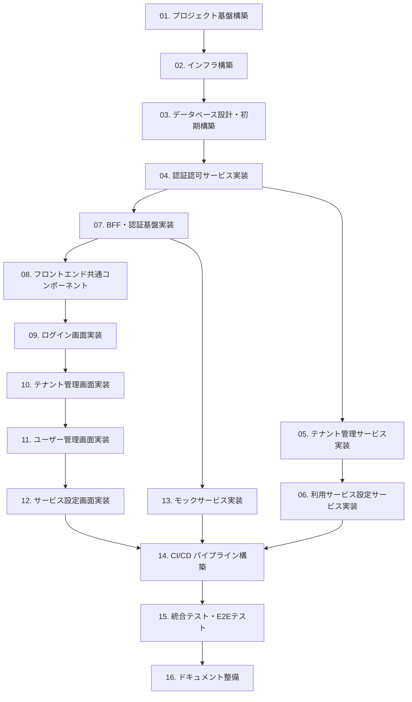

# 開発タスク一覧: 初期構築

## 概要
- アプリ名: PoCアプリ
- 開発プラン: 初期構築
- 開始日: 2024年
- 最終更新: 2024年

## プロジェクト概要

複数サービスを提供する会社の管理アプリケーションのPoC構築。
マイクロサービスアーキテクチャで、Next.jsフロントエンド + Python FastAPIバックエンド + Cosmos DBで構成。

**主要機能**:
- テナント管理
- ユーザー認証認可
- サービス利用設定
- モックサービス（ファイル管理、メッセージング、API利用、バックアップ）

## タスク一覧

| 順序 | タスク名 | 概要 | 優先度 | ステータス | 開始日 | 完了日 | 担当 | 備考 |
|------|----------|------|--------|------------|--------|--------|------|------|
| 01 | プロジェクト基盤構築 | リポジトリ構造、DevContainer、共通ツール設定 | 高 | 未着手 | | | | 他タスクの前提 |
| 02 | インフラ構築（Bicep IaC） | Azure リソースの定義と作成 | 高 | 未着手 | | | | 01完了後 |
| 03 | データベース設計・初期構築 | Cosmos DB コンテナ作成とシードデータ | 高 | 未着手 | | | | 02完了後 |
| 04 | 認証認可サービス実装 | ユーザー管理、JWT発行・検証 | 高 | 未着手 | | | | 03完了後 |
| 05 | テナント管理サービス実装 | テナントとユーザー紐付け管理 | 高 | 未着手 | | | | 04完了後 |
| 06 | 利用サービス設定サービス実装 | サービス割り当て管理 | 中 | 未着手 | | | | 05完了後 |
| 07 | BFF・認証基盤実装 | Next.js API Routes、JWT検証、Middleware | 高 | 未着手 | | | | 04完了後 |
| 08 | フロントエンド共通コンポーネント | レイアウト、UI部品、API Client | 中 | 未着手 | | | | 07完了後 |
| 09 | ログイン画面実装 | 認証フロー、セッション管理 | 高 | 未着手 | | | | 08完了後 |
| 10 | テナント管理画面実装 | 一覧・詳細・作成・編集画面 | 中 | 未着手 | | | | 09完了後 |
| 11 | ユーザー管理画面実装 | 一覧・詳細・作成・編集画面 | 中 | 未着手 | | | | 10完了後 |
| 12 | サービス設定画面実装 | サービス割り当て画面 | 低 | 未着手 | | | | 11完了後 |
| 13 | モックサービス実装 | 4つのモックサービスAPI | 低 | 未着手 | | | | 07完了後 |
| 14 | CI/CD パイプライン構築 | GitHub Actions でのデプロイ自動化 | 中 | 未着手 | | | | 全実装完了後 |
| 15 | 統合テスト・E2Eテスト | 主要フローの動作確認 | 中 | 未着手 | | | | 14完了後 |
| 16 | ドキュメント整備 | README、運用手順書 | 低 | 未着手 | | | | 最終工程 |

## 現在の作業状況
- 現在のタスク: -
- 現在のサブ工程: -
- 進捗率: 0% (0/16)

## タスクの依存関係

## マイルストーン

| マイルストーン | 完了条件 | 目標日 | ステータス |
|--------------|---------|--------|-----------|
| M1: 基盤完成 | タスク01-03完了、ローカル開発環境動作 | - | 未完了 |
| M2: バックエンド完成 | タスク04-06完了、全APIエンドポイント動作 | - | 未完了 |
| M3: フロントエンド完成 | タスク07-13完了、全画面動作 | - | 未完了 |
| M4: デプロイ完了 | タスク14-15完了、Azure環境で動作 | - | 未完了 |
| M5: リリース準備完了 | タスク16完了、ドキュメント整備 | - | 未完了 |

## タスク実施ガイドライン

### タスク着手前
1. 前提タスクの完了を確認
2. タスクドキュメントを読み、実装内容を理解
3. 参照ドキュメント（アーキテクチャ、API仕様）を確認

### タスク実施中
1. **仕様作成**: 詳細仕様を作成（必要に応じて）
2. **アーキテクチャ更新**: 既存設計との差分を確認・更新
3. **実装**: コーディング
4. **テストプラン**: テスト項目を定義
5. **テスト実装**: 単体テスト作成・実行

### タスク完了時
1. 完了条件をすべて満たしているか確認
2. このドキュメント（開発タスク.md）を更新
   - ステータスを「完了」に変更
   - 完了日を記入
   - 次のタスクのステータスを「未着手」→「進行中」に変更
3. コミット・プッシュ

### ステータス定義
- **未着手**: まだ開始していない
- **進行中**: 作業中
- **レビュー中**: 実装完了、レビュー待ち
- **完了**: すべての完了条件を満たした

## リスクと課題

| ID | リスク/課題 | 影響度 | 対策 | ステータス |
|----|-----------|--------|------|-----------|
| R01 | Cosmos DB接続エラー | 高 | エラーハンドリング実装、リトライ処理 | 未対応 |
| R02 | JWT セキュリティ | 中 | 秘密鍵の適切な管理、有効期限設定 | 未対応 |
| R03 | デプロイ時のコスト超過 | 低 | Serverless構成、最小SKU選択 | 未対応 |

## 参照ドキュメント

- [システム概要](../../init.md)
- [アーキテクチャ概要](../../arch/overview.md)
- [コンポーネント設計](../../arch/components/README.md)
- [データモデル](../../arch/data/data-model.md)
- [API仕様](../../arch/api/api-specification.md)
- [デプロイメント設計](../../arch/deployment.md)

## 履歴
- 2024年: 開発タスク一覧作成
