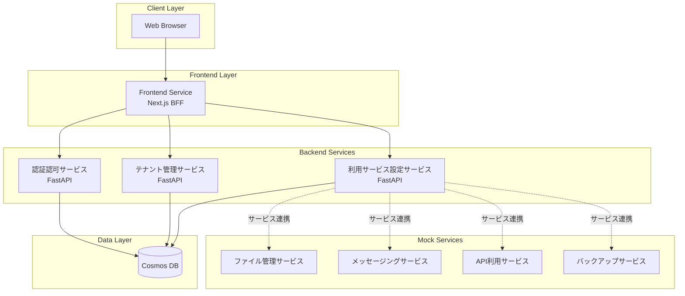
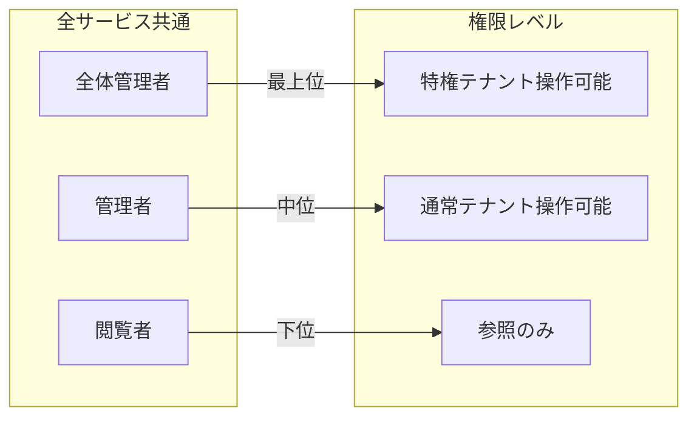

# マルチテナント管理アプリケーション仕様書

**バージョン**: 1.0.0  
**最終更新**: 2026-01-24  
**ステータス**: Draft

## 概要

複数サービスを提供する会社のための統合管理アプリケーションです。マイクロサービスアーキテクチャで構成され、テナント管理、ユーザー認証認可、サービス利用設定を一元的に行えます。

## システムアーキテクチャ



## サービス一覧

| サービス名 | 役割 | 技術スタック | ドキュメント |
|-----------|------|-------------|-------------|
| Frontend | BFFとしてUIを提供 | Next.js (React) | [詳細](./services/frontend/spec.md) |
| テナント管理サービス | テナントとユーザーの管理 | FastAPI (Python) | [詳細](./services/user-management/spec.md) |
| 認証認可サービス | 認証・認可・JWT管理 | FastAPI (Python) | [詳細](./services/auth/spec.md) |
| 利用サービス設定サービス | テナントへのサービス割当 | FastAPI (Python) | [詳細](./services/service-setting/spec.md) |

## リポジトリ構成

```
ws-demo-poly-integration/        # 統合リポジトリ (repo0)
├── infra/                       # IaCコード (Bicep)
├── docs/                        # ドキュメント
│   ├── README.md               # 本ファイル
│   ├── architecture/           # アーキテクチャ設計
│   └── services/               # サービス別仕様
└── src/
    ├── front/                   # repo1: フロントエンド
    ├── user-management-service/ # repo2: テナント管理
    ├── auth-service/            # repo3: 認証認可
    └── service-setting-service/ # repo4: サービス設定
```

## ロール概要

各サービスで定義されるロールの概要です。



## ドキュメント構成

- [アーキテクチャ設計](./architecture/README.md)
  - [認証フロー](./architecture/authentication-flow.md)
  - [データベース設計](./architecture/database-design.md)
  - [API設計ガイドライン](./architecture/api-guidelines.md)
- サービス仕様
  - [Frontend](./services/frontend/spec.md)
  - [テナント管理サービス](./services/user-management/spec.md)
  - [認証認可サービス](./services/auth/spec.md)
  - [利用サービス設定サービス](./services/service-setting/spec.md)
  - [モックサービス](./services/mock-services/spec.md)

## 技術スタック

| カテゴリ | 技術 |
|---------|------|
| フロントエンド | React (Next.js) |
| バックエンド | Python (FastAPI) |
| データベース | Azure Cosmos DB |
| インフラ | Bicep (Azure IaC) |
| 認証方式 | JWT (JSON Web Token) |
