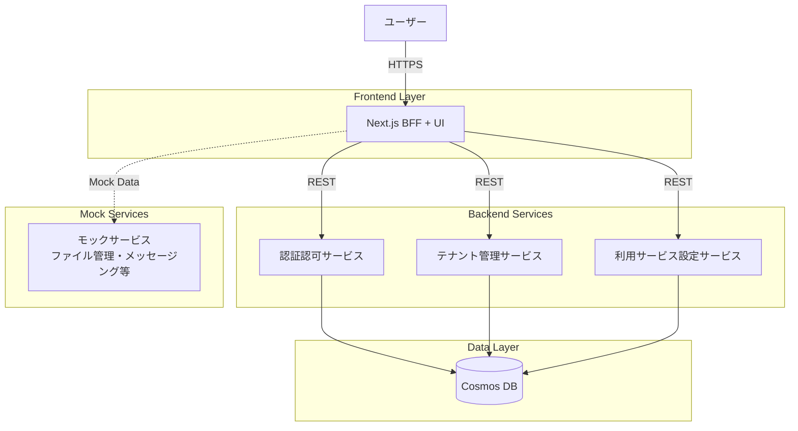

# アーキテクチャドキュメント

このディレクトリには、複数サービス管理アプリケーションPoCのアーキテクチャ設計ドキュメントが格納されています。

---

## 📚 ドキュメント一覧

### 1. [アーキテクチャ概要](./overview.md)
システム全体の概要、技術スタック、設計原則、主要コンポーネントの説明。

**内容**:
- システム概要と目的
- アーキテクチャスタイル（マイクロサービス、BFF）
- システム構成図
- 技術スタック
- 認証・認可モデル
- セキュリティ考慮事項
- デプロイメント構成

**対象読者**: すべての開発者、プロジェクト関係者

---

### 2. [コンポーネント設計](./components/README.md)
各マイクロサービスとフロントエンドの詳細設計。

**内容**:
- Frontend (Next.js) の設計
  - ディレクトリ構造
  - BFF API Routes
  - UIコンポーネント
  - 認証フロー
- 認証認可サービスの設計
  - ユーザー管理
  - JWT発行・検証
  - ロール管理
- テナント管理サービスの設計
  - テナントCRUD
  - 特権テナント保護
  - テナントユーザー管理
- 利用サービス設定サービスの設計
  - サービス割り当て
  - サービス一覧管理
- モックサービスの実装
  - ファイル管理
  - メッセージング
  - API利用
  - バックアップ

**対象読者**: 開発者、テクニカルリード

---

### 3. [データ設計](./data/data-model.md)
データベース設計、データモデル、データフロー。

**内容**:
- Cosmos DB 構成
- データモデル定義
  - テナント管理データ
  - 認証認可データ
  - サービス設定データ
- コンテナ設計
- パーティションキー戦略
- データアクセスパターン
- クエリ最適化
- データマイグレーション

**対象読者**: 開発者、データエンジニア

---

### 4. [API設計仕様書](./api/api-specification.md)
すべてのAPIエンドポイントの詳細仕様。

**内容**:
- 共通仕様（認証、エラーレスポンス）
- 認証認可サービス API
  - ログイン・トークン検証
  - ユーザー管理
  - ロール管理
- テナント管理サービス API
  - テナントCRUD
  - テナントユーザー管理
- 利用サービス設定サービス API
  - サービス一覧
  - サービス割り当て
- BFF API (Next.js)
  - データ集約エンドポイント
- モックサービス API

**対象読者**: 開発者、QAエンジニア、フロントエンド開発者

---

### 5. [開発環境設計](./development-environment.md)
ローカル開発環境の構成、DevContainer設定、Docker Compose構成。

**内容**:
- DevContainer構成
  - Dockerfile設計
  - devcontainer.json設定
  - VS Code拡張機能
- ディレクトリ構造
- Docker Compose構成
  - Workspace Container
  - Cosmos DB Emulator
- 開発ツールとパッケージ
  - Python環境
  - Node.js環境
  - Azure CLI
- 環境変数管理
- ポート構成
- 初期化プロセス
- トラブルシューティング

**対象読者**: すべての開発者、新規参加者

---

### 6. [デプロイメント設計](./deployment.md)
Azure インフラ構成、CI/CD、Bicep IaC 設計。

**内容**:
- インフラストラクチャ概要
- Azure リソース構成
  - App Service (Frontend)
  - Container Apps (Backend)
  - Cosmos DB
  - Application Insights
- ネットワーク設計
- CI/CD パイプライン（GitHub Actions）
- Bicep IaC テンプレート
- 環境変数管理
- コスト見積もり

**対象読者**: DevOpsエンジニア、インフラエンジニア、開発者

---

## 🎯 利用ガイド

### 新規参加者向け

1. **[アーキテクチャ概要](./overview.md)** を読む
   - システム全体を理解
2. **[開発環境設計](./development-environment.md)** で開発環境をセットアップ
3. **[コンポーネント設計](./components/README.md)** で担当領域を確認
4. **[API設計仕様書](./api/api-specification.md)** で連携方法を把握

### フロントエンド開発者向け

1. **[開発環境設計](./development-environment.md)** でNext.js環境をセットアップ
2. **[API設計仕様書](./api/api-specification.md)** でエンドポイントを確認
3. **[コンポーネント設計](./components/README.md)** の Frontend セクションを参照
4. **[データ設計](./data/data-model.md)** でデータ構造を理解

### バックエンド開発者向け

1. **[開発環境設計](./development-environment.md)** でPython環境をセットアップ
2. **[コンポーネント設計](./components/README.md)** で担当サービスの詳細を確認
3. **[データ設計](./data/data-model.md)** でデータモデルを理解
4. **[API設計仕様書](./api/api-specification.md)** でエンドポイント仕様を実装

### インフラ担当者向け

1. **[デプロイメント設計](./deployment.md)** でインフラ構成を確認
2. Bicep テンプレートを使用してリソースをデプロイ
3. CI/CD パイプラインを設定

---

## 🔄 アーキテクチャ図

### システム全体像

---

## 📋 技術スタック概要

| レイヤー | 技術 |
|---------|------|
| **Frontend** | React, Next.js, TypeScript |
| **Backend** | Python, FastAPI |
| **Database** | Azure Cosmos DB (NoSQL) |
| **Hosting** | Azure App Service, Azure Container Apps |
| **CI/CD** | GitHub Actions |
| **IaC** | Bicep |
| **Monitoring** | Application Insights |

---

## 🔐 主要な設計原則

1. **マイクロサービスアーキテクチャ**: 各サービスは独立してデプロイ可能
2. **BFFパターン**: フロントエンド専用のバックエンド層でデータを集約
3. **JWT認証**: ステートレスな認証・認可
4. **ロールベースアクセス制御**: サービスごとのきめ細かい権限管理
5. **PoCに最適化**: シンプルで低コストな構成

---

## 📝 ドキュメント更新ルール

- アーキテクチャに変更がある場合は、該当ドキュメントを更新
- 変更履歴セクションに更新内容を記録
- プルリクエストに「architecture」ラベルを付与

---

## 📞 問い合わせ

アーキテクチャに関する質問や提案は、GitHubのIssueで管理してください。

---

## 関連ドキュメント

- [プロジェクト概要](../init.md)
- [開発環境について](../../.github/instructions/general.instructions.md)
- [エージェント利用ガイド](../../.github/instructions/agents.instructions.md)

---

## 変更履歴

| バージョン | 日付 | 変更内容 | 作成者 |
|-----------|------|---------|-------|
| 1.0.1 | 2024 | 開発環境設計ドキュメント追加 | Architecture Agent |
| 1.0.0 | 2024 | 初版作成 | Architecture Agent |
