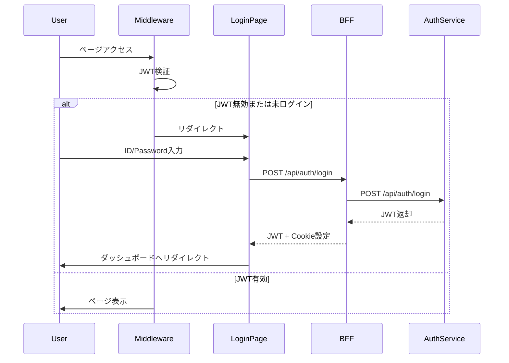
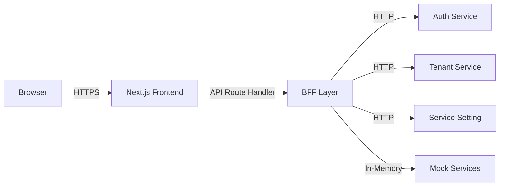
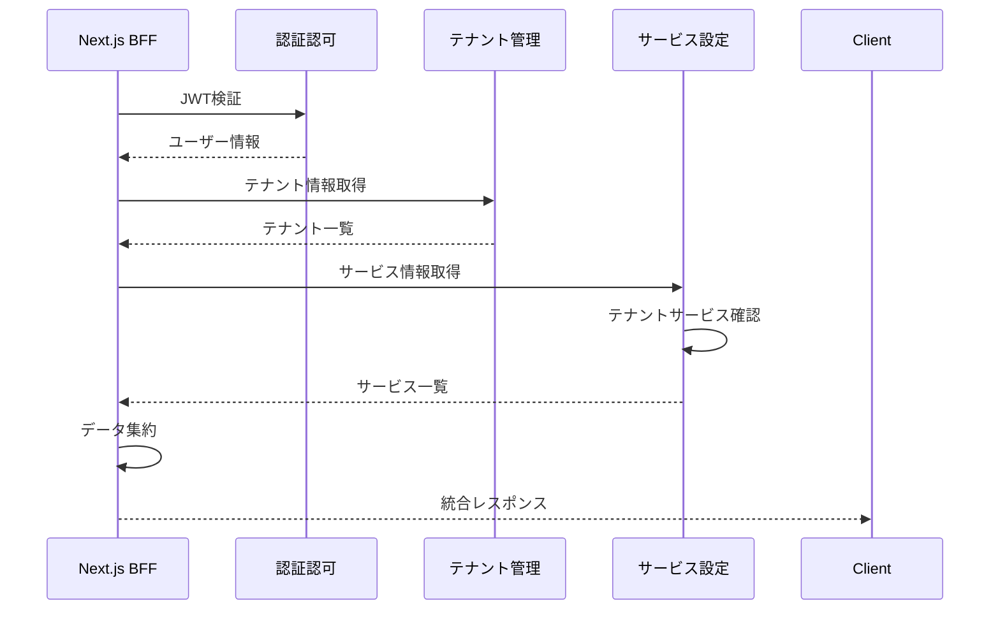
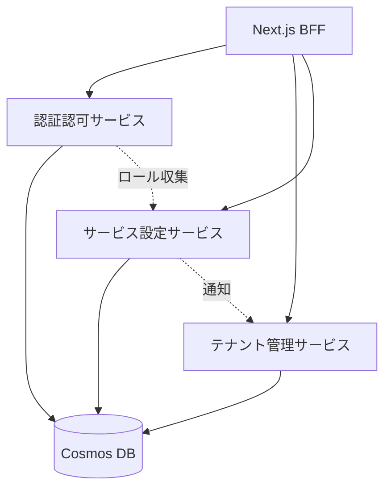

# コンポーネント設計

## ドキュメント情報

- **バージョン**: 1.0.0
- **最終更新日**: 2024年
- **ステータス**: Draft

---

## 目次

1. [Frontend (Next.js)](#1-frontend-nextjs)
2. [認証認可サービス](#2-認証認可サービス)
3. [テナント管理サービス](#3-テナント管理サービス)
4. [利用サービス設定サービス](#4-利用サービス設定サービス)
5. [モックサービス](#5-モックサービス)

---

## 1. Frontend (Next.js)

### 1.1 概要

Next.jsベースのフロントエンドアプリケーションで、以下の2つの役割を持ちます：
- **UIレイヤー**: Reactによるユーザーインターフェース
- **BFFレイヤー**: バックエンドサービスへのプロキシとデータ集約

### 1.2 ディレクトリ構造

```
src/front/
├── app/                      # Next.js App Router
│   ├── api/                  # BFF API Routes
│   │   ├── auth/             # 認証関連API
│   │   ├── tenants/          # テナント管理API
│   │   ├── users/            # ユーザー管理API
│   │   ├── services/         # サービス設定API
│   │   └── mock/             # モックサービスAPI
│   ├── login/                # ログインページ
│   ├── tenants/              # テナント管理画面
│   ├── users/                # ユーザー管理画面
│   ├── services/             # サービス設定画面
│   └── layout.tsx            # ルートレイアウト
├── components/               # Reactコンポーネント
│   ├── ui/                   # 汎用UIコンポーネント
│   ├── features/             # 機能別コンポーネント
│   └── layouts/              # レイアウトコンポーネント
├── lib/                      # ユーティリティ
│   ├── api-client.ts         # APIクライアント
│   ├── auth.ts               # 認証ヘルパー
│   └── mock-data.ts          # モックデータ
├── types/                    # TypeScript型定義
└── middleware.ts             # Next.js Middleware（認証チェック）
```

### 1.3 主要機能

#### 1.3.1 BFF API Routes

**認証関連 (`/api/auth/*`)**
- `POST /api/auth/login` - ログイン処理
- `POST /api/auth/logout` - ログアウト処理
- `GET /api/auth/verify` - トークン検証
- `GET /api/auth/me` - 現在のユーザー情報取得

**テナント管理 (`/api/tenants/*`)**
- `GET /api/tenants` - テナント一覧取得
- `GET /api/tenants/[id]` - テナント詳細取得
- `POST /api/tenants` - テナント作成
- `PUT /api/tenants/[id]` - テナント更新
- `DELETE /api/tenants/[id]` - テナント削除

**ユーザー管理 (`/api/users/*`)**
- `GET /api/users` - ユーザー一覧取得
- `GET /api/users/[id]` - ユーザー詳細取得
- `POST /api/users` - ユーザー作成
- `PUT /api/users/[id]` - ユーザー更新
- `DELETE /api/users/[id]` - ユーザー削除

**サービス設定 (`/api/services/*`)**
- `GET /api/services` - サービス一覧取得
- `GET /api/services/tenant/[tenantId]` - テナントのサービス取得
- `POST /api/services/assign` - サービス割り当て
- `DELETE /api/services/unassign` - サービス解除

**モックサービス (`/api/mock/*`)**
- `GET /api/mock/file-management` - ファイル管理モックデータ
- `GET /api/mock/messaging` - メッセージングモックデータ
- `GET /api/mock/api-usage` - API利用モックデータ
- `GET /api/mock/backup` - バックアップモックデータ

#### 1.3.2 UIコンポーネント

**レイアウトコンポーネント**
```typescript
// components/layouts/MainLayout.tsx
interface MainLayoutProps {
  children: React.ReactNode;
  user: User;
}

export function MainLayout({ children, user }: MainLayoutProps) {
  return (
    <div className="layout">
      <Sidebar user={user} />
      <Header user={user} />
      <main>{children}</main>
    </div>
  );
}
```

**テナント管理コンポーネント**
- `TenantList` - テナント一覧表示
- `TenantDetail` - テナント詳細表示・編集
- `TenantForm` - テナント作成・編集フォーム
- `TenantUserList` - テナント所属ユーザー一覧

**ユーザー管理コンポーネント**
- `UserList` - ユーザー一覧表示
- `UserDetail` - ユーザー詳細表示・編集
- `UserForm` - ユーザー作成・編集フォーム
- `RoleSelector` - ロール選択コンポーネント

### 1.4 認証フロー



### 1.5 環境変数

```bash
# Backend Service URLs
NEXT_PUBLIC_AUTH_SERVICE_URL=http://localhost:8001
NEXT_PUBLIC_TENANT_SERVICE_URL=http://localhost:8002
NEXT_PUBLIC_SERVICE_SETTING_URL=http://localhost:8003

# JWT Configuration
JWT_SECRET=your-secret-key
JWT_EXPIRES_IN=24h

# Environment
NODE_ENV=development
```

### 1.6 データフロー



---

## 2. 認証認可サービス

### 2.1 概要

ユーザー認証、JWT発行、ロール管理を担当するマイクロサービスです。

### 2.2 ディレクトリ構造

```
src/auth-service/
├── app/
│   ├── main.py                 # FastAPIアプリケーション
│   ├── config.py               # 設定管理
│   ├── models/                 # データモデル
│   │   ├── user.py
│   │   └── role.py
│   ├── schemas/                # Pydanticスキーマ
│   │   ├── auth.py
│   │   ├── user.py
│   │   └── role.py
│   ├── repositories/           # データアクセス層
│   │   ├── user_repository.py
│   │   └── role_repository.py
│   ├── services/               # ビジネスロジック
│   │   ├── auth_service.py
│   │   └── user_service.py
│   ├── api/                    # APIエンドポイント
│   │   └── v1/
│   │       ├── auth.py
│   │       ├── users.py
│   │       └── roles.py
│   └── utils/                  # ユーティリティ
│       ├── jwt.py
│       ├── password.py
│       └── dependencies.py
├── tests/
├── Dockerfile
└── requirements.txt
```

### 2.3 主要機能

#### 2.3.1 認証機能

**ログイン**
```python
# app/services/auth_service.py
class AuthService:
    async def login(self, user_id: str, password: str) -> TokenResponse:
        # 1. ユーザー検証
        user = await self.user_repo.get_by_id(user_id)
        if not user or not verify_password(password, user.password_hash):
            raise UnauthorizedError("Invalid credentials")
        
        # 2. 特権テナント所属チェック
        if not user.is_privileged_tenant:
            raise ForbiddenError("Only privileged tenant users can login")
        
        # 3. ロール情報取得
        roles = await self.role_repo.get_user_roles(user.id)
        
        # 4. JWT生成
        token = create_jwt_token({
            "user_id": user.id,
            "tenant_id": user.tenant_id,
            "roles": [r.dict() for r in roles]
        })
        
        return TokenResponse(access_token=token, user=user)
```

**JWT検証**
```python
# app/utils/jwt.py
def verify_jwt_token(token: str) -> Dict:
    try:
        payload = jwt.decode(token, SECRET_KEY, algorithms=[ALGORITHM])
        return payload
    except JWTError:
        raise UnauthorizedError("Invalid token")
```

#### 2.3.2 ユーザー管理

**ユーザー作成**
```python
# app/services/user_service.py
class UserService:
    async def create_user(self, user_data: UserCreate) -> User:
        # パスワードハッシュ化
        password_hash = hash_password(user_data.password)
        
        user = User(
            id=generate_uuid(),
            user_id=user_data.user_id,
            name=user_data.name,
            password_hash=password_hash,
            tenant_id=user_data.tenant_id,
            created_at=datetime.utcnow()
        )
        
        await self.user_repo.create(user)
        return user
```

#### 2.3.3 ロール管理

**ロール情報収集**
```python
# app/services/role_service.py
class RoleService:
    async def collect_roles_from_services(self) -> List[RoleDefinition]:
        """各サービスからロール定義を収集"""
        roles = []
        
        # サービス一覧を取得
        services = await self.service_repo.get_all_services()
        
        for service in services:
            # 各サービスのロールAPI呼び出し
            service_roles = await self.http_client.get(
                f"{service.api_url}/api/roles"
            )
            roles.extend(service_roles)
        
        # DB に保存
        await self.role_repo.bulk_upsert(roles)
        return roles
```

### 2.4 データモデル

```python
# app/models/user.py
from pydantic import BaseModel
from datetime import datetime
from typing import Optional

class User(BaseModel):
    id: str
    user_id: str
    name: str
    password_hash: str
    tenant_id: str
    is_active: bool = True
    created_at: datetime
    updated_at: Optional[datetime] = None

# app/models/role.py
class Role(BaseModel):
    id: str
    service_id: str
    service_name: str
    role_code: str
    role_name: str
    description: str

class UserRole(BaseModel):
    user_id: str
    role_id: str
    assigned_at: datetime
```

### 2.5 API エンドポイント

| メソッド | エンドポイント | 説明 | 必要ロール |
|---------|---------------|------|-----------|
| POST | `/api/v1/auth/login` | ログイン | - |
| POST | `/api/v1/auth/verify` | トークン検証 | - |
| GET | `/api/v1/users` | ユーザー一覧 | 閲覧者以上 |
| GET | `/api/v1/users/{user_id}` | ユーザー詳細 | 閲覧者以上 |
| POST | `/api/v1/users` | ユーザー作成 | 全体管理者 |
| PUT | `/api/v1/users/{user_id}` | ユーザー更新 | 全体管理者 |
| DELETE | `/api/v1/users/{user_id}` | ユーザー削除 | 全体管理者 |
| GET | `/api/v1/roles` | ロール一覧 | 閲覧者以上 |
| GET | `/api/v1/users/{user_id}/roles` | ユーザーロール取得 | 閲覧者以上 |
| POST | `/api/v1/users/{user_id}/roles` | ロール割り当て | 全体管理者 |

### 2.6 環境変数

```bash
# Database
COSMOS_DB_ENDPOINT=https://xxx.documents.azure.com:443/
COSMOS_DB_KEY=xxx
COSMOS_DB_DATABASE=auth_db
COSMOS_DB_CONTAINER=users

# JWT
JWT_SECRET=your-secret-key
JWT_ALGORITHM=HS256
JWT_EXPIRATION_HOURS=24

# Service
SERVICE_NAME=auth-service
PORT=8001
```

---

## 3. テナント管理サービス

### 3.1 概要

テナントとテナント所属ユーザーのライフサイクル管理を行うマイクロサービスです。

### 3.2 ディレクトリ構造

```
src/tenant-management-service/
├── app/
│   ├── main.py
│   ├── config.py
│   ├── models/
│   │   ├── tenant.py
│   │   └── tenant_user.py
│   ├── schemas/
│   │   └── tenant.py
│   ├── repositories/
│   │   └── tenant_repository.py
│   ├── services/
│   │   └── tenant_service.py
│   ├── api/
│   │   └── v1/
│   │       └── tenants.py
│   └── utils/
│       └── dependencies.py
├── tests/
├── Dockerfile
└── requirements.txt
```

### 3.3 主要機能

#### 3.3.1 テナント管理

**テナント作成**
```python
# app/services/tenant_service.py
class TenantService:
    async def create_tenant(self, tenant_data: TenantCreate, current_user: User) -> Tenant:
        # 権限チェック（管理者以上）
        if not self.has_permission(current_user, ["管理者", "全体管理者"]):
            raise ForbiddenError("Insufficient permissions")
        
        tenant = Tenant(
            id=generate_uuid(),
            name=tenant_data.name,
            domains=tenant_data.domains,
            is_privileged=False,
            created_at=datetime.utcnow()
        )
        
        await self.tenant_repo.create(tenant)
        return tenant
```

**特権テナント保護**
```python
async def update_tenant(self, tenant_id: str, tenant_data: TenantUpdate, current_user: User) -> Tenant:
    tenant = await self.tenant_repo.get_by_id(tenant_id)
    
    # 特権テナントの編集禁止
    if tenant.is_privileged:
        raise ForbiddenError("Cannot edit privileged tenant")
    
    # 権限チェック
    if not self.has_permission(current_user, ["管理者", "全体管理者"]):
        raise ForbiddenError("Insufficient permissions")
    
    # 更新処理
    tenant.name = tenant_data.name
    tenant.domains = tenant_data.domains
    tenant.updated_at = datetime.utcnow()
    
    await self.tenant_repo.update(tenant)
    return tenant
```

#### 3.3.2 テナントユーザー管理

```python
async def add_user_to_tenant(self, tenant_id: str, user_id: str, current_user: User) -> TenantUser:
    tenant = await self.tenant_repo.get_by_id(tenant_id)
    
    # 特権テナントの場合は全体管理者のみ
    if tenant.is_privileged:
        if not self.has_permission(current_user, ["全体管理者"]):
            raise ForbiddenError("Only global admin can modify privileged tenant users")
    
    # ユーザー追加
    tenant_user = TenantUser(
        tenant_id=tenant_id,
        user_id=user_id,
        added_at=datetime.utcnow()
    )
    
    await self.tenant_repo.add_user(tenant_user)
    return tenant_user
```

### 3.4 データモデル

```python
# app/models/tenant.py
class Tenant(BaseModel):
    id: str
    name: str
    domains: List[str]
    is_privileged: bool = False
    created_at: datetime
    updated_at: Optional[datetime] = None

class TenantUser(BaseModel):
    tenant_id: str
    user_id: str
    added_at: datetime

class TenantWithUsers(Tenant):
    users: List[User]
    services: List[str]  # サービスIDのリスト
```

### 3.5 API エンドポイント

| メソッド | エンドポイント | 説明 | 必要ロール |
|---------|---------------|------|-----------|
| GET | `/api/v1/tenants` | テナント一覧 | 閲覧者以上 |
| GET | `/api/v1/tenants/{tenant_id}` | テナント詳細 | 閲覧者以上 |
| POST | `/api/v1/tenants` | テナント作成 | 管理者以上 |
| PUT | `/api/v1/tenants/{tenant_id}` | テナント更新 | 管理者以上 |
| DELETE | `/api/v1/tenants/{tenant_id}` | テナント削除 | 管理者以上 |
| GET | `/api/v1/tenants/{tenant_id}/users` | テナント所属ユーザー | 閲覧者以上 |
| POST | `/api/v1/tenants/{tenant_id}/users` | ユーザー追加 | 管理者以上 |
| DELETE | `/api/v1/tenants/{tenant_id}/users/{user_id}` | ユーザー削除 | 管理者以上 |

---

## 4. 利用サービス設定サービス

### 4.1 概要

テナントごとのサービス利用設定を管理するマイクロサービスです。

### 4.2 ディレクトリ構造

```
src/service-setting-service/
├── app/
│   ├── main.py
│   ├── config.py
│   ├── models/
│   │   ├── service.py
│   │   └── tenant_service.py
│   ├── schemas/
│   │   └── service.py
│   ├── repositories/
│   │   └── service_repository.py
│   ├── services/
│   │   └── service_setting_service.py
│   ├── api/
│   │   └── v1/
│   │       └── services.py
│   └── utils/
│       └── dependencies.py
├── tests/
├── Dockerfile
└── requirements.txt
```

### 4.3 主要機能

#### 4.3.1 サービス管理

```python
# app/models/service.py
class Service(BaseModel):
    id: str
    name: str
    description: str
    api_url: str  # ロール情報取得用
    is_active: bool = True

class TenantService(BaseModel):
    tenant_id: str
    service_id: str
    assigned_at: datetime
    assigned_by: str  # user_id
```

#### 4.3.2 サービス割り当て

```python
# app/services/service_setting_service.py
class ServiceSettingService:
    async def assign_service_to_tenant(
        self,
        tenant_id: str,
        service_id: str,
        current_user: User
    ) -> TenantService:
        # 権限チェック（全体管理者のみ）
        if not self.has_permission(current_user, ["全体管理者"]):
            raise ForbiddenError("Only global admin can assign services")
        
        # サービス存在確認
        service = await self.service_repo.get_by_id(service_id)
        if not service:
            raise NotFoundError("Service not found")
        
        # 割り当て
        tenant_service = TenantService(
            tenant_id=tenant_id,
            service_id=service_id,
            assigned_at=datetime.utcnow(),
            assigned_by=current_user.id
        )
        
        await self.service_repo.assign(tenant_service)
        
        # テナント管理サービスへ通知
        await self.notify_tenant_service(tenant_id, service_id)
        
        return tenant_service
```

### 4.4 API エンドポイント

| メソッド | エンドポイント | 説明 | 必要ロール |
|---------|---------------|------|-----------|
| GET | `/api/v1/services` | サービス一覧 | 閲覧者以上 |
| GET | `/api/v1/services/{service_id}` | サービス詳細 | 閲覧者以上 |
| GET | `/api/v1/tenants/{tenant_id}/services` | テナントのサービス | 閲覧者以上 |
| POST | `/api/v1/tenants/{tenant_id}/services` | サービス割り当て | 全体管理者 |
| DELETE | `/api/v1/tenants/{tenant_id}/services/{service_id}` | サービス解除 | 全体管理者 |

---

## 5. モックサービス

### 5.1 概要

実サービスの代わりにモックデータを返却する機能です。BFF（Next.js）内に実装されます。

### 5.2 実装例

```typescript
// src/front/app/api/mock/file-management/route.ts
import { NextRequest, NextResponse } from 'next/server';

export async function GET(request: NextRequest) {
  // Mock data
  const mockFiles = [
    {
      id: 'file-1',
      name: 'document.pdf',
      size: 1024000,
      uploadedAt: '2024-01-15T10:30:00Z',
      uploadedBy: 'user-1'
    },
    {
      id: 'file-2',
      name: 'image.png',
      size: 512000,
      uploadedAt: '2024-01-16T14:20:00Z',
      uploadedBy: 'user-2'
    }
  ];
  
  return NextResponse.json({ files: mockFiles });
}
```

### 5.3 モックサービス一覧

#### 5.3.1 ファイル管理サービス

**エンドポイント**: `/api/mock/file-management`

**ロール**:
- `管理者`: ファイルアップロード・削除
- `ユーザー`: ファイル閲覧・ダウンロード

**モックデータ**:
```json
{
  "files": [
    {
      "id": "file-1",
      "name": "document.pdf",
      "size": 1024000,
      "uploadedAt": "2024-01-15T10:30:00Z",
      "uploadedBy": "user-1"
    }
  ]
}
```

#### 5.3.2 メッセージングサービス

**エンドポイント**: `/api/mock/messaging`

**ロール**:
- `管理者`: メッセージ送信・削除
- `ユーザー`: メッセージ閲覧

**モックデータ**:
```json
{
  "messages": [
    {
      "id": "msg-1",
      "subject": "System Update",
      "body": "The system will be updated tonight.",
      "sentAt": "2024-01-15T10:00:00Z",
      "sentBy": "admin-1"
    }
  ]
}
```

#### 5.3.3 API利用サービス

**エンドポイント**: `/api/mock/api-usage`

**ロール**:
- `管理者`: API設定変更
- `ユーザー`: API利用のみ

**モックデータ**:
```json
{
  "apiUsage": {
    "totalRequests": 15000,
    "remainingQuota": 35000,
    "resetDate": "2024-02-01T00:00:00Z"
  }
}
```

#### 5.3.4 バックアップサービス

**エンドポイント**: `/api/mock/backup`

**ロール**:
- `管理者`: バックアップ実行・復元
- `閲覧者`: バックアップ状況参照

**モックデータ**:
```json
{
  "backups": [
    {
      "id": "backup-1",
      "createdAt": "2024-01-15T02:00:00Z",
      "size": 5120000,
      "status": "completed"
    }
  ]
}
```

---

## 6. コンポーネント間通信

### 6.1 通信プロトコル

- **プロトコル**: HTTP/HTTPS
- **データ形式**: JSON
- **認証**: JWT Bearer Token

### 6.2 通信パターン



### 6.3 エラーハンドリング

各サービスは統一されたエラーレスポンス形式を返します：

```json
{
  "error": {
    "code": "UNAUTHORIZED",
    "message": "Invalid or expired token",
    "details": {}
  }
}
```

**エラーコード一覧**:
- `UNAUTHORIZED`: 認証エラー
- `FORBIDDEN`: 権限不足
- `NOT_FOUND`: リソース未検出
- `BAD_REQUEST`: リクエスト不正
- `INTERNAL_ERROR`: サーバーエラー

---

## 7. 依存関係



---

## 8. 開発ガイドライン

### 8.1 コーディング規約

**Python (FastAPI)**
- PEP 8 に準拠
- 型ヒントを必須化
- async/await を使用

**TypeScript (Next.js)**
- ESLint + Prettier 使用
- 厳格な型チェック有効化
- React Hooks 使用

### 8.2 テスト戦略

- **単体テスト**: 各関数・メソッド
- **統合テスト**: API エンドポイント
- **E2Eテスト**: 主要ユーザーフロー（オプション）

---

## 変更履歴

| バージョン | 日付 | 変更内容 | 作成者 |
|-----------|------|---------|-------|
| 1.0.0 | 2024 | 初版作成 | Architecture Agent |
