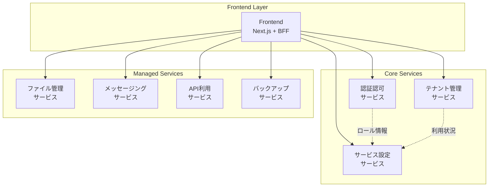
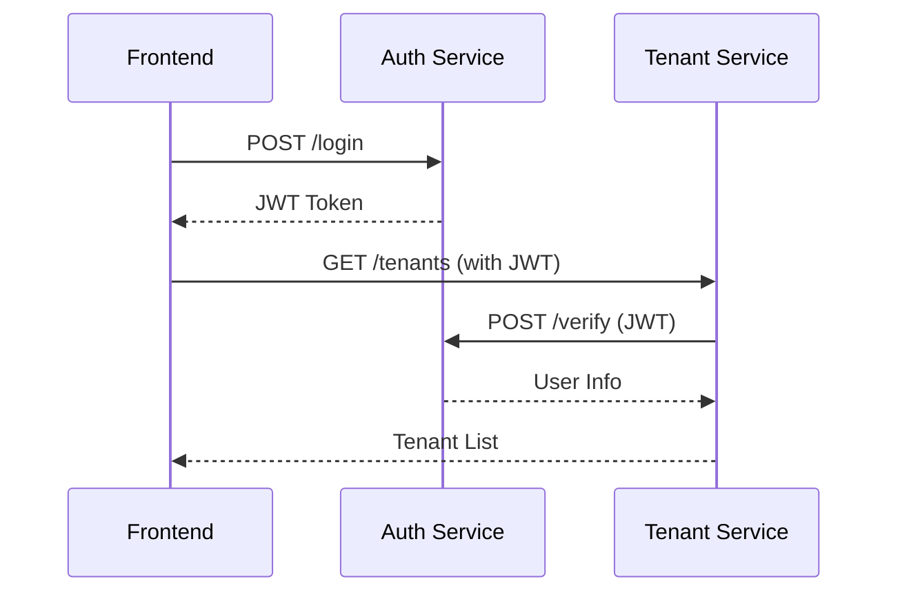

# コンポーネント設計

## ドキュメント情報
- バージョン: 1.0.0
- 最終更新日: 2026-02-01
- 関連: [システムアーキテクチャ概要](../overview.md)

## 1. コンポーネント構成概要

本システムは以下の8つの主要コンポーネントで構成されます：



## 2. Frontend コンポーネント

### 2.1 概要
Next.js 14を使用したReactベースのシングルページアプリケーション（SPA）。API RoutesをBFF（Backend for Frontend）層として活用し、バックエンドサービスとの通信を仲介します。

### 2.2 責務
- **UI提供**: ユーザーインターフェースのレンダリング
- **BFF層**: バックエンドAPIの集約とフロントエンド向け最適化
- **認証管理**: JWTトークンの安全な保管（HTTPOnly Cookie）
- **ルーティング**: フロントエンドのページ遷移管理

### 2.3 ディレクトリ構造
```
src/front/
├── app/                      # Next.js App Router
│   ├── (auth)/              # 認証関連ページ
│   │   └── login/           # ログインページ
│   ├── (dashboard)/         # ダッシュボード（認証必須）
│   │   ├── tenants/         # テナント管理
│   │   ├── users/           # ユーザー管理
│   │   └── services/        # サービス設定
│   ├── api/                 # BFF API Routes
│   │   ├── auth/            # 認証API
│   │   ├── tenants/         # テナントAPI
│   │   ├── users/           # ユーザーAPI
│   │   └── services/        # サービスAPI
│   └── layout.tsx           # ルートレイアウト
├── components/              # Reactコンポーネント
│   ├── ui/                  # 汎用UIコンポーネント
│   ├── forms/               # フォームコンポーネント
│   └── layouts/             # レイアウトコンポーネント
├── lib/                     # ユーティリティ
│   ├── api-client.ts        # BFF APIクライアント
│   ├── auth.ts              # 認証ヘルパー
│   └── types.ts             # TypeScript型定義
└── middleware.ts            # Next.js Middleware（認証チェック）
```

### 2.4 主要機能

#### 2.4.1 BFF API Routes
各バックエンドサービスへのリクエストを集約：

```typescript
// app/api/tenants/route.ts
export async function GET(request: Request) {
  // Cookie からJWT取得
  const token = cookies().get('auth_token')?.value;
  
  // 認証チェック
  if (!token) {
    return NextResponse.json({ error: 'Unauthorized' }, { status: 401 });
  }
  
  // バックエンドサービスへプロキシ
  const response = await fetch(`${process.env.TENANT_SERVICE_URL}/api/tenants`, {
    headers: {
      'Authorization': `Bearer ${token}`,
    },
  });
  
  return NextResponse.json(await response.json());
}
```

#### 2.4.2 認証Middleware
保護されたルートへのアクセス制御：

```typescript
// middleware.ts
export function middleware(request: NextRequest) {
  const token = request.cookies.get('auth_token')?.value;
  
  if (!token) {
    return NextResponse.redirect(new URL('/login', request.url));
  }
  
  return NextResponse.next();
}

export const config = {
  matcher: ['/dashboard/:path*'],
};
```

### 2.5 技術スタック
- **フレームワーク**: Next.js 14 (App Router)
- **言語**: TypeScript 5.0+
- **UIライブラリ**: React 18
- **スタイリング**: Tailwind CSS
- **状態管理**: TanStack Query (React Query)
- **フォーム**: React Hook Form
- **バリデーション**: Zod

### 2.6 外部依存
- 認証認可サービス: JWT検証、ログイン
- テナント管理サービス: テナント・ユーザーデータ
- サービス設定サービス: サービス利用状況
- 各種管理対象サービス: 各サービス固有機能

## 3. 認証認可サービス

### 3.1 概要
ユーザー認証とロールベースのアクセス制御を提供するコアサービス。JWT発行、検証、ロール管理を担当します。

### 3.2 責務
- **ユーザー認証**: ID/パスワードによる本人確認
- **JWT発行**: 認証成功時のトークン発行
- **JWT検証**: 他サービスからの検証リクエスト処理
- **ユーザー管理**: ユーザーCRUD操作
- **ロール管理**: サービス横断的なロール情報の管理

### 3.3 ディレクトリ構造
```
src/auth-service/
├── app/
│   ├── main.py              # FastAPIアプリケーションエントリポイント
│   ├── api/                 # APIエンドポイント
│   │   ├── auth.py          # 認証API（login, verify）
│   │   ├── users.py         # ユーザー管理API
│   │   └── roles.py         # ロール管理API
│   ├── models/              # Pydanticモデル
│   │   ├── user.py          # ユーザーモデル
│   │   ├── role.py          # ロールモデル
│   │   └── token.py         # トークンモデル
│   ├── services/            # ビジネスロジック
│   │   ├── auth_service.py  # 認証処理
│   │   ├── user_service.py  # ユーザー処理
│   │   └── role_service.py  # ロール処理
│   ├── repositories/        # データアクセス層
│   │   ├── user_repository.py
│   │   └── role_repository.py
│   ├── utils/               # ユーティリティ
│   │   ├── jwt.py           # JWT処理
│   │   ├── password.py      # パスワードハッシュ
│   │   └── validators.py    # バリデーション
│   └── config.py            # 設定
├── tests/                   # テストコード
└── requirements.txt         # 依存パッケージ
```

### 3.4 主要機能

#### 3.4.1 ユーザー認証
```python
# app/api/auth.py
@router.post("/login", response_model=TokenResponse)
async def login(credentials: LoginRequest, auth_service: AuthService = Depends()):
    """ユーザー認証とJWT発行"""
    user = await auth_service.authenticate(
        username=credentials.username,
        password=credentials.password
    )
    
    if not user:
        raise HTTPException(status_code=401, detail="Invalid credentials")
    
    # JWT生成
    token = create_access_token(
        data={
            "user_id": user.id,
            "tenant_id": user.tenant_id,
            "roles": user.roles
        }
    )
    
    return TokenResponse(access_token=token, token_type="bearer")
```

#### 3.4.2 JWT検証
```python
# app/api/auth.py
@router.post("/verify", response_model=TokenPayload)
async def verify_token(token: str = Header()):
    """JWT検証"""
    try:
        payload = decode_access_token(token)
        return TokenPayload(**payload)
    except JWTError:
        raise HTTPException(status_code=401, detail="Invalid token")
```

#### 3.4.3 ロール管理
複数サービスのロール情報を統合管理：

```python
# app/services/role_service.py
class RoleService:
    async def get_available_roles(self, tenant_id: str) -> List[Role]:
        """テナントが利用可能な全サービスのロールを取得"""
        # サービス設定サービスから利用可能サービスを取得
        available_services = await self.service_setting_client.get_tenant_services(tenant_id)
        
        # 各サービスからロール情報を取得
        all_roles = []
        for service in available_services:
            roles = await self.fetch_service_roles(service.id)
            all_roles.extend(roles)
        
        return all_roles
    
    async def fetch_service_roles(self, service_id: str) -> List[Role]:
        """特定サービスのロール一覧を取得"""
        # 各サービスの /api/roles エンドポイントを呼び出し
        pass
```

### 3.5 データモデル

#### 3.5.1 User
```python
class User(BaseModel):
    id: str = Field(default_factory=lambda: str(uuid.uuid4()))
    username: str
    email: str
    password_hash: str
    tenant_id: str
    is_active: bool = True
    created_at: datetime
    updated_at: datetime
```

#### 3.5.2 RoleAssignment
```python
class RoleAssignment(BaseModel):
    id: str = Field(default_factory=lambda: str(uuid.uuid4()))
    user_id: str
    tenant_id: str
    service_id: str
    role_name: str  # "全体管理者", "管理者", "閲覧者" など
    assigned_at: datetime
```

### 3.6 ロール定義
- **全体管理者**: ユーザー登録・削除、特権テナント操作
- **閲覧者**: ユーザー情報の参照のみ

### 3.7 技術スタック
- **フレームワーク**: FastAPI 0.100+
- **言語**: Python 3.11+
- **認証**: python-jose (JWT)
- **パスワードハッシュ**: passlib (bcrypt)
- **バリデーション**: Pydantic v2
- **非同期DB**: Azure Cosmos DB SDK (async)

### 3.8 外部依存
- サービス設定サービス: 利用可能サービスの取得
- 各種管理対象サービス: ロール情報の取得

## 4. テナント管理サービス

### 4.1 概要
テナント（クライアント企業）とそのユーザーを管理するサービス。特権テナントの概念を実装し、管理会社による一元管理を実現します。

### 4.2 責務
- **テナント管理**: テナントのCRUD操作
- **テナントユーザー管理**: テナントへのユーザー割り当て
- **ドメイン管理**: テナント許可ドメインの管理
- **特権テナント保護**: 特権テナントの削除・編集制限

### 4.3 ディレクトリ構造
```
src/tenant-management-service/
├── app/
│   ├── main.py
│   ├── api/
│   │   ├── tenants.py       # テナント管理API
│   │   └── domains.py       # ドメイン管理API
│   ├── models/
│   │   ├── tenant.py
│   │   └── domain.py
│   ├── services/
│   │   ├── tenant_service.py
│   │   └── domain_service.py
│   ├── repositories/
│   │   └── tenant_repository.py
│   └── config.py
├── tests/
└── requirements.txt
```

### 4.4 主要機能

#### 4.4.1 テナント一覧取得
```python
# app/api/tenants.py
@router.get("/", response_model=List[TenantResponse])
async def list_tenants(
    current_user: User = Depends(get_current_user),
    tenant_service: TenantService = Depends()
):
    """テナント一覧取得（ロールベース認可）"""
    # 権限チェック
    if not current_user.has_role("閲覧者", "tenant-management"):
        raise HTTPException(status_code=403, detail="Insufficient permissions")
    
    tenants = await tenant_service.list_tenants()
    return tenants
```

#### 4.4.2 テナント作成
```python
@router.post("/", response_model=TenantResponse)
async def create_tenant(
    tenant_data: TenantCreateRequest,
    current_user: User = Depends(get_current_user),
    tenant_service: TenantService = Depends()
):
    """テナント新規作成（管理者のみ）"""
    if not current_user.has_role("管理者", "tenant-management"):
        raise HTTPException(status_code=403, detail="Admin role required")
    
    tenant = await tenant_service.create_tenant(tenant_data)
    return tenant
```

#### 4.4.3 特権テナント保護
```python
# app/services/tenant_service.py
async def update_tenant(self, tenant_id: str, data: TenantUpdateRequest) -> Tenant:
    """テナント更新（特権テナント保護）"""
    tenant = await self.repository.get(tenant_id)
    
    # 特権テナントは編集不可
    if tenant.is_privileged:
        raise ValueError("Privileged tenant cannot be modified")
    
    return await self.repository.update(tenant_id, data)

async def delete_tenant(self, tenant_id: str) -> None:
    """テナント削除（特権テナント保護）"""
    tenant = await self.repository.get(tenant_id)
    
    # 特権テナントは削除不可
    if tenant.is_privileged:
        raise ValueError("Privileged tenant cannot be deleted")
    
    await self.repository.delete(tenant_id)
```

### 4.5 データモデル

#### 4.5.1 Tenant
```python
class Tenant(BaseModel):
    id: str = Field(default_factory=lambda: str(uuid.uuid4()))
    tenant_id: str  # パーティションキー
    name: str
    is_privileged: bool = False  # 特権テナントフラグ
    user_count: int = 0
    created_at: datetime
    updated_at: datetime
```

#### 4.5.2 TenantUser
```python
class TenantUser(BaseModel):
    id: str
    tenant_id: str  # パーティションキー
    user_id: str
    assigned_at: datetime
```

#### 4.5.3 Domain
```python
class Domain(BaseModel):
    id: str
    tenant_id: str  # パーティションキー
    domain: str  # "example.com"
    verified: bool = False
    created_at: datetime
```

### 4.6 ロール定義
- **全体管理者**: 特権テナント操作、全テナント管理
- **管理者**: 通常テナントの追加・削除・編集
- **閲覧者**: テナント情報の参照のみ

### 4.7 技術スタック
- **フレームワーク**: FastAPI 0.100+
- **言語**: Python 3.11+
- **バリデーション**: Pydantic v2
- **非同期DB**: Azure Cosmos DB SDK (async)

## 5. サービス設定サービス

### 5.1 概要
各テナントが利用可能なサービスを管理し、サービス間のロール情報を統合するハブサービス。

### 5.2 責務
- **サービス割り当て**: テナントへのサービス利用権限付与
- **サービスカタログ**: 全サービスの一覧管理
- **ロール情報統合**: 各サービスのロールAPIを集約
- **利用状況管理**: テナント毎のサービス利用状況追跡

### 5.3 ディレクトリ構造
```
src/service-setting-service/
├── app/
│   ├── main.py
│   ├── api/
│   │   ├── service_assignments.py  # サービス割り当てAPI
│   │   └── service_catalog.py      # サービスカタログAPI
│   ├── models/
│   │   ├── service.py
│   │   └── assignment.py
│   ├── services/
│   │   ├── assignment_service.py
│   │   └── role_aggregator.py      # ロール統合ロジック
│   ├── repositories/
│   │   └── service_repository.py
│   └── config.py
├── tests/
└── requirements.txt
```

### 5.4 主要機能

#### 5.4.1 サービス割り当て
```python
# app/api/service_assignments.py
@router.post("/tenants/{tenant_id}/services", response_model=AssignmentResponse)
async def assign_service(
    tenant_id: str,
    assignment: ServiceAssignmentRequest,
    current_user: User = Depends(get_current_user),
    service: AssignmentService = Depends()
):
    """テナントにサービスを割り当て（全体管理者のみ）"""
    if not current_user.has_role("全体管理者", "service-setting"):
        raise HTTPException(status_code=403, detail="Only global admin can assign services")
    
    result = await service.assign_service(tenant_id, assignment.service_id)
    return result
```

#### 5.4.2 ロール情報統合
各サービスから動的にロール情報を取得：

```python
# app/services/role_aggregator.py
class RoleAggregator:
    def __init__(self):
        self.service_registry = {
            "tenant-management": "http://tenant-service/api/roles",
            "auth-service": "http://auth-service/api/roles",
            "file-service": "http://file-service/api/roles",
            "messaging-service": "http://messaging-service/api/roles",
            # ...
        }
    
    async def get_roles_for_tenant(self, tenant_id: str) -> Dict[str, List[Role]]:
        """テナントが利用可能な全サービスのロールを取得"""
        # テナントの利用サービス取得
        assigned_services = await self.get_tenant_services(tenant_id)
        
        # 各サービスのロールAPIを並列呼び出し
        tasks = [
            self.fetch_service_roles(service.id)
            for service in assigned_services
        ]
        results = await asyncio.gather(*tasks)
        
        # サービスIDをキーとした辞書に変換
        return {
            service.id: roles
            for service, roles in zip(assigned_services, results)
        }
    
    async def fetch_service_roles(self, service_id: str) -> List[Role]:
        """特定サービスのロール情報を取得"""
        url = self.service_registry.get(service_id)
        if not url:
            return []
        
        async with httpx.AsyncClient() as client:
            response = await client.get(url)
            return [Role(**r) for r in response.json()]
```

### 5.5 データモデル

#### 5.5.1 Service
```python
class Service(BaseModel):
    id: str  # "file-service", "messaging-service" など
    name: str
    description: str
    role_endpoint: str  # ロール情報取得エンドポイント
    is_active: bool = True
```

#### 5.5.2 ServiceAssignment
```python
class ServiceAssignment(BaseModel):
    id: str
    tenant_id: str  # パーティションキー
    service_id: str
    assigned_at: datetime
    assigned_by: str  # ユーザーID
```

### 5.6 ロール定義
- **全体管理者**: サービス割り当て
- **閲覧者**: 利用状況の参照

### 5.7 技術スタック
- **フレームワーク**: FastAPI 0.100+
- **言語**: Python 3.11+
- **HTTPクライアント**: httpx (async)
- **非同期DB**: Azure Cosmos DB SDK (async)

### 5.8 外部依存
- 全ての管理対象サービス: ロール情報取得API

## 6. 管理対象サービス（モックサービス）

### 6.1 概要
実際にテナントが利用するサービス群。本システムでは4つのモックサービスを実装します。各サービスは同じ設計パターンに従い、独自のロールセットを定義します。

### 6.2 共通設計パターン

#### 6.2.1 共通ディレクトリ構造
```
src/{service-name}/
├── app/
│   ├── main.py
│   ├── api/
│   │   ├── features.py      # サービス固有機能API
│   │   └── roles.py         # ロール情報提供API
│   ├── models/
│   │   ├── entities.py      # サービス固有エンティティ
│   │   └── role.py          # ロールモデル
│   ├── services/
│   └── repositories/
├── tests/
└── requirements.txt
```

#### 6.2.2 ロール情報提供API（全サービス共通）
```python
# app/api/roles.py
@router.get("/roles", response_model=List[RoleInfo])
async def get_service_roles():
    """このサービスで定義されているロール一覧を返却"""
    return [
        RoleInfo(name="管理者", description="全機能へのアクセス"),
        RoleInfo(name="編集者", description="データの作成・編集"),
        RoleInfo(name="閲覧者", description="データの参照のみ"),
    ]
```

### 6.3 ファイル管理サービス

#### 6.3.1 主要機能
- ファイルアップロード
- ファイルダウンロード
- ファイル一覧取得
- フォルダ管理

#### 6.3.2 ロール定義
- **管理者**: 全操作可能
- **編集者**: ファイルのアップロード、削除、フォルダ作成
- **閲覧者**: ファイルのダウンロード、一覧表示のみ

#### 6.3.3 データモデル
```python
class File(BaseModel):
    id: str
    tenant_id: str  # パーティションキー
    name: str
    size: int
    content_type: str
    folder_id: Optional[str]
    uploaded_by: str
    uploaded_at: datetime
```

### 6.4 メッセージングサービス

#### 6.4.1 主要機能
- メッセージ送信
- メッセージ受信
- チャネル作成・管理
- メンバー管理

#### 6.4.2 ロール定義
- **管理者**: チャネル管理、メンバー管理
- **メンバー**: メッセージ送受信、チャネル閲覧
- **閲覧者**: メッセージ閲覧のみ

#### 6.4.3 データモデル
```python
class Message(BaseModel):
    id: str
    tenant_id: str  # パーティションキー
    channel_id: str
    content: str
    sender_id: str
    sent_at: datetime

class Channel(BaseModel):
    id: str
    tenant_id: str  # パーティションキー
    name: str
    description: str
    created_by: str
    created_at: datetime
```

### 6.5 API利用サービス

#### 6.5.1 主要機能
- APIキー発行
- API利用状況監視
- レート制限管理
- 利用統計レポート

#### 6.5.2 ロール定義
- **管理者**: APIキー管理、制限設定
- **開発者**: APIキー閲覧、利用統計確認
- **閲覧者**: 利用統計閲覧のみ

#### 6.5.3 データモデル
```python
class APIKey(BaseModel):
    id: str
    tenant_id: str  # パーティションキー
    key: str
    name: str
    rate_limit: int
    created_by: str
    created_at: datetime
    expires_at: Optional[datetime]

class APIUsage(BaseModel):
    id: str
    tenant_id: str  # パーティションキー
    api_key_id: str
    endpoint: str
    method: str
    status_code: int
    timestamp: datetime
```

### 6.6 バックアップサービス

#### 6.6.1 主要機能
- バックアップジョブ作成
- バックアップ実行
- リストア
- バックアップ履歴管理

#### 6.6.2 ロール定義
- **管理者**: 全操作可能
- **オペレーター**: バックアップ実行、リストア実行
- **閲覧者**: 履歴閲覧のみ

#### 6.6.3 データモデル
```python
class BackupJob(BaseModel):
    id: str
    tenant_id: str  # パーティションキー
    name: str
    schedule: str  # cron形式
    target: str  # バックアップ対象
    created_by: str
    created_at: datetime

class BackupHistory(BaseModel):
    id: str
    tenant_id: str  # パーティションキー
    job_id: str
    status: str  # "success", "failed"
    size: int
    started_at: datetime
    completed_at: datetime
```

## 7. コンポーネント間通信

### 7.1 通信方式
- **プロトコル**: HTTP/REST
- **フォーマット**: JSON
- **認証**: Bearer Token (JWT)

### 7.2 通信パターン

#### 7.2.1 同期通信（REST API）
基本的な通信はすべて同期的なREST APIで実現：



#### 7.2.2 サービス間認証
サービス間通信では共有秘密鍵を使用：

```python
# 共通ヘッダー
headers = {
    "X-Service-Key": os.getenv("SERVICE_SHARED_SECRET"),
    "X-Requesting-Service": "tenant-management"
}
```

### 7.3 エラーハンドリング戦略

#### 7.3.1 タイムアウト設定
| 通信種別 | タイムアウト | 理由 |
|---------|------------|------|
| BFF → バックエンド | 5秒 | ユーザー体験を損なわない範囲 |
| サービス間通信 | 3秒 | 内部通信は高速であるべき |
| Cosmos DB クエリ | 2秒 | パーティションキー指定時 |
| Cosmos DB クロスパーティション | 10秒 | 複雑なクエリの許容時間 |

```python
# タイムアウト設定例
import httpx

async with httpx.AsyncClient(timeout=3.0) as client:
    response = await client.get(
        f"{AUTH_SERVICE_URL}/verify",
        headers={"Authorization": f"Bearer {token}"}
    )
```

#### 7.3.2 リトライポリシー
- **リトライ対象**: 5xx エラー、タイムアウト、ネットワークエラー
- **リトライ回数**: 最大3回
- **バックオフ**: 指数バックオフ（初回: 100ms、2回目: 200ms、3回目: 400ms）
- **リトライ除外**: 4xx エラー（クライアントエラーは再試行不要）

```python
# リトライ実装例
from tenacity import retry, stop_after_attempt, wait_exponential, retry_if_exception_type

@retry(
    stop=stop_after_attempt(3),
    wait=wait_exponential(multiplier=0.1, min=0.1, max=1),
    retry=retry_if_exception_type((httpx.TimeoutException, httpx.ConnectError)),
    reraise=True
)
async def call_service_with_retry(url: str, **kwargs):
    """リトライ機能付きサービス呼び出し"""
    async with httpx.AsyncClient() as client:
        response = await client.get(url, **kwargs)
        # 5xxエラーの場合は例外を発生させてリトライ
        if response.status_code >= 500:
            raise httpx.HTTPStatusError(
                f"Server error: {response.status_code}",
                request=response.request,
                response=response
            )
        return response
```

#### 7.3.3 部分的失敗の扱い
サービス間通信で一部が失敗した場合の動作方針：

**1. クリティカルサービス**
- **対象**: 認証サービス
- **失敗時の動作**: 即座に503エラーを返す
- **理由**: 認証なしではシステムが機能しない

```python
async def get_dashboard_data(current_user: User):
    """ダッシュボードデータ取得（クリティカルサービス優先）"""
    try:
        # 認証サービスは必須
        user_info = await auth_service.get_user_info(current_user.id)
    except httpx.HTTPError as e:
        # 認証サービス失敗は即座にエラー
        raise HTTPException(
            status_code=503,
            detail="Authentication service unavailable"
        )
    
    # 他のデータは並列取得（部分的失敗を許容）
    results = await asyncio.gather(
        tenant_service.get_tenant(current_user.tenant_id),
        service_setting.get_services(current_user.tenant_id),
        return_exceptions=True  # 例外をキャッチして継続
    )
    
    # 成功したデータのみをレスポンスに含める
    response = {"user": user_info}
    
    if not isinstance(results[0], Exception):
        response["tenant"] = results[0]
    else:
        response["tenant"] = {"error": "Service unavailable"}
    
    if not isinstance(results[1], Exception):
        response["services"] = results[1]
    else:
        response["services"] = {"error": "Service unavailable"}
    
    return response
```

**2. 非クリティカルサービス**
- **対象**: 各種管理対象サービス（ファイル管理、メッセージング等）
- **失敗時の動作**: 該当部分を「利用不可」と表示、他は正常表示
- **理由**: 他のサービスは引き続き利用可能にする

**3. デグラデーション対応**
```python
# キャッシュがある場合の降格動作
async def get_tenant_with_fallback(tenant_id: str, cache: Redis):
    """キャッシュフォールバック付きテナント取得"""
    try:
        # 通常はサービスから取得
        tenant = await tenant_service.get_tenant(tenant_id)
        # キャッシュに保存（5分）
        await cache.setex(f"tenant:{tenant_id}", 300, tenant.json())
        return tenant
    except httpx.HTTPError:
        # サービス失敗時はキャッシュから取得
        cached = await cache.get(f"tenant:{tenant_id}")
        if cached:
            logger.warning(f"Using cached tenant data for {tenant_id}")
            return Tenant.parse_raw(cached)
        # キャッシュもない場合はエラー
        raise HTTPException(
            status_code=503,
            detail="Tenant service unavailable and no cached data"
        )
```

#### 7.3.4 標準エラーレスポンス
```json
{
  "error": {
    "code": "TENANT_NOT_FOUND",
    "message": "The specified tenant does not exist",
    "details": {},
    "timestamp": "2026-02-01T12:00:00Z",
    "requestId": "req_abc123"
  }
}
```

#### 7.3.5 サーキットブレーカーパターン（Phase 2）
連続的な失敗時にサービス呼び出しを一時停止：

```python
from circuitbreaker import circuit

@circuit(failure_threshold=5, recovery_timeout=60)
async def call_external_service(url: str):
    """サーキットブレーカー付きサービス呼び出し"""
    async with httpx.AsyncClient() as client:
        return await client.get(url)
```

## 8. 共通ライブラリ

### 8.1 認証ミドルウェア（Python）
各サービスで共通利用：

```python
# common/auth_middleware.py
async def verify_jwt_token(authorization: str = Header()):
    """JWT検証共通ミドルウェア"""
    if not authorization.startswith("Bearer "):
        raise HTTPException(status_code=401)
    
    token = authorization[7:]
    
    # 認証サービスで検証
    async with httpx.AsyncClient() as client:
        response = await client.post(
            f"{AUTH_SERVICE_URL}/verify",
            headers={"Authorization": f"Bearer {token}"}
        )
        
        if response.status_code != 200:
            raise HTTPException(status_code=401)
        
        return response.json()
```

### 8.2 ロール認可デコレータ
```python
# common/authorization.py
def require_role(service: str, role: str):
    """ロールベース認可デコレータ"""
    def decorator(func):
        @wraps(func)
        async def wrapper(*args, current_user: User, **kwargs):
            if not current_user.has_role(role, service):
                raise HTTPException(status_code=403, detail=f"Role '{role}' required")
            return await func(*args, current_user=current_user, **kwargs)
        return wrapper
    return decorator

# 使用例
@router.get("/tenants")
@require_role("tenant-management", "閲覧者")
async def list_tenants(current_user: User = Depends(get_current_user)):
    pass
```

## 9. コンポーネント成熟度

### 9.1 Phase 1 (MVP) - 現在
- ✅ Frontend (基本機能)
- ✅ 認証認可サービス（JWT発行・検証）
- ✅ テナント管理サービス（CRUD）
- ✅ サービス設定サービス（基本割り当て）
- ✅ モックサービス4つ（基本機能）

### 9.2 Phase 2 (拡張)
- ⬜ リフレッシュトークン
- ⬜ 詳細な監査ログ
- ⬜ イベント駆動アーキテクチャ
- ⬜ 高度なロール管理（階層型ロール）

### 9.3 Phase 3 (最適化)
- ⬜ APIゲートウェイ統合
- ⬜ サービスメッシュ
- ⬜ 分散トレーシング
- ⬜ 高度なキャッシング戦略

## 10. 参照
- [システムアーキテクチャ概要](../overview.md)
- [API設計](../api/README.md)
- [データモデル設計](../data/README.md)
- [セキュリティ設計](../security/README.md)

## 11. 変更履歴

| バージョン | 日付 | 変更内容 | 関連仕様 |
|----------|------|---------|----------|
| 1.0.0 | 2026-02-01 | 初版作成 | - |
| 1.1.0 | 2026-02-01 | エラーハンドリング戦略の詳細化（タイムアウト、リトライ、部分的失敗対応）（アーキテクチャレビュー対応） | [アーキテクチャレビュー001](../review/architecture-review-001.md) |
