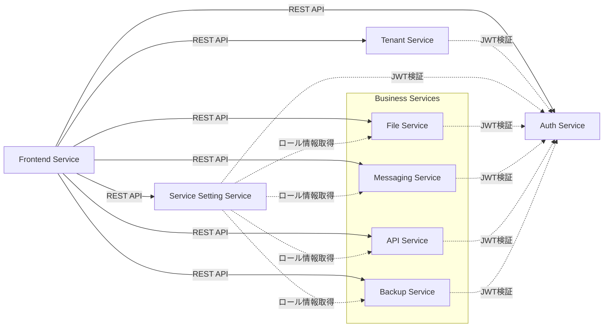

# コンポーネント設計

## 概要

本ディレクトリには、マイクロサービスアーキテクチャを構成する各コンポーネントの詳細設計を記載しています。

## ドキュメント一覧

### コアサービス

1. [Frontend Service](./frontend.md)
   - Next.js BFFアプリケーション
   - ユーザーインターフェース
   - バックエンドサービスへのルーティング

2. [Tenant Management Service](./tenant-service.md)
   - テナント管理
   - テナントユーザー管理
   - 特権テナント処理

3. [Auth Service](./auth-service.md)
   - 認証処理
   - JWT発行・検証
   - ロール情報管理

4. [Service Setting Service](./service-setting-service.md)
   - サービス利用設定
   - テナント-サービスマッピング
   - ロール情報収集

### ビジネスサービス

5. [Mock Services](./mock-services.md)
   - File Service
   - Messaging Service
   - API Service
   - Backup Service

## コンポーネント関係図



## 設計原則

### 1. 単一責任の原則（SRP）
各サービスは明確に定義された単一の責務を持ちます。

### 2. 疎結合
サービス間の依存は最小限にし、インターフェース（API）を介して通信します。

### 3. 高凝集
関連する機能は同一サービス内に集約します。

### 4. API First
すべてのサービスはAPI仕様を先に定義し、それに基づいて実装します。

### 5. ステートレス
各サービスはステートレスに設計し、スケーラビリティを確保します。

## 共通アーキテクチャパターン

### レイヤードアーキテクチャ

すべてのバックエンドサービスは以下のレイヤー構成を採用します：

```
┌─────────────────────┐
│   API Layer         │  FastAPI router, request/response handling
├─────────────────────┤
│   Service Layer     │  Business logic, orchestration
├─────────────────────┤
│   Repository Layer  │  Data access, Cosmos DB operations
├─────────────────────┤
│   Model Layer       │  Domain models, Pydantic schemas
└─────────────────────┘
```

### ディレクトリ構造（バックエンド）

```
service-name/
├── app/
│   ├── api/              # API endpoints
│   │   ├── v1/
│   │   │   ├── endpoints/
│   │   │   └── router.py
│   ├── core/             # Core configuration
│   │   ├── config.py
│   │   ├── security.py
│   │   └── exceptions.py
│   ├── models/           # Domain models
│   │   ├── domain/
│   │   └── schemas/
│   ├── services/         # Business logic
│   ├── repositories/     # Data access
│   └── main.py           # Application entry point
├── tests/
├── Dockerfile
├── requirements.txt
└── README.md
```

### ディレクトリ構造（フロントエンド）

```
front/
├── src/
│   ├── app/              # Next.js app directory
│   │   ├── (auth)/       # Auth layout group
│   │   ├── (dashboard)/  # Dashboard layout group
│   │   └── api/          # BFF API routes
│   ├── components/       # React components
│   │   ├── ui/
│   │   └── features/
│   ├── lib/              # Utilities
│   │   ├── api/          # API client
│   │   ├── auth/         # Auth utilities
│   │   └── utils/
│   ├── types/            # TypeScript types
│   └── config/           # Configuration
├── public/
├── tests/
└── package.json
```

## 非機能要件（共通）

### パフォーマンス

| 指標 | 目標値 |
|------|--------|
| API応答時間 (P95) | < 1秒 |
| エラーレート | < 0.1% |
| 可用性 | 99.9% |
| 同時接続数 | 10,000+ |

### スケーラビリティ

- 水平スケーリング対応（すべてのサービス）
- オートスケーリング設定
  - CPU使用率 > 70% でスケールアウト
  - CPU使用率 < 30% でスケールイン
- 最小インスタンス数: 2
- 最大インスタンス数: 10

### セキュリティ

- すべてのAPIエンドポイントで認証必須（ヘルスチェック除く）
- JWT検証ミドルウェア実装
- ロールベースの認可チェック
- 入力バリデーション（Pydantic）
- SQLインジェクション対策（パラメータ化クエリ）
- XSS対策（出力エスケープ）

### オブザーバビリティ

- 構造化ログ（JSON形式）
- 分散トレーシング（Application Insights）
- メトリクス収集（Prometheus形式）
- ヘルスチェックエンドポイント（`/health`, `/ready`）

## 次のステップ

各コンポーネントの詳細設計ドキュメントを参照してください。

1. アーキテクチャ理解のため、まず[Frontend Service](./frontend.md)から読むことを推奨します
2. 認証フローを理解するため、[Auth Service](./auth-service.md)を参照
3. その他のサービスは必要に応じて参照
