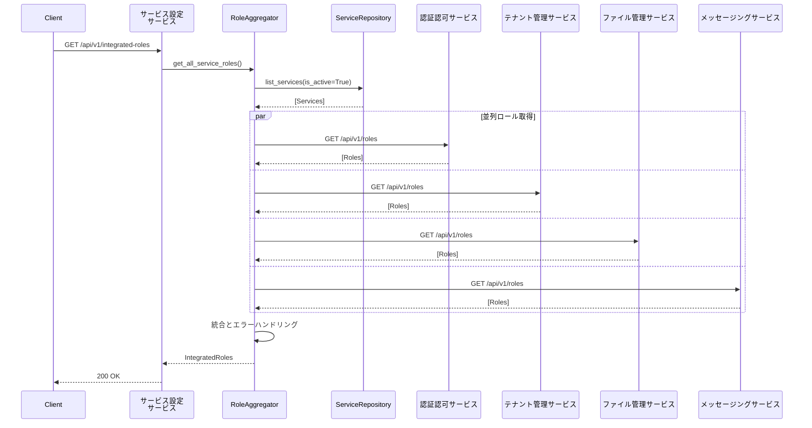

# コンポーネント設計

## ドキュメント情報
- バージョン: 1.7.0
- 最終更新日: 2026-02-02
- 関連: [システムアーキテクチャ概要](../overview.md)

## 1. コンポーネント構成概要

本システムは以下の8つの主要コンポーネントで構成されます：


## 2. Frontend コンポーネント

### 2.1 概要
Next.js 14を使用したReactベースのシングルページアプリケーション（SPA）。API RoutesをBFF（Backend for Frontend）層として活用し、バックエンドサービスとの通信を仲介します。

### 2.2 責務
- **UI提供**: ユーザーインターフェースのレンダリング
- **BFF層**: バックエンドAPIの集約とフロントエンド向け最適化
- **認証管理**: JWTトークンの安全な保管（HTTPOnly Cookie）
- **ルーティング**: フロントエンドのページ遷移管理

### 2.3 ディレクトリ構造
```
src/front/
├── app/                      # Next.js App Router
│   ├── (auth)/              # 認証関連ページ
│   │   └── login/           # ログインページ
│   ├── (dashboard)/         # ダッシュボード（認証必須）
│   │   ├── tenants/         # テナント管理
│   │   ├── users/           # ユーザー管理
│   │   └── services/        # サービス設定
│   ├── api/                 # BFF API Routes
│   │   ├── auth/            # 認証API
│   │   ├── tenants/         # テナントAPI
│   │   ├── users/           # ユーザーAPI
│   │   └── services/        # サービスAPI
│   └── layout.tsx           # ルートレイアウト
├── components/              # Reactコンポーネント
│   ├── ui/                  # 汎用UIコンポーネント
│   ├── forms/               # フォームコンポーネント
│   └── layouts/             # レイアウトコンポーネント
├── lib/                     # ユーティリティ
│   ├── api-client.ts        # BFF APIクライアント
│   ├── auth.ts              # 認証ヘルパー
│   └── types.ts             # TypeScript型定義
└── middleware.ts            # Next.js Middleware（認証チェック）
```

### 2.4 主要機能

#### 2.4.1 BFF API Routes
各バックエンドサービスへのリクエストを集約：

```typescript
// app/api/tenants/route.ts
export async function GET(request: Request) {
  // Cookie からJWT取得
  const token = cookies().get('auth_token')?.value;
  
  // 認証チェック
  if (!token) {
    return NextResponse.json({ error: 'Unauthorized' }, { status: 401 });
  }
  
  // バックエンドサービスへプロキシ
  const response = await fetch(`${process.env.TENANT_SERVICE_URL}/api/tenants`, {
    headers: {
      'Authorization': `Bearer ${token}`,
    },
  });
  
  return NextResponse.json(await response.json());
}
```

#### 2.4.2 認証Middleware
保護されたルートへのアクセス制御：

```typescript
// middleware.ts
export function middleware(request: NextRequest) {
  const token = request.cookies.get('auth_token')?.value;
  
  if (!token) {
    return NextResponse.redirect(new URL('/login', request.url));
  }
  
  return NextResponse.next();
}

export const config = {
  matcher: ['/dashboard/:path*'],
};
```

### 2.5 技術スタック
- **フレームワーク**: Next.js 14 (App Router)
- **言語**: TypeScript 5.0+
- **UIライブラリ**: React 18
- **スタイリング**: Tailwind CSS
- **状態管理**: TanStack Query (React Query)
- **フォーム**: React Hook Form
- **バリデーション**: Zod

### 2.6 外部依存
- 認証認可サービス: JWT検証、ログイン
- テナント管理サービス: テナント・ユーザーデータ
- サービス設定サービス: サービス利用状況
- 各種管理対象サービス: 各サービス固有機能

## 3. 認証認可サービス

### 3.1 概要
ユーザー認証とロールベースのアクセス制御を提供するコアサービス。JWT発行、検証、ロール管理を担当します。

### 3.2 責務
- **ユーザー認証**: ID/パスワードによる本人確認
- **JWT発行**: 認証成功時のトークン発行
- **JWT検証**: 他サービスからの検証リクエスト処理
- **ユーザー管理**: ユーザーCRUD操作
- **ロール管理**: サービス横断的なロール情報の管理

### 3.3 ディレクトリ構造
```
src/auth-service/
├── app/
│   ├── main.py              # FastAPIアプリケーションエントリポイント
│   ├── api/                 # APIエンドポイント
│   │   ├── auth.py          # 認証API（login, verify）
│   │   ├── users.py         # ユーザー管理API
│   │   └── roles.py         # ロール管理API
│   ├── models/              # Pydanticモデル
│   │   ├── user.py          # ユーザーモデル
│   │   ├── role.py          # ロールモデル
│   │   └── token.py         # トークンモデル
│   ├── services/            # ビジネスロジック
│   │   ├── auth_service.py  # 認証処理
│   │   ├── user_service.py  # ユーザー処理
│   │   └── role_service.py  # ロール処理
│   ├── repositories/        # データアクセス層
│   │   ├── user_repository.py
│   │   └── role_repository.py
│   ├── utils/               # ユーティリティ
│   │   ├── jwt.py           # JWT処理
│   │   ├── password.py      # パスワードハッシュ
│   │   └── validators.py    # バリデーション
│   └── config.py            # 設定
├── tests/                   # テストコード
└── requirements.txt         # 依存パッケージ
```

### 3.4 主要機能

#### 3.4.1 ユーザー認証
```python
# app/api/auth.py
@router.post("/login", response_model=TokenResponse)
async def login(credentials: LoginRequest, auth_service: AuthService = Depends()):
    """ユーザー認証とJWT発行"""
    user = await auth_service.authenticate(
        username=credentials.username,
        password=credentials.password
    )
    
    if not user:
        raise HTTPException(status_code=401, detail="Invalid credentials")
    
    # JWT生成
    token = create_access_token(
        data={
            "user_id": user.id,
            "tenant_id": user.tenant_id,
            "roles": user.roles
        }
    )
    
    return TokenResponse(access_token=token, token_type="bearer")
```

#### 3.4.2 JWT検証
```python
# app/api/auth.py
@router.post("/verify", response_model=TokenPayload)
async def verify_token(token: str = Header()):
    """JWT検証"""
    try:
        payload = decode_access_token(token)
        return TokenPayload(**payload)
    except JWTError:
        raise HTTPException(status_code=401, detail="Invalid token")
```

#### 3.4.3 ロール管理
複数サービスのロール情報を統合管理：

```python
# app/services/role_service.py
class RoleService:
    async def get_available_roles(self, tenant_id: str) -> List[Role]:
        """テナントが利用可能な全サービスのロールを取得"""
        # サービス設定サービスから利用可能サービスを取得
        available_services = await self.service_setting_client.get_tenant_services(tenant_id)
        
        # 各サービスからロール情報を取得
        all_roles = []
        for service in available_services:
            roles = await self.fetch_service_roles(service.id)
            all_roles.extend(roles)
        
        return all_roles
    
    async def fetch_service_roles(self, service_id: str) -> List[Role]:
        """特定サービスのロール一覧を取得"""
        # 各サービスの /api/roles エンドポイントを呼び出し
        pass
```

### 3.5 データモデル

#### 3.5.1 User
```python
class User(BaseModel):
    id: str = Field(default_factory=lambda: str(uuid.uuid4()))
    username: str
    email: str
    password_hash: str
    tenant_id: str
    is_active: bool = True
    created_at: datetime
    updated_at: datetime
```

#### 3.5.2 RoleAssignment
```python
class RoleAssignment(BaseModel):
    id: str = Field(default_factory=lambda: str(uuid.uuid4()))
    user_id: str
    tenant_id: str
    service_id: str
    role_name: str  # "全体管理者", "管理者", "閲覧者" など
    assigned_at: datetime
```

### 3.6 ロール定義

#### 3.6.1 認証認可サービスのロール

| ロール名 | 権限 | 説明 |
|---------|------|------|
| 全体管理者 | ユーザーのCRUD操作、ロール割り当て | システム全体の管理者。全テナントのユーザーを操作可能 |
| 閲覧者 | ユーザー情報の参照 | 自テナントのユーザー情報を参照できるが、変更は不可 |

**ロール階層**:
- 全体管理者 > 閲覧者

**実装状況（Phase 1完了）**:
- ✅ ロール管理API実装完了（GET /roles, GET/POST/DELETE /users/{userId}/roles）
- ✅ JWT内のrolesフィールドにロール情報を含める
- ✅ `require_role`デコレータによるロールベース認可が有効化
- ✅ RoleAssignmentエンティティによるロール割り当て管理

### 3.7 技術スタック
- **フレームワーク**: FastAPI 0.100+
- **言語**: Python 3.11+
- **認証**: python-jose (JWT)
- **パスワードハッシュ**: passlib (bcrypt)
- **バリデーション**: Pydantic v2
- **非同期DB**: Azure Cosmos DB SDK (async)

### 3.8 外部依存
- サービス設定サービス: 利用可能サービスの取得
- 各種管理対象サービス: ロール情報の取得

## 4. テナント管理サービス

### 4.1 概要
テナント（クライアント企業）とそのユーザーを管理するサービス。特権テナントの概念を実装し、管理会社による一元管理を実現します。

### 4.2 責務
- **テナント管理**: テナントのCRUD操作
- **テナントユーザー管理**: テナントへのユーザー割り当て
- **ドメイン管理**: テナント許可ドメインの管理
- **特権テナント保護**: 特権テナントの削除・編集制限

### 4.3 ディレクトリ構造
```
src/tenant-management-service/
├── app/
│   ├── main.py
│   ├── api/
│   │   ├── tenants.py       # テナント管理API
│   │   └── domains.py       # ドメイン管理API
│   ├── models/
│   │   ├── tenant.py
│   │   └── domain.py
│   ├── services/
│   │   ├── tenant_service.py
│   │   └── domain_service.py
│   ├── repositories/
│   │   └── tenant_repository.py
│   └── config.py
├── tests/
└── requirements.txt
```

### 4.4 主要機能

#### 4.4.1 テナント一覧取得
```python
# app/api/tenants.py
@router.get("/", response_model=List[TenantResponse])
@require_role("tenant-management", ["閲覧者", "管理者", "全体管理者"])
async def list_tenants(
    status: Optional[str] = None,
    skip: int = 0,
    limit: int = 20,
    current_user: User = Depends(get_current_user),
    tenant_service: TenantService = Depends()
):
    """テナント一覧取得（ロールベース認可とテナント分離）"""
    # 特権テナントかどうかチェック
    is_privileged = current_user.tenant_id == "tenant_privileged"
    
    if is_privileged:
        # 特権テナントは全テナントを取得
        tenants = await tenant_service.list_all_tenants(status, skip, limit)
    else:
        # 一般テナントは自テナントのみ取得
        tenants = await tenant_service.list_tenant_by_id(
            current_user.tenant_id, status
        )
    
    return tenants
```

#### 4.4.2 テナント作成
```python
@router.post("/", response_model=TenantResponse)
@require_role("tenant-management", ["管理者", "全体管理者"])
async def create_tenant(
    tenant_data: TenantCreateRequest,
    current_user: User = Depends(get_current_user),
    tenant_service: TenantService = Depends()
):
    """テナント新規作成（管理者のみ）"""
    tenant = await tenant_service.create_tenant(
        tenant_data, 
        created_by=current_user.id
    )
    return tenant
```

#### 4.4.3 テナント更新（特権テナント保護）
```python
@router.put("/{tenant_id}", response_model=TenantResponse)
@require_role("tenant-management", ["管理者", "全体管理者"])
async def update_tenant(
    tenant_id: str,
    data: TenantUpdateRequest,
    current_user: User = Depends(get_current_user),
    tenant_service: TenantService = Depends()
):
    """テナント更新（特権テナント保護）"""
    tenant = await tenant_service.update_tenant(
        tenant_id, 
        data, 
        updated_by=current_user.id
    )
    return tenant
```

#### 4.4.4 テナント削除（特権テナント保護）
```python
@router.delete("/{tenant_id}")
@require_role("tenant-management", ["管理者", "全体管理者"])
async def delete_tenant(
    tenant_id: str,
    current_user: User = Depends(get_current_user),
    tenant_service: TenantService = Depends()
):
    """テナント削除（特権テナント保護）"""
    await tenant_service.delete_tenant(tenant_id, deleted_by=current_user.id)
    return Response(status_code=204)
```

### 4.5 データモデル

#### 4.5.1 Tenant
```python
class Tenant(BaseModel):
    id: str                          # tenant_{slug化したname}
    tenant_id: str                   # パーティションキー（idと同値）
    type: str = "tenant"             # Cosmos DB識別子
    name: str                        # テナント名（一意、英数字とハイフン・アンダースコア、不変）
    display_name: str                # 表示名
    is_privileged: bool = False      # 特権テナントフラグ
    status: str = "active"           # ステータス（active/suspended/deleted）
    plan: str = "standard"           # プラン（free/standard/premium）
    user_count: int = 0              # 所属ユーザー数
    max_users: int = 100             # 最大ユーザー数
    metadata: Optional[dict] = None  # 追加メタデータ（業種、国など）
    created_at: datetime             # 作成日時
    updated_at: datetime             # 更新日時
    created_by: Optional[str]        # 作成者ユーザーID（監査用）
    updated_by: Optional[str]        # 更新者ユーザーID（監査用）
```

#### 4.5.2 TenantUser
```python
class TenantUser(BaseModel):
    id: str
    tenant_id: str  # パーティションキー
    user_id: str
    assigned_at: datetime
```

#### 4.5.3 Domain
```python
class Domain(BaseModel):
    id: str
    tenant_id: str  # パーティションキー
    domain: str  # "example.com"
    verified: bool = False
    created_at: datetime
```

### 4.6 ロール定義

#### 4.6.1 テナント管理サービスのロール

| ロール名 | 権限 | 説明 |
|---------|------|------|
| 全体管理者 | 特権テナント操作、全テナント管理 | システム全体の管理者。全テナントを操作可能 |
| 管理者 | 通常テナントの追加・削除・編集 | 通常テナントの管理が可能 |
| 閲覧者 | テナント情報の参照 | 自テナント情報を参照できるが、変更は不可 |

**ロール階層**:
- 全体管理者 > 管理者 > 閲覧者

**実装状況（Phase 1完了）**:
- ✅ ロール管理API実装完了
- ✅ JWT内のrolesフィールドにロール情報を含める
- ✅ `require_role`デコレータによるロールベース認可が有効化
- ✅ RoleAssignmentエンティティによるロール割り当て管理

### 4.7 ビジネスロジック詳細

#### 4.7.1 テナント作成
```python
# app/services/tenant_service.py
async def create_tenant(
    self, 
    tenant_data: TenantCreateRequest, 
    created_by: str
) -> Tenant:
    """テナント作成（一意性チェック付き）"""
    # 1. テナント名の一意性チェック（アクティブなテナント間のみ）
    existing = await self.tenant_repository.find_by_name(tenant_data.name)
    if existing and existing.status == "active":
        raise HTTPException(
            status_code=409,
            detail="Tenant name already exists"
        )
    
    # 2. テナントID生成（nameをslug化）
    tenant_id = f"tenant_{tenant_data.name.lower().replace(' ', '-')}"
    
    # 3. テナント作成
    tenant = Tenant(
        id=tenant_id,
        tenant_id=tenant_id,
        name=tenant_data.name,
        display_name=tenant_data.display_name,
        plan=tenant_data.plan or "standard",
        max_users=tenant_data.max_users or 100,
        user_count=0,
        status="active",
        is_privileged=False,
        metadata=tenant_data.metadata,
        created_at=datetime.utcnow(),
        updated_at=datetime.utcnow(),
        created_by=created_by
    )
    
    await self.tenant_repository.create(tenant)
    
    # 4. 監査ログ記録
    await log_audit(
        action="tenant.create",
        target_type="tenant",
        target_id=tenant_id,
        performed_by=created_by
    )
    
    return tenant
```

#### 4.7.2 テナント更新（特権テナント保護）
```python
async def update_tenant(
    self, 
    tenant_id: str, 
    data: TenantUpdateRequest, 
    updated_by: str
) -> Tenant:
    """テナント更新（特権テナント保護）"""
    # 1. テナント取得
    tenant = await self.tenant_repository.get(tenant_id, partition_key=tenant_id)
    
    # 2. 特権テナントチェック
    if tenant.is_privileged:
        raise HTTPException(
            status_code=403,
            detail="Privileged tenant cannot be modified"
        )
    
    # 3. 更新
    if data.display_name is not None:
        tenant.display_name = data.display_name
    if data.plan is not None:
        tenant.plan = data.plan
    if data.max_users is not None:
        tenant.max_users = data.max_users
    if data.metadata is not None:
        tenant.metadata = data.metadata
    
    tenant.updated_at = datetime.utcnow()
    tenant.updated_by = updated_by
    
    await self.tenant_repository.update(tenant_id, tenant_id, tenant.model_dump())
    
    # 4. 監査ログ記録
    await log_audit(
        action="tenant.update",
        target_type="tenant",
        target_id=tenant_id,
        performed_by=updated_by,
        changes=data.model_dump(exclude_unset=True)
    )
    
    return tenant
```

#### 4.7.3 テナント削除（特権テナント保護とユーザー数チェック）
```python
async def delete_tenant(self, tenant_id: str, deleted_by: str) -> None:
    """テナント削除（Phase 1: 物理削除）"""
    # 1. テナント取得
    tenant = await self.tenant_repository.get(tenant_id, partition_key=tenant_id)
    
    # 2. 特権テナントチェック
    if tenant.is_privileged:
        raise HTTPException(
            status_code=403,
            detail="Privileged tenant cannot be deleted"
        )
    
    # 3. ユーザー数チェック（Phase 1）
    if tenant.user_count > 0:
        raise HTTPException(
            status_code=400,
            detail="Cannot delete tenant with existing users. Please remove all users first."
        )
    
    # 4. 物理削除（Phase 1）
    await self.tenant_repository.delete(tenant_id, tenant_id)
    
    # 5. 監査ログ記録（Application Insightsに記録）
    await log_audit(
        action="tenant.delete",
        target_type="tenant",
        target_id=tenant_id,
        performed_by=deleted_by
    )
    
    logger.info(f"Tenant deleted: {tenant_id} by {deleted_by}")
```

**Phase 2での改善**:
- 論理削除に変更（`status=deleted`、`deleted_at`、`deleted_by`を記録）
- 30日後に物理削除する自動バッチ処理
- 関連データのカスケード削除（ServiceAssignment、TenantUser、Domain）

#### 4.7.4 user_countの更新（Phase 1実装予定）
```python
async def increment_user_count(self, tenant_id: str) -> None:
    """テナントのユーザー数をインクリメント（タスク06で呼び出し）"""
    tenant = await self.tenant_repository.get(tenant_id, tenant_id)
    tenant.user_count += 1
    tenant.updated_at = datetime.utcnow()
    await self.tenant_repository.update(tenant_id, tenant_id, tenant.model_dump())

async def decrement_user_count(self, tenant_id: str) -> None:
    """テナントのユーザー数をデクリメント（タスク06で呼び出し）"""
    tenant = await self.tenant_repository.get(tenant_id, tenant_id)
    tenant.user_count = max(0, tenant.user_count - 1)
    tenant.updated_at = datetime.utcnow()
    await self.tenant_repository.update(tenant_id, tenant_id, tenant.model_dump())
```

これらのメソッドはタスク06のTenantUserServiceから呼び出され、TenantUser作成・削除時に自動的に`user_count`を更新します。

### 4.7 技術スタック
- **フレームワーク**: FastAPI 0.100+
- **言語**: Python 3.11+
- **バリデーション**: Pydantic v2
- **非同期DB**: Azure Cosmos DB SDK (async)

## 5. サービス設定サービス

### 5.1 概要
各テナントが利用可能なサービスを管理し、サービスカタログの一元管理とテナントへのサービス割り当て機能を提供します。本サービスは、Phase 2でロール情報統合機能が追加される予定です。

### 5.2 責務
- **サービスカタログ管理**: システムが提供する全サービス（管理対象サービス4種類）の一覧を保持
- **サービス割り当て管理**: テナントごとに利用可能なサービスを管理（明示的な割り当てが必要）
- **サービス利用状況の可視化**: テナントがどのサービスを利用しているか確認
- **ロール情報統合** (Phase 2): 各サービスのロールAPIを集約

**Phase 1の実装範囲**:
- サービス一覧取得（GET /api/v1/services）
- サービス詳細取得（GET /api/v1/services/{serviceId}）
- テナント利用サービス一覧取得（GET /api/v1/tenants/{tenantId}/services）
- サービス割り当て（POST /api/v1/tenants/{tenantId}/services）
- サービス割り当て解除（DELETE /api/v1/tenants/{tenantId}/services/{serviceId}）
- **ロール情報統合機能（タスク08）**
  - 全サービスのロール情報取得（GET /api/v1/integrated-roles）
  - テナント利用可能ロール取得（GET /api/v1/tenants/{tenantId}/available-roles）
  - 特定サービスのロール取得（GET /api/v1/services/{serviceId}/roles）

**Phase 2以降**:
- ロール情報キャッシング（Redis導入）
- サービス利用統計・使用量管理

### 5.3 ディレクトリ構造
```
src/service-setting-service/
├── app/
│   ├── main.py                      # FastAPIアプリケーションエントリポイント
│   ├── config.py                    # 設定管理
│   ├── dependencies.py              # 依存注入
│   ├── api/                         # APIエンドポイント
│   │   ├── __init__.py
│   │   ├── services.py              # サービスカタログAPI
│   │   ├── assignments.py           # サービス割り当てAPI
│   │   └── roles.py                 # ロール統合API（タスク08）
│   ├── models/                      # Pydanticモデル
│   │   ├── __init__.py
│   │   ├── service.py               # Serviceモデル
│   │   ├── assignment.py            # ServiceAssignmentモデル
│   │   └── role.py                  # IntegratedRoleモデル（タスク08）
│   ├── schemas/                     # リクエスト/レスポンススキーマ
│   │   ├── __init__.py
│   │   ├── service.py               # Service関連スキーマ
│   │   ├── assignment.py            # ServiceAssignment関連スキーマ
│   │   └── role.py                  # IntegratedRole関連スキーマ（タスク08）
│   ├── services/                    # ビジネスロジック
│   │   ├── __init__.py
│   │   ├── service_catalog_service.py
│   │   ├── assignment_service.py
│   │   └── role_aggregator.py       # ロール統合ロジック（タスク08）
│   ├── repositories/                # データアクセス層
│   │   ├── __init__.py
│   │   ├── service_repository.py
│   │   └── assignment_repository.py
│   └── utils/                       # ユーティリティ
│       ├── __init__.py
│       └── initialization.py        # システム初期化
├── tests/                           # テストコード
│   ├── __init__.py
│   ├── conftest.py                  # pytestフィクスチャ
│   ├── test_api_services.py
│   ├── test_api_assignments.py
│   ├── test_api_roles.py            # ロール統合APIテスト（タスク08）
│   ├── test_service_catalog_service.py
│   ├── test_assignment_service.py
│   ├── test_role_aggregator.py      # ロール統合ロジックテスト（タスク08）
│   ├── test_service_repository.py
│   └── test_assignment_repository.py
├── pytest.ini                       # pytest設定
├── requirements.txt                 # 依存パッケージ
├── requirements-dev.txt             # 開発用依存パッケージ
└── README.md                       # サービスドキュメント
```

### 5.4 主要機能

#### 5.4.1 サービス一覧取得
システムが提供する全サービスの一覧を取得します。

```python
# app/api/services.py
@router.get("/services", response_model=ServiceListResponse)
@require_role("service-setting", ["閲覧者", "全体管理者"])
async def list_services(
    is_active: bool = True,
    current_user: User = Depends(get_current_user),
    service: ServiceCatalogService = Depends()
):
    """サービス一覧取得（service-setting: 閲覧者以上）"""
    services = await service.list_services(is_active=is_active)
    return ServiceListResponse(data=services)
```

**処理フロー**:
1. JWTから現在のユーザー情報を取得
2. ロール認可チェック（service-setting: 閲覧者以上）
3. Cosmos DBから`_system`パーティションのServiceエンティティを取得
4. `is_active`フィルタを適用
5. サービス一覧を返却

#### 5.4.2 サービス割り当て
テナントに新規サービスを割り当てます。

```python
# app/api/assignments.py
@router.post("/tenants/{tenant_id}/services", response_model=AssignmentResponse)
@require_role("service-setting", ["全体管理者"])
async def assign_service(
    tenant_id: str,
    assignment: ServiceAssignmentRequest,
    current_user: User = Depends(get_current_user),
    service: AssignmentService = Depends()
):
    """テナントにサービスを割り当て（全体管理者のみ）
    
    Args:
        tenant_id: テナントID
        assignment: サービス割り当てリクエスト
            - service_id: サービスID（"file-service"等）
            - config: サービス固有設定（オプショナル、最大10KB）
    
    Returns:
        AssignmentResponse: 作成されたServiceAssignment
    
    Raises:
        404: テナントまたはサービスが存在しない
        409: 同一サービスが既に割り当て済み
        422: サービスが非アクティブ
        503: テナント管理サービス接続エラー
    """
    result = await service.assign_service(
        tenant_id=tenant_id,
        service_id=assignment.service_id,
        config=assignment.config,
        assigned_by=current_user.id,
        jwt_token=get_jwt_from_request()
    )
    return result
```

**処理フロー**:
1. ロール認可チェック（service-setting: 全体管理者のみ）
2. **テナント存在確認**（テナント管理サービスAPIで検証）
   - エンドポイント: `GET /api/v1/tenants/{tenant_id}`
   - タイムアウト: 1秒
   - エラーハンドリング: 404の場合はテナント不在エラー、その他は503エラー
3. サービス存在確認（Cosmos DB、`_system`パーティションで検証）
4. サービスがアクティブか確認（`is_active=true`）
5. 重複チェック（同一テナント・同一サービスのServiceAssignmentが存在しないか）
6. **ID長制限検証**（`assignment_{tenantId}_{serviceId}`が255文字以内）
7. ServiceAssignmentエンティティ作成
   - `id`: `assignment_{tenantId}_{serviceId}` 形式（決定的ID）
   - `status`: "active"
   - `config`: リクエストボディのconfig（オプショナル、最大10KB、最大5階層、制御文字禁止）
8. Cosmos DBに保存
9. 監査ログ記録（Application Insights）
10. 作成されたServiceAssignmentを返却

#### 5.4.3 テナント利用サービス一覧取得
特定テナントが利用中のサービス一覧を取得します。

```python
# app/api/assignments.py
@router.get("/tenants/{tenant_id}/services", response_model=TenantServicesResponse)
@require_role("service-setting", ["閲覧者", "全体管理者"])
async def list_tenant_services(
    tenant_id: str,
    status: Optional[str] = None,
    current_user: User = Depends(get_current_user),
    service: AssignmentService = Depends()
):
    """テナント利用サービス一覧取得（service-setting: 閲覧者以上）
    
    Args:
        tenant_id: テナントID
        status: ステータスフィルタ（"active"/"suspended"）
    
    Returns:
        TenantServicesResponse: テナントが利用中のサービス一覧
    
    Security:
        - 特権テナント以外は自テナントのみアクセス可能
    """
    # テナント分離チェック
    if current_user.tenant_id != "tenant_privileged":
        if current_user.tenant_id != tenant_id:
            raise HTTPException(
                status_code=403,
                detail="Cross-tenant access denied"
            )
    
    services = await service.list_tenant_services(
        tenant_id=tenant_id,
        status=status
    )
    return TenantServicesResponse(data=services)
```

**処理フロー**:
1. ロール認可チェック（service-setting: 閲覧者以上）
2. テナント分離チェック（特権テナント以外は自テナントのみアクセス可能）
3. Cosmos DBから指定テナントのServiceAssignmentを取得（パーティションキー: `tenantId`）
4. `status`フィルタを適用（指定された場合）
5. **各ServiceAssignmentに対応するServiceの詳細情報を並列取得**（`asyncio.gather`使用）
   - 並列取得: 最大10件同時
   - タイムアウト: 各Service取得に200msのタイムアウト
   - エラーハンドリング: 個別Service取得失敗時もエラーを伝搬せず、警告ログを記録し他のServiceは返却
6. サービス一覧を返却

#### 5.4.4 サービス割り当て解除
テナントからサービスを削除し、利用を停止します。

```python
# app/api/assignments.py
@router.delete("/tenants/{tenant_id}/services/{service_id}")
@require_role("service-setting", ["全体管理者"])
async def unassign_service(
    tenant_id: str,
    service_id: str,
    current_user: User = Depends(get_current_user),
    service: AssignmentService = Depends()
):
    """サービス割り当て解除（全体管理者のみ）
    
    Args:
        tenant_id: テナントID
        service_id: サービスID
    
    Returns:
        204 No Content
    
    Raises:
        404: ServiceAssignmentが存在しない
    
    Phase 2での改善:
        - 論理削除への変更（監査要件の強化）
        - カスケード削除（関連RoleAssignmentの自動削除）
    """
    await service.remove_service_assignment(
        tenant_id=tenant_id,
        service_id=service_id,
        deleted_by=current_user.id
    )
    return Response(status_code=204)
```

**処理フロー**:
1. ロール認可チェック（service-setting: 全体管理者のみ）
2. ServiceAssignment存在確認（`assignment_{tenantId}_{serviceId}`）
3. 存在しない場合は404エラー
4. Cosmos DBから物理削除（Phase 1）
5. 監査ログ記録（Application Insights、`deleted_by`に現在のユーザーID）
6. 204 No Contentを返却

**Phase 2での改善予定**:
- 論理削除への変更（`status=deleted`、`deleted_at`、`deleted_by`を記録）
- カスケード削除の実装（タスク08で実装される`GET /api/v1/services/{serviceId}/roles`を活用）

#### 5.4.5 ロール情報統合（タスク08 - Phase 1実装）
各サービスから動的にロール情報を取得し、統合します。

##### 5.4.5.1 概要
サービス設定サービスは、各マイクロサービスからロール情報を収集し、テナントの利用状況に応じてフィルタリングした統合ロール情報を提供します。これにより、認証認可サービスがロール割り当てUI表示時に必要なロール一覧を取得できます。

##### 5.4.5.2 全サービスのロール情報取得
- **エンドポイント**: `GET /api/v1/integrated-roles`
- **認証**: service-setting: 閲覧者以上
- **処理フロー**:



**実装例**:
```python
# app/services/role_aggregator.py
import os
import logging
import asyncio
from typing import Dict, List, Optional
import httpx
from fastapi import HTTPException

class RoleAggregator:
    """ロール集約サービス（タスク08）"""
    
    def __init__(
        self,
        service_repository: ServiceRepository,
        http_client: httpx.AsyncClient
    ):
        self.service_repository = service_repository
        self.http_client = http_client
        self.logger = logging.getLogger(__name__)
        
        # サービスのベースURL（環境変数から取得）
        self.service_base_urls = {
            "auth-service": os.getenv("AUTH_SERVICE_URL"),
            "tenant-management": os.getenv("TENANT_SERVICE_URL"),
            "service-setting": "http://localhost:8002",  # 自サービス
            "file-service": os.getenv("FILE_SERVICE_URL"),
            "messaging-service": os.getenv("MESSAGING_SERVICE_URL"),
            "api-service": os.getenv("API_SERVICE_URL"),
            "backup-service": os.getenv("BACKUP_SERVICE_URL"),
        }
    
    async def fetch_service_roles(self, service_id: str) -> List[ServiceRoleInfo]:
        """
        特定サービスのロール情報取得
        
        Args:
            service_id: サービスID
        
        Returns:
            List[ServiceRoleInfo]: ロール情報配列
        
        Raises:
            httpx.TimeoutException: タイムアウト
            httpx.HTTPStatusError: HTTPエラー
        """
        base_url = self.service_base_urls.get(service_id)
        if not base_url:
            self.logger.error(f"Service URL not configured: {service_id}")
            raise ValueError(f"Service URL not configured for {service_id}")
        
        url = f"{base_url}/api/v1/roles"
        
        try:
            response = await self.http_client.get(
                url,
                timeout=0.5,  # 500msタイムアウト
                headers={"X-Service-Key": os.getenv("SERVICE_SHARED_SECRET")}
            )
            response.raise_for_status()
            
            data = response.json()
            roles = [ServiceRoleInfo(**r) for r in data.get("data", [])]
            
            self.logger.info(
                f"Fetched roles from {service_id}: {len(roles)} roles",
                extra={"service_id": service_id, "role_count": len(roles)}
            )
            
            return roles
        
        except httpx.TimeoutException:
            self.logger.warning(
                f"Timeout fetching roles from {service_id}",
                extra={"service_id": service_id, "timeout": 0.5}
            )
            raise
        
        except httpx.HTTPStatusError as e:
            self.logger.error(
                f"HTTP error fetching roles from {service_id}: {e.response.status_code}",
                extra={
                    "service_id": service_id,
                    "status_code": e.response.status_code,
                    "response": e.response.text
                }
            )
            raise
    
    async def get_all_service_roles(self) -> Dict[str, List[IntegratedRole]]:
        """
        全サービスのロール情報取得
        
        Returns:
            Dict[str, List[IntegratedRole]]: サービスIDをキーとした統合ロール情報
        
        Note:
            一部サービスのロール取得失敗時も、他のサービスのロール情報は返却
        """
        # サービスカタログ取得
        services = await self.service_repository.list_services(is_active=True)
        
        # 並列ロール取得（エラーハンドリング付き）
        async def fetch_service_roles_safe(
            service_id: str
        ) -> tuple[str, Optional[List[ServiceRoleInfo]]]:
            try:
                roles = await asyncio.wait_for(
                    self.fetch_service_roles(service_id),
                    timeout=0.5
                )
                return service_id, roles
            except asyncio.TimeoutError:
                self.logger.warning(
                    f"Timeout fetching roles from {service_id}",
                    extra={"service_id": service_id}
                )
                return service_id, None
            except Exception as e:
                self.logger.error(
                    f"Failed to fetch roles from {service_id}: {e}",
                    extra={"service_id": service_id, "error": str(e)}
                )
                return service_id, None
        
        # 並列実行
        results = await asyncio.gather(
            *[fetch_service_roles_safe(s.id) for s in services],
            return_exceptions=False
        )
        
        # 統合ロール情報を構築
        integrated_roles = {}
        failed_services = []
        
        for service_id, roles in results:
            if roles is not None:
                integrated_roles[service_id] = [
                    IntegratedRole(
                        service_id=service_id,
                        role_name=r.role_name,
                        description=r.description
                    )
                    for r in roles
                ]
            else:
                failed_services.append(service_id)
        
        # 全サービス失敗時はエラー
        if len(failed_services) == len(services):
            self.logger.error("All services failed to provide role information")
            raise HTTPException(
                status_code=503,
                detail={
                    "error": "ROLE_AGGREGATION_001_ALL_SERVICES_UNAVAILABLE",
                    "message": "All services failed to provide role information",
                    "failedServices": failed_services
                }
            )
        
        self.logger.info(
            f"Aggregated roles: {len(integrated_roles)} services, "
            f"{sum(len(r) for r in integrated_roles.values())} total roles, "
            f"{len(failed_services)} failed services",
            extra={
                "service_count": len(integrated_roles),
                "role_count": sum(len(r) for r in integrated_roles.values()),
                "failed_services": failed_services
            }
        )
        
        return integrated_roles
    
    async def get_tenant_available_roles(
        self,
        tenant_id: str
    ) -> Dict[str, List[IntegratedRole]]:
        """
        テナント利用可能ロール取得
        
        Args:
            tenant_id: テナントID
        
        Returns:
            Dict[str, List[IntegratedRole]]: フィルタリングされた統合ロール情報
        
        Business Logic:
            1. テナントのServiceAssignment取得（status=active）
            2. コアサービス（auth-service、tenant-management、service-setting）を自動追加
            3. 全サービスのロール情報取得
            4. テナントが利用しているサービスのロールのみをフィルタ
        """
        # 1. テナントのServiceAssignment取得
        assignments = await self.assignment_repository.list_by_tenant(
            tenant_id, status="active"
        )
        
        # 2. コアサービスを自動追加
        available_service_ids = {
            "auth-service",
            "tenant-management",
            "service-setting"
        }
        
        # 3. 管理対象サービスを追加
        for assignment in assignments:
            available_service_ids.add(assignment.service_id)
        
        # 4. 全サービスのロール情報取得
        all_roles = await self.get_all_service_roles()
        
        # 5. フィルタリング
        filtered_roles = {
            service_id: roles
            for service_id, roles in all_roles.items()
            if service_id in available_service_ids
        }
        
        self.logger.info(
            f"Tenant available roles: {len(filtered_roles)} services, "
            f"{sum(len(r) for r in filtered_roles.values())} roles",
            extra={
                "tenant_id": tenant_id,
                "service_count": len(filtered_roles),
                "role_count": sum(len(r) for r in filtered_roles.values()),
                "assigned_services": list(available_service_ids - {"auth-service", "tenant-management", "service-setting"})
            }
        )
        
        return filtered_roles
```

##### 5.4.5.3 パフォーマンス要件
| API | 目標応答時間 (P95) | 最大応答時間 (P99) |
|-----|-------------------|---------------------|
| GET /api/v1/integrated-roles | < 500ms | < 800ms |
| GET /api/v1/tenants/{tenantId}/available-roles | < 400ms | < 600ms |
| GET /api/v1/services/{serviceId}/roles | < 200ms | < 300ms |

##### 5.4.5.4 エラーハンドリング
| エラーコード | 条件 | メッセージ | HTTPステータス |
|--------------|------|------------|----------------|
| ROLE_AGGREGATION_001_ALL_SERVICES_UNAVAILABLE | 全サービスのロール取得に失敗 | All services failed to provide role information | 503 |
| ROLE_AGGREGATION_002_SERVICE_TIMEOUT | 特定サービスのロール取得がタイムアウト | Timeout fetching roles from {service_id} | 200 (部分成功) |
| ROLE_AGGREGATION_003_INVALID_RESPONSE | サービスのレスポンス形式が不正 | Invalid role response from {service_id} | 200 (部分成功) |
| TENANT_002_NOT_FOUND | テナントが存在しない | Tenant not found | 404 |
| TENANT_ISOLATION_VIOLATION | テナント分離違反 | Cannot access roles for different tenant | 403 |
| SERVICE_001_NOT_FOUND | サービスが存在しない | Service not found | 404 |
| CONFIG_001_SERVICE_URL_MISSING | サービスURLが設定されていない | Service URL not configured for {service_id} | 500 |

**部分的失敗の許容**:
- 一部サービスのロール取得失敗時も、他のサービスのロール情報は返却
- 失敗したサービスIDは `metadata.failedServices` に含まれる
- エラーログに記録し、運用チームに通知

```python
# 部分的失敗時のレスポンス例
{
  "roles": {
    "auth-service": [...],
    "tenant-management": [...]
    # file-service はタイムアウトで除外
  },
  "metadata": {
    "totalServices": 2,
    "totalRoles": 5,
    "failedServices": ["file-service"],  # 失敗したサービス
    "cachedAt": null
  }
}
```

### 5.5 データモデル

#### 5.5.1 Service エンティティ

```python
class Service(BaseModel):
    id: str                          # サービスID（"file-service"等）
    tenant_id: str = "_system"       # パーティションキー（システム共通）
    type: str = "service"            # Cosmos DB識別子
    name: str                        # サービス名（"ファイル管理サービス"等）
    description: str                 # サービス説明
    version: str = "1.0.0"           # バージョン
    base_url: Optional[str]          # サービスのベースURL
    role_endpoint: Optional[str] = "/api/v1/roles"    # ロール情報取得エンドポイント
    health_endpoint: Optional[str] = "/health"        # ヘルスチェックエンドポイント
    is_active: bool = True           # アクティブ状態
    metadata: Optional[dict] = None  # 追加メタデータ（アイコン、カテゴリ等）
    created_at: datetime             # 作成日時
    updated_at: datetime             # 更新日時
```

**パーティション設計**:
- `tenant_id = "_system"`（全Serviceエンティティ共通）
- 理由: 全サービス一覧取得時、単一パーティションからの取得でRU消費を最小化（1 RU）

**システム初期化**:
システム初期化時に、以下の管理対象サービス（4種類）がカタログに自動登録されます：
- `file-service`: ファイル管理サービス
- `messaging-service`: メッセージングサービス
- `api-service`: API利用サービス
- `backup-service`: バックアップサービス

コアサービス（認証認可、テナント管理、サービス設定）は、全テナントが暗黙的に利用可能なため、ServiceAssignmentは作成されません。

#### 5.5.2 ServiceAssignment エンティティ

```python
class ServiceAssignment(BaseModel):
    id: str                          # assignment_{tenantId}_{serviceId}
    tenant_id: str                   # パーティションキー
    type: str = "service_assignment" # Cosmos DB識別子
    service_id: str                  # サービスID
    status: str = "active"           # ステータス（active/suspended）
    config: Optional[dict] = None    # サービス固有設定（オプショナル、最大10KB）
    assigned_at: datetime            # 割り当て日時
    assigned_by: str                 # 割り当て実行者ユーザーID
```

**ID設計**:
- 決定的ID: `assignment_{tenant_id}_{service_id}`
- **設計根拠**:
  - 重複防止: Cosmos DBの主キー制約により、同一IDの重複挿入が自動的に409エラーになる
  - クエリ効率: IDから直接対象を特定可能
  - 監査追跡: IDを見るだけで、どのテナント・サービスの割り当てか即座に判別可能
  - べき等性: 同じリクエストを複数回実行しても、409エラーで失敗するため、副作用がない

**config検証ルール**:
- オプショナル（省略可能）
- JSONオブジェクト形式（`dict`型）
- **最大サイズ**: 10KB（10,240バイト）
- **最大ネストレベル**: 5階層まで
- **禁止文字**: 制御文字（`\x00-\x1F`、`\x7F`）は値に含めることを禁止
- **JSON Schema基本構造検証**: キーは文字列のみ、値はプリミティブ型またはオブジェクト/配列のみ
- サービス固有の検証ルールは各サービスの責任（Phase 1では検証しない）
- Phase 2以降: サービスごとのJSON Schemaによる検証機能を追加予定

### 5.6 ロール定義

#### 5.6.1 サービス設定サービスのロール

| ロール名 | 権限 | 説明 |
|---------|------|------|
| 全体管理者 | サービス割り当て・削除 | システム全体の管理者。全テナントのサービス利用状況を管理可能 |
| 閲覧者 | サービス一覧・利用状況の参照 | 自テナントのサービス利用状況を参照できるが、変更は不可 |

**ロール階層**:
- 全体管理者 > 閲覧者

### 5.7 ビジネスロジック

#### 5.7.1 サービス割り当て処理

```python
import httpx

async def assign_service(
    self, 
    tenant_id: str, 
    service_id: str, 
    config: Optional[dict],
    assigned_by: str,
    jwt_token: str
) -> ServiceAssignment:
    """サービス割り当て"""
    # 1. ID長制限検証
    if len(tenant_id) > 100 or len(service_id) > 100:
        raise HTTPException(
            status_code=400,
            detail="tenant_id and service_id must be 100 characters or less"
        )
    
    assignment_id = f"assignment_{tenant_id}_{service_id}"
    if len(assignment_id) > 255:
        raise HTTPException(
            status_code=400,
            detail="Combined assignment ID must be 255 characters or less"
        )
    
    # 2. テナント存在確認（テナント管理サービスAPI）
    try:
        async with httpx.AsyncClient(timeout=1.0) as client:
            response = await client.get(
                f"{self.tenant_service_base_url}/api/v1/tenants/{tenant_id}",
                headers={"Authorization": f"Bearer {jwt_token}"}
            )
            if response.status_code == 404:
                raise HTTPException(
                    status_code=404,
                    detail="Tenant not found"
                )
            elif response.status_code != 200:
                raise HTTPException(
                    status_code=503,
                    detail="Tenant service unavailable"
                )
    except httpx.TimeoutException:
        raise HTTPException(
            status_code=504,
            detail="Tenant service timeout"
        )
    
    # 3. サービス存在確認
    service = await self.service_repository.get(service_id, partition_key="_system")
    if not service:
        raise HTTPException(status_code=404, detail="Service not found")
    
    # 4. サービスアクティブ確認
    if not service.is_active:
        raise HTTPException(
            status_code=422,
            detail="Cannot assign inactive service"
        )
    
    # 5. 重複チェック（決定的ID）
    existing = await self.assignment_repository.get(assignment_id, tenant_id)
    if existing:
        raise HTTPException(
            status_code=409,
            detail="Service is already assigned to this tenant"
        )
    
    # 6. ServiceAssignment作成
    assignment = ServiceAssignment(
        id=assignment_id,
        tenant_id=tenant_id,
        service_id=service_id,
        status="active",
        config=config or {},
        assigned_at=datetime.utcnow(),
        assigned_by=assigned_by
    )
    
    await self.assignment_repository.create(assignment)
    
    # 7. 監査ログ記録
    await log_audit(
        action="service.assign",
        target_type="service_assignment",
        target_id=assignment_id,
        performed_by=assigned_by,
        changes={"service_id": service_id, "tenant_id": tenant_id}
    )
    
    return assignment
```

#### 5.7.2 並列Service情報取得

```python
import asyncio

async def get_service_safe(service_id: str) -> Optional[Service]:
    """タイムアウト付きService取得"""
    try:
        # 200msのタイムアウトを設定
        return await asyncio.wait_for(
            service_repository.get(service_id, "_system"),
            timeout=0.2
        )
    except asyncio.TimeoutError:
        logger.warning(f"Timeout fetching service {service_id}")
        return None
    except Exception as e:
        logger.warning(f"Failed to fetch service {service_id}: {e}")
        return None

async def list_tenant_services(tenant_id: str, status: Optional[str]):
    """テナント利用サービス一覧取得（並列Service情報取得）"""
    # ServiceAssignment取得
    assignments = await assignment_repository.query(
        "SELECT * FROM c WHERE c.tenantId = @tenant_id AND c.type = 'service_assignment'",
        [{"name": "@tenant_id", "value": tenant_id}],
        partition_key=tenant_id
    )
    
    # statusフィルタ適用
    if status:
        assignments = [a for a in assignments if a.status == status]
    
    # 並列でService情報を取得
    services = await asyncio.gather(
        *[get_service_safe(a.service_id) for a in assignments],
        return_exceptions=False
    )
    
    # Noneを除外してレスポンスに含める
    valid_services = [s for s in services if s is not None]
    
    return valid_services
```

### 5.8 技術スタック
- **フレームワーク**: FastAPI 0.100+
- **言語**: Python 3.11+
- **バリデーション**: Pydantic v2
- **HTTPクライアント**: httpx (async)
- **非同期DB**: Azure Cosmos DB SDK (async)

### 5.9 外部依存
- **テナント管理サービス**: テナント存在確認（`GET /api/v1/tenants/{tenantId}`）
- **認証認可サービス**: JWT検証
- **各種管理対象サービス**: ロール情報取得API（Phase 2で使用）

### 5.10 パフォーマンス要件

| API | 目標応答時間 (P95) | 最大応答時間 (P99) |
|-----|-------------------|-------------------|
| GET /api/v1/services | < 200ms | < 500ms |
| GET /api/v1/services/{serviceId} | < 100ms | < 300ms |
| GET /api/v1/tenants/{tenantId}/services | < 300ms | < 600ms |
| POST /api/v1/tenants/{tenantId}/services | < 300ms | < 700ms |
| DELETE /api/v1/tenants/{tenantId}/services/{serviceId} | < 200ms | < 500ms |

## 6. 管理対象サービス（モックサービス）

### 6.1 概要
実際にテナントが利用するサービス群。本システムでは4つのモックサービスを実装します。各サービスは同じ設計パターンに従い、独自のロールセットを定義します。

### 6.2 共通設計パターン

#### 6.2.1 共通ディレクトリ構造
```
src/{service-name}/
├── app/
│   ├── main.py
│   ├── api/
│   │   ├── features.py      # サービス固有機能API
│   │   └── roles.py         # ロール情報提供API
│   ├── models/
│   │   ├── entities.py      # サービス固有エンティティ
│   │   └── role.py          # ロールモデル
│   ├── services/
│   └── repositories/
├── tests/
└── requirements.txt
```

#### 6.2.2 ロール情報提供API（全サービス共通）
```python
# app/api/roles.py
@router.get("/roles", response_model=List[RoleInfo])
async def get_service_roles():
    """このサービスで定義されているロール一覧を返却"""
    return [
        RoleInfo(name="管理者", description="全機能へのアクセス"),
        RoleInfo(name="編集者", description="データの作成・編集"),
        RoleInfo(name="閲覧者", description="データの参照のみ"),
    ]
```

### 6.3 ファイル管理サービス

#### 6.3.1 主要機能
- ファイルアップロード
- ファイルダウンロード
- ファイル一覧取得
- フォルダ管理

#### 6.3.2 ロール定義
- **管理者**: 全操作可能
- **編集者**: ファイルのアップロード、削除、フォルダ作成
- **閲覧者**: ファイルのダウンロード、一覧表示のみ

#### 6.3.3 データモデル
```python
class File(BaseModel):
    id: str
    tenant_id: str  # パーティションキー
    name: str
    size: int
    content_type: str
    folder_id: Optional[str]
    uploaded_by: str
    uploaded_at: datetime
```

### 6.4 メッセージングサービス

#### 6.4.1 主要機能
- メッセージ送信
- メッセージ受信
- チャネル作成・管理
- メンバー管理

#### 6.4.2 ロール定義
- **管理者**: チャネル管理、メンバー管理
- **メンバー**: メッセージ送受信、チャネル閲覧
- **閲覧者**: メッセージ閲覧のみ

#### 6.4.3 データモデル
```python
class Message(BaseModel):
    id: str
    tenant_id: str  # パーティションキー
    channel_id: str
    content: str
    sender_id: str
    sent_at: datetime

class Channel(BaseModel):
    id: str
    tenant_id: str  # パーティションキー
    name: str
    description: str
    created_by: str
    created_at: datetime
```

### 6.5 API利用サービス

#### 6.5.1 主要機能
- APIキー発行
- API利用状況監視
- レート制限管理
- 利用統計レポート

#### 6.5.2 ロール定義
- **管理者**: APIキー管理、制限設定
- **開発者**: APIキー閲覧、利用統計確認
- **閲覧者**: 利用統計閲覧のみ

#### 6.5.3 データモデル
```python
class APIKey(BaseModel):
    id: str
    tenant_id: str  # パーティションキー
    key: str
    name: str
    rate_limit: int
    created_by: str
    created_at: datetime
    expires_at: Optional[datetime]

class APIUsage(BaseModel):
    id: str
    tenant_id: str  # パーティションキー
    api_key_id: str
    endpoint: str
    method: str
    status_code: int
    timestamp: datetime
```

### 6.6 バックアップサービス

#### 6.6.1 主要機能
- バックアップジョブ作成
- バックアップ実行
- リストア
- バックアップ履歴管理

#### 6.6.2 ロール定義
- **管理者**: 全操作可能
- **オペレーター**: バックアップ実行、リストア実行
- **閲覧者**: 履歴閲覧のみ

#### 6.6.3 データモデル
```python
class BackupJob(BaseModel):
    id: str
    tenant_id: str  # パーティションキー
    name: str
    schedule: str  # cron形式
    target: str  # バックアップ対象
    created_by: str
    created_at: datetime

class BackupHistory(BaseModel):
    id: str
    tenant_id: str  # パーティションキー
    job_id: str
    status: str  # "success", "failed"
    size: int
    started_at: datetime
    completed_at: datetime
```

## 7. コンポーネント間通信

### 7.1 通信方式
- **プロトコル**: HTTP/REST
- **フォーマット**: JSON
- **認証**: Bearer Token (JWT)

### 7.2 通信パターン

#### 7.2.1 同期通信（REST API）
基本的な通信はすべて同期的なREST APIで実現：


#### 7.2.2 サービス間認証
サービス間通信では共有秘密鍵を使用：

```python
# 共通ヘッダー
headers = {
    "X-Service-Key": os.getenv("SERVICE_SHARED_SECRET"),
    "X-Requesting-Service": "tenant-management"
}
```

### 7.3 エラーハンドリング戦略

#### 7.3.1 タイムアウト設定
| 通信種別 | タイムアウト | 理由 |
|---------|------------|------|
| BFF → バックエンド | 5秒 | ユーザー体験を損なわない範囲 |
| サービス間通信 | 3秒 | 内部通信は高速であるべき |
| Cosmos DB クエリ | 2秒 | パーティションキー指定時 |
| Cosmos DB クロスパーティション | 10秒 | 複雑なクエリの許容時間 |

```python
# タイムアウト設定例
import httpx

async with httpx.AsyncClient(timeout=3.0) as client:
    response = await client.get(
        f"{AUTH_SERVICE_URL}/verify",
        headers={"Authorization": f"Bearer {token}"}
    )
```

#### 7.3.2 リトライポリシー
- **リトライ対象**: 5xx エラー、タイムアウト、ネットワークエラー
- **リトライ回数**: 最大3回
- **バックオフ**: 指数バックオフ（初回: 100ms、2回目: 200ms、3回目: 400ms）
- **リトライ除外**: 4xx エラー（クライアントエラーは再試行不要）

```python
# リトライ実装例
from tenacity import retry, stop_after_attempt, wait_exponential, retry_if_exception_type

@retry(
    stop=stop_after_attempt(3),
    wait=wait_exponential(multiplier=0.1, min=0.1, max=1),
    retry=retry_if_exception_type((httpx.TimeoutException, httpx.ConnectError)),
    reraise=True
)
async def call_service_with_retry(url: str, **kwargs):
    """リトライ機能付きサービス呼び出し"""
    async with httpx.AsyncClient() as client:
        response = await client.get(url, **kwargs)
        # 5xxエラーの場合は例外を発生させてリトライ
        if response.status_code >= 500:
            raise httpx.HTTPStatusError(
                f"Server error: {response.status_code}",
                request=response.request,
                response=response
            )
        return response
```

#### 7.3.3 部分的失敗の扱い
サービス間通信で一部が失敗した場合の動作方針：

**1. クリティカルサービス**
- **対象**: 認証サービス
- **失敗時の動作**: 即座に503エラーを返す
- **理由**: 認証なしではシステムが機能しない

```python
async def get_dashboard_data(current_user: User):
    """ダッシュボードデータ取得（クリティカルサービス優先）"""
    try:
        # 認証サービスは必須
        user_info = await auth_service.get_user_info(current_user.id)
    except httpx.HTTPError as e:
        # 認証サービス失敗は即座にエラー
        raise HTTPException(
            status_code=503,
            detail="Authentication service unavailable"
        )
    
    # 他のデータは並列取得（部分的失敗を許容）
    results = await asyncio.gather(
        tenant_service.get_tenant(current_user.tenant_id),
        service_setting.get_services(current_user.tenant_id),
        return_exceptions=True  # 例外をキャッチして継続
    )
    
    # 成功したデータのみをレスポンスに含める
    response = {"user": user_info}
    
    if not isinstance(results[0], Exception):
        response["tenant"] = results[0]
    else:
        response["tenant"] = {"error": "Service unavailable"}
    
    if not isinstance(results[1], Exception):
        response["services"] = results[1]
    else:
        response["services"] = {"error": "Service unavailable"}
    
    return response
```

**2. 非クリティカルサービス**
- **対象**: 各種管理対象サービス（ファイル管理、メッセージング等）
- **失敗時の動作**: 該当部分を「利用不可」と表示、他は正常表示
- **理由**: 他のサービスは引き続き利用可能にする

**3. デグラデーション対応**
```python
# キャッシュがある場合の降格動作
async def get_tenant_with_fallback(tenant_id: str, cache: Redis):
    """キャッシュフォールバック付きテナント取得"""
    try:
        # 通常はサービスから取得
        tenant = await tenant_service.get_tenant(tenant_id)
        # キャッシュに保存（5分）
        await cache.setex(f"tenant:{tenant_id}", 300, tenant.json())
        return tenant
    except httpx.HTTPError:
        # サービス失敗時はキャッシュから取得
        cached = await cache.get(f"tenant:{tenant_id}")
        if cached:
            logger.warning(f"Using cached tenant data for {tenant_id}")
            return Tenant.parse_raw(cached)
        # キャッシュもない場合はエラー
        raise HTTPException(
            status_code=503,
            detail="Tenant service unavailable and no cached data"
        )
```

#### 7.3.4 標準エラーレスポンス
```json
{
  "error": {
    "code": "TENANT_NOT_FOUND",
    "message": "The specified tenant does not exist",
    "details": {},
    "timestamp": "2026-02-01T12:00:00Z",
    "requestId": "req_abc123"
  }
}
```

#### 7.3.5 サーキットブレーカーパターン（Phase 2）
連続的な失敗時にサービス呼び出しを一時停止：

```python
from circuitbreaker import circuit

@circuit(failure_threshold=5, recovery_timeout=60)
async def call_external_service(url: str):
    """サーキットブレーカー付きサービス呼び出し"""
    async with httpx.AsyncClient() as client:
        return await client.get(url)
```

## 8. 共通ライブラリ (common)

### 8.1 概要
全バックエンドサービス（8つのマイクロサービス）で共通利用する基盤機能を提供するPythonパッケージです。各サービスが個別に認証、データベース接続、ロギングなどを実装すると、開発コストが増大し品質のばらつきが生じるため、これらの基盤機能を一元化します。

**ビジネス価値**:
- 各サービスの開発時間を30-40%削減
- コードレビュー時間を50%削減、セキュリティリスクを70%低減
- バグ修正時間を60%削減
- オンボーディング期間を2週間短縮
- テストカバレッジ80%以上を保証

### 8.2 パッケージ構成

```
src/common/
├── common/
│   ├── __init__.py
│   ├── auth/              # 認証モジュール
│   │   ├── __init__.py
│   │   ├── jwt.py         # JWT生成・検証
│   │   ├── middleware.py  # 認証Middleware
│   │   └── dependencies.py # 依存注入ヘルパー
│   ├── database/          # データベースモジュール
│   │   ├── __init__.py
│   │   ├── cosmos.py      # Cosmos DB接続管理
│   │   └── repository.py  # 基底Repositoryクラス
│   ├── logging/           # ロギングモジュール
│   │   ├── __init__.py
│   │   ├── formatter.py   # JSONフォーマッター
│   │   └── logger.py      # ロガー設定
│   ├── models/            # モデルモジュール
│   │   ├── __init__.py
│   │   ├── base.py        # 基底BaseModel
│   │   └── errors.py      # 標準エラーレスポンス
│   ├── middleware/        # ミドルウェアモジュール
│   │   ├── __init__.py
│   │   ├── cors.py        # CORS設定
│   │   ├── error_handler.py # エラーハンドリング
│   │   └── request_id.py  # リクエストID生成
│   └── utils/             # ユーティリティモジュール
│       ├── __init__.py
│       ├── validators.py  # バリデーター
│       └── helpers.py     # ヘルパー関数
├── tests/                 # テストコード
├── setup.py              # パッケージング設定
├── requirements.txt      # 依存パッケージ
└── README.md            # ドキュメント
```

### 8.3 認証モジュール (common.auth)

#### 8.3.1 JWT処理 (jwt.py)

```python
from datetime import datetime, timedelta
from typing import Optional, Dict, Any
import jwt
from fastapi import HTTPException

def create_access_token(data: dict, expires_delta: Optional[timedelta] = None) -> str:
    """
    JWTアクセストークンを生成
    
    Args:
        data: トークンに含めるデータ（user_id, tenant_id, roles等）
              - 必須フィールド: user_id, tenant_id
        expires_delta: 有効期限（デフォルト: 60分）
    
    Returns:
        str: 署名済みJWTトークン
    
    Raises:
        ValueError: dataが空、または必須フィールド(user_id, tenant_id)が欠落
        JWTError: JWT署名に失敗
        
    Business Value:
        - セキュアな認証トークン発行により、不正アクセスを防止
        - 有効期限管理により、トークン漏洩時の影響を最小化
    """
    if not data:
        raise ValueError("Token data cannot be empty")
    if "user_id" not in data or "tenant_id" not in data:
        raise ValueError("Token must include user_id and tenant_id")
    
    to_encode = data.copy()
    if expires_delta:
        expire = datetime.utcnow() + expires_delta
    else:
        expire = datetime.utcnow() + timedelta(minutes=60)
    
    to_encode.update({"exp": expire, "iat": datetime.utcnow()})
    
    try:
        encoded_jwt = jwt.encode(to_encode, SECRET_KEY, algorithm="HS256")
        return encoded_jwt
    except Exception as e:
        logger.error(f"JWT encoding failed: {e}")
        raise

def decode_access_token(token: str) -> Dict[str, Any]:
    """
    JWTトークンを検証してデコード
    
    Args:
        token: 検証するJWTトークン
    
    Returns:
        dict: デコード済みペイロード（user_id, tenant_id, roles等）
    
    Raises:
        HTTPException(401): トークンが無効、期限切れ、または署名検証失敗
        ValueError: tokenが空文字列またはNone
        
    Business Value:
        - トークン検証の一元化により、セキュリティホールを防止
        - 統一されたエラーレスポンスによりクライアント実装が容易
    """
    if not token:
        raise ValueError("Token cannot be empty")
    
    try:
        payload = jwt.decode(token, SECRET_KEY, algorithms=["HS256"])
        return payload
    except jwt.ExpiredSignatureError:
        raise HTTPException(status_code=401, detail="Token has expired")
    except jwt.JWTError as e:
        logger.warning(f"JWT validation failed: {e}")
        raise HTTPException(status_code=401, detail="Invalid token")
```

#### 8.3.2 認証Middleware (middleware.py)

```python
from starlette.middleware.base import BaseHTTPMiddleware
from fastapi import Request, HTTPException

class JWTAuthenticationMiddleware(BaseHTTPMiddleware):
    """
    FastAPI Middleware for JWT authentication
    
    Functionality:
        - Authorizationヘッダーからトークン抽出
        - トークン検証
        - request.state.user にユーザー情報設定
        - 認証失敗時は 401 エラー
    
    Business Value:
        - 全エンドポイントで自動的に認証チェックが実行され、手動実装の漏れを防止
        - 認証ロジックの変更が全サービスに即座に反映
    """
    
    async def dispatch(self, request: Request, call_next):
        # 認証不要なパス
        if request.url.path in ["/health", "/docs", "/openapi.json"]:
            return await call_next(request)
        
        # Authorizationヘッダー取得
        authorization = request.headers.get("Authorization")
        if not authorization or not authorization.startswith("Bearer "):
            raise HTTPException(status_code=401, detail="Missing or invalid authorization header")
        
        token = authorization[7:]  # "Bearer " を除去
        
        # トークン検証
        try:
            payload = decode_access_token(token)
            request.state.user = payload
        except HTTPException:
            raise
        
        response = await call_next(request)
        return response
```

#### 8.3.3 依存注入ヘルパー (dependencies.py)

```python
from fastapi import Depends, Request
from typing import List

async def get_current_user(request: Request) -> dict:
    """
    FastAPI Dependencyで現在のユーザーを取得
    
    Usage:
        @router.get("/profile")
        async def get_profile(current_user: dict = Depends(get_current_user)):
            return current_user
    
    Business Value:
        - エンドポイントごとに認証処理を記述する必要がなく、開発速度が向上
    """
    return request.state.user

def require_role(service_id: str, required_roles: List[str]):
    """
    ロールベース認可デコレータ
    
    Args:
        service_id: サービスID（"tenant-management"等）
        required_roles: 必要なロール一覧（["管理者", "全体管理者"]等）
    
    Usage:
        @router.post("/tenants")
        @require_role("tenant-management", ["管理者"])
        async def create_tenant(current_user: dict = Depends(get_current_user)):
            pass
    
    Business Value:
        - 権限チェックの実装ミスを防止し、セキュリティを強化
        - 権限要件が明示的になり、コードレビューが容易
    """
    def decorator(func):
        @wraps(func)
        async def wrapper(*args, current_user: dict = Depends(get_current_user), **kwargs):
            user_roles = [r["role_name"] for r in current_user.get("roles", []) 
                         if r["service_id"] == service_id]
            
            if not any(role in required_roles for role in user_roles):
                raise HTTPException(
                    status_code=403,
                    detail=f"Requires one of: {', '.join(required_roles)}"
                )
            
            return await func(*args, current_user=current_user, **kwargs)
        return wrapper
    return decorator
```

### 8.4 データベースモジュール (common.database)

#### 8.4.1 Cosmos DB接続管理 (cosmos.py)

```python
from azure.cosmos.aio import CosmosClient
from azure.cosmos import PartitionKey
from typing import Optional
import asyncio

class CosmosDBClient:
    """
    Cosmos DB接続管理（シングルトンパターン）
    
    Features:
        - 非同期接続プールの管理
        - 複数コンテナへのアクセス
        - 自動リトライ（指数バックオフ）
    
    Usage:
        client = CosmosDBClient.get_instance()
        container = client.get_container("tenant")
    
    Retry Policy:
        - 429 (RU不足): 最大3回リトライ、指数バックオフ（初回1秒、2回目2秒、3回目4秒）
        - 503 (サービス一時停止): 最大3回リトライ、指数バックオフ
        - 408 (タイムアウト): 最大2回リトライ、1秒間隔
        - その他のエラー: リトライなし、即座に例外伝播
    
    Timeout Settings:
        - 接続確立: 5秒
        - 読み取り操作: 2秒
        - 書き込み操作: 5秒
    
    Business Value:
        - 接続管理の一元化により、リソースリークを防止
        - リトライ機能により、一時的なネットワーク障害に対する耐性を向上
        - 明確なタイムアウトによりユーザー体験を保護
    """
    
    _instance: Optional['CosmosDBClient'] = None
    
    def __init__(self, connection_string: str, database_name: str):
        self._client = CosmosClient.from_connection_string(connection_string)
        self._database = self._client.get_database_client(database_name)
        self._containers = {}
    
    @classmethod
    def get_instance(cls, connection_string: str = None, database_name: str = None):
        if cls._instance is None:
            if not connection_string or not database_name:
                raise ValueError("First initialization requires connection_string and database_name")
            cls._instance = cls(connection_string, database_name)
        return cls._instance
    
    def get_container(self, container_name: str):
        """コンテナクライアント取得（キャッシュ）"""
        if container_name not in self._containers:
            self._containers[container_name] = self._database.get_container_client(container_name)
        return self._containers[container_name]
```

#### 8.4.2 基底Repositoryクラス (repository.py)

```python
from typing import Generic, TypeVar, Optional, List, Dict, Any
from azure.cosmos.exceptions import CosmosHttpResponseError
import logging

T = TypeVar('T')

class SecurityError(Exception):
    """セキュリティ違反エラー"""
    pass

class BaseRepository(Generic[T]):
    """
    CRUD操作の共通実装（テナント分離強制）
    
    Type Parameter:
        T: Pydanticモデルの型
    
    Security:
        - 全てのクエリでパーティションキー（tenant_id）を強制
        - クロスパーティションクエリは明示的な allow_cross_partition=True が必要
        - パーティションキーの指定漏れは ValueError を発生
        - クエリ内にテナントIDフィルタが含まれているか自動検証
    
    Business Value:
        - CRUD操作の実装時間を80%削減
        - パーティションキーの指定漏れを防止し、パフォーマンスを最適化
        - 継続トークンを使用したページネーションにより、大量データに対応
        - テナント横断アクセスを防止し、データ漏洩リスクを最小化
    """
    
    def __init__(self, container, model_class: type):
        self.container = container
        self.model_class = model_class
        self.logger = logging.getLogger(__name__)
    
    async def get(self, id: str, partition_key: str) -> Optional[T]:
        """
        単一アイテム取得
        
        Args:
            id: アイテムID
            partition_key: パーティションキー（tenant_id）
        
        Returns:
            Optional[T]: アイテムが存在する場合はモデルインスタンス、存在しない場合はNone
        
        Raises:
            ValueError: idまたはpartition_keyが空文字列またはNoneの場合
            CosmosHttpResponseError: Cosmos DBエラー（リトライ後も失敗）
            TimeoutError: 読み取りタイムアウト（2秒超過）
        
        Performance:
            - パーティションキー指定により、単一パーティションクエリ（< 50ms）
        """
        if not id or not partition_key:
            raise ValueError("id and partition_key cannot be empty")
        
        try:
            item = await self.container.read_item(item=id, partition_key=partition_key)
            return self.model_class(**item)
        except CosmosHttpResponseError as e:
            if e.status_code == 404:
                return None
            raise
    
    async def create(self, item: T) -> T:
        """アイテム作成"""
        created = await self.container.create_item(body=item.dict())
        return self.model_class(**created)
    
    async def update(self, id: str, partition_key: str, data: dict) -> T:
        """アイテム更新"""
        existing = await self.get(id, partition_key)
        if not existing:
            raise ValueError(f"Item {id} not found")
        
        updated_data = {**existing.dict(), **data}
        updated = await self.container.upsert_item(body=updated_data)
        return self.model_class(**updated)
    
    async def delete(self, id: str, partition_key: str) -> None:
        """アイテム削除"""
        await self.container.delete_item(item=id, partition_key=partition_key)
    
    async def query(
        self,
        query: str,
        parameters: List[Dict[str, Any]],
        partition_key: Optional[str] = None,
        allow_cross_partition: bool = False
    ) -> List[T]:
        """
        クエリ実行（テナント分離強制）
        
        Args:
            query: パラメータ化されたSQLクエリ
            parameters: クエリパラメータ（[{"name": "@tenant_id", "value": "..."}]形式）
            partition_key: パーティションキー（Noneの場合、allow_cross_partition=Trueが必須）
            allow_cross_partition: クロスパーティションクエリを許可するか（デフォルト: False）
        
        Returns:
            List[T]: クエリ結果のモデルインスタンスリスト
        
        Raises:
            ValueError: partition_keyがNoneで、allow_cross_partition=Falseの場合
            SecurityError: クエリにテナントIDフィルタが含まれない場合
            SecurityError: パラメータに@tenant_idが含まれていない場合
        
        Security Check:
            1. partition_keyとallow_cross_partitionの整合性チェック
            2. クエリ文字列に "c.tenantId = @tenant_id" または "c.tenant_id = @tenant_id" が含まれているか検証
            3. パラメータに@tenant_idまたは@tenantIdが含まれているか検証
            4. 検証失敗時はSecurityErrorを発生（運用チームにアラート）
        
        Business Value:
            - テナント横断アクセスを技術的に防止し、データ漏洩リスクを最小化
            - 開発者がセキュリティミスをしても、共通ライブラリ層で自動検出
            - 監査ログにセキュリティ違反を記録し、コンプライアンスに対応
        """
        # セキュリティチェック1: パーティションキーの整合性
        if partition_key is None and not allow_cross_partition:
            raise ValueError(
                "partition_key is required for tenant isolation. "
                "Use allow_cross_partition=True to explicitly allow cross-partition queries."
            )
        
        # セキュリティチェック2: クエリにテナントIDフィルタが含まれているか検証
        if "c.tenantId" not in query and "c.tenant_id" not in query:
            self.logger.error(
                "Security violation: Query without tenant_id filter",
                extra={"query": query}
            )
            raise SecurityError(
                "Query must include tenant_id filter (c.tenantId = @tenant_id) for data isolation"
            )
        
        # セキュリティチェック3: パラメータにtenant_idが含まれているか検証
        tenant_id_in_params = any(
            p.get("name") in ("@tenant_id", "@tenantId") 
            for p in parameters
        )
        if not tenant_id_in_params:
            self.logger.error(
                "Security violation: Query parameters without tenant_id",
                extra={"parameters": parameters}
            )
            raise SecurityError(
                "Query parameters must include @tenant_id for data isolation"
            )
        
        # クエリ実行
        items = self.container.query_items(
            query=query,
            parameters=parameters,
            partition_key=partition_key,
            enable_cross_partition_query=allow_cross_partition
        )
        
        results = []
        async for item in items:
            results.append(self.model_class(**item))
        
        return results
```

**使用例**:
```python
# ユーザーリポジトリの実装
class UserRepository(BaseRepository[User]):
    def __init__(self, container):
        super().__init__(container, User)
    
    async def find_by_email(self, tenant_id: str, email: str) -> Optional[User]:
        query = "SELECT * FROM c WHERE c.tenantId = @tenant_id AND c.email = @email"
        parameters = [
            {"name": "@tenant_id", "value": tenant_id},
            {"name": "@email", "value": email}
        ]
        results = await self.query(query, parameters, partition_key=tenant_id)
        return results[0] if results else None
```

### 8.5 ロギングモジュール (common.logging)

#### 8.5.1 JSONフォーマッター (formatter.py)

```python
import logging
import json
from datetime import datetime

class JSONFormatter(logging.Formatter):
    """
    構造化ログのJSON出力
    
    Output Format:
        {
            "timestamp": "2026-02-01T12:00:00Z",
            "level": "INFO",
            "logger": "auth-service",
            "message": "User logged in",
            "module": "auth",
            "function": "login",
            "user_id": "user_123",
            "tenant_id": "tenant_456",
            "request_id": "req_abc"
        }
    
    Business Value:
        - Application Insightsでクエリ可能な構造化ログ
        - トラブルシューティング時間を60%短縮
        - リクエストIDによる分散トレーシングが可能
    """
    
    def format(self, record):
        log_data = {
            "timestamp": datetime.utcnow().isoformat() + "Z",
            "level": record.levelname,
            "logger": record.name,
            "message": record.getMessage(),
            "module": record.module,
            "function": record.funcName,
        }
        
        # コンテキスト情報の追加
        if hasattr(record, "user_id"):
            log_data["user_id"] = record.user_id
        if hasattr(record, "tenant_id"):
            log_data["tenant_id"] = record.tenant_id
        if hasattr(record, "request_id"):
            log_data["request_id"] = record.request_id
        
        return json.dumps(log_data)
```

### 8.6 モデルモジュール (common.models)

#### 8.6.1 基底モデル (base.py)

```python
from pydantic import BaseModel as PydanticBaseModel, Field
from datetime import datetime
import uuid

class BaseModel(PydanticBaseModel):
    """
    全エンティティの基底クラス
    
    Fields:
        - id: ユニークID（UUID自動生成）
        - created_at: 作成日時（自動設定）
        - updated_at: 更新日時（自動設定）
    
    Features:
        - datetimeのISO 8601形式変換
        - JSON変換の統一
    
    Business Value:
        - 全エンティティで一貫したID生成とタイムスタンプ管理
        - データ整合性の向上
    """
    
    id: str = Field(default_factory=lambda: str(uuid.uuid4()))
    created_at: datetime = Field(default_factory=datetime.utcnow)
    updated_at: datetime = Field(default_factory=datetime.utcnow)
    
    class Config:
        json_encoders = {
            datetime: lambda v: v.isoformat() + "Z"
        }
```

#### 8.6.2 エラーモデル (errors.py)

```python
from pydantic import BaseModel
from typing import Optional, List, Dict, Any
from datetime import datetime

class ErrorDetail(BaseModel):
    """エラー詳細"""
    field: Optional[str] = None
    message: str
    value: Optional[Any] = None

class ErrorResponse(BaseModel):
    """
    標準化されたエラーレスポンス
    
    Fields:
        - code: エラーコード（"TENANT_NOT_FOUND"等）
        - message: エラーメッセージ
        - details: 詳細情報（オプショナル）
        - timestamp: 発生日時
        - request_id: リクエストID（トレース用）
    
    Business Value:
        - APIエラーレスポンスが全サービスで統一
        - クライアント側のエラーハンドリングが容易
        - request_idによるエラー追跡が可能
    """
    
    code: str
    message: str
    details: Optional[List[ErrorDetail]] = None
    timestamp: datetime = Field(default_factory=datetime.utcnow)
    request_id: Optional[str] = None
```

### 8.7 ミドルウェアモジュール (common.middleware)

#### 8.7.1 エラーハンドリング (error_handler.py)

```python
from starlette.middleware.base import BaseHTTPMiddleware
from fastapi import Request, HTTPException
from fastapi.responses import JSONResponse
from pydantic import ValidationError
import logging

class ErrorHandlerMiddleware(BaseHTTPMiddleware):
    """
    全ての例外を標準フォーマットで返却
    
    Handled Exceptions:
        - HTTPException: FastAPIの標準HTTPエラー
        - ValidationError: Pydanticバリデーションエラー
        - Exception: 予期しないエラー（500エラーとして返却）
    
    Features:
        - エラーログの自動記録
        - スタックトレースの出力（開発環境のみ）
        - 標準ErrorResponse形式での返却
    
    Business Value:
        - 予期しないエラーでもクライアントに一貫したレスポンス
        - エラー発生時の調査時間を短縮
    """
    
    async def dispatch(self, request: Request, call_next):
        try:
            response = await call_next(request)
            return response
        except HTTPException as e:
            return JSONResponse(
                status_code=e.status_code,
                content={
                    "error": {
                        "code": "HTTP_EXCEPTION",
                        "message": e.detail,
                        "timestamp": datetime.utcnow().isoformat() + "Z",
                        "request_id": getattr(request.state, "request_id", None)
                    }
                }
            )
        except ValidationError as e:
            return JSONResponse(
                status_code=400,
                content={
                    "error": {
                        "code": "VALIDATION_ERROR",
                        "message": "Request validation failed",
                        "details": e.errors(),
                        "timestamp": datetime.utcnow().isoformat() + "Z",
                        "request_id": getattr(request.state, "request_id", None)
                    }
                }
            )
        except Exception as e:
            logging.error(f"Unexpected error: {e}", exc_info=True)
            return JSONResponse(
                status_code=500,
                content={
                    "error": {
                        "code": "INTERNAL_SERVER_ERROR",
                        "message": "An unexpected error occurred",
                        "timestamp": datetime.utcnow().isoformat() + "Z",
                        "request_id": getattr(request.state, "request_id", None)
                    }
                }
            )
```

#### 8.7.2 リクエストID生成 (request_id.py)

```python
import uuid
from starlette.middleware.base import BaseHTTPMiddleware
from fastapi import Request

class RequestIDMiddleware(BaseHTTPMiddleware):
    """
    各リクエストに一意のIDを付与
    
    Functionality:
        - X-Request-IDヘッダーの生成
        - request.state.request_id に設定
        - レスポンスヘッダーに付与
    
    Business Value:
        - 分散システムでのリクエスト追跡が可能
        - ログ分析時に特定リクエストの全ログを抽出可能
    """
    
    async def dispatch(self, request: Request, call_next):
        # 既存のX-Request-IDがあればそれを使用、なければ生成
        request_id = request.headers.get("X-Request-ID", str(uuid.uuid4()))
        request.state.request_id = request_id
        
        response = await call_next(request)
        response.headers["X-Request-ID"] = request_id
        
        return response
```

### 8.8 ユーティリティモジュール (common.utils)

#### 8.8.1 バリデーター (validators.py)

```python
import re
from typing import Optional

def validate_email(email: str) -> bool:
    """メールアドレスのバリデーション"""
    pattern = r'^[a-zA-Z0-9._%+-]+@[a-zA-Z0-9.-]+\.[a-zA-Z]{2,}$'
    return bool(re.match(pattern, email))

def validate_password_strength(password: str) -> bool:
    """
    パスワード強度のバリデーション
    
    Requirements:
        - 最小12文字
        - 大文字、小文字、数字、特殊文字を各1文字以上含む
    
    Business Value:
        - セキュリティポリシーの統一
        - 弱いパスワードによるアカウント侵害を防止
    """
    if len(password) < 12:
        return False
    if not any(c.isupper() for c in password):
        return False
    if not any(c.islower() for c in password):
        return False
    if not any(c.isdigit() for c in password):
        return False
    if not any(c in "!@#$%^&*()_+-=" for c in password):
        return False
    return True

def validate_tenant_id_format(tenant_id: str) -> bool:
    """テナントID形式のバリデーション（"tenant_" + 識別子）"""
    pattern = r'^tenant_[a-zA-Z0-9_]+$'
    return bool(re.match(pattern, tenant_id))

def validate_uuid(value: str) -> bool:
    """UUID形式のバリデーション"""
    pattern = r'^[0-9a-f]{8}-[0-9a-f]{4}-[0-9a-f]{4}-[0-9a-f]{4}-[0-9a-f]{12}$'
    return bool(re.match(pattern, value, re.IGNORECASE))
```

#### 8.8.2 ヘルパー関数 (helpers.py)

```python
import uuid
import bcrypt
import re

def generate_id(prefix: str) -> str:
    """
    プレフィックス付きID生成
    
    Example:
        generate_id("user_")  # => "user_550e8400-e29b-41d4-a716-446655440000"
    
    Business Value:
        - IDの可読性向上（エンティティタイプが一目でわかる）
    """
    return f"{prefix}{uuid.uuid4()}"

def hash_password(password: str) -> str:
    """
    パスワードをbcryptでハッシュ化（cost factor: 12）
    
    Business Value:
        - セキュアなパスワード保存
        - ハッシュアルゴリズムの統一
    """
    salt = bcrypt.gensalt(rounds=12)
    return bcrypt.hashpw(password.encode('utf-8'), salt).decode('utf-8')

def verify_password(password: str, hashed: str) -> bool:
    """パスワード検証"""
    return bcrypt.checkpw(password.encode('utf-8'), hashed.encode('utf-8'))

def mask_sensitive_data(text: str) -> str:
    """
    ログ出力時の機密情報マスキング
    
    Masked Data:
        - パスワード
        - メールアドレス（一部）
        - クレジットカード番号
    
    Business Value:
        - ログ経由の機密情報漏洩を防止
    """
    # パスワードフィールド
    text = re.sub(r'"password"\s*:\s*"[^"]*"', '"password": "***MASKED***"', text)
    
    # クレジットカード番号
    text = re.sub(r'\b\d{4}[-\s]?\d{4}[-\s]?\d{4}[-\s]?\d{4}\b', '****-****-****-****', text)
    
    # メールアドレスの一部マスキング
    text = re.sub(r'([a-zA-Z0-9._%+-]{1,3})[a-zA-Z0-9._%+-]*@', r'\1***@', text)
    
    return text
```

### 8.9 技術スタック
- **言語**: Python 3.11+
- **フレームワーク**: FastAPI 0.100+
- **認証**: python-jose (JWT)
- **パスワードハッシュ**: passlib (bcrypt)
- **バリデーション**: Pydantic v2
- **非同期DB**: Azure Cosmos DB SDK (async)
- **HTTPクライアント**: httpx (async)

### 8.10 依存関係
```python
# requirements.txt（最小限の依存関係）
fastapi>=0.100.0,<0.110.0       # 0.110.0はPydantic v3必須の破壊的変更あり
pydantic[email]>=2.0.0,<3.0.0   # v2系のみサポート、v3は大幅なAPI変更
python-jose[cryptography]>=3.3.0,<4.0.0  # v4でAPI変更の可能性
passlib[bcrypt]>=1.7.4,<2.0.0   # bcrypt互換性維持
azure-cosmos>=4.5.0,<5.0.0      # v5で非同期APIが大幅変更
python-multipart>=0.0.6,<1.0.0  # メジャーバージョンアップ対策
```

### 8.11 パフォーマンス要件
| 項目 | 要件 | ビジネス上の理由 |
|-----|------|----------------|
| **JWT生成・検証** | 1ms以内 | 全リクエストで実行されるため、高速である必要がある |
| **Cosmos DB接続確立** | 初回100ms以内、2回目以降10ms以内 | 接続プールにより再利用するため、2回目以降は高速 |
| **Base Repository CRUD** | 単一パーティションクエリ: 50ms以内 | ユーザー体験に直結するため、高速なデータアクセスが必要 |
| **ログ出力** | 同期処理5ms以内、非同期処理推奨 | ログ出力がアプリケーション性能のボトルネックにならない |

### 8.12 セキュリティ要件
| 項目 | 要件 | ビジネス上の理由 |
|-----|------|----------------|
| **JWT秘密鍵管理** | 環境変数（Phase1）、Azure Key Vault（Phase2） | 秘密鍵漏洩による全システム侵害を防止 |
| **パスワードハッシュ化** | bcrypt, cost factor 12 | レインボーテーブル攻撃に対する耐性 |
| **ログ内機密情報** | 自動マスキング必須 | パスワード、トークンのログ漏洩防止 |
| **テナント横断アクセス防止** | BaseRepository層で自動検証（クエリ内テナントIDフィルタ必須） | マルチテナントシステムで最もクリティカルなセキュリティ要件 |
| **SQL/NoSQLインジェクション** | パラメータ化クエリ必須 | データベース侵害の防止 |
| **依存パッケージ** | 定期的な脆弱性スキャン | 既知の脆弱性による攻撃を防止 |

### 8.13 使用例

各サービスでの共通ライブラリの使用例:

```python
# app/main.py（各サービス）
from fastapi import FastAPI
from common.middleware.error_handler import ErrorHandlerMiddleware
from common.middleware.request_id import RequestIDMiddleware
from common.auth.middleware import JWTAuthenticationMiddleware
from common.logging import setup_logging
from common.database.cosmos import CosmosDBClient

# アプリケーション初期化
app = FastAPI()

# ミドルウェア追加
app.add_middleware(ErrorHandlerMiddleware)
app.add_middleware(RequestIDMiddleware)
app.add_middleware(JWTAuthenticationMiddleware)

# ロガー設定
logger = setup_logging("tenant-management-service", log_level="INFO")

# Cosmos DB初期化
cosmos_client = CosmosDBClient.get_instance(
    connection_string=os.getenv("COSMOS_CONNECTION_STRING"),
    database_name="management-app"
)

# 各エンドポイントの実装
from common.auth.dependencies import get_current_user, require_role

@app.get("/tenants")
@require_role("tenant-management", ["閲覧者", "管理者"])
async def list_tenants(current_user: dict = Depends(get_current_user)):
    # テナント一覧取得
    pass
```

## 9. コンポーネント成熟度

### 9.1 Phase 1 (MVP) - 現在
- ✅ Frontend (基本機能)
- ✅ 認証認可サービス（JWT発行・検証）
- ✅ テナント管理サービス（CRUD）
- ✅ サービス設定サービス（基本割り当て）
- ✅ モックサービス4つ（基本機能）

### 9.2 Phase 2 (拡張)
- ⬜ リフレッシュトークン
- ⬜ 詳細な監査ログ
- ⬜ イベント駆動アーキテクチャ
- ⬜ 高度なロール管理（階層型ロール）

### 9.3 Phase 3 (最適化)
- ⬜ APIゲートウェイ統合
- ⬜ サービスメッシュ
- ⬜ 分散トレーシング
- ⬜ 高度なキャッシング戦略

## 10. 参照
- [システムアーキテクチャ概要](../overview.md)
- [API設計](../api/README.md)
- [データモデル設計](../data/README.md)
- [セキュリティ設計](../security/README.md)

## 11. 変更履歴

| バージョン | 日付 | 変更内容 | 関連仕様 |
|----------|------|---------|----------|
| 1.0.0 | 2026-02-01 | 初版作成 | - |
| 1.1.0 | 2026-02-01 | エラーハンドリング戦略の詳細化（タイムアウト、リトライ、部分的失敗対応）（アーキテクチャレビュー対応） | [アーキテクチャレビュー001](../review/architecture-review-001.md) |
| 1.2.0 | 2026-02-01 | 共通ライブラリの詳細設計を追加（認証、データベース、ロギング、モデル、ミドルウェア、ユーティリティモジュール）、テナント分離のセキュリティ機構を強化 | [02-共通ライブラリ実装](../../管理アプリ/Phase1-MVP開発/Specs/02-共通ライブラリ実装.md) |
| 1.3.0 | 2026-02-01 | 認証認可サービスの詳細設計を更新（Phase 1のロール定義、JWT発行・検証フロー、パスワードポリシーの明確化） | [03-認証認可サービス-コアAPI](../../管理アプリ/Phase1-MVP開発/Specs/03-認証認可サービス-コアAPI.md) |
| 1.4.0 | 2026-02-01 | ロール管理機能の実装完了を反映（タスク04対応）、RoleServiceとRoleRepositoryの追加、JWT内ロール情報の有効化、require_roleデコレータの有効化 | [04-認証認可サービス-ロール管理](../../管理アプリ/Phase1-MVP開発/Specs/04-認証認可サービス-ロール管理.md) |
| 1.5.0 | 2026-02-01 | テナント管理サービスの詳細化（タスク05対応）、Tenantデータモデルの詳細、一意性チェック、特権テナント保護、userCount更新方法を追加 | [05-テナント管理サービス-コアAPI](../../管理アプリ/Phase1-MVP開発/Specs/05-テナント管理サービス-コアAPI.md) |
| 1.6.0 | 2026-02-01 | TenantUser管理、Domain管理機能の追加（タスク06対応）、user_count自動更新（楽観的ロック）、認証認可サービス連携、DNS検証ロジックを追加 | [06-テナント管理サービス-ユーザー・ドメイン管理](../../管理アプリ/Phase1-MVP開発/Specs/06-テナント管理サービス-ユーザー・ドメイン管理.md) |
| 1.7.0 | 2026-02-02 | サービス設定サービスにロール統合機能を追加（タスク08対応）、RoleAggregatorクラスの詳細実装、並列ロール取得処理、エラーハンドリング、パフォーマンス要件を記載 | [08-サービス設定サービス-ロール統合](../../管理アプリ/Phase1-MVP開発/Specs/08-サービス設定サービス-ロール統合.md) |
