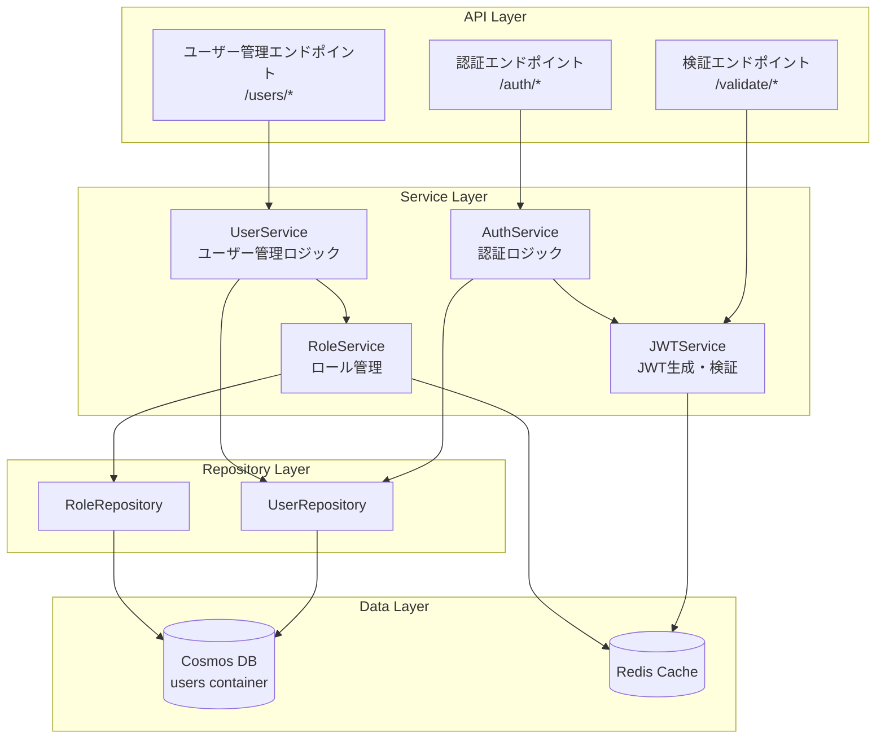
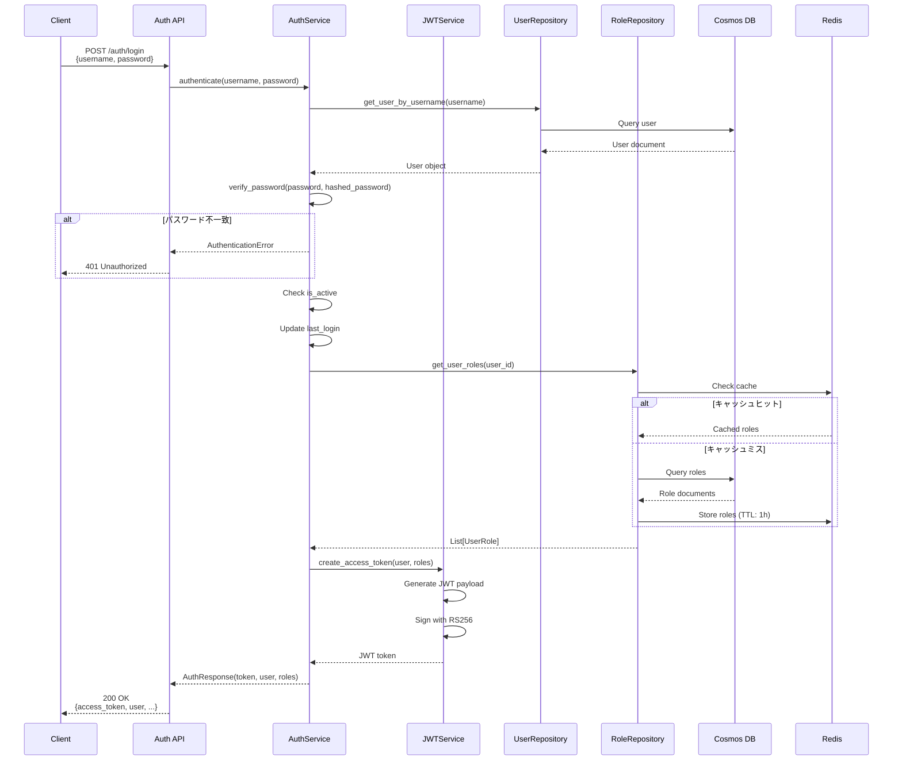
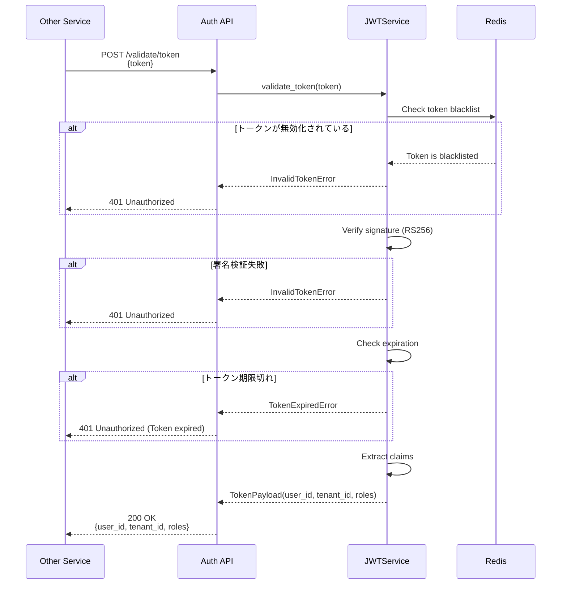

# Auth Service 設計

## 1. サービス概要

### 1.1 責務

Auth Serviceは、システム全体の認証・認可を管理する中核サービスです：

- **認証（Authentication）**: ユーザーID/パスワードによる本人確認
- **JWT発行**: 認証成功時のアクセストークン生成
- **JWT検証**: 他サービスからのトークン検証要求処理
- **ユーザー管理**: ユーザー情報とロール情報の管理
- **ロール管理**: 各サービスのロール情報の統合管理

### 1.2 技術スタック

```yaml
言語: Python 3.11
フレームワーク: FastAPI 0.109
認証ライブラリ: python-jose (JWT), passlib (パスワードハッシュ)
DB Client: azure-cosmos 4.5
キャッシュ: redis-py 5.0
バリデーション: Pydantic v2
非同期処理: asyncio, aiohttp
テスト: pytest, pytest-asyncio
```

### 1.3 主要な非機能要件

| 要件 | 目標値 |
|------|--------|
| 認証API応答時間 (P95) | < 500ms |
| JWT検証応答時間 (P95) | < 100ms |
| 可用性 | 99.9% |
| 同時認証要求 | 1000 req/sec |

## 2. アーキテクチャ

### 2.1 レイヤー構成



### 2.2 ディレクトリ構造

```
auth-service/
├── app/
│   ├── api/
│   │   ├── v1/
│   │   │   ├── endpoints/
│   │   │   │   ├── auth.py          # 認証エンドポイント
│   │   │   │   ├── users.py         # ユーザー管理エンドポイント
│   │   │   │   ├── validate.py      # JWT検証エンドポイント
│   │   │   │   └── roles.py         # ロール情報エンドポイント
│   │   │   └── router.py            # APIルーター統合
│   │   └── deps.py                  # 依存性注入
│   ├── core/
│   │   ├── config.py                # 設定管理
│   │   ├── security.py              # セキュリティユーティリティ
│   │   ├── exceptions.py            # カスタム例外
│   │   └── constants.py             # 定数定義
│   ├── models/
│   │   ├── domain/
│   │   │   ├── user.py              # ユーザードメインモデル
│   │   │   └── role.py              # ロールドメインモデル
│   │   └── schemas/
│   │       ├── auth.py              # 認証スキーマ
│   │       ├── user.py              # ユーザースキーマ
│   │       ├── token.py             # トークンスキーマ
│   │       └── role.py              # ロールスキーマ
│   ├── services/
│   │   ├── auth_service.py          # 認証サービス
│   │   ├── user_service.py          # ユーザー管理サービス
│   │   ├── jwt_service.py           # JWT処理サービス
│   │   └── role_service.py          # ロール管理サービス
│   ├── repositories/
│   │   ├── user_repository.py       # ユーザーリポジトリ
│   │   └── role_repository.py       # ロールリポジトリ
│   ├── middleware/
│   │   ├── auth_middleware.py       # 認証ミドルウェア
│   │   └── logging_middleware.py    # ロギングミドルウェア
│   └── main.py                      # アプリケーションエントリーポイント
├── tests/
│   ├── unit/
│   ├── integration/
│   └── conftest.py
├── Dockerfile
├── requirements.txt
└── README.md
```

## 3. データモデル

### 3.1 Usersコンテナ

```python
# app/models/domain/user.py
from typing import List, Optional
from datetime import datetime
from pydantic import BaseModel, EmailStr, Field

class User(BaseModel):
    """ユーザードメインモデル"""
    id: str = Field(..., description="ユーザーID (UUID)")
    username: str = Field(..., min_length=3, max_length=50)
    email: EmailStr
    hashed_password: str
    full_name: str
    tenant_id: str = Field(..., description="所属テナントID")
    is_active: bool = True
    is_privileged_tenant: bool = False
    created_at: datetime
    updated_at: datetime
    last_login: Optional[datetime] = None
    
    # Cosmos DB用フィールド
    type: str = "user"  # Discriminator for container
    partition_key: str  # tenant_id

class UserRole(BaseModel):
    """ユーザーロールモデル"""
    user_id: str
    service_name: str = Field(..., description="サービス名 (tenant, auth, file等)")
    role_name: str = Field(..., description="ロール名 (全体管理者、管理者、閲覧者等)")
    assigned_at: datetime
    assigned_by: str = Field(..., description="割り当てたユーザーID")
    
    # Cosmos DB用フィールド
    id: str  # user_id:service_name
    type: str = "user_role"
    partition_key: str  # user_id
```

### 3.2 ドキュメント例

```json
{
  "id": "user-12345",
  "type": "user",
  "username": "admin001",
  "email": "admin@example.com",
  "hashed_password": "$2b$12$...",
  "full_name": "管理者太郎",
  "tenant_id": "privileged-tenant",
  "is_active": true,
  "is_privileged_tenant": true,
  "created_at": "2026-01-01T00:00:00Z",
  "updated_at": "2026-02-01T10:00:00Z",
  "last_login": "2026-02-01T09:00:00Z",
  "partition_key": "privileged-tenant"
}

{
  "id": "user-12345:tenant",
  "type": "user_role",
  "user_id": "user-12345",
  "service_name": "tenant",
  "role_name": "全体管理者",
  "assigned_at": "2026-01-01T00:00:00Z",
  "assigned_by": "system",
  "partition_key": "user-12345"
}
```

## 4. 認証フロー

### 4.1 ログイン処理



### 4.2 JWT検証フロー



## 5. 主要機能実装

### 5.1 認証サービス

```python
# app/services/auth_service.py
from typing import Optional
from datetime import datetime
from app.models.domain.user import User
from app.models.schemas.auth import LoginRequest, AuthResponse
from app.repositories.user_repository import UserRepository
from app.repositories.role_repository import RoleRepository
from app.services.jwt_service import JWTService
from app.core.security import verify_password
from app.core.exceptions import AuthenticationError

class AuthService:
    def __init__(
        self,
        user_repo: UserRepository,
        role_repo: RoleRepository,
        jwt_service: JWTService
    ):
        self.user_repo = user_repo
        self.role_repo = role_repo
        self.jwt_service = jwt_service
    
    async def authenticate(self, request: LoginRequest) -> AuthResponse:
        """ユーザー認証とトークン生成"""
        
        # ユーザー取得
        user = await self.user_repo.get_by_username(request.username)
        if not user:
            raise AuthenticationError("ユーザー名またはパスワードが正しくありません")
        
        # パスワード検証
        if not verify_password(request.password, user.hashed_password):
            raise AuthenticationError("ユーザー名またはパスワードが正しくありません")
        
        # アクティブチェック
        if not user.is_active:
            raise AuthenticationError("このユーザーは無効化されています")
        
        # ロール情報取得（キャッシュ付き）
        roles = await self.role_repo.get_user_roles(user.id)
        
        # 最終ログイン時刻更新
        user.last_login = datetime.utcnow()
        await self.user_repo.update(user)
        
        # JWT生成
        access_token = await self.jwt_service.create_access_token(
            user_id=user.id,
            tenant_id=user.tenant_id,
            roles=roles
        )
        
        return AuthResponse(
            access_token=access_token,
            token_type="bearer",
            expires_in=28800,  # 8時間
            user=user,
            roles=roles
        )
    
    async def logout(self, token: str) -> None:
        """ログアウト（トークン無効化）"""
        await self.jwt_service.blacklist_token(token)
```

### 5.2 JWTサービス

```python
# app/services/jwt_service.py
from datetime import datetime, timedelta
from typing import Dict, Any, List
from jose import jwt, JWTError
from app.core.config import settings
from app.core.exceptions import InvalidTokenError, TokenExpiredError
from app.models.domain.role import UserRole
import aioredis

class JWTService:
    def __init__(self, redis_client: aioredis.Redis):
        self.redis = redis_client
        self.algorithm = "RS256"
        self.private_key = settings.JWT_PRIVATE_KEY
        self.public_key = settings.JWT_PUBLIC_KEY
        self.expires_delta = timedelta(hours=8)
    
    async def create_access_token(
        self,
        user_id: str,
        tenant_id: str,
        roles: List[UserRole]
    ) -> str:
        """アクセストークン生成"""
        
        expire = datetime.utcnow() + self.expires_delta
        
        # JWT Payload
        payload = {
            "sub": user_id,
            "tenant_id": tenant_id,
            "roles": [
                {
                    "service": role.service_name,
                    "role": role.role_name
                }
                for role in roles
            ],
            "exp": expire,
            "iat": datetime.utcnow(),
            "iss": "auth-service",
            "aud": "api-services"
        }
        
        # RS256で署名
        token = jwt.encode(payload, self.private_key, algorithm=self.algorithm)
        
        return token
    
    async def validate_token(self, token: str) -> Dict[str, Any]:
        """トークン検証"""
        
        # ブラックリストチェック
        is_blacklisted = await self.redis.exists(f"blacklist:{token}")
        if is_blacklisted:
            raise InvalidTokenError("このトークンは無効化されています")
        
        try:
            # 署名検証とデコード
            payload = jwt.decode(
                token,
                self.public_key,
                algorithms=[self.algorithm],
                audience="api-services",
                issuer="auth-service"
            )
            
            return payload
            
        except jwt.ExpiredSignatureError:
            raise TokenExpiredError("トークンの有効期限が切れています")
        except JWTError as e:
            raise InvalidTokenError(f"不正なトークンです: {str(e)}")
    
    async def blacklist_token(self, token: str) -> None:
        """トークンをブラックリストに追加"""
        
        # トークンからexpiration取得
        try:
            payload = jwt.decode(
                token,
                self.public_key,
                algorithms=[self.algorithm],
                options={"verify_exp": False}
            )
            exp = payload.get("exp")
            
            if exp:
                # 期限までRedisに保存
                ttl = exp - datetime.utcnow().timestamp()
                if ttl > 0:
                    await self.redis.setex(
                        f"blacklist:{token}",
                        int(ttl),
                        "1"
                    )
        except JWTError:
            pass  # 無効なトークンは無視
```

### 5.3 ユーザー管理サービス

```python
# app/services/user_service.py
from typing import List, Optional
from app.models.domain.user import User
from app.models.schemas.user import CreateUserRequest, UpdateUserRequest
from app.repositories.user_repository import UserRepository
from app.repositories.role_repository import RoleRepository
from app.core.security import get_password_hash
from app.core.exceptions import UserAlreadyExistsError, UserNotFoundError

class UserService:
    def __init__(
        self,
        user_repo: UserRepository,
        role_repo: RoleRepository
    ):
        self.user_repo = user_repo
        self.role_repo = role_repo
    
    async def create_user(self, request: CreateUserRequest) -> User:
        """ユーザー作成"""
        
        # 重複チェック
        existing = await self.user_repo.get_by_username(request.username)
        if existing:
            raise UserAlreadyExistsError(f"ユーザー名 '{request.username}' は既に使用されています")
        
        # パスワードハッシュ化
        hashed_password = get_password_hash(request.password)
        
        # ユーザーオブジェクト作成
        user = User(
            id=f"user-{uuid.uuid4()}",
            username=request.username,
            email=request.email,
            hashed_password=hashed_password,
            full_name=request.full_name,
            tenant_id=request.tenant_id,
            is_active=True,
            is_privileged_tenant=request.is_privileged_tenant,
            created_at=datetime.utcnow(),
            updated_at=datetime.utcnow(),
            partition_key=request.tenant_id
        )
        
        # DB保存
        created_user = await self.user_repo.create(user)
        
        # ロール割り当て
        if request.roles:
            await self.role_repo.assign_roles(
                user_id=created_user.id,
                roles=request.roles,
                assigned_by=request.created_by
            )
        
        return created_user
    
    async def list_users(
        self,
        skip: int = 0,
        limit: int = 100,
        tenant_id: Optional[str] = None
    ) -> List[User]:
        """ユーザー一覧取得"""
        return await self.user_repo.list(skip=skip, limit=limit, tenant_id=tenant_id)
    
    async def get_user(self, user_id: str) -> User:
        """ユーザー取得"""
        user = await self.user_repo.get(user_id)
        if not user:
            raise UserNotFoundError(f"ユーザーID '{user_id}' が見つかりません")
        return user
    
    async def update_user(self, user_id: str, request: UpdateUserRequest) -> User:
        """ユーザー更新"""
        user = await self.get_user(user_id)
        
        # 更新フィールドの適用
        if request.email:
            user.email = request.email
        if request.full_name:
            user.full_name = request.full_name
        if request.is_active is not None:
            user.is_active = request.is_active
        
        user.updated_at = datetime.utcnow()
        
        # DB更新
        updated_user = await self.user_repo.update(user)
        
        # ロール更新
        if request.roles is not None:
            await self.role_repo.update_user_roles(
                user_id=user_id,
                roles=request.roles,
                updated_by=request.updated_by
            )
        
        return updated_user
```

## 6. API仕様

### 6.1 認証エンドポイント

```python
# app/api/v1/endpoints/auth.py
from fastapi import APIRouter, Depends, HTTPException, status
from app.models.schemas.auth import LoginRequest, AuthResponse
from app.services.auth_service import AuthService
from app.api.deps import get_auth_service
from app.core.exceptions import AuthenticationError

router = APIRouter()

@router.post("/login", response_model=AuthResponse)
async def login(
    request: LoginRequest,
    auth_service: AuthService = Depends(get_auth_service)
):
    """
    ユーザーログイン
    
    - **username**: ユーザー名
    - **password**: パスワード
    
    Returns:
    - **access_token**: JWTアクセストークン
    - **user**: ユーザー情報
    - **roles**: ロール情報
    """
    try:
        response = await auth_service.authenticate(request)
        return response
    except AuthenticationError as e:
        raise HTTPException(
            status_code=status.HTTP_401_UNAUTHORIZED,
            detail=str(e)
        )

@router.post("/logout", status_code=status.HTTP_204_NO_CONTENT)
async def logout(
    token: str = Depends(get_current_token),
    auth_service: AuthService = Depends(get_auth_service)
):
    """
    ログアウト（トークン無効化）
    """
    await auth_service.logout(token)
    return None

@router.post("/refresh", response_model=AuthResponse)
async def refresh_token(
    token: str = Depends(get_current_token),
    auth_service: AuthService = Depends(get_auth_service)
):
    """
    トークンリフレッシュ
    """
    # 実装略
    pass
```

### 6.2 JWT検証エンドポイント

```python
# app/api/v1/endpoints/validate.py
from fastapi import APIRouter, Depends, HTTPException, status
from app.models.schemas.token import ValidateTokenRequest, TokenPayload
from app.services.jwt_service import JWTService
from app.api.deps import get_jwt_service
from app.core.exceptions import InvalidTokenError, TokenExpiredError

router = APIRouter()

@router.post("/token", response_model=TokenPayload)
async def validate_token(
    request: ValidateTokenRequest,
    jwt_service: JWTService = Depends(get_jwt_service)
):
    """
    JWT検証
    
    他のマイクロサービスからトークンの検証を受け付けます。
    
    - **token**: 検証するJWT
    
    Returns:
    - **user_id**: ユーザーID
    - **tenant_id**: テナントID
    - **roles**: ロール情報
    """
    try:
        payload = await jwt_service.validate_token(request.token)
        return TokenPayload(**payload)
    except TokenExpiredError as e:
        raise HTTPException(
            status_code=status.HTTP_401_UNAUTHORIZED,
            detail=str(e),
            headers={"WWW-Authenticate": "Bearer"}
        )
    except InvalidTokenError as e:
        raise HTTPException(
            status_code=status.HTTP_401_UNAUTHORIZED,
            detail=str(e),
            headers={"WWW-Authenticate": "Bearer"}
        )
```

## 7. セキュリティ実装

### 7.1 パスワードハッシュ化

```python
# app/core/security.py
from passlib.context import CryptContext

pwd_context = CryptContext(schemes=["bcrypt"], deprecated="auto")

def verify_password(plain_password: str, hashed_password: str) -> bool:
    """パスワード検証"""
    return pwd_context.verify(plain_password, hashed_password)

def get_password_hash(password: str) -> str:
    """パスワードハッシュ化"""
    return pwd_context.hash(password)
```

### 7.2 JWT鍵管理

```python
# app/core/config.py
from pydantic_settings import BaseSettings

class Settings(BaseSettings):
    # JWT設定
    JWT_PRIVATE_KEY: str  # RS256秘密鍵 (Key Vaultから取得)
    JWT_PUBLIC_KEY: str   # RS256公開鍵 (Key Vaultから取得)
    JWT_ALGORITHM: str = "RS256"
    JWT_EXPIRATION_HOURS: int = 8
    
    # Cosmos DB設定
    COSMOS_ENDPOINT: str
    COSMOS_KEY: str
    COSMOS_DATABASE: str = "auth_db"
    COSMOS_CONTAINER: str = "users"
    
    # Redis設定
    REDIS_HOST: str
    REDIS_PORT: int = 6379
    REDIS_PASSWORD: str
    REDIS_DB: int = 0
    
    class Config:
        env_file = ".env"

settings = Settings()
```

## 8. パフォーマンス最適化

### 8.1 ロール情報キャッシング

```python
# app/repositories/role_repository.py
import json
from typing import List
from app.models.domain.role import UserRole
import aioredis

class RoleRepository:
    def __init__(self, cosmos_client, redis_client: aioredis.Redis):
        self.container = cosmos_client.get_container()
        self.redis = redis_client
        self.cache_ttl = 3600  # 1時間
    
    async def get_user_roles(self, user_id: str) -> List[UserRole]:
        """ユーザーロール取得（キャッシュ付き）"""
        
        # キャッシュ確認
        cache_key = f"roles:{user_id}"
        cached = await self.redis.get(cache_key)
        
        if cached:
            roles_data = json.loads(cached)
            return [UserRole(**role) for role in roles_data]
        
        # DBから取得
        query = "SELECT * FROM c WHERE c.type = 'user_role' AND c.user_id = @user_id"
        parameters = [{"name": "@user_id", "value": user_id}]
        
        items = self.container.query_items(
            query=query,
            parameters=parameters,
            enable_cross_partition_query=True
        )
        
        roles = [UserRole(**item) for item in items]
        
        # キャッシュに保存
        roles_data = [role.dict() for role in roles]
        await self.redis.setex(
            cache_key,
            self.cache_ttl,
            json.dumps(roles_data, default=str)
        )
        
        return roles
```

## 9. 監視・ロギング

### 9.1 構造化ログ

```python
# app/middleware/logging_middleware.py
import logging
import json
import time
from fastapi import Request
from starlette.middleware.base import BaseHTTPMiddleware

logger = logging.getLogger(__name__)

class LoggingMiddleware(BaseHTTPMiddleware):
    async def dispatch(self, request: Request, call_next):
        start_time = time.time()
        
        # リクエストログ
        log_data = {
            "event": "request_started",
            "method": request.method,
            "path": request.url.path,
            "client_ip": request.client.host
        }
        logger.info(json.dumps(log_data))
        
        # 処理実行
        response = await call_next(request)
        
        # レスポンスログ
        process_time = time.time() - start_time
        log_data = {
            "event": "request_completed",
            "method": request.method,
            "path": request.url.path,
            "status_code": response.status_code,
            "process_time": f"{process_time:.3f}s"
        }
        logger.info(json.dumps(log_data))
        
        return response
```

## 10. テスト

### 10.1 認証テスト

```python
# tests/integration/test_auth.py
import pytest
from httpx import AsyncClient
from app.main import app

@pytest.mark.asyncio
async def test_login_success():
    """正常ログインテスト"""
    async with AsyncClient(app=app, base_url="http://test") as client:
        response = await client.post(
            "/api/v1/auth/login",
            json={
                "username": "testuser",
                "password": "testpass123"
            }
        )
    
    assert response.status_code == 200
    data = response.json()
    assert "access_token" in data
    assert data["token_type"] == "bearer"
    assert "user" in data

@pytest.mark.asyncio
async def test_login_invalid_credentials():
    """不正な認証情報でのログインテスト"""
    async with AsyncClient(app=app, base_url="http://test") as client:
        response = await client.post(
            "/api/v1/auth/login",
            json={
                "username": "testuser",
                "password": "wrongpassword"
            }
        )
    
    assert response.status_code == 401
```

## 11. 関連ドキュメント

- [セキュリティ設計](../security/authentication-flow.md)
- [API設計](../api/api-design.md)
- [データモデル](../data/data-model.md)
