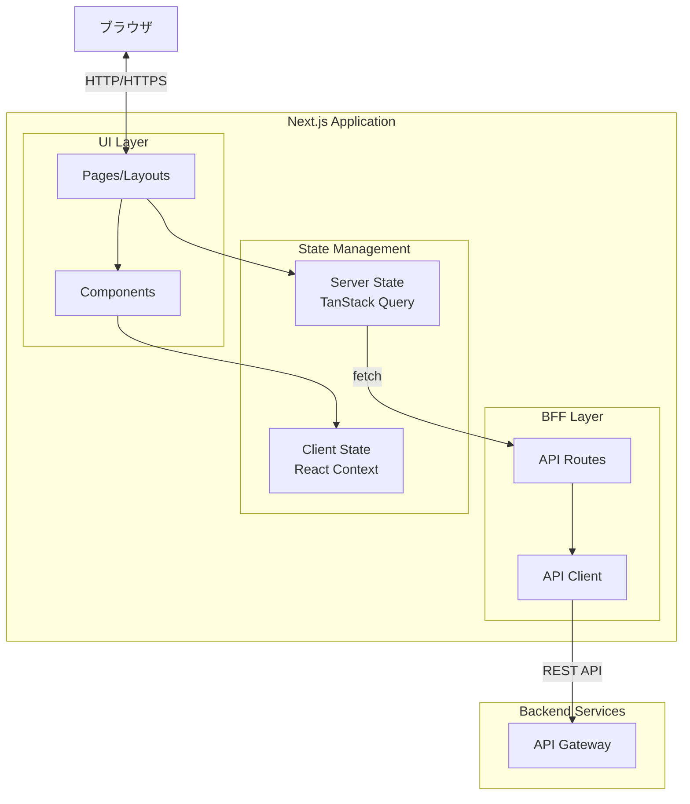
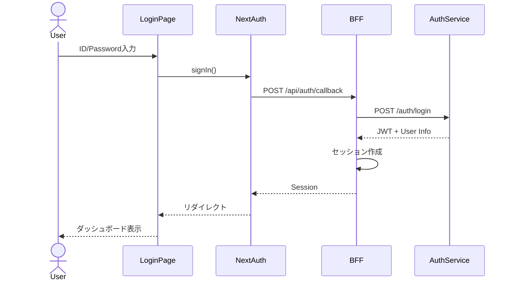
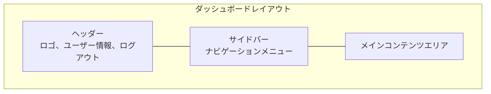

# Frontend Service 設計

## 1. サービス概要

### 1.1 責務

Frontend Serviceは、ユーザーインターフェース（UI）とBackend for Frontend（BFF）の両方の責務を持ちます：

- **UIレイヤー**: React/Next.jsによるWebアプリケーション
- **BFFレイヤー**: バックエンドマイクロサービスへのプロキシ、レスポンス集約、セッション管理

### 1.2 技術スタック

```yaml
フレームワーク: Next.js 14.1 (App Router)
言語: TypeScript 5.3
UIライブラリ: React 18
スタイリング: Tailwind CSS 3.4
状態管理: 
  - TanStack Query v5 (サーバー状態)
  - React Context API (クライアント状態)
フォーム: React Hook Form + Zod
HTTP Client: Axios
認証: NextAuth.js (カスタムプロバイダー)
```

### 1.3 アクセス制限

- 特権テナントに所属するユーザーのみログイン可能
- ロールに応じた画面制御
- 未認証ユーザーは自動的にログイン画面にリダイレクト

## 2. アーキテクチャ

### 2.1 全体構成



### 2.2 ディレクトリ構造

```
front/
├── src/
│   ├── app/                          # Next.js App Router
│   │   ├── (auth)/                   # 認証レイアウトグループ
│   │   │   ├── login/
│   │   │   │   └── page.tsx
│   │   │   └── layout.tsx
│   │   ├── (dashboard)/              # ダッシュボードレイアウトグループ
│   │   │   ├── tenants/              # テナント管理
│   │   │   │   ├── page.tsx         # 一覧
│   │   │   │   ├── [id]/
│   │   │   │   │   └── page.tsx     # 詳細・編集
│   │   │   │   └── new/
│   │   │   │       └── page.tsx     # 新規作成
│   │   │   ├── users/                # ユーザー管理
│   │   │   │   ├── page.tsx
│   │   │   │   ├── [id]/
│   │   │   │   │   └── page.tsx
│   │   │   │   └── new/
│   │   │   │       └── page.tsx
│   │   │   ├── services/             # サービス設定
│   │   │   │   └── page.tsx
│   │   │   └── layout.tsx
│   │   ├── api/                      # BFF API Routes
│   │   │   ├── auth/
│   │   │   │   ├── [...nextauth]/
│   │   │   │   │   └── route.ts
│   │   │   │   └── session/
│   │   │   │       └── route.ts
│   │   │   ├── tenants/
│   │   │   │   ├── route.ts
│   │   │   │   └── [id]/
│   │   │   │       └── route.ts
│   │   │   ├── users/
│   │   │   │   ├── route.ts
│   │   │   │   └── [id]/
│   │   │   │       └── route.ts
│   │   │   └── services/
│   │   │       └── route.ts
│   │   ├── layout.tsx                # ルートレイアウト
│   │   └── page.tsx                  # ホーム
│   ├── components/                   # Reactコンポーネント
│   │   ├── ui/                       # 汎用UIコンポーネント
│   │   │   ├── Button.tsx
│   │   │   ├── Input.tsx
│   │   │   ├── Modal.tsx
│   │   │   ├── Table.tsx
│   │   │   └── ...
│   │   ├── features/                 # 機能別コンポーネント
│   │   │   ├── tenants/
│   │   │   │   ├── TenantList.tsx
│   │   │   │   ├── TenantForm.tsx
│   │   │   │   └── TenantDetail.tsx
│   │   │   ├── users/
│   │   │   │   ├── UserList.tsx
│   │   │   │   ├── UserForm.tsx
│   │   │   │   └── UserRoleSelector.tsx
│   │   │   └── services/
│   │   │       └── ServiceSettings.tsx
│   │   └── layouts/                  # レイアウトコンポーネント
│   │       ├── Header.tsx
│   │       ├── Sidebar.tsx
│   │       └── Footer.tsx
│   ├── lib/                          # ユーティリティ・ロジック
│   │   ├── api/                      # API Client
│   │   │   ├── client.ts             # Axiosインスタンス
│   │   │   ├── tenants.ts            # テナントAPI
│   │   │   ├── users.ts              # ユーザーAPI
│   │   │   ├── auth.ts               # 認証API
│   │   │   └── services.ts           # サービス設定API
│   │   ├── auth/                     # 認証関連
│   │   │   ├── nextauth.ts           # NextAuth設定
│   │   │   └── guards.ts             # 認可ガード
│   │   ├── hooks/                    # カスタムフック
│   │   │   ├── useTenants.ts
│   │   │   ├── useUsers.ts
│   │   │   └── useAuth.ts
│   │   └── utils/                    # ユーティリティ関数
│   │       ├── format.ts
│   │       └── validation.ts
│   ├── types/                        # TypeScript型定義
│   │   ├── tenant.ts
│   │   ├── user.ts
│   │   ├── auth.ts
│   │   └── api.ts
│   ├── config/                       # 設定
│   │   └── constants.ts
│   └── middleware.ts                 # Next.js Middleware
├── public/                           # 静的ファイル
│   ├── images/
│   └── favicon.ico
├── tests/                            # テスト
│   ├── unit/
│   ├── integration/
│   └── e2e/
├── .env.local                        # 環境変数（ローカル）
├── .env.development
├── .env.production
├── next.config.js
├── tailwind.config.js
├── tsconfig.json
├── package.json
└── README.md
```

## 3. 主要機能

### 3.1 認証・認可

#### 3.1.1 ログインフロー



#### 3.1.2 セッション管理

```typescript
// lib/auth/nextauth.ts
import NextAuth, { NextAuthOptions } from "next-auth"
import CredentialsProvider from "next-auth/providers/credentials"
import { authApi } from "@/lib/api/auth"

export const authOptions: NextAuthOptions = {
  providers: [
    CredentialsProvider({
      name: "Credentials",
      credentials: {
        username: { label: "Username", type: "text" },
        password: { label: "Password", type: "password" }
      },
      async authorize(credentials) {
        if (!credentials?.username || !credentials?.password) {
          return null
        }
        
        try {
          const response = await authApi.login({
            username: credentials.username,
            password: credentials.password
          })
          
          // 特権テナントチェック
          if (!response.user.is_privileged_tenant) {
            throw new Error("特権テナントのユーザーのみログイン可能です")
          }
          
          return {
            id: response.user.id,
            name: response.user.name,
            email: response.user.email,
            tenant_id: response.user.tenant_id,
            roles: response.user.roles,
            access_token: response.access_token
          }
        } catch (error) {
          console.error("Login failed", error)
          return null
        }
      }
    })
  ],
  session: {
    strategy: "jwt",
    maxAge: 8 * 60 * 60, // 8時間
  },
  callbacks: {
    async jwt({ token, user }) {
      if (user) {
        token.access_token = user.access_token
        token.roles = user.roles
        token.tenant_id = user.tenant_id
      }
      return token
    },
    async session({ session, token }) {
      session.user.access_token = token.access_token
      session.user.roles = token.roles
      session.user.tenant_id = token.tenant_id
      return session
    }
  },
  pages: {
    signIn: "/login",
    error: "/login",
  }
}
```

#### 3.1.3 ロールベース認可

```typescript
// lib/auth/guards.ts
import { getServerSession } from "next-auth"
import { authOptions } from "./nextauth"
import { redirect } from "next/navigation"

export type Role = "全体管理者" | "管理者" | "閲覧者"

export async function requireAuth() {
  const session = await getServerSession(authOptions)
  if (!session) {
    redirect("/login")
  }
  return session
}

export async function requireRole(allowedRoles: Role[]) {
  const session = await requireAuth()
  const userRoles = session.user.roles
  
  const hasPermission = allowedRoles.some(role => 
    userRoles.some((userRole: any) => userRole.service === "tenant" && userRole.role === role)
  )
  
  if (!hasPermission) {
    redirect("/unauthorized")
  }
  
  return session
}

// 使用例
// app/(dashboard)/tenants/new/page.tsx
export default async function NewTenantPage() {
  await requireRole(["全体管理者", "管理者"])
  // ...
}
```

### 3.2 BFF API Routes

#### 3.2.1 テナント管理API

```typescript
// app/api/tenants/route.ts
import { NextRequest, NextResponse } from "next/server"
import { getServerSession } from "next-auth"
import { authOptions } from "@/lib/auth/nextauth"
import { tenantsApi } from "@/lib/api/tenants"

export async function GET(request: NextRequest) {
  try {
    const session = await getServerSession(authOptions)
    if (!session) {
      return NextResponse.json({ error: "Unauthorized" }, { status: 401 })
    }
    
    const { searchParams } = new URL(request.url)
    const page = parseInt(searchParams.get("page") || "1")
    const limit = parseInt(searchParams.get("limit") || "20")
    
    const tenants = await tenantsApi.list({
      page,
      limit,
      token: session.user.access_token
    })
    
    return NextResponse.json(tenants)
  } catch (error) {
    console.error("Failed to fetch tenants", error)
    return NextResponse.json(
      { error: "Internal Server Error" },
      { status: 500 }
    )
  }
}

export async function POST(request: NextRequest) {
  try {
    const session = await getServerSession(authOptions)
    if (!session) {
      return NextResponse.json({ error: "Unauthorized" }, { status: 401 })
    }
    
    // ロールチェック
    const hasPermission = session.user.roles.some(
      (role: any) => 
        role.service === "tenant" && 
        ["全体管理者", "管理者"].includes(role.role)
    )
    
    if (!hasPermission) {
      return NextResponse.json({ error: "Forbidden" }, { status: 403 })
    }
    
    const body = await request.json()
    const tenant = await tenantsApi.create({
      data: body,
      token: session.user.access_token
    })
    
    return NextResponse.json(tenant, { status: 201 })
  } catch (error) {
    console.error("Failed to create tenant", error)
    return NextResponse.json(
      { error: "Internal Server Error" },
      { status: 500 }
    )
  }
}
```

### 3.3 画面設計

#### 3.3.1 レイアウト構成



#### 3.3.2 画面一覧

| 画面名 | パス | 必要ロール | 説明 |
|--------|------|-----------|------|
| ログイン | `/login` | - | ログイン画面 |
| ダッシュボード | `/` | すべて | ホーム画面 |
| テナント一覧 | `/tenants` | すべて | テナント一覧表示 |
| テナント詳細 | `/tenants/[id]` | すべて | テナント詳細・編集 |
| テナント作成 | `/tenants/new` | 全体管理者、管理者 | 新規テナント作成 |
| ユーザー一覧 | `/users` | すべて | ユーザー一覧表示 |
| ユーザー詳細 | `/users/[id]` | すべて | ユーザー詳細・編集 |
| ユーザー作成 | `/users/new` | 全体管理者 | 新規ユーザー作成 |
| サービス設定 | `/services` | すべて | サービス利用設定 |

#### 3.3.3 コンポーネント設計例

```typescript
// components/features/tenants/TenantList.tsx
"use client"

import { useTenants } from "@/lib/hooks/useTenants"
import { Table } from "@/components/ui/Table"
import { Button } from "@/components/ui/Button"
import { useRouter } from "next/navigation"

export function TenantList() {
  const router = useRouter()
  const { data, isLoading, error } = useTenants()
  
  if (isLoading) return <div>読み込み中...</div>
  if (error) return <div>エラーが発生しました</div>
  
  const columns = [
    { key: "name", label: "テナント名" },
    { key: "user_count", label: "ユーザー数" },
    { key: "created_at", label: "作成日" },
    { key: "services", label: "利用サービス" },
  ]
  
  return (
    <div>
      <div className="flex justify-between mb-4">
        <h1 className="text-2xl font-bold">テナント一覧</h1>
        <Button onClick={() => router.push("/tenants/new")}>
          新規作成
        </Button>
      </div>
      
      <Table
        columns={columns}
        data={data?.tenants || []}
        onRowClick={(tenant) => router.push(`/tenants/${tenant.id}`)}
      />
    </div>
  )
}
```

## 4. API Client設計

### 4.1 共通Axios設定

```typescript
// lib/api/client.ts
import axios, { AxiosInstance, AxiosError } from "axios"
import { getSession } from "next-auth/react"

const BASE_URL = process.env.NEXT_PUBLIC_API_BASE_URL || "http://localhost:8000"

export const apiClient: AxiosInstance = axios.create({
  baseURL: BASE_URL,
  timeout: 10000,
  headers: {
    "Content-Type": "application/json",
  },
})

// リクエストインターセプター
apiClient.interceptors.request.use(
  async (config) => {
    // Client Component用：セッションからトークン取得
    if (typeof window !== "undefined") {
      const session = await getSession()
      if (session?.user?.access_token) {
        config.headers.Authorization = `Bearer ${session.user.access_token}`
      }
    }
    
    return config
  },
  (error) => {
    return Promise.reject(error)
  }
)

// レスポンスインターセプター
apiClient.interceptors.response.use(
  (response) => response,
  async (error: AxiosError) => {
    if (error.response?.status === 401) {
      // 認証エラー：ログイン画面へリダイレクト
      if (typeof window !== "undefined") {
        window.location.href = "/login"
      }
    }
    
    return Promise.reject(error)
  }
)

// サーバーコンポーネント用：トークン付きクライアント作成
export function createAuthenticatedClient(token: string): AxiosInstance {
  const client = axios.create({
    baseURL: BASE_URL,
    timeout: 10000,
    headers: {
      "Content-Type": "application/json",
      Authorization: `Bearer ${token}`,
    },
  })
  
  return client
}
```

## 5. 状態管理

### 5.1 TanStack Query設定

```typescript
// lib/hooks/useTenants.ts
import { useQuery, useMutation, useQueryClient } from "@tanstack/react-query"
import { tenantsApi } from "@/lib/api/tenants"
import type { Tenant, CreateTenantInput } from "@/types/tenant"

export function useTenants() {
  return useQuery({
    queryKey: ["tenants"],
    queryFn: () => tenantsApi.list(),
    staleTime: 5 * 60 * 1000, // 5分
  })
}

export function useTenant(id: string) {
  return useQuery({
    queryKey: ["tenants", id],
    queryFn: () => tenantsApi.get(id),
    enabled: !!id,
  })
}

export function useCreateTenant() {
  const queryClient = useQueryClient()
  
  return useMutation({
    mutationFn: (data: CreateTenantInput) => tenantsApi.create(data),
    onSuccess: () => {
      queryClient.invalidateQueries({ queryKey: ["tenants"] })
    },
  })
}

export function useUpdateTenant() {
  const queryClient = useQueryClient()
  
  return useMutation({
    mutationFn: ({ id, data }: { id: string; data: Partial<Tenant> }) =>
      tenantsApi.update(id, data),
    onSuccess: (_, variables) => {
      queryClient.invalidateQueries({ queryKey: ["tenants"] })
      queryClient.invalidateQueries({ queryKey: ["tenants", variables.id] })
    },
  })
}
```

## 6. パフォーマンス最適化

### 6.1 Next.js最適化

- **App Router使用**: Server Componentsでサーバーサイドレンダリング
- **動的インポート**: 大きなコンポーネントの遅延ロード
- **画像最適化**: Next.js Image コンポーネント使用
- **フォント最適化**: next/font使用

### 6.2 キャッシング戦略

```typescript
// TanStack Query設定
export const queryClientConfig = {
  defaultOptions: {
    queries: {
      staleTime: 5 * 60 * 1000,      // 5分
      cacheTime: 10 * 60 * 1000,     // 10分
      refetchOnWindowFocus: false,
      retry: 1,
    },
  },
}
```

## 7. エラーハンドリング

### 7.1 エラーバウンダリ

```typescript
// app/error.tsx
"use client"

import { useEffect } from "react"

export default function Error({
  error,
  reset,
}: {
  error: Error & { digest?: string }
  reset: () => void
}) {
  useEffect(() => {
    console.error(error)
  }, [error])

  return (
    <div>
      <h2>エラーが発生しました</h2>
      <button onClick={() => reset()}>再試行</button>
    </div>
  )
}
```

## 8. テスト戦略

### 8.1 テスト種類

| テスト種類 | ツール | 対象 | カバレッジ目標 |
|-----------|--------|------|---------------|
| 単体テスト | Jest, React Testing Library | コンポーネント、ユーティリティ | 80% |
| 統合テスト | Jest | API Routes | 70% |
| E2Eテスト | Playwright | 主要ユーザーフロー | 主要シナリオ |

### 8.2 テスト例

```typescript
// tests/unit/components/TenantList.test.tsx
import { render, screen } from "@testing-library/react"
import { QueryClient, QueryClientProvider } from "@tanstack/react-query"
import { TenantList } from "@/components/features/tenants/TenantList"

const queryClient = new QueryClient()

describe("TenantList", () => {
  it("テナント一覧を表示する", async () => {
    render(
      <QueryClientProvider client={queryClient}>
        <TenantList />
      </QueryClientProvider>
    )
    
    expect(await screen.findByText("テナント一覧")).toBeInTheDocument()
  })
})
```

## 9. デプロイメント

### 9.1 環境変数

```bash
# .env.production
NEXT_PUBLIC_API_BASE_URL=https://api.example.com
NEXTAUTH_URL=https://app.example.com
NEXTAUTH_SECRET=<ランダム文字列>
```

### 9.2 ビルド設定

```javascript
// next.config.js
/** @type {import('next').NextConfig} */
const nextConfig = {
  output: 'standalone',
  reactStrictMode: true,
  poweredByHeader: false,
  compress: true,
  
  async headers() {
    return [
      {
        source: '/:path*',
        headers: [
          {
            key: 'X-Frame-Options',
            value: 'DENY',
          },
          {
            key: 'X-Content-Type-Options',
            value: 'nosniff',
          },
          {
            key: 'Referrer-Policy',
            value: 'strict-origin-when-cross-origin',
          },
        ],
      },
    ]
  },
}

module.exports = nextConfig
```

## 10. 監視・ロギング

### 10.1 Application Insights統合

```typescript
// lib/monitoring/appInsights.ts
import { ApplicationInsights } from '@microsoft/applicationinsights-web'

const appInsights = new ApplicationInsights({
  config: {
    connectionString: process.env.NEXT_PUBLIC_APPINSIGHTS_CONNECTION_STRING,
    enableAutoRouteTracking: true,
  }
})

appInsights.loadAppInsights()
appInsights.trackPageView()

export { appInsights }
```

## 11. 関連ドキュメント

- [API設計](../api/api-design.md)
- [認証フロー](../security/authentication-flow.md)
- [データモデル](../data/data-model.md)
