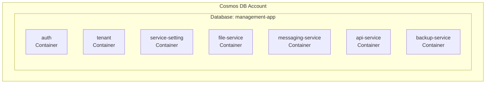

# データモデル設計

## ドキュメント情報
- バージョン: 1.6.0
- 最終更新日: 2026-02-02
- 関連: [システムアーキテクチャ概要](../overview.md)

## 1. データストア概要

### 1.1 Azure Cosmos DB構成
本システムは、Azure Cosmos DBのNoSQL APIを使用します。各マイクロサービスが専用のコンテナを持ち、テナントIDをパーティションキーとしてマルチテナンシーを実現します。



### 1.2 パーティション戦略
全てのコンテナで `/tenantId` をパーティションキーとして使用：

**利点**:
- テナント毎にデータが物理的に分離され、マルチテナンシーに最適
- 同一テナントのクエリは単一パーティション内で完結し、高速かつ低コスト
- テナント単位でのデータ移行・削除が容易

**考慮事項**:
- 特定テナントへのアクセスが集中すると、そのパーティションがホットパーティションになる可能性
- クロステナントのクエリは複数パーティションをスキャンするため高コスト（管理機能では許容）

### 1.3 整合性レベル
- **選択**: Session (デフォルト)
- **理由**: コストとパフォーマンスのバランスが最適
- **保証**: 同一セッション内での読み取り整合性

### 1.4 スループット設定
- **モード**: 自動スケール
- **最小**: 400 RU/s
- **最大**: 4000 RU/s
- **理由**: コスト最適化と負荷対応の両立

## 2. 認証認可サービス (auth コンテナ)

### 2.1 User エンティティ

#### 2.1.1 スキーマ
```json
{
  "id": "user_550e8400-e29b-41d4-a716-446655440000",
  "tenantId": "tenant_123",
  "type": "user",
  "username": "admin@example.com",
  "email": "admin@example.com",
  "passwordHash": "$2b$12$...",
  "displayName": "管理者太郎",
  "isActive": true,
  "createdAt": "2026-01-01T00:00:00Z",
  "updatedAt": "2026-01-15T10:30:00Z",
  "createdBy": "user_admin_001",
  "updatedBy": "user_admin_001",
  "_ts": 1706178600
}
```

#### 2.1.2 フィールド説明
| フィールド | 型 | 必須 | 説明 |
|----------|---|-----|------|
| id | string | ✅ | ユニークID（`user_` + UUID） |
| tenantId | string | ✅ | パーティションキー、所属テナントID |
| type | string | ✅ | エンティティタイプ識別子（"user"） |
| username | string | ✅ | ログインID（メールアドレス形式推奨） |
| email | string | ✅ | メールアドレス |
| passwordHash | string | ✅ | bcryptハッシュ化パスワード（cost factor: 12） |
| displayName | string | ✅ | 表示名 |
| isActive | boolean | ✅ | アクティブ状態 |
| createdAt | string | ✅ | 作成日時（ISO 8601） |
| updatedAt | string | ✅ | 更新日時（ISO 8601） |
| createdBy | string | - | 作成者ユーザーID（監査用） |
| updatedBy | string | - | 更新者ユーザーID（監査用） |
| _ts | number | - | Cosmos DB自動タイムスタンプ |

#### 2.1.3 インデックス
```json
{
  "indexingMode": "consistent",
  "includedPaths": [
    {"path": "/username/?"},
    {"path": "/email/?"},
    {"path": "/isActive/?"}
  ]
}
```

#### 2.1.4 クエリ例
```sql
-- ユーザー名でユーザー検索
SELECT * FROM c 
WHERE c.tenantId = "tenant_123" 
  AND c.type = "user" 
  AND c.username = "admin@example.com"

-- アクティブユーザー一覧
SELECT * FROM c 
WHERE c.tenantId = "tenant_123" 
  AND c.type = "user" 
  AND c.isActive = true
```

### 2.2 RoleAssignment エンティティ

#### 2.2.1 スキーマ
```json
{
  "id": "role_assignment_123e4567-e89b-12d3-a456-426614174000",
  "tenantId": "tenant_123",
  "type": "role_assignment",
  "userId": "user_550e8400-e29b-41d4-a716-446655440000",
  "serviceId": "tenant-management",
  "roleName": "管理者",
  "assignedBy": "user_admin_001",
  "assignedAt": "2026-01-10T12:00:00Z",
  "createdAt": "2026-01-10T12:00:00Z"
}
```

#### 2.2.2 フィールド説明
| フィールド | 型 | 必須 | 説明 |
|----------|---|-----|------|
| id | string | ✅ | ユニークID（`role_assignment_` + UUID、または決定的ID: `ra_{userId}_{serviceId}_{roleName}`） |
| tenantId | string | ✅ | パーティションキー |
| type | string | ✅ | "role_assignment" |
| userId | string | ✅ | ユーザーID |
| serviceId | string | ✅ | サービス識別子（例: "auth-service", "tenant-management"） |
| roleName | string | ✅ | ロール名（例: "全体管理者", "管理者", "閲覧者"） |
| assignedBy | string | ✅ | 割り当てを実行したユーザーID |
| assignedAt | string | ✅ | 割り当て日時（ISO 8601形式） |
| createdAt | string | ✅ | 作成日時（ISO 8601形式） |

**ID設計**:
- Phase 1では決定的ID（`ra_{userId}_{serviceId}_{roleName}`）を使用し、Cosmos DBの一意制約を活用して重複を防止
- 同じユーザーに同じサービスの同じロールを重複割り当てすることを技術的に防止

#### 2.2.3 インデックス
```json
{
  "indexingMode": "consistent",
  "includedPaths": [
    {"path": "/userId/?"},
    {"path": "/serviceId/?"},
    {"path": "/roleName/?"},
    {"path": "/assignedAt/?"}
  ]
}
```

#### 2.2.4 クエリ例
```sql
-- ユーザーの全ロール取得（JWT生成時に使用）
SELECT * FROM c 
WHERE c.tenantId = @tenant_id
  AND c.type = "role_assignment" 
  AND c.userId = @user_id

-- 特定サービスの特定ロールを持つユーザー一覧
SELECT * FROM c 
WHERE c.tenantId = @tenant_id
  AND c.type = "role_assignment" 
  AND c.serviceId = @service_id
  AND c.roleName = @role_name

-- 特定ロール割り当ての重複チェック
SELECT * FROM c
WHERE c.tenantId = @tenant_id
  AND c.type = "role_assignment"
  AND c.userId = @user_id
  AND c.serviceId = @service_id
  AND c.roleName = @role_name
```

#### 2.2.5 データ整合性

**カスケード削除**:
ユーザー削除時、関連するRoleAssignmentも自動的に削除されます（論理削除）。

```python
# app/services/user_service.py
async def delete_user(self, user_id: str, tenant_id: str, deleted_by: str) -> None:
    """ユーザー削除（論理削除 + RoleAssignmentのカスケード削除）"""
    # 1. ユーザーの論理削除
    user = await self.user_repository.get(user_id, tenant_id)
    user.is_active = False
    await self.user_repository.update(user_id, tenant_id, user.dict())
    
    # 2. 関連RoleAssignmentを削除
    role_assignments = await self.role_repository.get_by_user_id(user_id, tenant_id)
    for ra in role_assignments:
        await self.role_repository.delete(ra.id, tenant_id)
```

**重複防止**:
決定的ID（`ra_{userId}_{serviceId}_{roleName}`）により、Cosmos DBのid一意制約を活用して重複を防止。

```python
# 409 Conflictエラーをキャッチして既存レコードを返却
try:
    await self.create(role_assignment)
    return role_assignment, True
except CosmosHttpResponseError as e:
    if e.status_code == 409:  # Conflict: ID重複
        existing = await self.get(role_assignment.id, tenant_id)
        return existing, False
    raise
```

### 2.3 ServiceRoleDefinition エンティティ

各サービスが提供するロールの定義情報をキャッシュ：

```json
{
  "id": "service_role_tenant-management_admin",
  "tenantId": "_system",
  "type": "service_role_definition",
  "serviceId": "tenant-management",
  "roleName": "管理者",
  "description": "テナントの追加・編集・削除が可能",
  "permissions": ["tenants:create", "tenants:update", "tenants:delete", "tenants:read"],
  "updatedAt": "2026-01-01T00:00:00Z"
}
```

**注意**: `tenantId: "_system"` は特殊なパーティションで、システム全体の設定を格納します。

## 3. テナント管理サービス (tenant コンテナ)

### 3.1 Tenant エンティティ

#### 3.1.1 スキーマ
```json
{
  "id": "tenant_acme",
  "tenantId": "tenant_acme",
  "type": "tenant",
  "name": "acme",
  "displayName": "Acme Corporation",
  "isPrivileged": false,
  "status": "active",
  "plan": "standard",
  "userCount": 25,
  "maxUsers": 100,
  "metadata": {
    "industry": "Manufacturing",
    "country": "US"
  },
  "createdAt": "2026-01-01T00:00:00Z",
  "updatedAt": "2026-01-20T15:00:00Z",
  "createdBy": "user_admin_001",
  "updatedBy": "user_admin_001",
  "_ts": 1706178600
}
```

#### 3.1.2 フィールド説明
| フィールド | 型 | 必須 | 説明 |
|----------|---|-----|------|
| id | string | ✅ | テナントID（`tenant_` + slug化したname） |
| tenantId | string | ✅ | パーティションキー（idと同値） |
| type | string | ✅ | "tenant" |
| name | string | ✅ | テナント識別名（英数字とハイフン・アンダースコア、3-100文字） |
| displayName | string | ✅ | 表示名（1-200文字） |
| isPrivileged | boolean | ✅ | 特権テナントフラグ（デフォルト: false） |
| status | string | ✅ | ステータス（active/suspended/deleted、デフォルト: active） |
| plan | string | ✅ | プラン（free/standard/premium、デフォルト: standard） |
| userCount | number | ✅ | 所属ユーザー数（デフォルト: 0） |
| maxUsers | number | ✅ | 最大ユーザー数（1-10000、デフォルト: 100） |
| metadata | object | - | 追加メタデータ（業種、国など） |
| createdAt | string | ✅ | 作成日時（ISO 8601） |
| updatedAt | string | ✅ | 更新日時（ISO 8601） |
| createdBy | string | ✅ | 作成者ユーザーID（監査用） |
| updatedBy | string | - | 更新者ユーザーID（監査用） |
| _ts | number | - | Cosmos DB自動タイムスタンプ |

#### 3.1.3 インデックス設計
```json
{
  "indexingPolicy": {
    "indexingMode": "consistent",
    "automatic": true,
    "includedPaths": [
      {"path": "/name/?"},
      {"path": "/status/?"},
      {"path": "/isPrivileged/?"},
      {"path": "/createdAt/?"}
    ],
    "excludedPaths": [
      {"path": "/metadata/*"}
    ]
  }
}
```

**インデックス設計の理由**:
- `/name/?`: テナント名検索で使用（一意性チェック）
- `/status/?`: ステータスフィルタで使用
- `/isPrivileged/?`: 特権テナント検索で使用
- `/createdAt/?`: 作成日時でソート
- `/metadata/*`: メタデータは検索対象外のため除外（RU削減）

#### 3.1.4 特権テナント
```json
{
  "id": "tenant_privileged",
  "tenantId": "tenant_privileged",
  "type": "tenant",
  "name": "privileged",
  "displayName": "管理会社",
  "isPrivileged": true,
  "status": "active",
  "plan": "privileged",
  "userCount": 5,
  "maxUsers": 50,
  "createdAt": "2026-01-01T00:00:00Z",
  "updatedAt": "2026-01-01T00:00:00Z"
}
```

**制約**:
- `isPrivileged: true` のテナントは削除・編集不可（アプリケーション層で制御）
- システム初期化時に自動作成
- `is_privileged`フラグは変更不可

#### 3.1.5 データ整合性

**テナント名の一意性チェック**:
```python
# app/repositories/tenant_repository.py
async def find_by_name(self, name: str) -> Optional[Tenant]:
    """テナント名でテナントを検索（アクティブなテナントのみ）"""
    query = "SELECT * FROM c WHERE c.type = 'tenant' AND c.name = @name AND c.status = 'active'"
    parameters = [{"name": "@name", "value": name}]
    
    results = await self.query(
        query, 
        parameters, 
        partition_key=None,  # クロスパーティションクエリ
        allow_cross_partition=True
    )
    
    return results[0] if results else None
```

**ビジネスルール**:
- テナント名はアクティブなテナント(`status=active`)間で一意である必要がある
- 削除済みテナント名の再利用は可能
- `name`フィールドは作成後変更不可（不変フィールド）

**userCountの更新方法（Phase 1）**:
タスク06（TenantUser管理）実装時に、TenantUser作成・削除時に`userCount`をインクリメント/デクリメントします。

```python
# app/services/tenant_service.py（Phase 1実装予定）
async def increment_user_count(self, tenant_id: str) -> None:
    """テナントのユーザー数をインクリメント"""
    tenant = await self.tenant_repository.get(tenant_id, tenant_id)
    tenant.user_count += 1
    tenant.updated_at = datetime.utcnow()
    await self.tenant_repository.update(tenant_id, tenant_id, tenant.model_dump())

async def decrement_user_count(self, tenant_id: str) -> None:
    """テナントのユーザー数をデクリメント"""
    tenant = await self.tenant_repository.get(tenant_id, tenant_id)
    tenant.user_count = max(0, tenant.user_count - 1)
    tenant.updated_at = datetime.utcnow()
    await self.tenant_repository.update(tenant_id, tenant_id, tenant.model_dump())
```

これらのメソッドはタスク06のTenantUserServiceから呼び出されます。

#### 3.1.6 user_countの自動更新（楽観的ロック使用）

TenantUser作成・削除時に`user_count`を自動的に更新します。楽観的ロック（ETag）を使用して競合を制御します。

```python
from azure.cosmos.exceptions import CosmosHttpResponseError
import asyncio

async def increment_user_count(self, tenant_id: str) -> None:
    """
    テナントのユーザー数をインクリメント（楽観的ロック使用）
    
    Concurrency Control:
        - ETag（Entity Tag）を使用した楽観的ロック
        - 競合発生時は最大3回リトライ
        - リトライ間隔: 100ms固定
    
    Error Handling:
        - 412 Precondition Failed: 競合発生 → リトライ
        - 404 Not Found: テナント存在しない → 例外伝播
    """
    max_retries = 3
    retry_delay = 0.1  # 100ms
    
    for attempt in range(max_retries):
        try:
            # 1. 最新データを取得（ETag含む）
            tenant = await self.tenant_repository.get(tenant_id, tenant_id)
            
            if not tenant:
                raise HTTPException(
                    status_code=404,
                    detail="Tenant not found"
                )
            
            # 2. user_countをインクリメント
            tenant.user_count += 1
            tenant.updated_at = datetime.utcnow()
            
            # 3. ETagを使用してアトミックに更新（楽観的ロック）
            await self.tenant_repository.update_with_etag(
                tenant_id, 
                tenant_id, 
                tenant.model_dump(),
                etag=tenant._etag  # Cosmos DBから取得したETag
            )
            
            logger.info(f"Successfully incremented user_count for tenant {tenant_id}")
            return
            
        except CosmosHttpResponseError as e:
            if e.status_code == 412:  # Precondition Failed（競合）
                if attempt < max_retries - 1:
                    logger.warning(
                        f"Conflict updating user_count for {tenant_id}, "
                        f"retry {attempt + 1}/{max_retries}"
                    )
                    await asyncio.sleep(retry_delay)
                    continue
                else:
                    # 最大リトライ回数超過
                    logger.error(f"Failed to increment user_count after {max_retries} retries")
                    raise HTTPException(
                        status_code=409,
                        detail="Failed to update user count due to conflicts"
                    )
            else:
                # その他のエラーは即座に伝播
                raise

async def decrement_user_count(self, tenant_id: str) -> None:
    """
    テナントのユーザー数をデクリメント（楽観的ロック使用）
    
    同様の楽観的ロックを使用
    """
    max_retries = 3
    retry_delay = 0.1
    
    for attempt in range(max_retries):
        try:
            tenant = await self.tenant_repository.get(tenant_id, tenant_id)
            
            if not tenant:
                raise HTTPException(status_code=404, detail="Tenant not found")
            
            # 0以下にならないように
            tenant.user_count = max(0, tenant.user_count - 1)
            tenant.updated_at = datetime.utcnow()
            
            await self.tenant_repository.update_with_etag(
                tenant_id, 
                tenant_id, 
                tenant.model_dump(),
                etag=tenant._etag
            )
            
            logger.info(f"Successfully decremented user_count for tenant {tenant_id}")
            return
            
        except CosmosHttpResponseError as e:
            if e.status_code == 412:
                if attempt < max_retries - 1:
                    logger.warning(
                        f"Conflict updating user_count for {tenant_id}, "
                        f"retry {attempt + 1}/{max_retries}"
                    )
                    await asyncio.sleep(retry_delay)
                    continue
                else:
                    raise HTTPException(
                        status_code=409,
                        detail="Failed to update user count due to conflicts"
                    )
            else:
                raise

async def repair_user_count(self, tenant_id: str) -> int:
    """
    user_countの不整合を修復
    
    Usage:
        - 定期的なバッチジョブ（例: 毎日深夜）
        - 管理画面からの手動実行
        - データ移行後の整合性チェック
    
    Process:
        1. TenantUserの実際の件数をCosmos DBでカウント
        2. Tenantの user_count と比較
        3. 不一致の場合は実際の件数で上書き
    
    Returns:
        int: 修復後の正しいuser_count
    """
    # 1. TenantUserの実際の件数を取得
    query = """
    SELECT VALUE COUNT(1) 
    FROM c 
    WHERE c.tenant_id = @tenant_id 
      AND c.type = 'tenant_user'
    """
    parameters = [{"name": "@tenant_id", "value": tenant_id}]
    
    actual_count_result = await self.tenant_repository.query_raw(
        query, 
        parameters, 
        partition_key=tenant_id
    )
    actual_count = actual_count_result[0] if actual_count_result else 0
    
    # 2. Tenantを取得
    tenant = await self.tenant_repository.get(tenant_id, tenant_id)
    
    # 3. 不一致の場合は修復
    if tenant.user_count != actual_count:
        logger.warning(
            f"user_count mismatch for {tenant_id}: "
            f"stored={tenant.user_count}, actual={actual_count}"
        )
        
        tenant.user_count = actual_count
        tenant.updated_at = datetime.utcnow()
        
        await self.tenant_repository.update(
            tenant_id, 
            tenant_id, 
            tenant.model_dump()
        )
        
        logger.info(f"Repaired user_count for {tenant_id}: {actual_count}")
    
    return actual_count
```

**BaseRepository.update_with_etagの実装**:
```python
# common/database/repository.py
async def update_with_etag(
    self, 
    id: str, 
    partition_key: str, 
    data: dict,
    etag: str
) -> T:
    """
    ETagを使用した楽観的ロックによる更新
    
    Args:
        id: アイテムID
        partition_key: パーティションキー
        data: 更新データ
        etag: 楽観的ロック用のETag
    
    Raises:
        CosmosHttpResponseError(412): 競合発生（他のプロセスが先に更新）
    """
    # ETagをif_matchに設定して更新
    updated = await self.container.upsert_item(
        body=data,
        if_match=etag  # この条件が満たされない場合は412エラー
    )
    return self.model_class(**updated)
```

#### 3.1.7 クエリ例
```sql
-- アクティブなテナント一覧（単一パーティションクエリ）
SELECT * FROM c 
WHERE c.tenantId = "tenant_acme" 
  AND c.type = "tenant"

-- 全テナント一覧（特権テナントのみ、クロスパーティションクエリ）
SELECT * FROM c 
WHERE c.type = "tenant" 
  AND c.status = "active"
ORDER BY c.createdAt DESC
OFFSET 0 LIMIT 20

-- テナント名の一意性チェック
SELECT * FROM c 
WHERE c.type = "tenant" 
  AND c.name = "example-corp" 
  AND c.status = "active"
```

### 3.2 TenantUser エンティティ

#### 3.2.1 スキーマ
```python
class TenantUser(BaseModel):
    id: str                          # tenant_user_{tenant_id}_{user_id}
    tenant_id: str                   # パーティションキー
    type: str = "tenant_user"        # Cosmos DB識別子
    user_id: str                     # ユーザーID
    assigned_at: datetime            # 招待日時
    assigned_by: str                 # 招待者ユーザーID
```

#### 3.2.2 Cosmos DB格納例
```json
{
  "id": "tenant_user_tenant_acme_user_550e8400",
  "tenantId": "tenant_acme",
  "type": "tenant_user",
  "userId": "user_550e8400-e29b-41d4-a716-446655440000",
  "assignedAt": "2026-02-01T10:00:00Z",
  "assignedBy": "user_admin_001",
  "_ts": 1738408800
}
```

#### 3.2.3 ID設計
決定的ID（`tenant_user_{tenant_id}_{user_id}`）を使用し、Cosmos DBの一意制約を活用して重複を防止します。

**利点**:
- 同一テナント・同一ユーザーの重複招待を技術的に防止
- IDから対象のテナントとユーザーが特定可能（デバッグ容易）

#### 3.2.4 インデックス設計
```json
{
  "indexingPolicy": {
    "indexingMode": "consistent",
    "automatic": true,
    "includedPaths": [
      {"path": "/userId/?"},
      {"path": "/assignedAt/?"}
    ]
  }
}
```

#### 3.2.5 クエリ例
```sql
-- テナント所属ユーザー一覧
SELECT * FROM c 
WHERE c.tenantId = @tenant_id
  AND c.type = 'tenant_user'
ORDER BY c.assignedAt DESC
OFFSET @skip LIMIT @limit

-- ユーザーが特定テナントに所属しているか確認
SELECT * FROM c 
WHERE c.tenantId = @tenant_id
  AND c.type = 'tenant_user'
  AND c.userId = @user_id

-- 特定ユーザーが所属するテナント一覧（クロスパーティションクエリ）
SELECT * FROM c 
WHERE c.type = 'tenant_user'
  AND c.userId = @user_id
```

#### 3.2.6 データ整合性

**重複チェック**:
```python
async def create_tenant_user(
    self, 
    tenant_id: str, 
    user_id: str, 
    assigned_by: str
) -> TenantUser:
    """ユーザー招待（重複チェック）"""
    # 決定的IDで重複防止
    tenant_user_id = f"tenant_user_{tenant_id}_{user_id}"
    
    # 既存チェック
    existing = await self.get(tenant_user_id, tenant_id)
    if existing:
        raise HTTPException(
            status_code=409,
            detail="User is already a member of this tenant"
        )
    
    tenant_user = TenantUser(
        id=tenant_user_id,
        tenant_id=tenant_id,
        user_id=user_id,
        assigned_at=datetime.utcnow(),
        assigned_by=assigned_by
    )
    
    await self.create(tenant_user)
    return tenant_user
```

**カスケード削除**:
ユーザー削除時、関連するTenantUserも削除されます（タスク03で実装済み）。

### 3.3 Domain エンティティ

#### 3.3.1 スキーマ
```python
class Domain(BaseModel):
    id: str                          # domain_{tenant_id}_{slug化したdomain}
    tenant_id: str                   # パーティションキー
    type: str = "domain"             # Cosmos DB識別子
    domain: str                      # ドメイン名（例: example.com）
    verified: bool = False           # 検証済みフラグ
    verification_token: str          # 検証トークン
    verified_at: Optional[datetime]  # 検証完了日時
    verified_by: Optional[str]       # 検証者ユーザーID
    created_at: datetime             # 作成日時
    created_by: str                  # 作成者ユーザーID
```

#### 3.3.2 Cosmos DB格納例
```json
{
  "id": "domain_tenant_acme_example_com",
  "tenantId": "tenant_acme",
  "type": "domain",
  "domain": "example.com",
  "verified": true,
  "verificationToken": "txt-verification-a1b2c3d4e5f6...",
  "verifiedAt": "2026-02-01T11:30:00Z",
  "verifiedBy": "user_admin_001",
  "createdAt": "2026-02-01T11:00:00Z",
  "createdBy": "user_admin_001",
  "_ts": 1738410600
}
```

#### 3.3.3 ID設計
`domain_{tenant_id}_{slug化したdomain}` 形式で決定的IDを生成します。

**slug化ルール**:
- `.`（ドット） → `_`（アンダースコア）に変換
- 小文字に統一
- 例: `example.com` → `domain_tenant_acme_example_com`

#### 3.3.4 検証トークン生成
```python
import secrets

def generate_verification_token() -> str:
    """検証トークン生成（32桁のランダム文字列）"""
    random_str = secrets.token_hex(16)  # 32文字
    return f"txt-verification-{random_str}"
```

**トークン形式**: `txt-verification-{ランダム文字列32桁}`

#### 3.3.5 インデックス設計
```json
{
  "indexingPolicy": {
    "indexingMode": "consistent",
    "automatic": true,
    "includedPaths": [
      {"path": "/domain/?"},
      {"path": "/verified/?"},
      {"path": "/createdAt/?"}
    ],
    "excludedPaths": [
      {"path": "/verificationToken/*"}  # 検証トークンは検索不要、RU節約
    ]
  }
}
```

#### 3.3.6 ドメイン検証フロー
1. テナント管理者がドメイン追加リクエスト
2. システムが検証トークン生成（`txt-verification-{ランダム32桁}`）
3. 管理者がDNS TXTレコードにトークン設定
   - レコード名: `_tenant_verification.{domain}`
   - タイプ: `TXT`
   - 値: 生成された検証トークン
4. システムがDNSクエリで検証（dnspythonライブラリ使用）
   - タイムアウト: 5秒
   - リトライ: 最大3回、固定間隔1秒
5. 検証成功で `verified: true` に更新

```python
import dns.resolver
from tenacity import retry, stop_after_attempt, wait_fixed

@retry(
    stop=stop_after_attempt(3),
    wait=wait_fixed(1),
    reraise=True
)
async def verify_domain_ownership(domain: str, expected_token: str) -> bool:
    """DNS TXTレコードでドメイン所有権を検証"""
    record_name = f"_tenant_verification.{domain}"
    
    try:
        resolver = dns.resolver.Resolver()
        resolver.timeout = 5.0  # タイムアウト5秒
        resolver.lifetime = 5.0
        
        answers = resolver.resolve(record_name, 'TXT')
        
        for rdata in answers:
            for txt_string in rdata.strings:
                txt_value = txt_string.decode('utf-8')
                if txt_value == expected_token:
                    return True
        
        return False
        
    except dns.resolver.NXDOMAIN:
        logger.warning(f"Domain does not exist: {domain}")
        return False
    except dns.resolver.NoAnswer:
        logger.warning(f"No TXT record found for {record_name}")
        return False
    except dns.exception.Timeout:
        logger.warning(f"DNS query timeout for {record_name}")
        raise
    except Exception as e:
        logger.error(f"DNS verification error for {domain}: {e}")
        return False
```

#### 3.3.7 クエリ例
```sql
-- テナントの全ドメイン一覧
SELECT * FROM c 
WHERE c.tenantId = @tenant_id
  AND c.type = 'domain'
ORDER BY c.createdAt DESC

-- テナントの検証済みドメイン一覧
SELECT * FROM c 
WHERE c.tenantId = @tenant_id
  AND c.type = 'domain'
  AND c.verified = true

-- 特定ドメインの存在チェック
SELECT * FROM c 
WHERE c.tenantId = @tenant_id
  AND c.type = 'domain'
  AND c.domain = @domain
```

#### 3.3.8 データ整合性

**同一ドメインの複数テナント登録**:
Phase 1では、異なるテナントが同じドメインを登録可能です。検証済みドメインのみが有効として扱われます。

**Phase 2での改善**:
- 検証済みドメインは1テナントのみに制限
- ドメイン所有権の移管機能

## 4. サービス設定サービス (service-setting コンテナ)

### 4.1 Service エンティティ

利用可能なサービスのカタログ：

```json
{
  "id": "file-service",
  "tenantId": "_system",
  "type": "service",
  "name": "ファイル管理サービス",
  "description": "ファイルのアップロード・ダウンロード・管理",
  "version": "1.0.0",
  "baseUrl": "https://file-service.example.com",
  "roleEndpoint": "/api/roles",
  "healthEndpoint": "/health",
  "isActive": true,
  "metadata": {
    "icon": "file-icon.png",
    "category": "storage"
  },
  "createdAt": "2026-01-01T00:00:00Z",
  "updatedAt": "2026-01-01T00:00:00Z"
}
```

**注意**: `tenantId: "_system"` でシステム全体のサービスカタログを管理。

### 4.2 ServiceAssignment エンティティ

テナントへのサービス割り当て：

#### 4.2.1 スキーマ

```python
class ServiceAssignment(BaseModel):
    id: str                          # assignment_{tenantId}_{serviceId}
    tenant_id: str                   # パーティションキー
    type: str = "service_assignment" # Cosmos DB識別子
    service_id: str                  # サービスID
    status: str = "active"           # ステータス（active/suspended）
    config: Optional[dict] = None    # サービス固有設定（オプショナル、最大10KB）
    assigned_at: datetime            # 割り当て日時
    assigned_by: str                 # 割り当て実行者ユーザーID
```

#### 4.2.2 Cosmos DB格納例

```json
{
  "id": "assignment_tenant_acme_file-service",
  "tenantId": "tenant_acme",
  "type": "service_assignment",
  "serviceId": "file-service",
  "status": "active",
  "config": {
    "maxStorage": "100GB",
    "maxFileSize": "10MB"
  },
  "assignedAt": "2026-01-10T09:00:00Z",
  "assignedBy": "user_admin_001",
  "_ts": 1704700800
}
```

#### 4.2.3 フィールド説明

| フィールド | 型 | 必須 | 説明 |
|----------|---|-----|------|
| id | string | ✅ | ユニークID（`assignment_{tenant_id}_{service_id}`） |
| tenantId | string | ✅ | パーティションキー |
| type | string | ✅ | "service_assignment" |
| serviceId | string | ✅ | サービスID |
| status | string | ✅ | active/suspended/expired |
| config | object | - | サービス固有設定（最大10KB、最大5階層、制御文字禁止） |
| assignedBy | string | ✅ | 割り当て実行者 |
| assignedAt | string | ✅ | 割り当て日時 |

#### 4.2.4 ID設計

決定的ID：`assignment_{tenant_id}_{service_id}`

**設計根拠**:
- **重複防止**: Cosmos DBの主キー制約により、同一IDの重複挿入が自動的に409エラーになり、アプリケーションレベルでの重複チェックが不要
- **クエリ効率**: IDから直接対象を特定可能（`GET`操作でパーティションキーとIDのみで取得可能、追加クエリ不要）
- **監査追跡**: ログやエラーメッセージでIDを見るだけで、どのテナント・サービスの割り当てか即座に判別可能
- **べき等性**: 同じリクエストを複数回実行しても、409エラーで失敗するため、副作用がない

#### 4.2.5 config検証ルール

- `config`フィールドはオプショナル（省略可能）
- 指定する場合はJSONオブジェクト形式（`dict`型）
- 最大サイズ: 10KB（10,240バイト）
- **最大ネストレベル**: 5階層まで（深い階層は可読性とパフォーマンスに悪影響）
- **禁止文字**: 特殊文字（制御文字`\x00-\x1F`、`\x7F`）は値に含めることを禁止
- **JSON Schema基本構造検証**: キーは文字列のみ、値はプリミティブ型（string/number/boolean/null）またはオブジェクト/配列のみ
- サービス固有の検証ルールは**各サービスの責任**（Phase 1ではサービス設定サービスでは検証しない）
- Phase 2以降の拡張: サービスごとのJSON Schemaによる検証機能を追加予定

**バリデーション実装例**:
```python
import re
import json
from pydantic import BaseModel, Field, field_validator

class ServiceAssignmentCreate(BaseModel):
    service_id: str = Field(
        ..., 
        pattern="^[a-z0-9-]+$",
        max_length=100,
        description="サービスID（最大100文字）"
    )
    config: Optional[Dict[str, Any]] = Field(None, max_length=10240)
    
    @field_validator('config')
    def validate_config(cls, v):
        if v is None:
            return v
        
        # サイズ検証
        json_str = json.dumps(v)
        if len(json_str.encode('utf-8')) > 10240:
            raise ValueError('config must be less than 10KB')
        
        # ネストレベル検証
        def check_depth(obj, current_depth=1, max_depth=5):
            if current_depth > max_depth:
                raise ValueError(f'config nesting level must be {max_depth} or less')
            if isinstance(obj, dict):
                for value in obj.values():
                    check_depth(value, current_depth + 1, max_depth)
            elif isinstance(obj, list):
                for item in obj:
                    check_depth(item, current_depth + 1, max_depth)
        
        check_depth(v)
        
        # 制御文字・特殊文字検証
        control_char_pattern = re.compile(r'[\x00-\x1F\x7F]')
        def check_control_chars(obj):
            if isinstance(obj, str):
                if control_char_pattern.search(obj):
                    raise ValueError('config values must not contain control characters')
            elif isinstance(obj, dict):
                for key, value in obj.items():
                    if not isinstance(key, str):
                        raise ValueError('config keys must be strings')
                    check_control_chars(value)
            elif isinstance(obj, list):
                for item in obj:
                    check_control_chars(item)
            elif not isinstance(obj, (str, int, float, bool, type(None))):
                raise ValueError('config values must be primitive types, objects, or arrays')
        
        check_control_chars(v)
        
        return v
```

#### 4.2.6 インデックス設計

```json
{
  "indexingPolicy": {
    "indexingMode": "consistent",
    "automatic": true,
    "includedPaths": [
      {"path": "/serviceId/?"},
      {"path": "/status/?"},
      {"path": "/assignedAt/?"}
    ],
    "excludedPaths": [
      {"path": "/config/*"}
    ]
  }
}
```

**インデックス設計の理由**:
- `/serviceId/?`: 特定サービスを利用しているテナントの検索に使用
- `/status/?`: ステータスフィルタ（active/suspended）に使用
- `/assignedAt/?`: 割り当て日時でソート
- `/config/*`: サービス固有設定は検索対象外のため除外（RU削減）

#### 4.2.7 クエリ例

```sql
-- テナントの利用可能サービス一覧
SELECT * FROM c 
WHERE c.tenantId = @tenant_id
  AND c.type = 'service_assignment'
ORDER BY c.assignedAt DESC

-- アクティブなサービス割り当てのみ
SELECT * FROM c 
WHERE c.tenantId = @tenant_id
  AND c.type = 'service_assignment'
  AND c.status = 'active'

-- 特定サービスを利用しているテナント数（クロスパーティションクエリ、管理用）
SELECT COUNT(1) as count FROM c 
WHERE c.type = 'service_assignment' 
  AND c.serviceId = @service_id
  AND c.status = 'active'
```

### 4.3 IntegratedRole モデル（タスク08 - Phase 1実装）

ロール統合機能で使用される統合ロール情報モデルです。各サービスから取得したロール情報を統合して表現します。

**注意**: このモデルはCosmos DBに保存されません（Phase 1では動的に生成）。Phase 2でRedisキャッシュに保存される可能性があります。

#### 4.3.1 Python モデル定義

```python
from pydantic import BaseModel, Field, ConfigDict
from typing import Optional, List

class IntegratedRole(BaseModel):
    """統合ロール情報（タスク08）"""
    
    model_config = ConfigDict(populate_by_name=True)
    
    service_id: str = Field(..., alias="serviceId")
    role_name: str = Field(..., alias="roleName")
    description: str
    
    # 追加メタデータ（Phase 2で拡張予定）
    permissions: Optional[List[str]] = None  # 権限一覧
    is_default: bool = False  # デフォルトロールフラグ
    display_order: int = 0  # 表示順序


class ServiceRoleInfo(BaseModel):
    """サービスロール情報（各サービスの /api/v1/roles レスポンス形式）"""
    
    model_config = ConfigDict(populate_by_name=True)
    
    role_name: str = Field(..., alias="roleName")
    description: str


class IntegratedRolesResponse(BaseModel):
    """統合ロール情報レスポンス（タスク08）"""
    
    roles: Dict[str, List[IntegratedRole]]  # サービスIDをキーとした辞書
    metadata: IntegratedRolesMetadata


class IntegratedRolesMetadata(BaseModel):
    """統合ロール情報メタデータ（タスク08）"""
    
    total_services: int = Field(..., alias="totalServices")
    total_roles: int = Field(..., alias="totalRoles")
    failed_services: List[str] = Field(default_factory=list, alias="failedServices")
    cached_at: Optional[datetime] = Field(None, alias="cachedAt")
```

#### 4.3.2 フィールド説明

| フィールド | 型 | 必須 | 説明 |
|----------|---|-----|------|
| service_id | string | ✅ | ロールを定義しているサービスID（例: "file-service"） |
| role_name | string | ✅ | ロール名（例: "管理者"） |
| description | string | ✅ | ロールの説明（50-200文字） |
| permissions | array[string] | - | 権限一覧（Phase 2で追加、例: ["files:read", "files:write"]） |
| is_default | boolean | - | 新規ユーザーに自動割り当てするデフォルトロールか（Phase 2で追加、デフォルト: false） |
| display_order | integer | - | UI表示時のソート順序（Phase 2で追加、デフォルト: 0） |

#### 4.3.3 JSON レスポンス例

**全サービスの統合ロール情報**:
```json
{
  "roles": {
    "auth-service": [
      {
        "serviceId": "auth-service",
        "roleName": "全体管理者",
        "description": "ユーザー登録・削除、ロール割り当て"
      },
      {
        "serviceId": "auth-service",
        "roleName": "閲覧者",
        "description": "ユーザー情報の参照のみ"
      }
    ],
    "file-service": [
      {
        "serviceId": "file-service",
        "roleName": "管理者",
        "description": "全機能へのアクセス"
      },
      {
        "serviceId": "file-service",
        "roleName": "編集者",
        "description": "ファイルのアップロード、削除"
      },
      {
        "serviceId": "file-service",
        "roleName": "閲覧者",
        "description": "ファイルのダウンロード、一覧表示のみ"
      }
    ]
  },
  "metadata": {
    "totalServices": 7,
    "totalRoles": 18,
    "failedServices": [],
    "cachedAt": null
  }
}
```

**テナント利用可能ロール**:
```json
{
  "tenantId": "tenant_acme",
  "roles": {
    "auth-service": [
      {
        "serviceId": "auth-service",
        "roleName": "全体管理者",
        "description": "ユーザー登録・削除、ロール割り当て"
      }
    ],
    "file-service": [
      {
        "serviceId": "file-service",
        "roleName": "管理者",
        "description": "全機能へのアクセス"
      }
    ]
  },
  "metadata": {
    "totalServices": 4,
    "totalRoles": 8,
    "assignedServices": ["file-service"],
    "cachedAt": null
  }
}
```

#### 4.3.4 Phase 2での拡張予定

- **permissions フィールド**: 各ロールが持つ詳細な権限リスト
- **is_default フィールド**: 新規ユーザーに自動割り当てするロールのマーク
- **display_order フィールド**: UI表示時のソート順序
- **Redisキャッシュ**: ロール情報をRedisにキャッシュし、TTL: 5分で自動更新

### 4.4 ServiceUsage エンティティ

サービス利用統計：

```json
{
  "id": "usage_202601_tenant123_file",
  "tenantId": "tenant_123",
  "type": "service_usage",
  "serviceId": "file-service",
  "period": "2026-01",
  "metrics": {
    "apiCalls": 15420,
    "storageUsed": "85GB",
    "bandwidth": "120GB"
  },
  "lastUpdated": "2026-01-31T23:59:59Z"
}
```

## 5. ファイル管理サービス (file-service コンテナ)

### 5.1 File エンティティ

```json
{
  "id": "file_abc123",
  "tenantId": "tenant_123",
  "type": "file",
  "name": "presentation.pdf",
  "displayName": "プレゼンテーション資料",
  "size": 2048576,
  "contentType": "application/pdf",
  "folderId": "folder_xyz789",
  "storageUrl": "https://storage.blob.core.windows.net/files/...",
  "checksum": "sha256:abcd1234...",
  "uploadedBy": "user_550e8400",
  "uploadedAt": "2026-01-15T14:30:00Z",
  "lastAccessedAt": "2026-01-20T10:15:00Z",
  "metadata": {
    "tags": ["important", "2026"],
    "description": "2026年度プレゼン資料"
  }
}
```

### 5.2 Folder エンティティ

```json
{
  "id": "folder_xyz789",
  "tenantId": "tenant_123",
  "type": "folder",
  "name": "Documents",
  "parentFolderId": null,
  "path": "/Documents",
  "createdBy": "user_550e8400",
  "createdAt": "2026-01-01T00:00:00Z"
}
```

## 6. メッセージングサービス (messaging-service コンテナ)

### 6.1 Channel エンティティ

```json
{
  "id": "channel_general",
  "tenantId": "tenant_123",
  "type": "channel",
  "name": "general",
  "displayName": "一般",
  "description": "全体連絡用チャネル",
  "isPrivate": false,
  "memberCount": 25,
  "createdBy": "user_550e8400",
  "createdAt": "2026-01-01T00:00:00Z"
}
```

### 6.2 Message エンティティ

```json
{
  "id": "msg_1704067200000_abc",
  "tenantId": "tenant_123",
  "type": "message",
  "channelId": "channel_general",
  "content": "こんにちは、みなさん!",
  "senderId": "user_550e8400",
  "senderName": "山田太郎",
  "sentAt": "2026-01-01T12:00:00Z",
  "editedAt": null,
  "reactions": {
    "👍": ["user_123", "user_456"],
    "❤️": ["user_789"]
  },
  "attachments": []
}
```

### 6.3 ChannelMember エンティティ

```json
{
  "id": "member_channel_general_user_550",
  "tenantId": "tenant_123",
  "type": "channel_member",
  "channelId": "channel_general",
  "userId": "user_550e8400",
  "role": "member",
  "joinedAt": "2026-01-01T10:00:00Z",
  "lastReadAt": "2026-01-20T15:30:00Z"
}
```

## 7. API利用サービス (api-service コンテナ)

### 7.1 APIKey エンティティ

```json
{
  "id": "apikey_abc123xyz",
  "tenantId": "tenant_123",
  "type": "api_key",
  "name": "Production API Key",
  "keyHash": "sha256:...",
  "keyPrefix": "ak_live_",
  "scopes": ["read", "write"],
  "rateLimit": 1000,
  "rateLimitWindow": "1h",
  "isActive": true,
  "createdBy": "user_550e8400",
  "createdAt": "2026-01-10T00:00:00Z",
  "lastUsedAt": "2026-01-20T14:25:00Z",
  "expiresAt": "2027-01-10T00:00:00Z"
}
```

### 7.2 APIUsage エンティティ

```json
{
  "id": "usage_1705752000_abc",
  "tenantId": "tenant_123",
  "type": "api_usage",
  "apiKeyId": "apikey_abc123xyz",
  "endpoint": "/api/v1/data",
  "method": "GET",
  "statusCode": 200,
  "responseTime": 125,
  "requestSize": 512,
  "responseSize": 2048,
  "clientIp": "192.168.1.100",
  "userAgent": "MyApp/1.0",
  "timestamp": "2026-01-20T12:00:00Z"
}
```

**パフォーマンス考慮**:
- 使用ログは大量に蓄積されるため、TTL（Time To Live）を90日に設定
- 月次集計後は詳細ログを削除

#### 7.2.1 TTL設定
```json
{
  "defaultTtl": 7776000,  // 90日（秒）
  "ttl": 7776000
}
```

### 7.3 APIUsageAggregate エンティティ

月次集計データ：

```json
{
  "id": "aggregate_202601_apikey_abc",
  "tenantId": "tenant_123",
  "type": "api_usage_aggregate",
  "apiKeyId": "apikey_abc123xyz",
  "period": "2026-01",
  "totalCalls": 45230,
  "successCalls": 44980,
  "errorCalls": 250,
  "avgResponseTime": 145,
  "totalBandwidth": 102400000,
  "topEndpoints": [
    {"/api/v1/data": 30000},
    {"/api/v1/users": 10000}
  ]
}
```

## 8. バックアップサービス (backup-service コンテナ)

### 8.1 BackupJob エンティティ

```json
{
  "id": "job_daily_full",
  "tenantId": "tenant_123",
  "type": "backup_job",
  "name": "Daily Full Backup",
  "description": "全データの日次バックアップ",
  "schedule": "0 2 * * *",
  "target": "all",
  "retentionDays": 30,
  "isActive": true,
  "createdBy": "user_550e8400",
  "createdAt": "2026-01-01T00:00:00Z",
  "lastRunAt": "2026-01-20T02:00:00Z",
  "nextRunAt": "2026-01-21T02:00:00Z"
}
```

### 8.2 BackupHistory エンティティ

```json
{
  "id": "history_20260120_job_daily",
  "tenantId": "tenant_123",
  "type": "backup_history",
  "jobId": "job_daily_full",
  "status": "success",
  "backupSize": 10485760,
  "storageLocation": "https://backup.blob.core.windows.net/...",
  "itemsBackedUp": 1523,
  "startedAt": "2026-01-20T02:00:00Z",
  "completedAt": "2026-01-20T02:15:32Z",
  "duration": 932,
  "errorMessage": null
}
```

## 9. データ整合性とバリデーション

### 9.1 必須フィールドバリデーション
全エンティティで以下のフィールドは必須：
- `id`: ユニークID
- `tenantId`: パーティションキー
- `type`: エンティティタイプ識別子

### 9.2 参照整合性
Cosmos DBはリレーショナルな外部キー制約がないため、アプリケーション層で制御：

```python
# テナント削除時の整合性チェック
async def delete_tenant(tenant_id: str):
    # 1. 所属ユーザーの確認
    users = await user_repository.find_by_tenant(tenant_id)
    if users:
        raise ValueError("Cannot delete tenant with active users")
    
    # 2. サービス割り当ての確認
    assignments = await service_repository.find_assignments(tenant_id)
    if assignments:
        raise ValueError("Cannot delete tenant with active service assignments")
    
    # 3. テナント削除
    await tenant_repository.delete(tenant_id)
```

### 9.3 一意性制約
Cosmos DBレベルでの一意性制約は限定的なため、アプリケーション層で実装：

```python
# ユーザー名の一意性チェック
async def create_user(user_data: UserCreate):
    # 既存ユーザー検索
    existing = await user_repository.find_by_username(
        tenant_id=user_data.tenant_id,
        username=user_data.username
    )
    if existing:
        raise ValueError("Username already exists in this tenant")
    
    return await user_repository.create(user_data)
```

## 10. データライフサイクル管理

### 10.1 TTL（Time To Live）設定

| コンテナ | エンティティタイプ | TTL | 理由 |
|---------|--------------|-----|------|
| api-service | api_usage | 90日 | 詳細ログは月次集計後不要 |
| messaging-service | message | 1年 | 古いメッセージは自動削除 |
| backup-service | backup_history | 365日 | 古い履歴は自動削除 |

### 10.2 ソフトデリート
重要エンティティは物理削除せず、ステータスフラグで論理削除：

```json
{
  "id": "tenant_123",
  "tenantId": "tenant_123",
  "type": "tenant",
  "status": "deleted",
  "deletedAt": "2026-01-20T00:00:00Z",
  "deletedBy": "user_admin_001"
}
```

### 10.3 アーカイブ戦略
一定期間後にコールドストレージへ移行：
1. TTL到達前に重要データを検出
2. Azure Blob Storage（Archive tier）へエクスポート
3. Cosmos DBから削除

## 11. パフォーマンス最適化

### 11.1 インデックス戦略
頻繁にクエリされるフィールドにインデックスを設定：

```json
{
  "indexingPolicy": {
    "indexingMode": "consistent",
    "automatic": true,
    "includedPaths": [
      {"path": "/type/?"},
      {"path": "/status/?"},
      {"path": "/createdAt/?"},
      {"path": "/*"}
    ],
    "excludedPaths": [
      {"path": "/metadata/*"},
      {"path": "/_etag/?"}
    ]
  }
}
```

### 11.2 クエリ最適化
- **パーティションキーを常に指定**: 単一パーティションクエリで高速化
- **SELECT句でフィールド限定**: 必要なフィールドのみ取得
- **ORDER BY最小化**: ソートはコスト高
- **継続トークン使用**: 大量データのページネーション

```sql
-- 良い例: パーティションキー指定、フィールド限定
SELECT c.id, c.name, c.createdAt 
FROM c 
WHERE c.tenantId = "tenant_123" 
  AND c.type = "user" 
  AND c.isActive = true

-- 悪い例: クロスパーティション、SELECT *
SELECT * FROM c WHERE c.type = "user"
```

### 11.3 バッチ操作
複数アイテムの書き込みはトランザクショナルバッチで実行：

```python
# TransactionalBatch使用
batch = container.create_batch(partition_key="tenant_123")
batch.create_item(user1)
batch.create_item(user2)
batch.create_item(user3)
await batch.execute()
```

## 12. データ移行とバージョニング

### 12.1 スキーマバージョニング戦略

#### 12.1.1 バージョン管理の基本方針
エンティティにバージョンフィールドを追加し、段階的移行を可能にします：

```json
{
  "id": "user_550e8400",
  "schemaVersion": "2.0",
  "tenantId": "tenant_123",
  "type": "user",
  // ... 他のフィールド
}
```

**バージョニング規則**:
- **メジャーバージョン**: 破壊的変更（フィールド削除、型変更、必須化）
- **マイナーバージョン**: 非破壊的変更（フィールド追加、オプショナル化）

#### 12.1.2 破壊的変更と非破壊的変更の定義

**破壊的変更（メジャーバージョンアップ）**:
- 既存フィールドの削除
- フィールド名の変更
- フィールド型の変更（string → number 等）
- オプショナルフィールドの必須化
- パーティションキーの変更

**非破壊的変更（マイナーバージョンアップ）**:
- 新規フィールドの追加（オプショナル）
- 必須フィールドのオプショナル化
- デフォルト値の追加
- インデックスの追加

**例: User エンティティのバージョン履歴**
```
v1.0: 初期バージョン
  - id, tenantId, username, email, passwordHash, displayName

v1.1: 非破壊的（新規フィールド追加）
  + isActive (デフォルト: true)
  + metadata (optional)

v2.0: 破壊的（フィールド削除・型変更）
  - deleted: username (email を使用)
  * changed: roles (embedded → reference)
```

### 12.2 移行戦略

#### 12.2.1 Lazy Migration（遅延移行）
読み取り時に古いスキーマを検出し、新スキーマに変換して保存します。

**利点**:
- 一括移行不要で即座にデプロイ可能
- 使用頻度の低いデータは移行されないため効率的
- ダウンタイムゼロ

**実装例**:
```python
async def get_user(user_id: str, tenant_id: str) -> User:
    """ユーザー取得（自動マイグレーション付き）"""
    doc = await container.read_item(user_id, tenant_id)
    
    # スキーマバージョンチェック
    schema_version = doc.get("schemaVersion", "1.0")
    
    if schema_version == "1.0":
        # v1.0 → v2.0 への移行
        doc = migrate_user_v1_to_v2(doc)
        # 新スキーマで保存（非同期で実行してレスポンス遅延を避ける）
        asyncio.create_task(container.upsert_item(doc))
    
    return User(**doc)

def migrate_user_v1_to_v2(doc: dict) -> dict:
    """User v1.0 → v2.0 マイグレーション"""
    # 1. usernameフィールドを削除（emailを使用）
    if "username" in doc and doc["username"] != doc["email"]:
        logger.warning(f"Username differs from email: {doc['id']}")
    doc.pop("username", None)
    
    # 2. roles を埋め込みから参照に変更
    if "roles" in doc and isinstance(doc["roles"], list):
        # 既存のロール情報を別コレクションに移動（実装省略）
        # ここでは単純に削除
        doc.pop("roles")
    
    # 3. バージョン更新
    doc["schemaVersion"] = "2.0"
    
    return doc
```

#### 12.2.2 Batch Migration（一括移行）
バックグラウンドジョブで全データを変換します。

**利点**:
- 移行完了後は古いコードを削除可能
- 移行進捗を監視可能
- データ整合性を事前に検証可能

**実装例**:
```python
async def batch_migrate_users_v1_to_v2():
    """ユーザーエンティティの一括移行"""
    # テナントごとに処理（パーティション単位）
    tenants = await get_all_tenant_ids()
    
    total_migrated = 0
    total_failed = 0
    
    for tenant_id in tenants:
        logger.info(f"Migrating users for tenant: {tenant_id}")
        
        # パーティション内の全ユーザーを取得
        query = """
            SELECT * FROM c 
            WHERE c.tenantId = @tenant_id 
              AND c.type = 'user' 
              AND (c.schemaVersion = '1.0' OR NOT IS_DEFINED(c.schemaVersion))
        """
        parameters = [{"name": "@tenant_id", "value": tenant_id}]
        
        users = container.query_items(
            query=query,
            parameters=parameters,
            partition_key=tenant_id
        )
        
        async for user in users:
            try:
                # データ移行
                migrated_user = migrate_user_v1_to_v2(user)
                
                # 検証
                User(**migrated_user)  # Pydanticで検証
                
                # 保存
                await container.upsert_item(migrated_user)
                total_migrated += 1
                
                # 進捗ログ
                if total_migrated % 100 == 0:
                    logger.info(f"Migrated {total_migrated} users")
                
            except Exception as e:
                logger.error(f"Migration failed for user {user['id']}: {e}")
                total_failed += 1
    
    logger.info(f"Migration complete: {total_migrated} success, {total_failed} failed")
    
    # 失敗したアイテムをレポート
    if total_failed > 0:
        await send_alert(f"Migration completed with {total_failed} failures")
```

#### 12.2.3 Dual Write（二重書き込み）
移行期間中、新旧両形式で書き込みます。

**利点**:
- 新旧コードが並行稼働可能
- ロールバックが容易

**実装例**:
```python
async def create_user_dual_write(user_data: UserCreate) -> User:
    """ユーザー作成（新旧スキーマ両方に書き込み）"""
    # v2.0スキーマでメイン保存
    user_v2 = User(
        id=user_data.id,
        tenantId=user_data.tenant_id,
        email=user_data.email,
        schemaVersion="2.0",
        # ...
    )
    await container.upsert_item(user_v2.dict())
    
    # v1.0スキーマでもバックアップ保存（Phase中のみ）
    if MIGRATION_PHASE:
        user_v1 = {
            **user_v2.dict(),
            "username": user_data.email,  # v1.0にはusernameが必要
            "schemaVersion": "1.0"
        }
        await legacy_container.upsert_item(user_v1)
    
    return user_v2
```

### 12.3 互換性保証

#### 12.3.1 読み取り互換性
古いスキーマのデータを新コードで読み取り可能にします。

```python
class User(BaseModel):
    id: str
    tenantId: str
    email: str
    # v1.0互換: usernameがあればemailとして扱う
    username: Optional[str] = None
    schemaVersion: str = "2.0"
    
    @validator("email", pre=True, always=True)
    def set_email_from_username(cls, v, values):
        """v1.0互換: usernameをemailとして使用"""
        if not v and values.get("username"):
            return values["username"]
        return v
```

#### 12.3.2 書き込み互換性
新コードが古いスキーマでも動作するようにします。

```python
async def update_user_compatible(user_id: str, data: UserUpdate) -> User:
    """スキーマバージョンに関わらず更新可能"""
    existing = await container.read_item(user_id, data.tenant_id)
    schema_version = existing.get("schemaVersion", "1.0")
    
    if schema_version == "1.0":
        # v1.0の場合はusernameも更新
        if data.email:
            existing["username"] = data.email
    
    # 共通フィールドの更新
    for key, value in data.dict(exclude_unset=True).items():
        existing[key] = value
    
    await container.upsert_item(existing)
    return User(**existing)
```

### 12.4 ロールバック手順

#### 12.4.1 マイグレーション失敗時のロールバック
```python
async def rollback_migration(backup_container_name: str):
    """マイグレーション前のバックアップから復元"""
    # 1. バックアップコンテナから全データを取得
    backup_container = database.get_container_client(backup_container_name)
    
    # 2. パーティションごとに復元
    async for item in backup_container.query_items(
        query="SELECT * FROM c",
        enable_cross_partition_query=True
    ):
        # 元のコンテナに書き戻し
        await container.upsert_item(item)
    
    logger.info("Rollback complete")
```

#### 12.4.2 コード側のロールバック
```python
# フィーチャーフラグでスキーマバージョンを制御
USE_SCHEMA_V2 = os.getenv("USE_SCHEMA_V2", "false").lower() == "true"

async def get_user(user_id: str, tenant_id: str) -> User:
    doc = await container.read_item(user_id, tenant_id)
    
    if USE_SCHEMA_V2:
        # 新スキーマ使用
        return User(**doc)
    else:
        # 旧スキーマ使用
        return UserV1(**doc)
```

### 12.5 マイグレーション前のバックアップ

```python
async def backup_before_migration(container_name: str):
    """マイグレーション前の全データバックアップ"""
    # バックアップ用コンテナ作成
    backup_container_name = f"{container_name}_backup_{datetime.now().strftime('%Y%m%d_%H%M%S')}"
    backup_container = await database.create_container(
        id=backup_container_name,
        partition_key=PartitionKey(path="/tenantId")
    )
    
    # 全データをコピー
    source_container = database.get_container_client(container_name)
    async for item in source_container.query_items(
        query="SELECT * FROM c",
        enable_cross_partition_query=True
    ):
        await backup_container.upsert_item(item)
    
    logger.info(f"Backup created: {backup_container_name}")
    return backup_container_name
```

### 12.6 マイグレーション実行チェックリスト

**事前準備**:
- [ ] マイグレーションスクリプトのテスト完了
- [ ] ロールバック手順の確認
- [ ] 全データのバックアップ取得
- [ ] 移行対象データ量の把握
- [ ] 移行所要時間の見積もり

**実行中**:
- [ ] 進捗モニタリングの開始
- [ ] エラーログの監視
- [ ] 移行完了率の定期確認

**実行後**:
- [ ] 移行完了の確認（全データのschemaVersionチェック）
- [ ] データ整合性の検証
- [ ] アプリケーションの動作確認
- [ ] パフォーマンステスト
- [ ] 古いバージョンのコード削除

## 13. セキュリティ考慮事項

### 13.1 機密情報の暗号化
- **パスワードハッシュ**: bcrypt (cost factor: 12)
- **APIキー**: SHA-256ハッシュ保存、プレフィックスのみ平文
- **トークン**: 環境変数での管理、DBには保存しない

### 13.2 PII（個人識別情報）の扱い
- メールアドレス、氏名などはCosmos DBの暗号化機能で保護
- 削除リクエスト時は物理削除を実施（GDPR対応）

### 13.3 監査ログ
全ての変更操作に対して監査情報を記録：

```json
{
  "id": "audit_abc123",
  "tenantId": "tenant_123",
  "type": "audit_log",
  "action": "user.update",
  "targetId": "user_550e8400",
  "performedBy": "user_admin_001",
  "changes": {
    "displayName": {"old": "旧名前", "new": "新名前"}
  },
  "timestamp": "2026-01-20T10:00:00Z",
  "ipAddress": "192.168.1.100",
  "userAgent": "Mozilla/5.0..."
}
```

## 14. データモデルベストプラクティス

### 14.1 設計原則
1. **パーティションキーの慎重な選択**: テナントIDは理想的
2. **非正規化の許容**: NoSQLの特性を活かし、重複を許容して読み取りを最適化
3. **型識別子の使用**: 1コンテナ複数エンティティタイプの識別
4. **タイムスタンプの一貫性**: ISO 8601形式を統一使用

### 14.2 アンチパターン回避
- ❌ 巨大ドキュメント（2MB制限に注意）
- ❌ ホットパーティション（特定テナントへのアクセス集中）
- ❌ クロスパーティションクエリの多用
- ❌ 頻繁なフルスキャン

### 14.3 推奨パターン
- ✅ 小さく分割されたドキュメント
- ✅ テナントIDによる均等な負荷分散
- ✅ パーティション内クエリの最大化
- ✅ 継続トークンでのページネーション

## 15. 参照
- [システムアーキテクチャ概要](../overview.md)
- [コンポーネント設計](../components/README.md)
- [API設計](../api/README.md)
- [Azure Cosmos DB ドキュメント](https://docs.microsoft.com/azure/cosmos-db/)

## 16. 変更履歴

| バージョン | 日付 | 変更内容 | 関連仕様 |
|----------|------|---------|----------|
| 1.0.0 | 2026-02-01 | 初版作成 | - |
| 1.1.0 | 2026-02-01 | データモデルバージョニング戦略の詳細化（移行戦略、互換性保証、ロールバック手順）（アーキテクチャレビュー対応） | [アーキテクチャレビュー001](../review/architecture-review-001.md) |
| 1.2.0 | 2026-02-01 | Userエンティティに監査フィールド（createdBy, updatedBy）を追加、パスワードハッシュのcost factor明記 | [03-認証認可サービス-コアAPI](../../管理アプリ/Phase1-MVP開発/Specs/03-認証認可サービス-コアAPI.md) |
| 1.3.0 | 2026-02-01 | RoleAssignmentエンティティの詳細を追加（タスク04対応）、決定的IDによる重複防止、カスケード削除、インデックス設計、クエリ例を追加 | [04-認証認可サービス-ロール管理](../../管理アプリ/Phase1-MVP開発/Specs/04-認証認可サービス-ロール管理.md) |
| 1.4.0 | 2026-02-01 | Tenantエンティティの詳細化（タスク05対応）、updatedByフィールド追加、インデックス設計、一意性チェック、userCount更新方法、クエリ例を追加 | [05-テナント管理サービス-コアAPI](../../管理アプリ/Phase1-MVP開発/Specs/05-テナント管理サービス-コアAPI.md) |
| 1.5.0 | 2026-02-01 | TenantUser、Domainエンティティの詳細化（タスク06対応）、決定的ID設計、インデックス設計、ドメイン検証フロー、user_count自動更新ロジック（楽観的ロック）を追加 | [06-テナント管理サービス-ユーザー・ドメイン管理](../../管理アプリ/Phase1-MVP開発/Specs/06-テナント管理サービス-ユーザー・ドメイン管理.md) |
| 1.6.0 | 2026-02-02 | IntegratedRoleモデルを追加（タスク08対応）、サービスロール情報統合のためのデータモデル定義、Phase 2での拡張予定を明記 | [08-サービス設定サービス-ロール統合](../../管理アプリ/Phase1-MVP開発/Specs/08-サービス設定サービス-ロール統合.md) |
