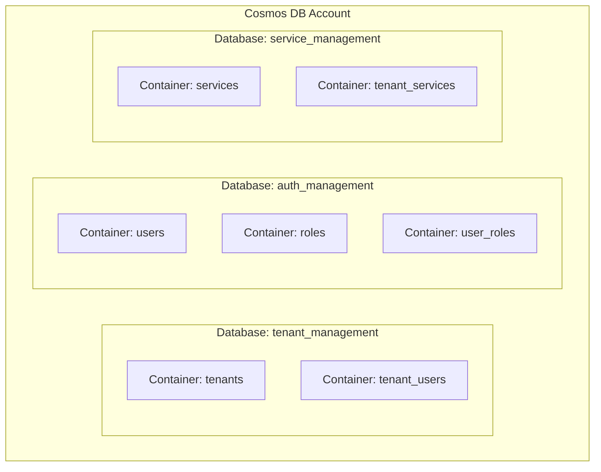
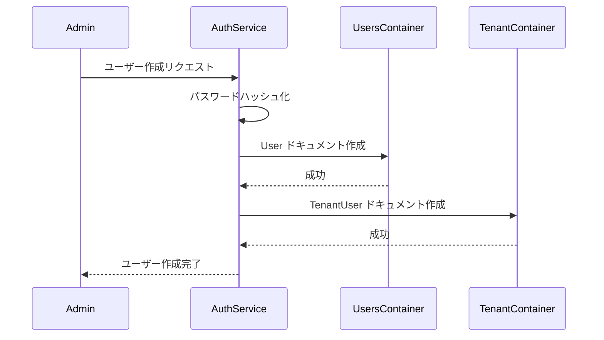
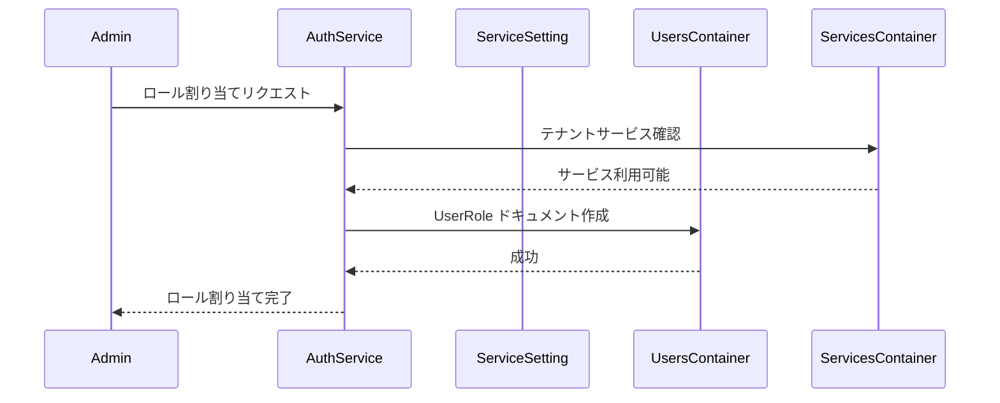
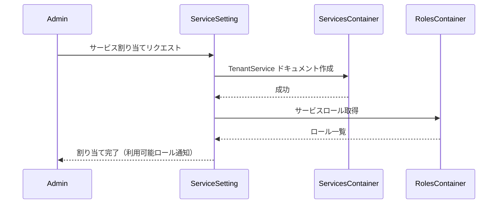

# データ設計

## ドキュメント情報

- **バージョン**: 1.0.0
- **最終更新日**: 2024年
- **ステータス**: Draft

---

## 目次

1. [データベース概要](#1-データベース概要)
2. [データモデル](#2-データモデル)
3. [コンテナ設計](#3-コンテナ設計)
4. [データフロー](#4-データフロー)
5. [データアクセスパターン](#5-データアクセスパターン)

---

## 1. データベース概要

### 1.1 データベース選択理由

**Azure Cosmos DB (NoSQL API)** を採用

**選択理由**:
- スキーマレスでPoCの柔軟な開発に適している
- マネージドサービスで運用コストが低い
- マルチテナントアーキテクチャに適したパーティショニング
- Azure環境との統合が容易

### 1.2 データベース構成



### 1.3 パフォーマンス設定

- **スループット**: 400 RU/s (手動、PoCのため最小構成)
- **整合性レベル**: Session (デフォルト)
- **インデックスポリシー**: 自動インデックス有効

---

## 2. データモデル

### 2.1 テナント管理データモデル

#### 2.1.1 Tenant (テナント)

```json
{
  "id": "tenant-uuid",
  "type": "tenant",
  "name": "株式会社サンプル",
  "domains": ["example.com", "sample.co.jp"],
  "isPrivileged": false,
  "createdAt": "2024-01-15T10:00:00Z",
  "updatedAt": "2024-01-20T15:30:00Z",
  "partitionKey": "tenant-uuid"
}
```

**フィールド説明**:

| フィールド | 型 | 必須 | 説明 |
|-----------|-----|-----|------|
| id | string | ✓ | テナントID（UUID） |
| type | string | ✓ | ドキュメントタイプ（固定値: "tenant"） |
| name | string | ✓ | テナント名 |
| domains | array | ✓ | テナントが管理するドメインのリスト |
| isPrivileged | boolean | ✓ | 特権テナントフラグ |
| createdAt | datetime | ✓ | 作成日時（ISO 8601） |
| updatedAt | datetime |   | 更新日時（ISO 8601） |
| partitionKey | string | ✓ | パーティションキー（tenant ID） |

**インデックス**:
- Primary Key: `id`
- Partition Key: `id`

**制約**:
- 特権テナント（`isPrivileged: true`）は1つのみ存在
- `name` はテナント間で一意
- `isPrivileged: true` のテナントは削除・編集不可

#### 2.1.2 TenantUser (テナント所属ユーザー)

```json
{
  "id": "tenant-user-uuid",
  "type": "tenant_user",
  "tenantId": "tenant-uuid",
  "userId": "user-uuid",
  "addedAt": "2024-01-15T10:00:00Z",
  "addedBy": "admin-user-uuid",
  "partitionKey": "tenant-uuid"
}
```

**フィールド説明**:

| フィールド | 型 | 必須 | 説明 |
|-----------|-----|-----|------|
| id | string | ✓ | 関連ID（UUID） |
| type | string | ✓ | ドキュメントタイプ（固定値: "tenant_user"） |
| tenantId | string | ✓ | テナントID |
| userId | string | ✓ | ユーザーID |
| addedAt | datetime | ✓ | 追加日時 |
| addedBy | string | ✓ | 追加実行者のユーザーID |
| partitionKey | string | ✓ | パーティションキー（tenant ID） |

**インデックス**:
- Primary Key: `id`
- Partition Key: `tenantId`
- Composite Index: `(tenantId, userId)` - 一意制約

---

### 2.2 認証認可データモデル

#### 2.2.1 User (ユーザー)

```json
{
  "id": "user-uuid",
  "type": "user",
  "userId": "user@example.com",
  "name": "山田太郎",
  "passwordHash": "$2b$12$...",
  "tenantId": "tenant-uuid",
  "isActive": true,
  "createdAt": "2024-01-15T10:00:00Z",
  "updatedAt": "2024-01-20T15:30:00Z",
  "lastLoginAt": "2024-01-25T09:00:00Z",
  "partitionKey": "user-uuid"
}
```

**フィールド説明**:

| フィールド | 型 | 必須 | 説明 |
|-----------|-----|-----|------|
| id | string | ✓ | ユーザーID（UUID） |
| type | string | ✓ | ドキュメントタイプ（固定値: "user"） |
| userId | string | ✓ | ログインID（メールアドレス形式） |
| name | string | ✓ | ユーザー名 |
| passwordHash | string | ✓ | パスワードハッシュ（bcrypt） |
| tenantId | string | ✓ | 所属テナントID |
| isActive | boolean | ✓ | アクティブフラグ |
| createdAt | datetime | ✓ | 作成日時 |
| updatedAt | datetime |   | 更新日時 |
| lastLoginAt | datetime |   | 最終ログイン日時 |
| partitionKey | string | ✓ | パーティションキー（user ID） |

**インデックス**:
- Primary Key: `id`
- Partition Key: `id`
- Unique Index: `userId`

**制約**:
- `userId` は全ユーザー間で一意
- `passwordHash` は bcrypt でハッシュ化（cost factor: 12）

#### 2.2.2 Role (ロール定義)

```json
{
  "id": "role-uuid",
  "type": "role",
  "serviceId": "service-uuid",
  "serviceName": "テナント管理サービス",
  "roleCode": "tenant_admin",
  "roleName": "管理者",
  "description": "テナントの追加・削除・編集が可能",
  "permissions": ["tenant:create", "tenant:update", "tenant:delete", "tenant:read"],
  "createdAt": "2024-01-15T10:00:00Z",
  "partitionKey": "service-uuid"
}
```

**フィールド説明**:

| フィールド | 型 | 必須 | 説明 |
|-----------|-----|-----|------|
| id | string | ✓ | ロールID（UUID） |
| type | string | ✓ | ドキュメントタイプ（固定値: "role"） |
| serviceId | string | ✓ | サービスID |
| serviceName | string | ✓ | サービス名 |
| roleCode | string | ✓ | ロールコード（システム内部で使用） |
| roleName | string | ✓ | ロール表示名 |
| description | string | ✓ | ロールの説明 |
| permissions | array | ✓ | 権限リスト |
| createdAt | datetime | ✓ | 作成日時 |
| partitionKey | string | ✓ | パーティションキー（service ID） |

**インデックス**:
- Primary Key: `id`
- Partition Key: `serviceId`
- Unique Index: `(serviceId, roleCode)`

#### 2.2.3 UserRole (ユーザーロール紐付け)

```json
{
  "id": "user-role-uuid",
  "type": "user_role",
  "userId": "user-uuid",
  "roleId": "role-uuid",
  "serviceId": "service-uuid",
  "assignedAt": "2024-01-15T10:00:00Z",
  "assignedBy": "admin-user-uuid",
  "partitionKey": "user-uuid"
}
```

**フィールド説明**:

| フィールド | 型 | 必須 | 説明 |
|-----------|-----|-----|------|
| id | string | ✓ | 紐付けID（UUID） |
| type | string | ✓ | ドキュメントタイプ（固定値: "user_role"） |
| userId | string | ✓ | ユーザーID |
| roleId | string | ✓ | ロールID |
| serviceId | string | ✓ | サービスID |
| assignedAt | datetime | ✓ | 割り当て日時 |
| assignedBy | string | ✓ | 割り当て実行者のユーザーID |
| partitionKey | string | ✓ | パーティションキー（user ID） |

**インデックス**:
- Primary Key: `id`
- Partition Key: `userId`
- Composite Index: `(userId, roleId)` - 一意制約

---

### 2.3 サービス設定データモデル

#### 2.3.1 Service (サービス定義)

```json
{
  "id": "service-uuid",
  "type": "service",
  "name": "ファイル管理サービス",
  "description": "ファイルのアップロード・管理機能を提供",
  "apiUrl": "https://api.example.com/file-management",
  "roleApiEndpoint": "/api/roles",
  "isActive": true,
  "isMock": true,
  "createdAt": "2024-01-15T10:00:00Z",
  "updatedAt": "2024-01-20T15:30:00Z",
  "partitionKey": "service-uuid"
}
```

**フィールド説明**:

| フィールド | 型 | 必須 | 説明 |
|-----------|-----|-----|------|
| id | string | ✓ | サービスID（UUID） |
| type | string | ✓ | ドキュメントタイプ（固定値: "service"） |
| name | string | ✓ | サービス名 |
| description | string | ✓ | サービスの説明 |
| apiUrl | string | ✓ | サービスのベースURL |
| roleApiEndpoint | string | ✓ | ロール情報取得APIのパス |
| isActive | boolean | ✓ | アクティブフラグ |
| isMock | boolean | ✓ | モックサービスフラグ |
| createdAt | datetime | ✓ | 作成日時 |
| updatedAt | datetime |   | 更新日時 |
| partitionKey | string | ✓ | パーティションキー（service ID） |

**インデックス**:
- Primary Key: `id`
- Partition Key: `id`

**定義済みサービス**:
1. テナント管理サービス
2. 認証認可サービス
3. 利用サービス設定サービス
4. ファイル管理サービス（Mock）
5. メッセージングサービス（Mock）
6. API利用サービス（Mock）
7. バックアップサービス（Mock）

#### 2.3.2 TenantService (テナントサービス紐付け)

```json
{
  "id": "tenant-service-uuid",
  "type": "tenant_service",
  "tenantId": "tenant-uuid",
  "serviceId": "service-uuid",
  "assignedAt": "2024-01-15T10:00:00Z",
  "assignedBy": "admin-user-uuid",
  "partitionKey": "tenant-uuid"
}
```

**フィールド説明**:

| フィールド | 型 | 必須 | 説明 |
|-----------|-----|-----|------|
| id | string | ✓ | 紐付けID（UUID） |
| type | string | ✓ | ドキュメントタイプ（固定値: "tenant_service"） |
| tenantId | string | ✓ | テナントID |
| serviceId | string | ✓ | サービスID |
| assignedAt | datetime | ✓ | 割り当て日時 |
| assignedBy | string | ✓ | 割り当て実行者のユーザーID |
| partitionKey | string | ✓ | パーティションキー（tenant ID） |

**インデックス**:
- Primary Key: `id`
- Partition Key: `tenantId`
- Composite Index: `(tenantId, serviceId)` - 一意制約

---

## 3. コンテナ設計

### 3.1 Database: tenant_management

#### Container: tenants

| 設定項目 | 値 |
|---------|-----|
| **パーティションキー** | `/id` |
| **スループット** | 400 RU/s (共有) |
| **TTL** | 無効 |

**格納ドキュメント**:
- Tenant
- TenantUser

**クエリパターン**:
```sql
-- テナント一覧取得
SELECT * FROM c WHERE c.type = 'tenant'

-- テナント詳細取得
SELECT * FROM c WHERE c.id = @tenantId AND c.type = 'tenant'

-- テナント所属ユーザー取得
SELECT * FROM c WHERE c.tenantId = @tenantId AND c.type = 'tenant_user'

-- 特権テナント取得
SELECT * FROM c WHERE c.type = 'tenant' AND c.isPrivileged = true
```

---

### 3.2 Database: auth_management

#### Container: users

| 設定項目 | 値 |
|---------|-----|
| **パーティションキー** | `/id` |
| **スループット** | 400 RU/s (共有) |
| **TTL** | 無効 |

**格納ドキュメント**:
- User
- UserRole

**クエリパターン**:
```sql
-- ユーザー一覧取得
SELECT * FROM c WHERE c.type = 'user'

-- ユーザーID検索（ログイン用）
SELECT * FROM c WHERE c.type = 'user' AND c.userId = @userId

-- ユーザーロール取得
SELECT * FROM c WHERE c.userId = @userId AND c.type = 'user_role'

-- テナント所属ユーザー取得
SELECT * FROM c WHERE c.type = 'user' AND c.tenantId = @tenantId
```

#### Container: roles

| 設定項目 | 値 |
|---------|-----|
| **パーティションキー** | `/serviceId` |
| **スループット** | 共有（400 RU/s） |
| **TTL** | 無効 |

**格納ドキュメント**:
- Role

**クエリパターン**:
```sql
-- 全ロール取得
SELECT * FROM c WHERE c.type = 'role'

-- サービス別ロール取得
SELECT * FROM c WHERE c.serviceId = @serviceId AND c.type = 'role'

-- ロールコードで検索
SELECT * FROM c WHERE c.serviceId = @serviceId AND c.roleCode = @roleCode
```

---

### 3.3 Database: service_management

#### Container: services

| 設定項目 | 値 |
|---------|-----|
| **パーティションキー** | `/id` |
| **スループット** | 400 RU/s (共有) |
| **TTL** | 無効 |

**格納ドキュメント**:
- Service
- TenantService

**クエリパターン**:
```sql
-- サービス一覧取得
SELECT * FROM c WHERE c.type = 'service'

-- アクティブサービス取得
SELECT * FROM c WHERE c.type = 'service' AND c.isActive = true

-- テナント割り当てサービス取得
SELECT * FROM c WHERE c.tenantId = @tenantId AND c.type = 'tenant_service'

-- モックサービス取得
SELECT * FROM c WHERE c.type = 'service' AND c.isMock = true
```

---

## 4. データフロー

### 4.1 ユーザー登録フロー



### 4.2 ロール割り当てフロー



### 4.3 サービス割り当てフロー



---

## 5. データアクセスパターン

### 5.1 読み取りパターン

#### パターン1: Point Read（最も効率的）

```python
# パーティションキーとIDを指定した読み取り
async def get_tenant_by_id(tenant_id: str) -> Tenant:
    container = cosmos_client.get_container("tenants")
    item = container.read_item(
        item=tenant_id,
        partition_key=tenant_id
    )
    return Tenant(**item)
```

**RUコスト**: 1 RU

#### パターン2: Query（フィルタ付き）

```python
# タイプでフィルタした全件取得
async def get_all_tenants() -> List[Tenant]:
    container = cosmos_client.get_container("tenants")
    query = "SELECT * FROM c WHERE c.type = 'tenant'"
    items = container.query_items(query=query, enable_cross_partition_query=True)
    return [Tenant(**item) for item in items]
```

**RUコスト**: データ量に依存（通常 2-5 RU）

#### パターン3: Cross-Partition Query

```python
# ユーザーIDでユーザー検索（ログイン時）
async def get_user_by_user_id(user_id: str) -> User:
    container = cosmos_client.get_container("users")
    query = "SELECT * FROM c WHERE c.type = 'user' AND c.userId = @userId"
    parameters = [{"name": "@userId", "value": user_id}]
    items = list(container.query_items(
        query=query,
        parameters=parameters,
        enable_cross_partition_query=True
    ))
    if items:
        return User(**items[0])
    return None
```

**RUコスト**: 5-10 RU（インデックス使用）

### 5.2 書き込みパターン

#### パターン1: 単一ドキュメント作成

```python
async def create_tenant(tenant: Tenant) -> Tenant:
    container = cosmos_client.get_container("tenants")
    created_item = container.create_item(body=tenant.dict())
    return Tenant(**created_item)
```

**RUコスト**: 5-10 RU

#### パターン2: 更新（Upsert）

```python
async def update_tenant(tenant: Tenant) -> Tenant:
    container = cosmos_client.get_container("tenants")
    updated_item = container.upsert_item(body=tenant.dict())
    return Tenant(**updated_item)
```

**RUコスト**: 5-15 RU

#### パターン3: 削除

```python
async def delete_tenant(tenant_id: str) -> None:
    container = cosmos_client.get_container("tenants")
    container.delete_item(item=tenant_id, partition_key=tenant_id)
```

**RUコスト**: 5 RU

### 5.3 複合クエリ

#### テナント情報とユーザー情報の統合

```python
async def get_tenant_with_users(tenant_id: str) -> TenantWithUsers:
    # 1. テナント取得（Point Read: 1 RU）
    tenant = await get_tenant_by_id(tenant_id)
    
    # 2. テナント所属ユーザー取得（Query: 2-5 RU）
    container = cosmos_client.get_container("tenants")
    query = "SELECT * FROM c WHERE c.tenantId = @tenantId AND c.type = 'tenant_user'"
    tenant_users = list(container.query_items(
        query=query,
        parameters=[{"name": "@tenantId", "value": tenant_id}],
        partition_key=tenant_id
    ))
    
    # 3. ユーザー詳細取得（各1 RU × ユーザー数）
    user_ids = [tu["userId"] for tu in tenant_users]
    users = []
    for user_id in user_ids:
        user = await get_user_by_id(user_id)
        users.append(user)
    
    return TenantWithUsers(
        **tenant.dict(),
        users=users
    )
```

**合計RUコスト**: 3-10 RU + (1 RU × ユーザー数)

---

## 6. データマイグレーション

### 6.1 初期データ投入

```python
# scripts/seed_data.py
async def seed_initial_data():
    # 1. 特権テナント作成
    privileged_tenant = Tenant(
        id="privileged-tenant-001",
        name="特権テナント",
        domains=["system.local"],
        isPrivileged=True,
        createdAt=datetime.utcnow()
    )
    await create_tenant(privileged_tenant)
    
    # 2. 全体管理者ユーザー作成
    admin_user = User(
        id="admin-user-001",
        userId="admin@system.local",
        name="システム管理者",
        passwordHash=hash_password("初期パスワード"),
        tenantId="privileged-tenant-001",
        isActive=True,
        createdAt=datetime.utcnow()
    )
    await create_user(admin_user)
    
    # 3. サービス定義作成
    services = [
        Service(id="service-001", name="テナント管理サービス", ...),
        Service(id="service-002", name="認証認可サービス", ...),
        Service(id="service-003", name="利用サービス設定サービス", ...),
        Service(id="service-004", name="ファイル管理サービス", isMock=True, ...),
        Service(id="service-005", name="メッセージングサービス", isMock=True, ...),
        Service(id="service-006", name="API利用サービス", isMock=True, ...),
        Service(id="service-007", name="バックアップサービス", isMock=True, ...),
    ]
    for service in services:
        await create_service(service)
    
    # 4. ロール定義作成
    roles = [
        Role(
            id="role-001",
            serviceId="service-001",
            serviceName="テナント管理サービス",
            roleCode="global_admin",
            roleName="全体管理者",
            description="特権テナントに対する操作が可能",
            permissions=["tenant:*"],
        ),
        # ... 他のロール定義
    ]
    for role in roles:
        await create_role(role)
```

### 6.2 データバックアップ戦略

**PoCのため簡易的な対応**:
- Cosmos DBの自動バックアップ機能を使用（追加コストなし）
- Point-in-Time Restore: 過去30日間のデータ復元可能
- 手動バックアップ: 不要（PoCのため）

---

## 7. パフォーマンス最適化

### 7.1 インデックス戦略

**自動インデックス**:
- すべてのプロパティに自動インデックス
- PoCのため、カスタムインデックスポリシーは不要

### 7.2 パーティション戦略

| コンテナ | パーティションキー | 理由 |
|---------|------------------|------|
| tenants | `/id` | テナント単位でのアクセスが多い |
| users | `/id` | ユーザー単位でのアクセスが多い |
| roles | `/serviceId` | サービス単位でのロール取得が多い |
| services | `/id` | サービス単位でのアクセスが多い |

### 7.3 クエリ最適化

**ベストプラクティス**:
1. Point Read を最優先
2. パーティションキーを指定したクエリを使用
3. SELECT * の代わりに必要なフィールドのみ指定
4. Cross-Partition Query は最小限に

**アンチパターン**:
- パーティションキーなしの全件検索
- 大量データの一括取得
- 非効率な JOIN 操作

---

## 8. セキュリティ考慮事項

### 8.1 データ暗号化

- **保存時の暗号化**: Cosmos DB標準機能で自動暗号化
- **転送時の暗号化**: TLS 1.2以上を使用

### 8.2 アクセス制御

- **接続文字列**: Azure Key Vault で管理（本番環境）
- **マネージドID**: 推奨（本番環境）
- **環境変数**: 開発環境のみ

### 8.3 機密情報の扱い

- **パスワード**: bcrypt でハッシュ化（cost factor: 12）
- **JWT秘密鍵**: 環境変数で管理
- **API キー**: Azure Key Vault で管理

---

## 9. 制約事項

### 9.1 PoCとしての制約

- レプリケーション: 単一リージョンのみ
- バックアップ: 自動バックアップのみ
- 監視: 最小限のメトリクス
- スケーリング: 手動のみ

### 9.2 データ量の想定

| データタイプ | 想定件数 | サイズ |
|------------|---------|--------|
| テナント | 100件 | ~50 KB |
| ユーザー | 1,000件 | ~500 KB |
| ロール | 50件 | ~25 KB |
| サービス | 10件 | ~5 KB |

**合計見積もり**: ~1 MB（PoCとして十分）

---

## 10. 関連ドキュメント

- [アーキテクチャ概要](../overview.md)
- [API設計](../api/api-specification.md)
- [コンポーネント設計](../components/README.md)

---

## 変更履歴

| バージョン | 日付 | 変更内容 | 作成者 |
|-----------|------|---------|-------|
| 1.0.0 | 2024 | 初版作成 | Architecture Agent |
