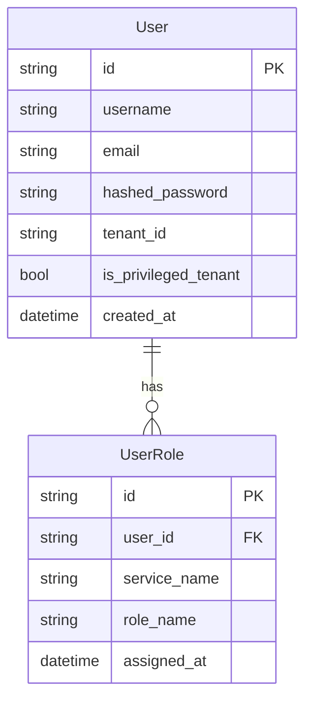
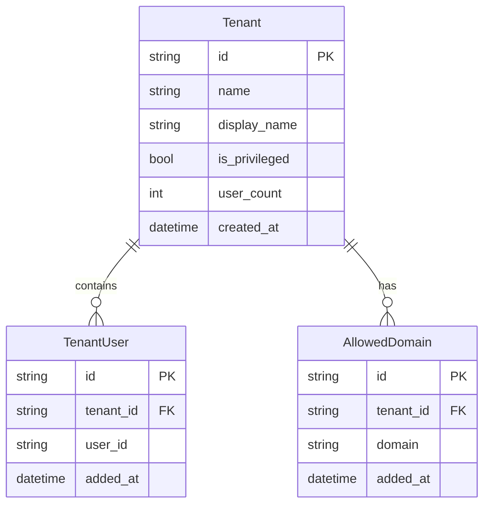
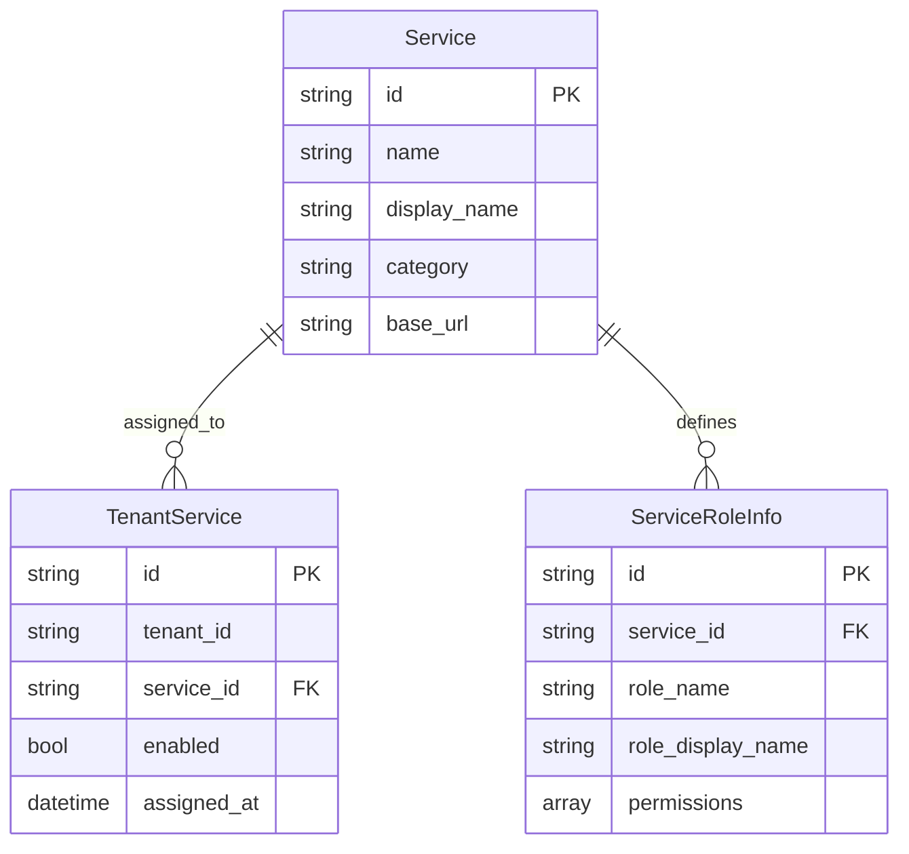

# データモデル設計

## 1. 概要

本ドキュメントは、マルチテナント管理アプリケーションのデータモデル設計を定義します。すべてのデータはAzure Cosmos DB (NoSQL API)に格納され、テナント単位でパーティション分割されます。

### 1.1 設計原則

1. **マルチテナント分離**: パーティションキーによるテナントデータの物理的分離
2. **スケーラビリティ**: パーティションキー戦略による水平スケーリング対応
3. **ポリグロットパーシステンス**: サービスごとに最適なデータ構造を選択
4. **結果整合性**: サービス間のデータ同期は結果整合性を許容
5. **監査証跡**: すべてのデータ変更履歴を記録

### 1.2 Cosmos DB設定

```yaml
API: NoSQL (旧 SQL API)
整合性レベル: Session
パーティションキー戦略: tenant_id (一部user_id)
インデックスポリシー: 自動インデックス + カスタムインデックス
TTL設定: ログデータに対して有効化
自動スケーリング: 有効（400-10000 RU/s）
```

## 2. データベース構成

### 2.1 データベース一覧

| データベース名 | 用途 | 所有サービス |
|--------------|------|------------|
| auth_db | 認証・認可データ | Auth Service |
| tenant_db | テナント管理データ | Tenant Management Service |
| service_setting_db | サービス設定データ | Service Setting Service |
| file_db | ファイル管理データ | File Service |
| messaging_db | メッセージングデータ | Messaging Service |
| api_db | API利用データ | API Service |
| backup_db | バックアップデータ | Backup Service |

### 2.2 コンテナ設計パターン

各サービスは以下のコンテナを持ちます：

```
{service}_db/
├── {service}_main       # メインエンティティ (パーティションキー: tenant_id)
├── {service}_events     # イベントログ (パーティションキー: tenant_id, TTL有効)
└── {service}_audit      # 監査ログ (パーティションキー: tenant_id, TTL有効)
```

## 3. Auth Service データモデル

### 3.1 ERD（概念）



### 3.2 Usersコンテナ

```json
{
  "id": "user-uuid",
  "type": "user",
  "username": "admin001",
  "email": "admin@example.com",
  "hashed_password": "$2b$12$...",
  "full_name": "管理者太郎",
  "tenant_id": "privileged-tenant",
  "is_active": true,
  "is_privileged_tenant": true,
  "created_at": "2026-01-01T00:00:00Z",
  "updated_at": "2026-02-01T10:00:00Z",
  "last_login": "2026-02-01T09:00:00Z",
  "partition_key": "privileged-tenant",
  "_ts": 1738406400
}
```

**インデックス:**
```json
{
  "indexingPolicy": {
    "includedPaths": [
      {"path": "/username/?"},
      {"path": "/email/?"},
      {"path": "/tenant_id/?"},
      {"path": "/is_active/?"}
    ],
    "excludedPaths": [
      {"path": "/hashed_password/?"}
    ]
  }
}
```

### 3.3 UserRolesコンテナ

```json
{
  "id": "user-uuid:tenant",
  "type": "user_role",
  "user_id": "user-uuid",
  "service_name": "tenant",
  "role_name": "全体管理者",
  "assigned_at": "2026-01-01T00:00:00Z",
  "assigned_by": "system",
  "partition_key": "user-uuid",
  "_ts": 1735689600
}
```

## 4. Tenant Management Service データモデル

### 4.1 ERD（概念）



### 4.2 Tenantsコンテナ

```json
{
  "id": "tenant-uuid",
  "type": "tenant",
  "name": "example-corp",
  "display_name": "株式会社Example",
  "description": "サンプル企業",
  "is_privileged": false,
  "status": "active",
  "user_count": 25,
  "max_users": 100,
  "allowed_domains": ["example.com"],
  "metadata": {
    "industry": "IT",
    "company_size": "medium"
  },
  "created_at": "2026-01-01T00:00:00Z",
  "updated_at": "2026-02-01T10:00:00Z",
  "created_by": "user-admin",
  "updated_by": "user-admin",
  "partition_key": "tenant-uuid",
  "_ts": 1738406400
}
```

### 4.3 TenantUsersコンテナ

```json
{
  "id": "tenant-uuid:user-uuid",
  "type": "tenant_user",
  "tenant_id": "tenant-uuid",
  "user_id": "user-uuid",
  "user_name": "yamada",
  "user_email": "yamada@example.com",
  "added_at": "2026-01-15T10:00:00Z",
  "added_by": "user-admin",
  "partition_key": "tenant-uuid",
  "_ts": 1737021600
}
```

## 5. Service Setting Service データモデル

### 5.1 ERD（概念）



### 5.2 Servicesコンテナ

```json
{
  "id": "file-service",
  "type": "service",
  "name": "file-service",
  "display_name": "ファイル管理サービス",
  "description": "ファイルアップロード、ダウンロード機能",
  "category": "business",
  "status": "active",
  "base_url": "http://file-service:8101",
  "roles_endpoint": "/api/v1/roles",
  "icon_url": "https://cdn.example.com/icons/file.svg",
  "created_at": "2026-01-01T00:00:00Z",
  "updated_at": "2026-02-01T10:00:00Z",
  "partition_key": "file-service",
  "_ts": 1738406400
}
```

### 5.3 TenantServicesコンテナ

```json
{
  "id": "tenant-uuid:file-service",
  "type": "tenant_service",
  "tenant_id": "tenant-uuid",
  "service_id": "file-service",
  "service_name": "ファイル管理サービス",
  "enabled": true,
  "assigned_at": "2026-01-15T10:00:00Z",
  "assigned_by": "user-admin",
  "partition_key": "tenant-uuid",
  "_ts": 1737021600
}
```

### 5.4 ServiceRoleInfoコンテナ

```json
{
  "id": "file-service:file_admin",
  "type": "service_role_info",
  "service_id": "file-service",
  "service_name": "ファイル管理サービス",
  "role_name": "file_admin",
  "role_display_name": "ファイル管理者",
  "description": "すべてのファイル操作が可能",
  "permissions": ["read", "write", "delete", "share", "manage"],
  "fetched_at": "2026-02-01T10:00:00Z",
  "partition_key": "file-service",
  "_ts": 1738406400
}
```

## 6. ビジネスサービス データモデル（例：File Service）

### 6.1 Filesコンテナ

```json
{
  "id": "file-uuid",
  "type": "file",
  "tenant_id": "tenant-uuid",
  "name": "document.pdf",
  "original_name": "重要資料_ver2.pdf",
  "size": 1048576,
  "mime_type": "application/pdf",
  "storage_path": "/tenants/tenant-uuid/files/file-uuid/document.pdf",
  "checksum": "a94a8fe5ccb19ba61c4c0873d391e987982fbbd3",
  "uploaded_by": "user-uuid",
  "uploaded_at": "2026-02-01T10:00:00Z",
  "updated_at": "2026-02-01T10:00:00Z",
  "status": "active",
  "is_shared": false,
  "shared_with": [],
  "tags": ["important", "2026"],
  "metadata": {
    "department": "sales",
    "project": "project-alpha"
  },
  "partition_key": "tenant-uuid",
  "_ts": 1738406400
}
```

## 7. パーティションキー戦略

### 7.1 パーティションキー選択基準

| サービス | パーティションキー | 理由 |
|---------|------------------|------|
| Auth Service | user_id | ユーザーごとのロール情報アクセスが頻繁 |
| Tenant Management | tenant_id | テナント単位での操作が主体 |
| Service Setting | tenant_id | テナントごとのサービス設定 |
| Business Services | tenant_id | テナント分離が必須 |

### 7.2 ホットパーティション対策

1. **複合パーティションキー**: 高トラフィックの場合は`{tenant_id}-{shard_id}`
2. **キャッシュ活用**: 頻繁にアクセスされるデータはRedisでキャッシュ
3. **読み取りレプリカ**: 読み取り専用レプリカの活用

## 8. インデックス戦略

### 8.1 共通インデックスポリシー

```json
{
  "indexingMode": "consistent",
  "automatic": true,
  "includedPaths": [
    {"path": "/type/?"},
    {"path": "/tenant_id/?"},
    {"path": "/created_at/?"},
    {"path": "/updated_at/?"},
    {"path": "/status/?"}
  ],
  "excludedPaths": [
    {"path": "/hashed_password/?"},
    {"path": "/api_key/?"},
    {"path": "/_etag/?"}
  ],
  "compositeIndexes": [
    [
      {"path": "/tenant_id", "order": "ascending"},
      {"path": "/created_at", "order": "descending"}
    ]
  ]
}
```

### 8.2 サービス固有インデックス

**Auth Service:**
```json
{
  "includedPaths": [
    {"path": "/username/?"},
    {"path": "/email/?"},
    {"path": "/last_login/?"}
  ]
}
```

**File Service:**
```json
{
  "includedPaths": [
    {"path": "/uploaded_by/?"},
    {"path": "/tags/*"},
    {"path": "/mime_type/?"}
  ]
}
```

## 9. TTL（Time To Live）設定

### 9.1 ログデータのTTL

```json
{
  "defaultTtl": -1,
  "ttlPropertyPath": "/ttl"
}
```

**適用例:**
```json
{
  "id": "log-uuid",
  "type": "audit_log",
  "action": "user_login",
  "user_id": "user-uuid",
  "timestamp": "2026-02-01T10:00:00Z",
  "ttl": 2592000,
  "partition_key": "tenant-uuid"
}
```

### 9.2 TTL設定一覧

| データ種別 | TTL | 理由 |
|----------|-----|------|
| 監査ログ | 90日 | コンプライアンス要件 |
| アクセスログ | 30日 | デバッグ用 |
| セッションデータ | 8時間 | JWT有効期限と同期 |
| キャッシュデータ | 1時間 | 鮮度維持 |

## 10. データマイグレーション戦略

### 10.1 バージョニング

すべてのドキュメントに`schema_version`フィールドを追加：

```json
{
  "id": "user-uuid",
  "schema_version": "1.0.0",
  "type": "user",
  ...
}
```

### 10.2 マイグレーションパターン

1. **Lazy Migration**: 読み取り時にバージョンチェックして必要に応じて更新
2. **Batch Migration**: 定期的なバッチ処理で一括更新
3. **Blue-Green**: 新バージョンのコンテナを作成して段階的に移行

## 11. バックアップ戦略

### 11.1 Cosmos DBバックアップ

- **継続的バックアップ**: 30日間のポイントインタイム復元
- **定期バックアップ**: 毎日の自動スナップショット（保持期間: 90日）

### 11.2 エクスポート戦略

重要データは定期的にAzure Blob Storageにエクスポート：

```python
# 定期エクスポートジョブ（疑似コード）
async def export_tenant_data(tenant_id: str):
    # Cosmos DBからデータ取得
    data = await cosmos_client.query_items(...)
    
    # JSON形式でエクスポート
    export_data = {
        "tenant_id": tenant_id,
        "export_date": datetime.utcnow().isoformat(),
        "data": data
    }
    
    # Blob Storageにアップロード
    await blob_client.upload(f"exports/{tenant_id}/{date}.json", export_data)
```

## 12. モニタリング指標

### 12.1 Cosmos DB メトリクス

| メトリクス | 閾値 | アクション |
|----------|------|----------|
| RU消費率 | > 80% | スケールアップ |
| P99レイテンシ | > 100ms | インデックス最適化 |
| 429エラー率 | > 1% | RU増加 |
| ストレージ使用率 | > 80% | データアーカイブ |

### 12.2 監視クエリ例

```sql
-- パーティションキー別のRU消費
SELECT 
    c.partition_key,
    COUNT(1) as request_count,
    SUM(c._ru) as total_ru
FROM c
WHERE c._ts >= @start_timestamp
GROUP BY c.partition_key
ORDER BY total_ru DESC
```

## 13. セキュリティ考慮事項

### 13.1 データ暗号化

- **保存時**: Cosmos DB自動暗号化（AES-256）
- **転送時**: TLS 1.3
- **フィールドレベル**: 機密フィールド（password, api_keyなど）は追加暗号化

### 13.2 アクセス制御

```yaml
原則: 最小権限の原則
実装:
  - サービスごとに専用の接続文字列
  - パーティションキーによる論理分離
  - RBACベースのアクセス制御
  - Key Vaultでの秘密情報管理
```

## 14. パフォーマンス最適化

### 14.1 クエリ最適化

**悪い例:**
```sql
SELECT * FROM c WHERE c.created_at > @date
```

**良い例:**
```sql
SELECT c.id, c.name, c.created_at 
FROM c 
WHERE c.tenant_id = @tenant_id 
  AND c.type = 'file'
  AND c.created_at > @date
ORDER BY c.created_at DESC
```

### 14.2 ページング

```python
# 効率的なページング実装
async def list_items(tenant_id: str, continuation_token: str = None, limit: int = 100):
    query = """
        SELECT * FROM c 
        WHERE c.tenant_id = @tenant_id 
        ORDER BY c.created_at DESC
    """
    
    options = {
        "max_item_count": limit,
        "continuation_token": continuation_token
    }
    
    result = container.query_items(
        query=query,
        parameters=[{"name": "@tenant_id", "value": tenant_id}],
        **options
    )
    
    return {
        "items": list(result),
        "continuation_token": result.response_headers.get("x-ms-continuation")
    }
```

## 15. 関連ドキュメント

- [API設計](../api/api-design.md)
- [コンポーネント設計](../components/README.md)
- [インフラストラクチャ設計](../infrastructure/infrastructure.md)
- [セキュリティ設計](../security/security-considerations.md)
