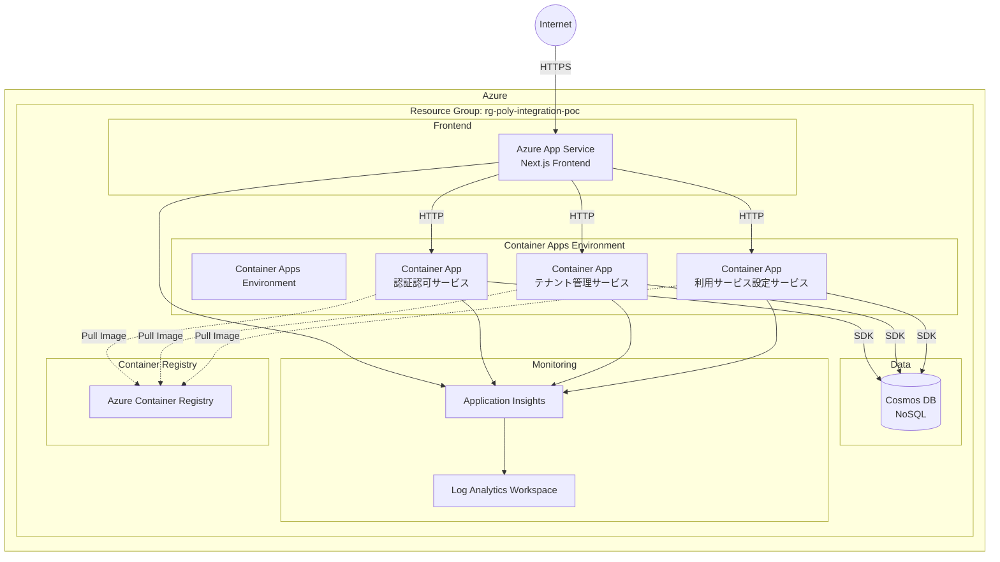
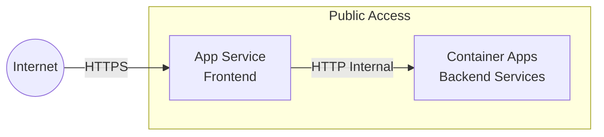
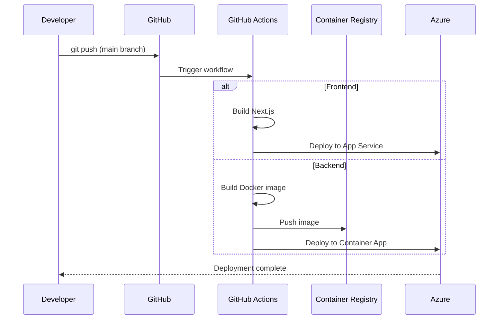

# デプロイメント設計

## ドキュメント情報

- **バージョン**: 1.0.0
- **最終更新日**: 2024年
- **ステータス**: Draft

---

## 目次

1. [インフラストラクチャ概要](#1-インフラストラクチャ概要)
2. [Azure リソース構成](#2-azure-リソース構成)
3. [ネットワーク設計](#3-ネットワーク設計)
4. [CI/CD パイプライン](#4-cicd-パイプライン)
5. [環境構成](#5-環境構成)
6. [Bicep IaC 設計](#6-bicep-iac-設計)

---

## 1. インフラストラクチャ概要

### 1.1 デプロイメント戦略

**PoCアプリケーションの方針**:

- **シンプル**: 最小限のリソース構成
- **低コスト**: 開発・検証に適したスケール
- **マネージド**: 運用負荷を最小化

**環境構成**:

- **Development**: DevContainerによるローカル開発環境（詳細: [開発環境設計](./development-environment.md)）
- **Production**: Azure上の本番環境（本ドキュメント）

### 1.2 全体アーキテクチャ



---

## 2. Azure リソース構成

### 2.1 リソース一覧

| リソース種別               | リソース名              | SKU/Tier            | 用途                       |
| -------------------------- | ----------------------- | ------------------- | -------------------------- |
| Resource Group             | rg-poly-integration-poc | -                   | リソース管理               |
| App Service Plan           | plan-poly-frontend      | B1 (Basic)          | フロントエンドホスティング |
| App Service                | app-poly-frontend       | -                   | Next.js アプリ             |
| Container Apps Environment | cae-poly-backend        | Consumption         | コンテナホスティング環境   |
| Container App              | ca-auth-service         | -                   | 認証認可サービス           |
| Container App              | ca-tenant-service       | -                   | テナント管理サービス       |
| Container App              | ca-service-setting      | -                   | サービス設定サービス       |
| Cosmos DB Account          | cosmos-poly-poc         | Standard (400 RU/s) | データベース               |
| Container Registry         | acrpolypoc              | Basic               | コンテナイメージ管理       |
| Application Insights       | appi-poly-poc           | -                   | 監視・ログ                 |
| Log Analytics Workspace    | log-poly-poc            | -                   | ログ集約                   |

### 2.2 リージョン

**プライマリリージョン**: Japan East（東日本）

**理由**:

- PoCのため単一リージョン
- 日本国内アクセスを想定
- コスト最適化

---

## 3. ネットワーク設計

### 3.1 ネットワーク構成

PoCのため、シンプルな構成を採用：



**特徴**:

- パブリックアクセス（認証必須）
- VNet統合なし（PoCのため）
- HTTPS強制

### 3.2 DNS設定

PoCのため、Azureデフォルトドメインを使用：

- **Frontend**: `https://app-poly-frontend.azurewebsites.net`
- **Container Apps**: 内部DNS（Container Apps Environment内）

### 3.3 セキュリティ

#### 3.3.1 ネットワークセキュリティ

| レイヤー           | 設定                                      |
| ------------------ | ----------------------------------------- |
| **App Service**    | HTTPS のみ許可                            |
| **Container Apps** | 内部通信は HTTP、外部からのアクセスは制限 |
| **Cosmos DB**      | パブリックアクセス（接続文字列で保護）    |

#### 3.3.2 認証・認可

- すべてのエンドポイントでJWT検証
- ロールベースアクセス制御（RBAC）

---

## 4. CI/CD パイプライン

### 4.1 GitHub Actions ワークフロー

#### 4.1.1 フロントエンド デプロイ

```yaml
# .github/workflows/deploy-frontend.yml
name: Deploy Frontend

on:
  push:
    branches:
      - main
    paths:
      - "src/front/**"
      - ".github/workflows/deploy-frontend.yml"

jobs:
  build-and-deploy:
    runs-on: ubuntu-latest

    steps:
      - name: Checkout code
        uses: actions/checkout@v3
        with:
          submodules: recursive

      - name: Setup Node.js
        uses: actions/setup-node@v3
        with:
          node-version: "18"

      - name: Install dependencies
        working-directory: ./src/front
        run: npm ci

      - name: Build Next.js app
        working-directory: ./src/front
        run: npm run build

      - name: Deploy to Azure App Service
        uses: azure/webapps-deploy@v2
        with:
          app-name: "app-poly-frontend"
          publish-profile: ${{ secrets.AZURE_WEBAPP_PUBLISH_PROFILE }}
          package: ./src/front
```

#### 4.1.2 バックエンドサービス デプロイ

```yaml
# .github/workflows/deploy-auth-service.yml
name: Deploy Auth Service

on:
  push:
    branches:
      - main
    paths:
      - "src/auth-service/**"
      - ".github/workflows/deploy-auth-service.yml"

jobs:
  build-and-deploy:
    runs-on: ubuntu-latest

    steps:
      - name: Checkout code
        uses: actions/checkout@v3
        with:
          submodules: recursive

      - name: Login to Azure Container Registry
        uses: docker/login-action@v2
        with:
          registry: acrpolypoc.azurecr.io
          username: ${{ secrets.ACR_USERNAME }}
          password: ${{ secrets.ACR_PASSWORD }}

      - name: Build and push Docker image
        working-directory: ./src/auth-service
        run: |
          docker build -t acrpolypoc.azurecr.io/auth-service:${{ github.sha }} .
          docker push acrpolypoc.azurecr.io/auth-service:${{ github.sha }}

      - name: Deploy to Container App
        uses: azure/container-apps-deploy-action@v1
        with:
          containerAppName: ca-auth-service
          resourceGroup: rg-poly-integration-poc
          imageToDeploy: acrpolypoc.azurecr.io/auth-service:${{ github.sha }}
```

### 4.2 デプロイフロー



---

## 5. 環境構成

### 5.1 環境変数管理

#### 5.1.1 App Service (Frontend)

```bash
# Azure App Service Configuration
NODE_ENV=production
NEXT_PUBLIC_AUTH_SERVICE_URL=http://ca-auth-service.internal
NEXT_PUBLIC_TENANT_SERVICE_URL=http://ca-tenant-service.internal
NEXT_PUBLIC_SERVICE_SETTING_URL=http://ca-service-setting.internal
JWT_SECRET=<KeyVault参照またはシークレット>
```

#### 5.1.2 Container Apps (Backend Services)

**認証認可サービス**:

```bash
SERVICE_NAME=auth-service
PORT=8001
COSMOS_DB_ENDPOINT=https://cosmos-poly-poc.documents.azure.com:443/
COSMOS_DB_KEY=<KeyVault参照>
COSMOS_DB_DATABASE=auth_management
JWT_SECRET=<KeyVault参照>
JWT_ALGORITHM=HS256
JWT_EXPIRATION_HOURS=24
```

**テナント管理サービス**:

```bash
SERVICE_NAME=tenant-management-service
PORT=8002
COSMOS_DB_ENDPOINT=https://cosmos-poly-poc.documents.azure.com:443/
COSMOS_DB_KEY=<KeyVault参照>
COSMOS_DB_DATABASE=tenant_management
```

**利用サービス設定サービス**:

```bash
SERVICE_NAME=service-setting-service
PORT=8003
COSMOS_DB_ENDPOINT=https://cosmos-poly-poc.documents.azure.com:443/
COSMOS_DB_KEY=<KeyVault参照>
COSMOS_DB_DATABASE=service_management
```

### 5.2 シークレット管理

**PoCでの方針**:

- 環境変数で管理（Azure Portal または Bicep で設定）
- 本番運用では Azure Key Vault 推奨

---

## 6. Bicep IaC 設計

### 6.1 ディレクトリ構造

```
infra/                                        # 統合リポジトリ（共有リソース）
├── main.bicep                                # メインテンプレート（オーケストレーション）
├── modules/
│   ├── container-apps-env.bicep              # Container Apps Environment（共有）
│   ├── cosmos-db.bicep                       # Cosmos DB（共有）
│   ├── container-registry.bicep              # ACR（共有）
│   ├── monitoring.bicep                      # Log Analytics + App Insights（共有）
│   └── key-vault.bicep                       # Key Vault（共有）
├── parameters/
│   ├── dev.bicepparam                        # Dev環境パラメータ
│   ├── staging.bicepparam                    # Staging環境パラメータ
│   └── production.bicepparam                 # Production環境パラメータ
└── scripts/

src/auth-service/infra/                       # 認証認可サービス固有
└── container-app.bicep

src/tenant-management-service/infra/          # テナント管理サービス固有
└── container-app.bicep

src/service-setting-service/infra/            # 利用サービス設定サービス固有
└── container-app.bicep

src/front/infra/                              # フロントエンド固有
├── app-service-plan.bicep
└── app-service.bicep
```

> **設計方針**: 共有リソース（CosmosDB, ACR, Monitoring, Key Vault, Container Apps Environment）は統合リポジトリで管理し、各サービス固有のコンピューティングリソース（Container App, App Service）は各サービスリポジトリの `infra/` に配置。`main.bicep` が両方を参照してオーケストレーションします。

### 6.2 main.bicep

```bicep
targetScope = 'subscription'

@description('Environment name (dev, prod)')
param environmentName string = 'dev'

@description('Primary location for resources')
param location string = 'japaneast'

@description('Resource name prefix')
param resourcePrefix string = 'poly-integration'

// Resource Group
resource rg 'Microsoft.Resources/resourceGroups@2021-04-01' = {
  name: 'rg-${resourcePrefix}-${environmentName}'
  location: location
}

// Monitoring
module monitoring 'modules/monitoring.bicep' = {
  scope: rg
  name: 'monitoring-deployment'
  params: {
    location: location
    environmentName: environmentName
    resourcePrefix: resourcePrefix
  }
}

// Container Registry
module acr 'modules/container-registry.bicep' = {
  scope: rg
  name: 'acr-deployment'
  params: {
    location: location
    environmentName: environmentName
    resourcePrefix: resourcePrefix
  }
}

// Cosmos DB
module cosmosDb 'modules/cosmos-db.bicep' = {
  scope: rg
  name: 'cosmos-deployment'
  params: {
    location: location
    environmentName: environmentName
    resourcePrefix: resourcePrefix
  }
}

// Container Apps Environment and Apps
module containerApps 'modules/container-apps.bicep' = {
  scope: rg
  name: 'container-apps-deployment'
  params: {
    location: location
    environmentName: environmentName
    resourcePrefix: resourcePrefix
    cosmosDbEndpoint: cosmosDb.outputs.endpoint
    cosmosDbKey: cosmosDb.outputs.primaryKey
    appInsightsConnectionString: monitoring.outputs.connectionString
    containerRegistryServer: acr.outputs.loginServer
  }
}

// App Service for Frontend
module appService 'modules/app-service.bicep' = {
  scope: rg
  name: 'app-service-deployment'
  params: {
    location: location
    environmentName: environmentName
    resourcePrefix: resourcePrefix
    appInsightsConnectionString: monitoring.outputs.connectionString
    authServiceUrl: containerApps.outputs.authServiceUrl
    tenantServiceUrl: containerApps.outputs.tenantServiceUrl
    serviceSettingUrl: containerApps.outputs.serviceSettingUrl
  }
}

output frontendUrl string = appService.outputs.defaultHostname
output containerAppsUrls object = containerApps.outputs.serviceUrls
```

### 6.3 modules/cosmos-db.bicep

```bicep
@description('Location for resources')
param location string

@description('Environment name')
param environmentName string

@description('Resource prefix')
param resourcePrefix string

var accountName = 'cosmos-${resourcePrefix}-${environmentName}'

resource cosmosAccount 'Microsoft.DocumentDB/databaseAccounts@2023-04-15' = {
  name: accountName
  location: location
  kind: 'GlobalDocumentDB'
  properties: {
    databaseAccountOfferType: 'Standard'
    consistencyPolicy: {
      defaultConsistencyLevel: 'Session'
    }
    locations: [
      {
        locationName: location
        failoverPriority: 0
        isZoneRedundant: false
      }
    ]
    capabilities: [
      {
        name: 'EnableServerless'
      }
    ]
  }
}

// Databases
resource authDatabase 'Microsoft.DocumentDB/databaseAccounts/sqlDatabases@2023-04-15' = {
  parent: cosmosAccount
  name: 'auth_management'
  properties: {
    resource: {
      id: 'auth_management'
    }
  }
}

resource tenantDatabase 'Microsoft.DocumentDB/databaseAccounts/sqlDatabases@2023-04-15' = {
  parent: cosmosAccount
  name: 'tenant_management'
  properties: {
    resource: {
      id: 'tenant_management'
    }
  }
}

resource serviceDatabase 'Microsoft.DocumentDB/databaseAccounts/sqlDatabases@2023-04-15' = {
  parent: cosmosAccount
  name: 'service_management'
  properties: {
    resource: {
      id: 'service_management'
    }
  }
}

// Containers
resource usersContainer 'Microsoft.DocumentDB/databaseAccounts/sqlDatabases/containers@2023-04-15' = {
  parent: authDatabase
  name: 'users'
  properties: {
    resource: {
      id: 'users'
      partitionKey: {
        paths: ['/id']
        kind: 'Hash'
      }
      indexingPolicy: {
        automatic: true
        indexingMode: 'consistent'
      }
    }
  }
}

resource rolesContainer 'Microsoft.DocumentDB/databaseAccounts/sqlDatabases/containers@2023-04-15' = {
  parent: authDatabase
  name: 'roles'
  properties: {
    resource: {
      id: 'roles'
      partitionKey: {
        paths: ['/serviceId']
        kind: 'Hash'
      }
    }
  }
}

resource tenantsContainer 'Microsoft.DocumentDB/databaseAccounts/sqlDatabases/containers@2023-04-15' = {
  parent: tenantDatabase
  name: 'tenants'
  properties: {
    resource: {
      id: 'tenants'
      partitionKey: {
        paths: ['/id']
        kind: 'Hash'
      }
    }
  }
}

resource servicesContainer 'Microsoft.DocumentDB/databaseAccounts/sqlDatabases/containers@2023-04-15' = {
  parent: serviceDatabase
  name: 'services'
  properties: {
    resource: {
      id: 'services'
      partitionKey: {
        paths: ['/id']
        kind: 'Hash'
      }
    }
  }
}

output endpoint string = cosmosAccount.properties.documentEndpoint
output primaryKey string = cosmosAccount.listKeys().primaryMasterKey
```

### 6.4 modules/container-apps.bicep

```bicep
@description('Location for resources')
param location string

@description('Environment name')
param environmentName string

@description('Resource prefix')
param resourcePrefix string

@description('Cosmos DB Endpoint')
param cosmosDbEndpoint string

@secure()
@description('Cosmos DB Key')
param cosmosDbKey string

@description('App Insights Connection String')
param appInsightsConnectionString string

@description('Container Registry Server')
param containerRegistryServer string

// Container Apps Environment
resource containerAppsEnv 'Microsoft.App/managedEnvironments@2023-05-01' = {
  name: 'cae-${resourcePrefix}-${environmentName}'
  location: location
  properties: {
    appLogsConfiguration: {
      destination: 'log-analytics'
      logAnalyticsConfiguration: {
        customerId: reference(logAnalyticsWorkspace.id, '2021-06-01').customerId
        sharedKey: listKeys(logAnalyticsWorkspace.id, '2021-06-01').primarySharedKey
      }
    }
  }
}

// Auth Service Container App
resource authServiceApp 'Microsoft.App/containerApps@2023-05-01' = {
  name: 'ca-auth-service'
  location: location
  properties: {
    managedEnvironmentId: containerAppsEnv.id
    configuration: {
      ingress: {
        external: true
        targetPort: 8001
      }
      registries: [
        {
          server: containerRegistryServer
          identity: 'system'
        }
      ]
    }
    template: {
      containers: [
        {
          name: 'auth-service'
          image: '${containerRegistryServer}/auth-service:latest'
          env: [
            {
              name: 'COSMOS_DB_ENDPOINT'
              value: cosmosDbEndpoint
            }
            {
              name: 'COSMOS_DB_KEY'
              secretRef: 'cosmos-key'
            }
            {
              name: 'COSMOS_DB_DATABASE'
              value: 'auth_management'
            }
            {
              name: 'APPLICATIONINSIGHTS_CONNECTION_STRING'
              value: appInsightsConnectionString
            }
          ]
          resources: {
            cpu: json('0.25')
            memory: '0.5Gi'
          }
        }
      ]
      scale: {
        minReplicas: 1
        maxReplicas: 3
      }
    }
  }
}

// Tenant Service Container App
resource tenantServiceApp 'Microsoft.App/containerApps@2023-05-01' = {
  name: 'ca-tenant-service'
  location: location
  properties: {
    managedEnvironmentId: containerAppsEnv.id
    configuration: {
      ingress: {
        external: true
        targetPort: 8002
      }
    }
    template: {
      containers: [
        {
          name: 'tenant-service'
          image: '${containerRegistryServer}/tenant-service:latest'
          env: [
            {
              name: 'COSMOS_DB_ENDPOINT'
              value: cosmosDbEndpoint
            }
            {
              name: 'COSMOS_DB_KEY'
              secretRef: 'cosmos-key'
            }
            {
              name: 'COSMOS_DB_DATABASE'
              value: 'tenant_management'
            }
          ]
          resources: {
            cpu: json('0.25')
            memory: '0.5Gi'
          }
        }
      ]
    }
  }
}

// Service Setting Container App
resource serviceSettingApp 'Microsoft.App/containerApps@2023-05-01' = {
  name: 'ca-service-setting'
  location: location
  properties: {
    managedEnvironmentId: containerAppsEnv.id
    configuration: {
      ingress: {
        external: true
        targetPort: 8003
      }
    }
    template: {
      containers: [
        {
          name: 'service-setting'
          image: '${containerRegistryServer}/service-setting:latest'
          env: [
            {
              name: 'COSMOS_DB_ENDPOINT'
              value: cosmosDbEndpoint
            }
            {
              name: 'COSMOS_DB_KEY'
              secretRef: 'cosmos-key'
            }
            {
              name: 'COSMOS_DB_DATABASE'
              value: 'service_management'
            }
          ]
          resources: {
            cpu: json('0.25')
            memory: '0.5Gi'
          }
        }
      ]
    }
  }
}

output authServiceUrl string = authServiceApp.properties.configuration.ingress.fqdn
output tenantServiceUrl string = tenantServiceApp.properties.configuration.ingress.fqdn
output serviceSettingUrl string = serviceSettingApp.properties.configuration.ingress.fqdn
output serviceUrls object = {
  authService: authServiceApp.properties.configuration.ingress.fqdn
  tenantService: tenantServiceApp.properties.configuration.ingress.fqdn
  serviceSetting: serviceSettingApp.properties.configuration.ingress.fqdn
}
```

### 6.5 デプロイコマンド

```bash
# リソースグループとリソースのデプロイ
az deployment sub create \
  --location japaneast \
  --template-file infra/main.bicep \
  --parameters infra/parameters/dev.parameters.json

# 特定のモジュールのみデプロイ（例：Cosmos DB）
az deployment group create \
  --resource-group rg-poly-integration-dev \
  --template-file infra/modules/cosmos-db.bicep \
  --parameters location=japaneast environmentName=dev resourcePrefix=poly-integration
```

---

## 7. 運用管理

### 7.1 監視

**Application Insights**で以下を監視：

- APIレスポンスタイム
- エラーレート
- 依存関係の失敗
- カスタムメトリクス

### 7.2 ログ管理

- **App Service**: 標準出力・標準エラー
- **Container Apps**: コンテナログ
- **Cosmos DB**: 診断ログ

### 7.3 アラート（オプション）

PoCのため未設定だが、本番では推奨：

- HTTPエラー率 > 5%
- レスポンスタイム > 3秒
- Cosmos DB RU消費率 > 80%

---

## 8. コスト見積もり

### 8.1 月額コスト概算（Japan East）

| リソース             | SKU/構成              | 月額概算         |
| -------------------- | --------------------- | ---------------- |
| App Service          | B1 (1 instance)       | ¥1,800           |
| Container Apps       | 0.25 vCPU × 3 apps    | ¥3,000           |
| Cosmos DB            | Serverless (最小使用) | ¥2,000           |
| Container Registry   | Basic                 | ¥600             |
| Application Insights | 最小使用              | ¥500             |
| **合計**             |                       | **約 ¥7,900/月** |

※ 2024年1月時点の概算。実際のコストは使用量により変動します。

---

## 9. スケーリング戦略

### 9.1 PoCでの設定

- **App Service**: 1インスタンス固定
- **Container Apps**: 1-3インスタンス（CPU使用率ベース）
- **Cosmos DB**: Serverless（自動スケール）

### 9.2 将来的な拡張

本番運用時の推奨：

- オートスケール設定
- マルチリージョン展開
- CDNの導入

---

## 10. セキュリティベストプラクティス

### 10.1 実装済み

- HTTPS強制
- JWT認証
- 環境変数での機密情報管理

### 10.2 将来推奨

- Azure Key Vault統合
- VNet統合
- Private Endpoint
- Azure AD統合

---

## 11. 関連ドキュメント

- [アーキテクチャ概要](./overview.md)
- [開発環境設計](./development-environment.md)
- [コンポーネント設計](./components/README.md)
- [データ設計](./data/data-model.md)

---

## 変更履歴

| バージョン | 日付 | 変更内容               | 作成者             |
| ---------- | ---- | ---------------------- | ------------------ |
| 1.0.1      | 2024 | 開発環境へのリンク追加 | Architecture Agent |
| 1.0.0      | 2024 | 初版作成               | Architecture Agent |
