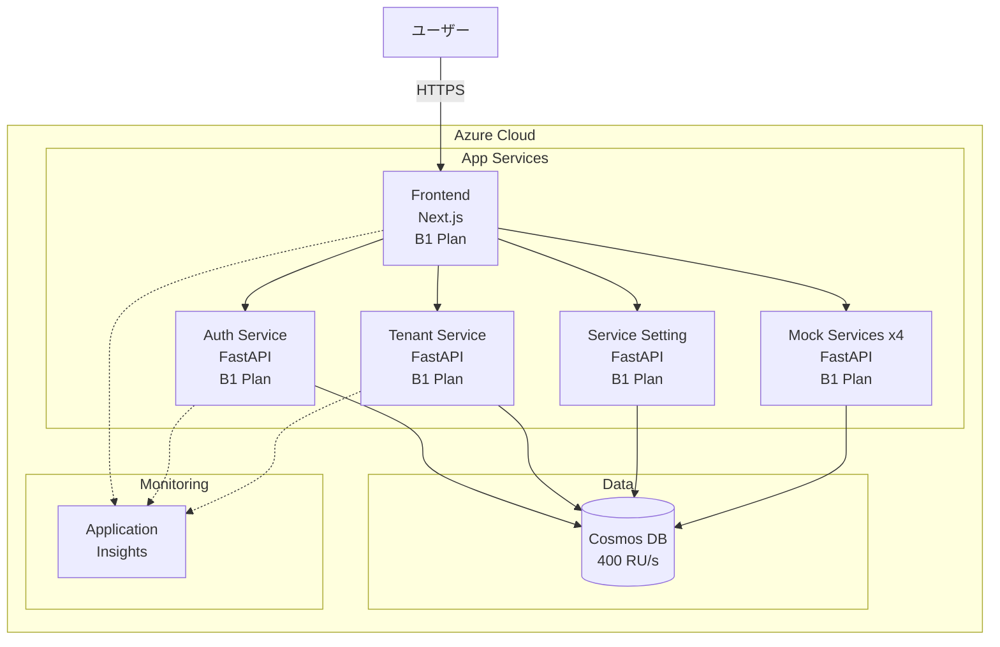
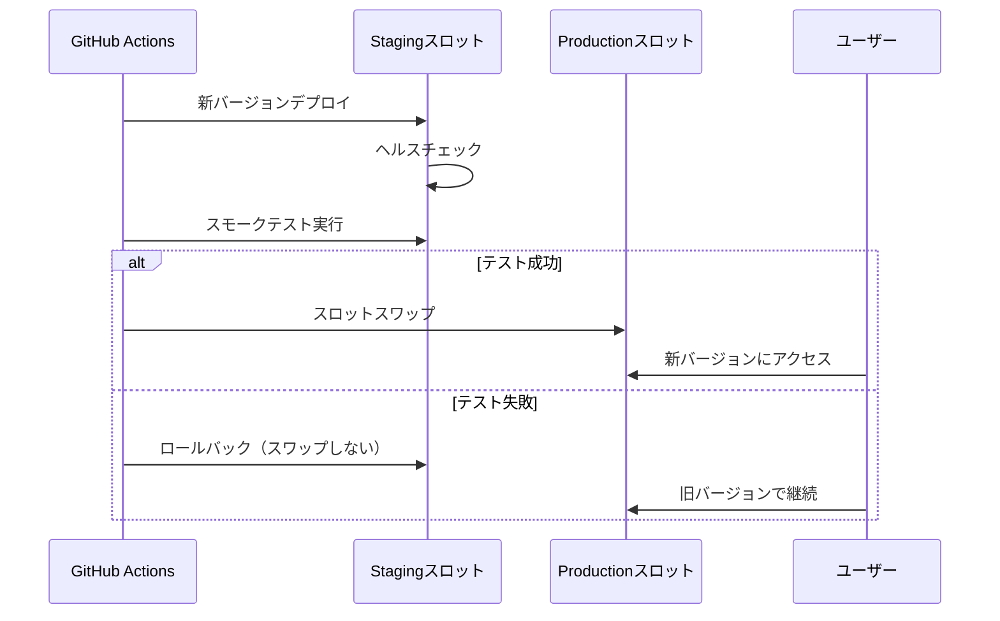

# デプロイメント設計

## ドキュメント情報
- バージョン: 1.0.0
- 最終更新日: 2026-02-01
- 関連: [システムアーキテクチャ概要](../overview.md)

## 1. デプロイメント概要

### 1.1 インフラストラクチャ
本システムは、Azure PaaSサービスを活用した最小コスト構成で構築されます。



### 1.2 環境構成

| 環境 | 用途 | Azure リソースグループ |
|-----|------|-------------------|
| Development | ローカル開発 | DevContainer |
| Staging | 検証・テスト | rg-management-app-staging |
| Production | 本番運用 | rg-management-app-production |

## 2. Azureリソース構成

### 2.1 リソース一覧

#### 2.1.1 本番環境リソース

| リソース名 | 種類 | SKU/プラン | 月額概算 (USD) |
|----------|------|-----------|--------------|
| app-frontend-prod | App Service | B1 | $13 |
| app-auth-prod | App Service | B1 | $13 |
| app-tenant-prod | App Service | B1 | $13 |
| app-service-setting-prod | App Service | B1 | $13 |
| app-file-service-prod | App Service | B1 | $13 |
| cosmos-management-app-prod | Cosmos DB | 400 RU/s 自動スケール | $24 |
| appi-management-app-prod | Application Insights | Basic | $5 |
| **合計** | | | **$94** |

**コスト削減オプション**:
- 複数のApp Serviceを1つのApp Service Planで共有可能（最大$26まで削減可能）
- Cosmos DBの自動スケール設定で未使用時は最小RUに縮小

### 2.2 Bicepテンプレート構成

```
infra/
├── main.bicep                  # エントリポイント
├── parameters/
│   ├── dev.bicepparam         # 開発環境パラメータ
│   ├── staging.bicepparam     # ステージング環境パラメータ
│   └── production.bicepparam  # 本番環境パラメータ
├── modules/
│   ├── app-service.bicep      # App Service モジュール
│   ├── cosmos-db.bicep        # Cosmos DB モジュール
│   ├── app-insights.bicep     # Application Insights モジュール
│   └── networking.bicep       # ネットワーク設定
└── scripts/
    ├── deploy.sh              # デプロイスクリプト
    └── destroy.sh             # リソース削除スクリプト
```

### 2.3 主要Bicepテンプレート

#### 2.3.1 main.bicep
```bicep
targetScope = 'subscription'

@description('環境名 (dev, staging, production)')
param environment string

@description('リージョン')
param location string = 'japaneast'

@description('共通タグ')
param tags object = {
  Environment: environment
  Project: 'ManagementApp'
  ManagedBy: 'Bicep'
}

// リソースグループ作成
resource rg 'Microsoft.Resources/resourceGroups@2021-04-01' = {
  name: 'rg-management-app-${environment}'
  location: location
  tags: tags
}

// App Service Plan
module appServicePlan 'modules/app-service-plan.bicep' = {
  scope: rg
  name: 'appServicePlan'
  params: {
    name: 'plan-management-app-${environment}'
    location: location
    sku: {
      name: 'B1'
      tier: 'Basic'
      capacity: 1
    }
    tags: tags
  }
}

// Frontend App Service
module frontendApp 'modules/app-service.bicep' = {
  scope: rg
  name: 'frontendApp'
  params: {
    name: 'app-frontend-${environment}'
    location: location
    planId: appServicePlan.outputs.id
    runtime: 'node'
    runtimeVersion: '20-lts'
    tags: tags
  }
}

// Auth Service App Service
module authServiceApp 'modules/app-service.bicep' = {
  scope: rg
  name: 'authServiceApp'
  params: {
    name: 'app-auth-${environment}'
    location: location
    planId: appServicePlan.outputs.id
    runtime: 'python'
    runtimeVersion: '3.11'
    tags: tags
  }
}

// Cosmos DB
module cosmosDb 'modules/cosmos-db.bicep' = {
  scope: rg
  name: 'cosmosDb'
  params: {
    name: 'cosmos-management-app-${environment}'
    location: location
    databaseName: 'management-app'
    containers: [
      { name: 'auth', partitionKey: '/tenantId' }
      { name: 'tenant', partitionKey: '/tenantId' }
      { name: 'service-setting', partitionKey: '/tenantId' }
      { name: 'file-service', partitionKey: '/tenantId' }
      { name: 'messaging-service', partitionKey: '/tenantId' }
      { name: 'api-service', partitionKey: '/tenantId' }
      { name: 'backup-service', partitionKey: '/tenantId' }
    ]
    tags: tags
  }
}

// Application Insights
module appInsights 'modules/app-insights.bicep' = {
  scope: rg
  name: 'appInsights'
  params: {
    name: 'appi-management-app-${environment}'
    location: location
    tags: tags
  }
}

output resourceGroupName string = rg.name
output cosmosDbConnectionString string = cosmosDb.outputs.connectionString
output appInsightsInstrumentationKey string = appInsights.outputs.instrumentationKey
```

#### 2.3.2 modules/app-service.bicep
```bicep
@description('App Service名')
param name string

@description('リージョン')
param location string

@description('App Service PlanのID')
param planId string

@description('ランタイム (node, python)')
param runtime string

@description('ランタイムバージョン')
param runtimeVersion string

@description('タグ')
param tags object

resource appService 'Microsoft.Web/sites@2022-03-01' = {
  name: name
  location: location
  tags: tags
  properties: {
    serverFarmId: planId
    httpsOnly: true
    siteConfig: {
      alwaysOn: true
      http20Enabled: true
      minTlsVersion: '1.2'
      ftpsState: 'Disabled'
      
      // Python設定
      linuxFxVersion: runtime == 'python' ? 'PYTHON|${runtimeVersion}' : null
      
      // Node.js設定
      nodeVersion: runtime == 'node' ? runtimeVersion : null
      
      appSettings: [
        {
          name: 'WEBSITE_RUN_FROM_PACKAGE'
          value: '1'
        }
      ]
    }
  }
}

output id string = appService.id
output name string = appService.name
output defaultHostName string = appService.properties.defaultHostName
```

#### 2.3.3 modules/cosmos-db.bicep
```bicep
@description('Cosmos DBアカウント名')
param name string

@description('リージョン')
param location string

@description('データベース名')
param databaseName string

@description('コンテナ定義')
param containers array

@description('タグ')
param tags object

resource cosmosAccount 'Microsoft.DocumentDB/databaseAccounts@2023-04-15' = {
  name: name
  location: location
  tags: tags
  kind: 'GlobalDocumentDB'
  properties: {
    databaseAccountOfferType: 'Standard'
    consistencyPolicy: {
      defaultConsistencyLevel: 'Session'
    }
    locations: [
      {
        locationName: location
        failoverPriority: 0
        isZoneRedundant: false
      }
    ]
    capabilities: [
      {
        name: 'EnableServerless'  // サーバーレスモード
      }
    ]
    backupPolicy: {
      type: 'Continuous'
      continuousModeProperties: {
        tier: 'Continuous30Days'
      }
    }
  }
}

resource database 'Microsoft.DocumentDB/databaseAccounts/sqlDatabases@2023-04-15' = {
  parent: cosmosAccount
  name: databaseName
  properties: {
    resource: {
      id: databaseName
    }
  }
}

resource containerResources 'Microsoft.DocumentDB/databaseAccounts/sqlDatabases/containers@2023-04-15' = [for container in containers: {
  parent: database
  name: container.name
  properties: {
    resource: {
      id: container.name
      partitionKey: {
        paths: [
          container.partitionKey
        ]
        kind: 'Hash'
      }
      indexingPolicy: {
        indexingMode: 'consistent'
        automatic: true
        includedPaths: [
          {
            path: '/*'
          }
        ]
      }
    }
    options: {
      autoscaleSettings: {
        maxThroughput: 4000
      }
    }
  }
}]

output id string = cosmosAccount.id
output name string = cosmosAccount.name
output connectionString string = cosmosAccount.listConnectionStrings().connectionStrings[0].connectionString
```

## 3. CI/CDパイプライン

### 3.1 GitHub Actions ワークフロー構成

```
.github/
└── workflows/
    ├── ci.yml                    # CI（テスト、リント）
    ├── deploy-frontend.yml       # Frontendデプロイ
    ├── deploy-backend.yml        # Backendサービスデプロイ
    ├── deploy-infra.yml          # インフラデプロイ
    └── security-scan.yml         # セキュリティスキャン
```

### 3.2 CI パイプライン

#### 3.2.1 .github/workflows/ci.yml
```yaml
name: CI

on:
  pull_request:
    branches: [main, develop]
  push:
    branches: [main, develop]

jobs:
  lint-and-test-frontend:
    runs-on: ubuntu-latest
    defaults:
      run:
        working-directory: ./src/front
    
    steps:
      - uses: actions/checkout@v4
      
      - name: Setup Node.js
        uses: actions/setup-node@v4
        with:
          node-version: '20'
          cache: 'npm'
          cache-dependency-path: ./src/front/package-lock.json
      
      - name: Install dependencies
        run: npm ci
      
      - name: Lint
        run: npm run lint
      
      - name: Type check
        run: npm run type-check
      
      - name: Test
        run: npm run test
      
      - name: Build
        run: npm run build

  lint-and-test-backend:
    runs-on: ubuntu-latest
    strategy:
      matrix:
        service: [auth-service, tenant-management-service, service-setting-service]
    
    defaults:
      run:
        working-directory: ./src/${{ matrix.service }}
    
    steps:
      - uses: actions/checkout@v4
      
      - name: Setup Python
        uses: actions/setup-python@v5
        with:
          python-version: '3.11'
      
      - name: Install dependencies
        run: |
          python -m pip install --upgrade pip
          pip install -r requirements.txt
          pip install -r requirements-dev.txt
      
      - name: Lint with ruff
        run: ruff check .
      
      - name: Type check with mypy
        run: mypy app/
      
      - name: Test with pytest
        run: pytest tests/ --cov=app --cov-report=xml
      
      - name: Upload coverage
        uses: codecov/codecov-action@v3
        with:
          file: ./coverage.xml
```

### 3.3 インフラデプロイパイプライン

#### 3.3.1 .github/workflows/deploy-infra.yml
```yaml
name: Deploy Infrastructure

on:
  push:
    branches: [main]
    paths:
      - 'infra/**'
  workflow_dispatch:
    inputs:
      environment:
        description: 'Environment to deploy'
        required: true
        type: choice
        options:
          - staging
          - production

jobs:
  deploy:
    runs-on: ubuntu-latest
    environment: ${{ github.event.inputs.environment || 'staging' }}
    
    steps:
      - uses: actions/checkout@v4
      
      - name: Azure Login
        uses: azure/login@v1
        with:
          creds: ${{ secrets.AZURE_CREDENTIALS }}
      
      - name: Deploy Bicep
        uses: azure/arm-deploy@v1
        with:
          subscriptionId: ${{ secrets.AZURE_SUBSCRIPTION_ID }}
          scope: subscription
          template: ./infra/main.bicep
          parameters: ./infra/parameters/${{ github.event.inputs.environment || 'staging' }}.bicepparam
          failOnStdErr: false
          deploymentName: 'infra-${{ github.run_number }}'
      
      - name: Get outputs
        id: bicep-outputs
        run: |
          az deployment sub show \
            --name infra-${{ github.run_number }} \
            --query 'properties.outputs' \
            --output json > outputs.json
          cat outputs.json
```

### 3.4 アプリケーションデプロイパイプライン

#### 3.4.1 .github/workflows/deploy-backend.yml
```yaml
name: Deploy Backend Services

on:
  push:
    branches: [main]
    paths:
      - 'src/auth-service/**'
      - 'src/tenant-management-service/**'
      - 'src/service-setting-service/**'
  workflow_dispatch:
    inputs:
      environment:
        description: 'Environment'
        required: true
        type: choice
        options:
          - staging
          - production
      service:
        description: 'Service to deploy'
        required: true
        type: choice
        options:
          - auth-service
          - tenant-management-service
          - service-setting-service
          - all

jobs:
  deploy:
    runs-on: ubuntu-latest
    environment: ${{ github.event.inputs.environment || 'staging' }}
    strategy:
      matrix:
        service: ${{ github.event.inputs.service == 'all' && fromJson('["auth-service", "tenant-management-service", "service-setting-service"]') || fromJson(format('["{0}"]', github.event.inputs.service)) }}
    
    steps:
      - uses: actions/checkout@v4
        with:
          submodules: true
      
      - name: Setup Python
        uses: actions/setup-python@v5
        with:
          python-version: '3.11'
      
      - name: Build application
        working-directory: ./src/${{ matrix.service }}
        run: |
          python -m pip install --upgrade pip
          pip install -r requirements.txt
          # 依存関係を含めたzipパッケージ作成
          pip install -t .python_packages/lib/site-packages -r requirements.txt
          zip -r deploy.zip . -x "*.git*" -x "*__pycache__*" -x "tests/*"
      
      - name: Azure Login
        uses: azure/login@v1
        with:
          creds: ${{ secrets.AZURE_CREDENTIALS }}
      
      - name: Deploy to Azure App Service
        uses: azure/webapps-deploy@v2
        with:
          app-name: app-${{ matrix.service }}-${{ github.event.inputs.environment || 'staging' }}
          package: ./src/${{ matrix.service }}/deploy.zip
      
      - name: Configure App Settings
        run: |
          az webapp config appsettings set \
            --name app-${{ matrix.service }}-${{ github.event.inputs.environment || 'staging' }} \
            --resource-group rg-management-app-${{ github.event.inputs.environment || 'staging' }} \
            --settings \
              JWT_SECRET_KEY="${{ secrets.JWT_SECRET_KEY }}" \
              COSMOS_DB_CONNECTION_STRING="${{ secrets.COSMOS_DB_CONNECTION_STRING }}" \
              SERVICE_SHARED_SECRET="${{ secrets.SERVICE_SHARED_SECRET }}" \
              APPINSIGHTS_INSTRUMENTATIONKEY="${{ secrets.APPINSIGHTS_INSTRUMENTATIONKEY }}"
```

#### 3.4.2 .github/workflows/deploy-frontend.yml
```yaml
name: Deploy Frontend

on:
  push:
    branches: [main]
    paths:
      - 'src/front/**'
  workflow_dispatch:
    inputs:
      environment:
        description: 'Environment'
        required: true
        type: choice
        options:
          - staging
          - production

jobs:
  deploy:
    runs-on: ubuntu-latest
    environment: ${{ github.event.inputs.environment || 'staging' }}
    
    steps:
      - uses: actions/checkout@v4
        with:
          submodules: true
      
      - name: Setup Node.js
        uses: actions/setup-node@v4
        with:
          node-version: '20'
          cache: 'npm'
          cache-dependency-path: ./src/front/package-lock.json
      
      - name: Install dependencies
        working-directory: ./src/front
        run: npm ci
      
      - name: Build application
        working-directory: ./src/front
        env:
          NEXT_PUBLIC_API_URL: ${{ secrets.API_URL }}
          AUTH_SERVICE_URL: ${{ secrets.AUTH_SERVICE_URL }}
          TENANT_SERVICE_URL: ${{ secrets.TENANT_SERVICE_URL }}
        run: npm run build
      
      - name: Azure Login
        uses: azure/login@v1
        with:
          creds: ${{ secrets.AZURE_CREDENTIALS }}
      
      - name: Deploy to Azure App Service
        uses: azure/webapps-deploy@v2
        with:
          app-name: app-frontend-${{ github.event.inputs.environment || 'staging' }}
          package: ./src/front
      
      - name: Configure App Settings
        run: |
          az webapp config appsettings set \
            --name app-frontend-${{ github.event.inputs.environment || 'staging' }} \
            --resource-group rg-management-app-${{ github.event.inputs.environment || 'staging' }} \
            --settings \
              AUTH_SERVICE_URL="${{ secrets.AUTH_SERVICE_URL }}" \
              TENANT_SERVICE_URL="${{ secrets.TENANT_SERVICE_URL }}" \
              SERVICE_SETTING_URL="${{ secrets.SERVICE_SETTING_URL }}" \
              JWT_SECRET_KEY="${{ secrets.JWT_SECRET_KEY }}"
```

## 4. デプロイメント戦略

### 4.1 ブルーグリーンデプロイメント
Azure App Serviceのデプロイメントスロット機能を使用：



#### 4.1.1 スロット設定
```bicep
resource appService 'Microsoft.Web/sites@2022-03-01' = {
  name: name
  // ... 省略
  
  resource stagingSlot 'slots' = {
    name: 'staging'
    location: location
    properties: {
      serverFarmId: planId
      siteConfig: {
        // 本番と同じ設定
      }
    }
  }
}
```

#### 4.1.2 スワップ実行
```yaml
- name: Swap slots
  run: |
    az webapp deployment slot swap \
      --name app-auth-production \
      --resource-group rg-management-app-production \
      --slot staging \
      --target-slot production
```

### 4.2 カナリアデプロイメント（Phase 2）
トラフィックの一部を新バージョンに段階的に移行：

```yaml
- name: Route 10% traffic to staging
  run: |
    az webapp traffic-routing set \
      --name app-auth-production \
      --resource-group rg-management-app-production \
      --distribution staging=10 production=90
```

### 4.3 ロールバック戦略

#### 4.3.1 自動ロールバック
デプロイ後のヘルスチェックで異常を検知した場合、自動的にロールバック：

```yaml
- name: Health check
  id: health
  run: |
    for i in {1..5}; do
      response=$(curl -s -o /dev/null -w "%{http_code}" https://app-auth-production.azurewebsites.net/health)
      if [ $response -eq 200 ]; then
        echo "Health check passed"
        exit 0
      fi
      sleep 10
    done
    echo "Health check failed"
    exit 1

- name: Rollback on failure
  if: failure() && steps.health.outcome == 'failure'
  run: |
    az webapp deployment slot swap \
      --name app-auth-production \
      --resource-group rg-management-app-production \
      --slot production \
      --target-slot staging
```

#### 4.3.2 手動ロールバック
```bash
# 前回のデプロイメントにロールバック
az webapp deployment slot swap \
  --name app-auth-production \
  --resource-group rg-management-app-production \
  --slot production \
  --target-slot staging

# 特定のバージョンにロールバック
az webapp deployment list-publishing-profiles \
  --name app-auth-production \
  --resource-group rg-management-app-production

# 履歴からリストア
az webapp deployment source config-zip \
  --resource-group rg-management-app-production \
  --name app-auth-production \
  --src previous-version.zip
```

## 5. モニタリングとロギング

### 5.1 Application Insights

#### 5.1.1 監視対象メトリクス
Application Insightsで以下のメトリクスを監視します：

**パフォーマンスメトリクス**:
- **平均応答時間**: API リクエストの平均レスポンスタイム
- **P95応答時間**: 95パーセンタイルのレスポンスタイム
- **スループット**: リクエスト数/秒
- **依存関係の応答時間**: Cosmos DB、外部API呼び出しの時間

**可用性メトリクス**:
- **アップタイム**: サービスの稼働時間率
- **失敗率**: HTTPエラーレスポンスの割合
- **ヘルスチェック**: /health エンドポイントの応答

**リソースメトリクス**:
- **CPU使用率**: App ServiceインスタンスのCPU使用率
- **メモリ使用率**: メモリ消費量
- **Cosmos DB RU消費**: データベースのRU/s消費量

**ビジネスメトリクス**:
- **ログイン数**: ユーザーログイン回数
- **テナント作成数**: 新規テナント作成数
- **API呼び出し数**: エンドポイント別の呼び出し回数

#### 5.1.2 アラート設定

**📊 パフォーマンスアラート**

| メトリクス | 閾値 | 評価期間 | 重大度 | アクション |
|----------|------|---------|--------|----------|
| 平均応答時間 | > 500ms | 5分間 | ⚠️ 警告 | Slackチャネル通知 |
| P95応答時間 | > 1000ms | 5分間 | 🔴 重大 | PagerDuty呼び出し + Slack |
| P95応答時間 | > 2000ms | 5分間 | 🚨 緊急 | PagerDuty + SMS + Slack |
| スループット | < 10 req/min | 10分間（平日9-18時） | ⚠️ 警告 | 正常性確認（利用率低下の可能性） |
| データベースRU消費 | > 80% | 10分間 | ⚠️ 警告 | オートスケール確認、最適化検討 |
| データベースRU消費 | > 95% | 5分間 | 🔴 重大 | 即座にRU増加、原因調査 |

**Bicep実装例**:
```bicep
resource performanceAlert 'Microsoft.Insights/metricAlerts@2018-03-01' = {
  name: 'alert-high-response-time'
  location: 'global'
  properties: {
    description: 'Alert when P95 response time exceeds 1000ms'
    severity: 2  // 重大
    enabled: true
    scopes: [
      appService.id
    ]
    evaluationFrequency: 'PT1M'  // 1分ごとに評価
    windowSize: 'PT5M'           // 5分間の窓
    criteria: {
      'odata.type': 'Microsoft.Azure.Monitor.SingleResourceMultipleMetricCriteria'
      allOf: [
        {
          name: 'HighP95ResponseTime'
          metricName: 'HttpResponseTime'
          operator: 'GreaterThan'
          threshold: 1000
          timeAggregation: 'Percentile'
          dimensions: [
            {
              name: 'Percentile'
              operator: 'Include'
              values: ['95']
            }
          ]
        }
      ]
    }
    actions: [
      {
        actionGroupId: actionGroup.id
        webHookProperties: {
          severity: 'critical'
          service: 'auth-service'
        }
      }
    ]
  }
}
```

**🚨 エラーアラート**

| メトリクス | 閾値 | 評価期間 | 重大度 | アクション |
|----------|------|---------|--------|----------|
| エラー率（5xx） | > 5% | 5分間 | 🔴 重大 | PagerDuty + Slack |
| エラー率（5xx） | > 10% | 5分間 | 🚨 緊急 | PagerDuty + SMS + インシデント自動作成 |
| 認証失敗率 | > 10% | 1分間 | 🚨 緊急 | セキュリティチーム通知 + アカウントロック検討 |
| 認証失敗率 | > 30% | 1分間 | 🚨 緊急 | 攻撃の可能性、IP制限検討 |
| データベース接続エラー | > 0 | 1分間 | 🚨 緊急 | 即座に調査、Cosmos DB状態確認 |
| タイムアウトエラー | > 5/min | 5分間 | 🔴 重大 | タイムアウト原因調査、依存サービス確認 |
| 4xx エラー | > 20% | 10分間 | ⚠️ 警告 | クライアント実装問題の可能性 |

**Bicep実装例**:
```bicep
resource errorRateAlert 'Microsoft.Insights/metricAlerts@2018-03-01' = {
  name: 'alert-high-error-rate'
  location: 'global'
  properties: {
    description: 'Alert when 5xx error rate exceeds 5%'
    severity: 2
    enabled: true
    scopes: [appService.id]
    evaluationFrequency: 'PT1M'
    windowSize: 'PT5M'
    criteria: {
      'odata.type': 'Microsoft.Azure.Monitor.SingleResourceMultipleMetricCriteria'
      allOf: [
        {
          name: 'HighErrorRate'
          metricName: 'Http5xx'
          operator: 'GreaterThan'
          threshold: 5
          timeAggregation: 'Average'
        }
      ]
    }
    actions: [
      {
        actionGroupId: actionGroup.id
      }
    ]
  }
}
```

**📉 ビジネスメトリクスアラート**

| メトリクス | 閾値 | 評価期間 | 重大度 | アクション |
|----------|------|---------|--------|----------|
| ログイン数 | < 10/時（平日9-18時） | 1時間 | ⚠️ 警告 | サービス正常性確認 |
| テナント作成数 | = 0（24時間） | 24時間 | ℹ️ 情報 | 週次レポートに含める |
| API呼び出し数 | < 100/時（平時） | 2時間 | ⚠️ 警告 | 異常な低利用率の確認 |
| 新規ユーザー登録 | = 0（1週間） | 1週間 | ℹ️ 情報 | ビジネスチームへ報告 |

**カスタムメトリクス実装例**:
```python
from applicationinsights import TelemetryClient

tc = TelemetryClient(os.getenv('APPINSIGHTS_INSTRUMENTATIONKEY'))

# ログイン成功時
@router.post("/auth/login")
async def login(credentials: LoginRequest):
    user = await auth_service.authenticate(credentials)
    
    # カスタムメトリクス送信
    tc.track_metric('UserLogins', 1)
    tc.track_event('UserLogin', properties={
        'tenant_id': user.tenant_id,
        'user_id': user.id
    })
    tc.flush()
    
    return TokenResponse(...)
```

**🔧 リソースアラート**

| メトリクス | 閾値 | 評価期間 | 重大度 | アクション |
|----------|------|---------|--------|----------|
| CPU使用率 | > 80% | 10分間 | ⚠️ 警告 | オートスケール確認、最適化検討 |
| CPU使用率 | > 90% | 5分間 | 🔴 重大 | 即座にスケールアウト |
| メモリ使用率 | > 85% | 10分間 | ⚠️ 警告 | メモリリーク調査 |
| メモリ使用率 | > 95% | 5分間 | 🔴 重大 | サービス再起動検討 |
| ディスク使用率 | > 80% | 30分間 | ⚠️ 警告 | ログクリーンアップ検討 |
| ネットワーク帯域 | > 80% | 10分間 | ⚠️ 警告 | トラフィック分析 |

**🔍 依存関係アラート**

| メトリクス | 閾値 | 評価期間 | 重大度 | アクション |
|----------|------|---------|--------|----------|
| Cosmos DB応答時間 | > 100ms（P95） | 5分間 | ⚠️ 警告 | クエリ最適化検討 |
| Cosmos DB応答時間 | > 500ms（P95） | 5分間 | 🔴 重大 | インデックス確認、RU増加 |
| 外部API呼び出し失敗率 | > 5% | 5分間 | ⚠️ 警告 | 外部サービス状態確認 |
| 外部API呼び出し失敗率 | > 20% | 5分間 | 🔴 重大 | フォールバック処理確認 |

#### 5.1.3 アラート通知先の設定

**Action Group設定**:
```bicep
resource actionGroup 'Microsoft.Insights/actionGroups@2023-01-01' = {
  name: 'ag-management-app-alerts'
  location: 'global'
  properties: {
    groupShortName: 'MgmtApp'
    enabled: true
    emailReceivers: [
      {
        name: 'DevTeam'
        emailAddress: 'dev-team@example.com'
        useCommonAlertSchema: true
      }
    ]
    smsReceivers: [
      {
        name: 'OnCallEngineer'
        countryCode: '81'
        phoneNumber: '9012345678'
      }
    ]
    webhookReceivers: [
      {
        name: 'Slack'
        serviceUri: 'https://hooks.slack.com/services/XXX/YYY/ZZZ'
        useCommonAlertSchema: true
      }
      {
        name: 'PagerDuty'
        serviceUri: 'https://events.pagerduty.com/integration/xxx/enqueue'
        useCommonAlertSchema: true
      }
    ]
  }
}
```

**重大度別の通知ルール**:
- **🚨 緊急 (Severity 0)**: PagerDuty + SMS + Slack + メール
- **🔴 重大 (Severity 1-2)**: PagerDuty + Slack + メール
- **⚠️ 警告 (Severity 3)**: Slack + メール
- **ℹ️ 情報 (Severity 4)**: Slack のみ

#### 5.1.4 カスタムダッシュボード

Application Insightsのダッシュボードで以下を可視化：

**リアルタイムダッシュボード**:
- 現在のリクエスト数/秒
- 平均応答時間（過去1時間）
- エラー率（過去1時間）
- アクティブユーザー数

**パフォーマンスダッシュボード**:
- エンドポイント別応答時間
- 応答時間の分布（ヒストグラム）
- スループットの推移
- P50/P95/P99 レスポンスタイム

**エラーダッシュボード**:
- エラー数の推移
- エラータイプ別の内訳
- トップ10 エラーメッセージ
- エラー発生ユーザー/テナント

**ビジネスダッシュボード**:
- 日次アクティブユーザー数（DAU）
- 日次ログイン数
- テナント数の推移
- サービス利用状況

### 5.2 ログ集約

#### 5.2.1 ログレベル
```python
import logging

# 環境別のログレベル
LOG_LEVEL = os.getenv('LOG_LEVEL', 'INFO')
logging.basicConfig(level=LOG_LEVEL)

# 各レベルの使い分け
logger.debug('Detailed information for debugging')          # DEBUG
logger.info('User login successful: user_id=xxx')          # INFO
logger.warning('API rate limit approaching: 80% used')     # WARNING
logger.error('Failed to connect to Cosmos DB')             # ERROR
logger.critical('Service unavailable: all instances down') # CRITICAL
```

#### 5.2.2 構造化ログ
```python
import logging
import json
from datetime import datetime

class JSONFormatter(logging.Formatter):
    """JSON形式のログフォーマッター"""
    def format(self, record):
        log_data = {
            "timestamp": datetime.utcnow().isoformat(),
            "level": record.levelname,
            "logger": record.name,
            "message": record.getMessage(),
            "module": record.module,
            "function": record.funcName,
            "line": record.lineno,
        }
        
        # 追加フィールド
        if hasattr(record, "user_id"):
            log_data["user_id"] = record.user_id
        if hasattr(record, "tenant_id"):
            log_data["tenant_id"] = record.tenant_id
        if hasattr(record, "ip_address"):
            log_data["ip_address"] = record.ip_address
        if hasattr(record, "request_id"):
            log_data["request_id"] = record.request_id
        
        # 例外情報
        if record.exc_info:
            log_data["exception"] = self.formatException(record.exc_info)
        
        return json.dumps(log_data, ensure_ascii=False)

# ロガー設定
handler = logging.StreamHandler()
handler.setFormatter(JSONFormatter())
logger = logging.getLogger("management-app")
logger.addHandler(handler)
logger.setLevel(logging.INFO)

# 使用例
logger.info(
    "User login",
    extra={
        "user_id": user.id,
        "tenant_id": user.tenant_id,
        "ip_address": request.client.host,
        "request_id": request.state.request_id
    }
)
```

#### 5.2.3 ログクエリ例（Kusto）

**エラー率の計算**:
```kusto
requests
| where timestamp > ago(1h)
| summarize 
    total = count(),
    errors = countif(resultCode >= 500)
| extend error_rate = (errors * 100.0) / total
```

**遅いリクエストのトップ10**:
```kusto
requests
| where timestamp > ago(24h)
| top 10 by duration desc
| project timestamp, name, duration, resultCode
```

**テナント別のログイン数**:
```kusto
customEvents
| where name == "UserLogin"
| where timestamp > ago(24h)
| summarize count() by tostring(customDimensions.tenant_id)
| order by count_ desc
```

### 5.3 ダッシュボード
Application Insightsのダッシュボードで以下を監視：

- **パフォーマンス**: レスポンスタイム、スループット
- **可用性**: アップタイム、失敗率
- **エラー**: 例外、HTTPエラー
- **ユーザー**: アクティブユーザー数、セッション数
- **ビジネスメトリクス**: ログイン数、テナント数、サービス利用状況

## 6. 環境変数管理

### 6.1 環境変数一覧

#### 6.1.1 共通環境変数
| 変数名 | 説明 | 例 |
|-------|------|---|
| ENVIRONMENT | 環境名 | production |
| LOG_LEVEL | ログレベル | INFO |
| APPINSIGHTS_INSTRUMENTATIONKEY | Application Insights キー | xxx-xxx-xxx |

#### 6.1.2 認証サービス
| 変数名 | 説明 | 必須 |
|-------|------|-----|
| JWT_SECRET_KEY | JWT署名キー | ✅ |
| JWT_ALGORITHM | JWTアルゴリズム | ❌ (デフォルト: HS256) |
| JWT_EXPIRE_MINUTES | JWT有効期限 | ❌ (デフォルト: 60) |
| COSMOS_DB_CONNECTION_STRING | Cosmos DB接続文字列 | ✅ |
| SERVICE_SHARED_SECRET | サービス間通信秘密鍵 | ✅ |

#### 6.1.3 Frontend
| 変数名 | 説明 | 必須 |
|-------|------|-----|
| AUTH_SERVICE_URL | 認証サービスURL | ✅ |
| TENANT_SERVICE_URL | テナント管理サービスURL | ✅ |
| SERVICE_SETTING_URL | サービス設定URL | ✅ |
| JWT_SECRET_KEY | JWT検証用秘密鍵 | ✅ |

### 6.2 GitHub Secrets設定

```bash
# GitHub Secretsに追加
gh secret set AZURE_CREDENTIALS --body '{
  "clientId": "xxx",
  "clientSecret": "xxx",
  "subscriptionId": "xxx",
  "tenantId": "xxx"
}'

gh secret set JWT_SECRET_KEY --body "your-super-secret-key"
gh secret set COSMOS_DB_CONNECTION_STRING --body "AccountEndpoint=..."
gh secret set SERVICE_SHARED_SECRET --body "shared-secret-key"
```

### 6.3 Azure App Service設定

```bash
# CLIで一括設定
az webapp config appsettings set \
  --name app-auth-production \
  --resource-group rg-management-app-production \
  --settings \
    JWT_SECRET_KEY="xxx" \
    COSMOS_DB_CONNECTION_STRING="xxx" \
    SERVICE_SHARED_SECRET="xxx" \
    ENVIRONMENT="production" \
    LOG_LEVEL="INFO"
```

## 7. バックアップとディザスタリカバリ

### 7.1 Cosmos DBバックアップ

#### 7.1.1 継続的バックアップ（推奨）
```bicep
resource cosmosAccount 'Microsoft.DocumentDB/databaseAccounts@2023-04-15' = {
  // ...
  properties: {
    backupPolicy: {
      type: 'Continuous'
      continuousModeProperties: {
        tier: 'Continuous30Days'  // 30日間の任意の時点に復元可能
      }
    }
  }
}
```

#### 7.1.2 リストア手順
```bash
# 特定の時点にリストア
az cosmosdb sql database restore \
  --account-name cosmos-management-app-prod \
  --resource-group rg-management-app-production \
  --name management-app \
  --restore-timestamp "2026-01-20T10:00:00Z" \
  --target-database-name management-app-restored
```

### 7.2 App Serviceバックアップ
```bicep
resource backupConfig 'Microsoft.Web/sites/config@2022-03-01' = {
  parent: appService
  name: 'backup'
  properties: {
    backupSchedule: {
      frequencyInterval: 1
      frequencyUnit: 'Day'
      keepAtLeastOneBackup: true
      retentionPeriodInDays: 30
    }
    storageAccountUrl: 'https://${storageAccount.name}.blob.core.windows.net/backups?${sasToken}'
  }
}
```

### 7.3 ディザスタリカバリ計画

#### 7.3.1 目標設定
- **RTO (Recovery Time Objective)**: 1時間
- **RPO (Recovery Point Objective)**: 1時間

#### 7.3.2 リカバリ手順
1. **インシデント検知**: Application Insightsアラート
2. **影響評価**: ダウン範囲の特定
3. **復旧判断**: ロールバック or リストア
4. **復旧実行**:
   ```bash
   # App Serviceロールバック
   az webapp deployment slot swap --name app-auth-production --slot staging
   
   # Cosmos DBリストア
   az cosmosdb sql database restore --restore-timestamp "..."
   ```
5. **動作確認**: ヘルスチェック、スモークテスト
6. **再開告知**: ユーザーへの通知

## 8. スケーリング戦略

### 8.1 App Serviceオートスケール

```bicep
resource autoscaleSettings 'Microsoft.Insights/autoscalesettings@2022-10-01' = {
  name: 'autoscale-app-auth'
  location: location
  properties: {
    enabled: true
    targetResourceUri: appServicePlan.id
    profiles: [
      {
        name: 'Default'
        capacity: {
          minimum: '1'
          maximum: '3'
          default: '1'
        }
        rules: [
          {
            metricTrigger: {
              metricName: 'CpuPercentage'
              metricResourceUri: appServicePlan.id
              timeGrain: 'PT1M'
              statistic: 'Average'
              timeWindow: 'PT5M'
              timeAggregation: 'Average'
              operator: 'GreaterThan'
              threshold: 70
            }
            scaleAction: {
              direction: 'Increase'
              type: 'ChangeCount'
              value: '1'
              cooldown: 'PT5M'
            }
          }
          {
            metricTrigger: {
              metricName: 'CpuPercentage'
              metricResourceUri: appServicePlan.id
              timeGrain: 'PT1M'
              statistic: 'Average'
              timeWindow: 'PT5M'
              timeAggregation: 'Average'
              operator: 'LessThan'
              threshold: 30
            }
            scaleAction: {
              direction: 'Decrease'
              type: 'ChangeCount'
              value: '1'
              cooldown: 'PT5M'
            }
          }
        ]
      }
    ]
  }
}
```

### 8.2 Cosmos DBスケーリング
自動スケール設定により、負荷に応じてRUを自動調整：

```bicep
options: {
  autoscaleSettings: {
    maxThroughput: 4000  // 最大4000 RU/s
  }
}
```

## 9. デプロイメントチェックリスト

### 9.1 デプロイ前
- [ ] 全てのテストが通過
- [ ] セキュリティスキャン完了
- [ ] Bicepテンプレートの検証
- [ ] 環境変数の確認
- [ ] バックアップの確認
- [ ] ロールバック手順の確認

### 9.2 デプロイ中
- [ ] デプロイメントログの監視
- [ ] ヘルスチェックの確認
- [ ] エラーログの確認

### 9.3 デプロイ後
- [ ] スモークテストの実行
- [ ] パフォーマンステスト
- [ ] ユーザー受け入れテスト
- [ ] 監視ダッシュボードの確認
- [ ] ドキュメントの更新

## 10. 参照
- [システムアーキテクチャ概要](../overview.md)
- [コンポーネント設計](../components/README.md)
- [セキュリティ設計](../security/README.md)
- [Azure App Service ドキュメント](https://docs.microsoft.com/azure/app-service/)
- [Azure Bicep ドキュメント](https://docs.microsoft.com/azure/azure-resource-manager/bicep/)

## 11. 変更履歴

| バージョン | 日付 | 変更内容 | 関連仕様 |
|----------|------|---------|----------|
| 1.0.0 | 2026-02-01 | 初版作成 | - |
| 1.1.0 | 2026-02-01 | 監視アラート閾値の詳細定義、カスタムダッシュボード仕様追加（アーキテクチャレビュー対応） | [アーキテクチャレビュー001](../review/architecture-review-001.md) |
