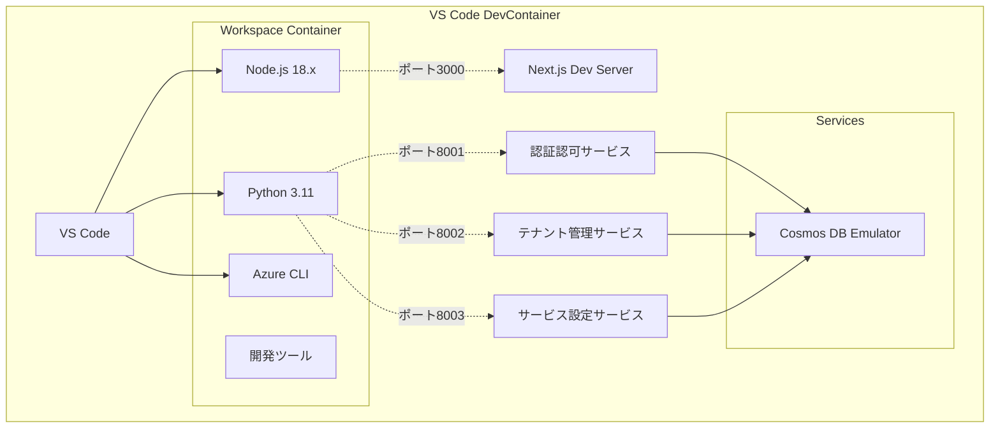
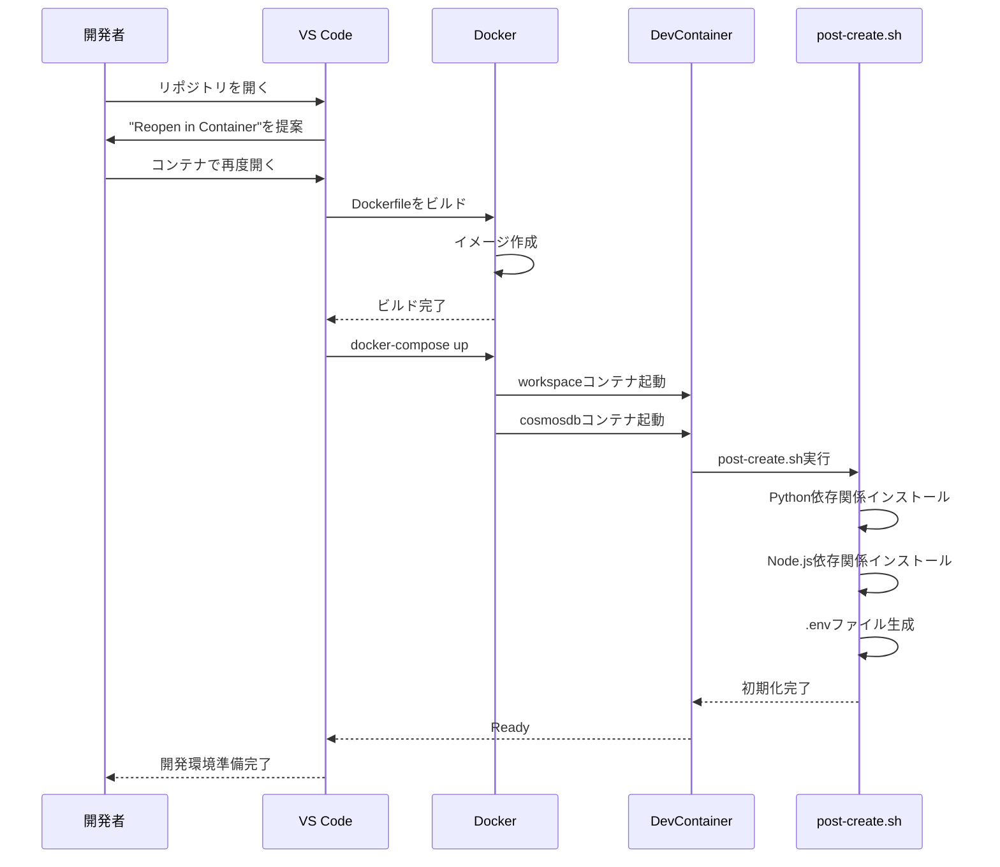
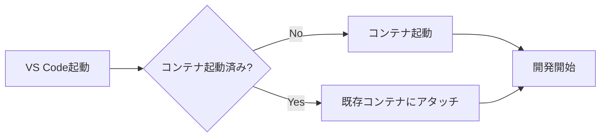

# 開発環境設計

## ドキュメント情報

- **バージョン**: 1.0.0
- **最終更新日**: 2024年
- **ステータス**: Draft
- **関連仕様**: [01-プロジェクト基盤構築](../PoCアプリ/初期構築/Specs/01-プロジェクト基盤構築.md)

---

## 目次

1. [概要](#1-概要)
2. [DevContainer構成](#2-devcontainer構成)
3. [ディレクトリ構造](#3-ディレクトリ構造)
4. [Docker Compose構成](#4-docker-compose構成)
5. [開発ツールとパッケージ](#5-開発ツールとパッケージ)
6. [環境変数管理](#6-環境変数管理)
7. [ポート構成](#7-ポート構成)
8. [初期化プロセス](#8-初期化プロセス)

---

## 1. 概要

### 1.1 目的

本ドキュメントは、複数サービス管理PoCアプリケーションの開発環境構成を定義します。
VS CodeのDev Containers機能を使用したDockerベースの統合開発環境を提供し、すべての開発者が同一環境で効率的に開発できることを目的とします。

### 1.2 設計原則

- **統一性**: すべての開発者が同じ環境を使用
- **再現性**: コンテナイメージで環境を完全再現
- **自動化**: セットアップを最大限自動化
- **効率性**: 必要最小限のツールとパッケージ

### 1.3 前提条件

| ツール | 最小バージョン | 推奨バージョン |
|--------|-------------|-------------|
| Docker Desktop | 4.20 | 最新 |
| VS Code | 1.80 | 最新 |
| Dev Containers拡張 | - | 最新 |
| メモリ | 8GB | 16GB |
| ディスク空き容量 | 10GB | 20GB |

---

## 2. DevContainer構成

### 2.1 全体構成



### 2.2 Dockerfile

**場所**: `.devcontainer/Dockerfile`

```dockerfile
FROM mcr.microsoft.com/devcontainers/python:3.11

# Node.js 18.x インストール
RUN curl -fsSL https://deb.nodesource.com/setup_18.x | bash - \
    && apt-get install -y nodejs

# Azure CLI インストール
RUN curl -sL https://aka.ms/InstallAzureCLIDeb | bash

# Python開発ツール
RUN pip install --upgrade pip \
    && pip install black pylint pytest pytest-asyncio httpx

# グローバルツール
RUN npm install -g npm@latest

WORKDIR /workspace
```

**主要コンポーネント**:
- **ベースイメージ**: Microsoft公式Python 3.11 DevContainer
- **Node.js**: フロントエンド開発用
- **Azure CLI**: Azureリソース管理用
- **Python開発ツール**: リンター、フォーマッター、テストツール

### 2.3 devcontainer.json

**場所**: `.devcontainer/devcontainer.json`

```json
{
  "name": "PoC Multi-Service App",
  "dockerComposeFile": "../docker-compose.yml",
  "service": "workspace",
  "workspaceFolder": "/workspace",
  
  "customizations": {
    "vscode": {
      "extensions": [
        // Python
        "ms-python.python",
        "ms-python.vscode-pylance",
        "ms-python.black-formatter",
        
        // JavaScript/TypeScript
        "dbaeumer.vscode-eslint",
        "esbenp.prettier-vscode",
        
        // Next.js/React
        "bradlc.vscode-tailwindcss",
        
        // Azure
        "ms-azuretools.vscode-bicep",
        "ms-azuretools.vscode-azureresourcegroups",
        
        // その他
        "redhat.vscode-yaml",
        "ms-azuretools.vscode-docker"
      ],
      "settings": {
        // Python設定
        "python.defaultInterpreterPath": "/usr/local/bin/python",
        "python.formatting.provider": "black",
        "python.formatting.blackArgs": ["--line-length", "100"],
        "python.linting.enabled": true,
        "python.linting.pylintEnabled": true,
        
        // JavaScript/TypeScript設定
        "editor.defaultFormatter": "esbenp.prettier-vscode",
        "editor.formatOnSave": true,
        "editor.codeActionsOnSave": {
          "source.organizeImports": true
        },
        
        // ファイル設定
        "files.eol": "\n",
        "files.insertFinalNewline": true,
        "files.trimTrailingWhitespace": true,
        
        // Prettier設定
        "[javascript]": {
          "editor.defaultFormatter": "esbenp.prettier-vscode"
        },
        "[typescript]": {
          "editor.defaultFormatter": "esbenp.prettier-vscode"
        },
        "[json]": {
          "editor.defaultFormatter": "esbenp.prettier-vscode"
        }
      }
    }
  },
  
  "forwardPorts": [3000, 8001, 8002, 8003, 8081],
  "portsAttributes": {
    "3000": {
      "label": "Next.js Frontend",
      "onAutoForward": "notify"
    },
    "8001": {
      "label": "Auth Service",
      "onAutoForward": "silent"
    },
    "8002": {
      "label": "Tenant Service",
      "onAutoForward": "silent"
    },
    "8003": {
      "label": "Service Setting",
      "onAutoForward": "silent"
    },
    "8081": {
      "label": "Cosmos DB Emulator",
      "onAutoForward": "silent"
    }
  },
  
  "postCreateCommand": "bash .devcontainer/post-create.sh",
  
  "remoteUser": "vscode"
}
```

**主要設定**:
- **VS Code拡張機能**: Python、TypeScript、Azure関連の拡張を自動インストール
- **エディタ設定**: フォーマット、リント設定を統一
- **ポートフォワーディング**: 開発サーバーとデータベースポートを公開
- **初期化スクリプト**: コンテナ作成後の自動セットアップ

### 2.4 初期化スクリプト

**場所**: `.devcontainer/post-create.sh`

```bash
#!/bin/bash
set -e

echo "======================================"
echo " DevContainer セットアップ開始"
echo "======================================"

# Python依存関係インストール
echo "📦 Python依存関係をインストール中..."
for service in auth-service tenant-management-service service-setting-service; do
  if [ -f "/workspace/src/$service/requirements.txt" ]; then
    echo "  → $service"
    pip install -q -r "/workspace/src/$service/requirements.txt"
  fi
done

# Node.js依存関係インストール
echo "📦 Node.js依存関係をインストール中..."
if [ -f "/workspace/src/front/package.json" ]; then
  echo "  → frontend"
  cd /workspace/src/front
  npm install --silent
  cd /workspace
fi

# 環境変数ファイルの作成
echo "🔧 環境変数ファイルをセットアップ中..."
for service in front auth-service tenant-management-service service-setting-service; do
  ENV_EXAMPLE="/workspace/src/$service/.env.example"
  ENV_FILE="/workspace/src/$service/.env"
  if [ -f "$ENV_EXAMPLE" ] && [ ! -f "$ENV_FILE" ]; then
    echo "  → $service/.env を作成"
    cp "$ENV_EXAMPLE" "$ENV_FILE"
  fi
done

# Git設定
echo "🔧 Git設定を確認中..."
if [ ! -f ~/.gitconfig ]; then
  git config --global core.autocrlf input
  git config --global core.eol lf
fi

echo ""
echo "======================================"
echo " ✅ セットアップ完了!"
echo "======================================"
echo ""
echo "📝 次のステップ:"
echo "  1. フロントエンド起動: cd src/front && npm run dev"
echo "  2. 認証サービス起動: cd src/auth-service && uvicorn app.main:app --reload --port 8001"
echo "  3. テナントサービス起動: cd src/tenant-management-service && uvicorn app.main:app --reload --port 8002"
echo "  4. サービス設定起動: cd src/service-setting-service && uvicorn app.main:app --reload --port 8003"
echo ""
```

**処理内容**:
1. Python依存関係の一括インストール
2. Node.js依存関係のインストール
3. .env.exampleから.envファイルを生成
4. Git設定の初期化
5. 起動手順の表示

---

## 3. ディレクトリ構造

### 3.1 全体構造

```
/
├── .devcontainer/              # DevContainer設定
│   ├── devcontainer.json
│   ├── Dockerfile
│   └── post-create.sh
├── .github/                    # GitHub設定
│   └── workflows/              # CI/CD（後続タスク用）
├── docs/                       # ドキュメント
│   ├── arch/                   # アーキテクチャ設計
│   └── PoCアプリ/              # 機能仕様
├── infra/                      # IaC（後続タスク用）
│   ├── main.bicep
│   ├── modules/
│   └── parameters/
├── src/                        # ソースコード
│   ├── front/                  # Next.js
│   ├── auth-service/           # 認証認可サービス
│   ├── tenant-management-service/
│   └── service-setting-service/
├── .gitignore
├── .editorconfig
├── README.md
└── docker-compose.yml
```

### 3.2 各サービスの構造

#### 3.2.1 フロントエンド (src/front/)

```
src/front/
├── app/                        # Next.js App Router
│   ├── api/                    # BFF API Routes
│   ├── login/                  # ログインページ
│   ├── (dashboard)/            # ダッシュボードグループ
│   │   ├── tenants/
│   │   ├── users/
│   │   └── services/
│   ├── layout.tsx
│   └── page.tsx
├── components/                 # Reactコンポーネント
│   ├── ui/
│   └── features/
├── lib/                        # ユーティリティ
│   ├── api-client.ts
│   └── auth.ts
├── types/                      # TypeScript型定義
├── public/                     # 静的ファイル
├── .env.local.example
├── package.json
├── tsconfig.json
└── tailwind.config.js
```

#### 3.2.2 バックエンドサービス (src/{service-name}/)

```
src/auth-service/               # 例: 認証認可サービス
├── app/
│   ├── __init__.py
│   ├── main.py                 # FastAPIアプリ
│   ├── config.py               # 設定管理
│   ├── models/                 # データモデル
│   │   └── __init__.py
│   ├── schemas/                # Pydanticスキーマ
│   │   └── __init__.py
│   ├── repositories/           # データアクセス
│   │   └── __init__.py
│   ├── services/               # ビジネスロジック
│   │   └── __init__.py
│   ├── api/                    # エンドポイント
│   │   └── v1/
│   │       └── __init__.py
│   └── utils/                  # ユーティリティ
│       └── __init__.py
├── tests/                      # テストコード
│   └── __init__.py
├── .env.example
├── requirements.txt
└── Dockerfile
```

---

## 4. Docker Compose構成

### 4.1 docker-compose.yml

**場所**: `docker-compose.yml` (ルート)

```yaml
version: '3.8'

services:
  # DevContainer用ワークスペース
  workspace:
    build:
      context: .devcontainer
      dockerfile: Dockerfile
    volumes:
      - .:/workspace:cached
      - /var/run/docker.sock:/var/run/docker.sock
    command: sleep infinity
    networks:
      - poc-network
    environment:
      - DOCKER_HOST=unix:///var/run/docker.sock

  # Cosmos DB Emulator
  cosmosdb:
    image: mcr.microsoft.com/cosmosdb/linux/azure-cosmos-emulator:latest
    container_name: cosmosdb-emulator
    ports:
      - "8081:8081"
      - "10251:10251"
      - "10252:10252"
      - "10253:10253"
      - "10254:10254"
    environment:
      - AZURE_COSMOS_EMULATOR_PARTITION_COUNT=10
      - AZURE_COSMOS_EMULATOR_ENABLE_DATA_PERSISTENCE=true
      - AZURE_COSMOS_EMULATOR_IP_ADDRESS_OVERRIDE=127.0.0.1
    volumes:
      - cosmosdb-data:/data/db
    networks:
      - poc-network
    healthcheck:
      test: ["CMD", "curl", "-k", "https://localhost:8081/_explorer/emulator.pem"]
      interval: 30s
      timeout: 10s
      retries: 5

networks:
  poc-network:
    driver: bridge

volumes:
  cosmosdb-data:
```

**サービス構成**:
- **workspace**: 開発用メインコンテナ（VS CodeがアタッチするServiceコンテナ）
- **cosmosdb**: Azure Cosmos DB Emulator

### 4.2 ネットワーク設計

| ネットワーク | ドライバ | 用途 |
|------------|---------|------|
| poc-network | bridge | コンテナ間通信 |

**接続構成**:
- workspaceコンテナから`cosmosdb:8081`でCosmos DB Emulatorにアクセス可能
- ホストマシンから`localhost:3000`, `localhost:8001-8003`でアプリケーションにアクセス可能

---

## 5. 開発ツールとパッケージ

### 5.1 Python環境

#### 5.1.1 システムパッケージ

| パッケージ | バージョン | 用途 |
|----------|----------|------|
| Python | 3.11 | プログラミング言語 |
| pip | 最新 | パッケージマネージャ |
| black | 最新 | コードフォーマッター |
| pylint | 最新 | リンター |
| pytest | 最新 | テストフレームワーク |
| pytest-asyncio | 最新 | 非同期テスト |
| httpx | 最新 | HTTPクライアント（テスト用） |

#### 5.1.2 サービス依存パッケージ (requirements.txt)

```txt
fastapi==0.104.1
uvicorn[standard]==0.24.0
pydantic==2.5.0
pydantic-settings==2.1.0
azure-cosmos==4.5.1
python-jose[cryptography]==3.3.0
passlib[bcrypt]==1.7.4
python-multipart==0.0.6
pytest==7.4.3
pytest-asyncio==0.21.1
httpx==0.25.2
```

### 5.2 Node.js環境

#### 5.2.1 システムパッケージ

| パッケージ | バージョン | 用途 |
|----------|----------|------|
| Node.js | 18.x | JavaScript実行環境 |
| npm | 最新 | パッケージマネージャ |

#### 5.2.2 フロントエンド依存パッケージ (package.json)

**主要パッケージ**:
```json
{
  "dependencies": {
    "next": "^14.0.0",
    "react": "^18.2.0",
    "react-dom": "^18.2.0",
    "typescript": "^5.0.0",
    "axios": "^1.6.0",
    "@tanstack/react-query": "^5.0.0"
  },
  "devDependencies": {
    "@types/node": "^20.0.0",
    "@types/react": "^18.2.0",
    "tailwindcss": "^3.3.0",
    "postcss": "^8.4.0",
    "autoprefixer": "^10.4.0",
    "eslint": "^8.0.0",
    "eslint-config-next": "^14.0.0",
    "prettier": "^3.0.0"
  }
}
```

### 5.3 Azure CLI

| ツール | バージョン | 用途 |
|--------|----------|------|
| Azure CLI | 最新 | Azureリソース管理 |

**主要コマンド**:
- `az login`: Azure認証
- `az account set`: サブスクリプション選択
- `az deployment sub create`: Bicepデプロイ
- `az cosmosdb`: Cosmos DB管理

---

## 6. 環境変数管理

### 6.1 管理方針

- **開発環境**: `.env`ファイルで管理
- **本番環境**: Azure App Service / Container Appsの環境変数設定
- **シークレット**: `.env.example`には含めず、ドキュメントで指示
- **バージョン管理**: `.env`は`.gitignore`に含め、`.env.example`をテンプレートとして管理

### 6.2 フロントエンド環境変数

**ファイル**: `src/front/.env.local.example`

```bash
# バックエンドサービスURL
NEXT_PUBLIC_AUTH_SERVICE_URL=http://localhost:8001
NEXT_PUBLIC_TENANT_SERVICE_URL=http://localhost:8002
NEXT_PUBLIC_SERVICE_SETTING_URL=http://localhost:8003

# JWT設定（開発用）
JWT_SECRET=your-development-secret-key-change-in-production
JWT_ALGORITHM=HS256
JWT_EXPIRATION_HOURS=24
```

**命名規則**:
- `NEXT_PUBLIC_*`: クライアントサイドで使用可能な環境変数
- その他: サーバーサイドのみで使用

### 6.3 バックエンドサービス環境変数

#### 6.3.1 認証認可サービス

**ファイル**: `src/auth-service/.env.example`

```bash
# サービス設定
SERVICE_NAME=auth-service
PORT=8001

# Cosmos DB設定（ローカル）
COSMOS_DB_ENDPOINT=https://localhost:8081
COSMOS_DB_KEY=C2y6yDjf5/R+ob0N8A7Cgv30VRDJIWEHLM+4QDU5DE2nQ9nDuVTqobD4b8mGGyPMbIZnqyMsEcaGQy67XIw/Jw==
COSMOS_DB_DATABASE=auth_management

# JWT設定
JWT_SECRET=your-development-secret-key
JWT_ALGORITHM=HS256
JWT_EXPIRATION_HOURS=24

# ログレベル
LOG_LEVEL=INFO
```

#### 6.3.2 テナント管理サービス

**ファイル**: `src/tenant-management-service/.env.example`

```bash
# サービス設定
SERVICE_NAME=tenant-management-service
PORT=8002

# Cosmos DB設定（ローカル）
COSMOS_DB_ENDPOINT=https://localhost:8081
COSMOS_DB_KEY=C2y6yDjf5/R+ob0N8A7Cgv30VRDJIWEHLM+4QDU5DE2nQ9nDuVTqobD4b8mGGyPMbIZnqyMsEcaGQy67XIw/Jw==
COSMOS_DB_DATABASE=tenant_management

# ログレベル
LOG_LEVEL=INFO
```

#### 6.3.3 利用サービス設定サービス

**ファイル**: `src/service-setting-service/.env.example`

```bash
# サービス設定
SERVICE_NAME=service-setting-service
PORT=8003

# Cosmos DB設定（ローカル）
COSMOS_DB_ENDPOINT=https://localhost:8081
COSMOS_DB_KEY=C2y6yDjf5/R+ob0N8A7Cgv30VRDJIWEHLM+4QDU5DE2nQ9nDuVTqobD4b8mGGyPMbIZnqyMsEcaGQy67XIw/Jw==
COSMOS_DB_DATABASE=service_management

# ログレベル
LOG_LEVEL=INFO
```

### 6.4 Cosmos DB Emulatorのデフォルト接続文字列

**エンドポイント**: `https://localhost:8081`

**キー** (固定):
```
C2y6yDjf5/R+ob0N8A7Cgv30VRDJIWEHLM+4QDU5DE2nQ9nDuVTqobD4b8mGGyPMbIZnqyMsEcaGQy67XIw/Jw==
```

⚠️ **注意**: この接続文字列は開発専用です。本番環境では絶対に使用しないでください。

---

## 7. ポート構成

### 7.1 使用ポート一覧

| ポート | サービス | 用途 | 外部公開 |
|--------|---------|------|---------|
| 3000 | Next.js | フロントエンド開発サーバー | ✓ |
| 8001 | FastAPI | 認証認可サービス | ✓ |
| 8002 | FastAPI | テナント管理サービス | ✓ |
| 8003 | FastAPI | 利用サービス設定サービス | ✓ |
| 8081 | Cosmos DB Emulator | データベース (HTTPS) | ✓ |
| 10251-10254 | Cosmos DB Emulator | 内部ポート | - |

### 7.2 ポート競合の解決

**問題**: 既にポートが使用されている場合

**解決方法**:

1. **使用中のプロセスを確認**:
   ```bash
   # Linux/macOS
   lsof -i :3000
   
   # Windows
   netstat -ano | findstr :3000
   ```

2. **プロセスを終了**:
   ```bash
   # Linux/macOS
   kill -9 <PID>
   
   # Windows
   taskkill /PID <PID> /F
   ```

3. **別のポートを使用**:
   - `.env`ファイルでポート番号を変更
   - `devcontainer.json`の`forwardPorts`も更新

---

## 8. 初期化プロセス

### 8.1 初回セットアップフロー



### 8.2 日常的な起動フロー



**所要時間**:
- 初回ビルド: 約10分
- 2回目以降: 約30秒

### 8.3 トラブルシューティング

#### 8.3.1 コンテナビルド失敗

**症状**: Dockerイメージのビルドが失敗する

**原因と対処**:
1. **ネットワークエラー**: インターネット接続を確認
2. **Dockerリソース不足**: Docker Desktopのメモリ・CPU設定を増やす
3. **キャッシュ問題**: `docker system prune -a`でクリーンアップ

#### 8.3.2 Cosmos DB Emulatorが起動しない

**症状**: ポート8081に接続できない

**原因と対処**:
1. **コンテナ起動確認**: `docker ps | grep cosmosdb`
2. **ログ確認**: `docker logs cosmosdb-emulator`
3. **再起動**: `docker-compose restart cosmosdb`

#### 8.3.3 パッケージインストール失敗

**症状**: post-create.shでエラー

**原因と対処**:
1. **requirements.txtの誤り**: 構文エラーを確認
2. **package.jsonの誤り**: JSONフォーマットを確認
3. **手動インストール**: コンテナ内で手動実行

---

## 9. 開発ワークフロー

### 9.1 サービス起動手順

#### 9.1.1 すべてのサービスを起動

**ターミナル1: フロントエンド**
```bash
cd src/front
npm run dev
```

**ターミナル2: 認証認可サービス**
```bash
cd src/auth-service
uvicorn app.main:app --reload --port 8001
```

**ターミナル3: テナント管理サービス**
```bash
cd src/tenant-management-service
uvicorn app.main:app --reload --port 8002
```

**ターミナル4: サービス設定サービス**
```bash
cd src/service-setting-service
uvicorn app.main:app --reload --port 8003
```

#### 9.1.2 VS Code Tasksでの起動（推奨）

**ファイル**: `.vscode/tasks.json`（後続タスクで作成）

```json
{
  "version": "2.0.0",
  "tasks": [
    {
      "label": "Start All Services",
      "dependsOn": [
        "Start Frontend",
        "Start Auth Service",
        "Start Tenant Service",
        "Start Service Setting"
      ],
      "problemMatcher": []
    },
    {
      "label": "Start Frontend",
      "type": "shell",
      "command": "cd src/front && npm run dev",
      "isBackground": true
    },
    {
      "label": "Start Auth Service",
      "type": "shell",
      "command": "cd src/auth-service && uvicorn app.main:app --reload --port 8001",
      "isBackground": true
    }
    // ... 他のサービス
  ]
}
```

### 9.2 動作確認

#### 9.2.1 ヘルスチェック

```bash
# フロントエンド
curl http://localhost:3000

# 認証認可サービス
curl http://localhost:8001/health

# テナント管理サービス
curl http://localhost:8002/health

# サービス設定サービス
curl http://localhost:8003/health

# Cosmos DB Emulator
curl -k https://localhost:8081/_explorer/emulator.pem
```

#### 9.2.2 ブラウザでの確認

- **フロントエンド**: http://localhost:3000
- **認証サービスAPI Docs**: http://localhost:8001/docs
- **テナントサービスAPI Docs**: http://localhost:8002/docs
- **サービス設定API Docs**: http://localhost:8003/docs
- **Cosmos DB Explorer**: https://localhost:8081/_explorer/index.html

---

## 10. ベストプラクティス

### 10.1 開発時の推奨事項

1. **定期的なコンテナ再起動**: パフォーマンス維持のため週1回再起動
2. **依存関係の同期**: requirements.txt / package.json変更時は再インストール
3. **ログの確認**: エラー発生時はサービスログを確認
4. **環境変数の確認**: 動作不良時は.envファイルをチェック

### 10.2 やってはいけないこと

1. **.envファイルのコミット**: 絶対にGitにコミットしない
2. **開発用認証情報の本番使用**: Cosmos Emulatorのキーは開発専用
3. **コンテナ内での永続的な変更**: ファイル変更は/workspaceで行う
4. **大量のDockerイメージ蓄積**: 定期的に`docker system prune`

---

## 11. パフォーマンスチューニング

### 11.1 Docker Desktop設定

**推奨リソース設定**:
- CPU: 4コア以上
- メモリ: 8GB以上（推奨12GB）
- ディスク: 20GB以上

**設定場所**: Docker Desktop → Settings → Resources

### 11.2 VS Code設定

```json
{
  // ファイル監視除外（パフォーマンス向上）
  "files.watcherExclude": {
    "**/.git/objects/**": true,
    "**/node_modules/**": true,
    "**/.next/**": true,
    "**/__pycache__/**": true,
    "**/.pytest_cache/**": true
  },
  
  // 検索除外
  "search.exclude": {
    "**/node_modules": true,
    "**/.next": true,
    "**/__pycache__": true
  }
}
```

---

## 関連ドキュメント

- [アーキテクチャ概要](./overview.md)
- [デプロイメント設計](./deployment.md)
- [01-プロジェクト基盤構築仕様](../PoCアプリ/初期構築/Specs/01-プロジェクト基盤構築.md)

---

## 更新履歴

| 日付 | バージョン | 変更内容 | 関連仕様 |
|------|------------|----------|----------|
| 2024 | 1.0.0 | 初版作成（タスク01対応） | [01-プロジェクト基盤構築](../PoCアプリ/初期構築/Specs/01-プロジェクト基盤構築.md) |
