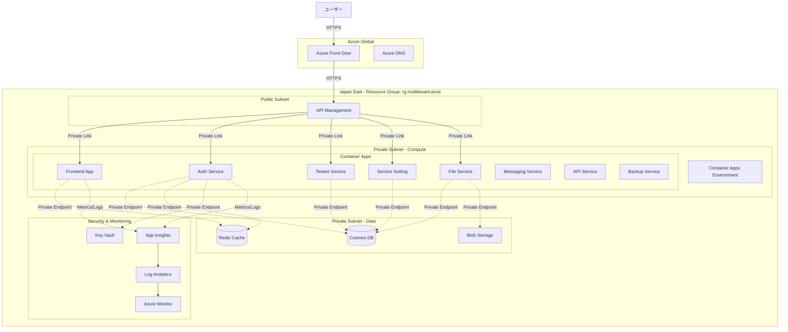

# インフラストラクチャ設計

## 1. 概要

本ドキュメントは、マルチテナント管理アプリケーションのAzureインフラストラクチャ設計を定義します。すべてのリソースはBicep（IaC）で管理されます。

### 1.1 設計原則

1. **Infrastructure as Code（IaC）**: すべてのインフラをBicepで定義
2. **環境分離**: Dev / Staging / Production環境の完全分離
3. **高可用性**: SLA 99.9%を実現する冗長構成
4. **スケーラビリティ**: 水平スケーリング対応
5. **セキュリティ**: ゼロトラスト、最小権限の原則

### 1.2 Azureリージョン

```yaml
Primary Region: Japan East（東日本）
Secondary Region: Japan West（西日本） # 将来のDR用

選定理由:
  - データレジデンシー要件
  - 低レイテンシ
  - 可用性ゾーン対応
```

## 2. 全体アーキテクチャ

### 2.1 インフラストラクチャ概要図



### 2.2 ネットワーク構成

```yaml
Virtual Network:
  Name: vnet-multitenant-prod
  Address Space: 10.0.0.0/16
  
Subnets:
  - Name: snet-apim
    Address: 10.0.1.0/24
    Purpose: API Management
    
  - Name: snet-container-apps
    Address: 10.0.2.0/23  # 10.0.2.0 - 10.0.3.255
    Purpose: Container Apps Environment
    
  - Name: snet-data
    Address: 10.0.4.0/24
    Purpose: Private Endpoints（Cosmos DB, Redis, Storage）
    
  - Name: snet-private-endpoints
    Address: 10.0.5.0/24
    Purpose: その他のPrivate Endpoints

NSG（Network Security Group）:
  - nsg-apim: API Management用
  - nsg-container-apps: Container Apps用
  - nsg-data: データサービス用
```

## 3. コンピューティングリソース

### 3.1 Azure Container Apps

#### Container Apps Environment

```yaml
Name: cae-multitenant-prod
Location: Japan East
Virtual Network: vnet-multitenant-prod
Subnet: snet-container-apps
Internal Load Balancer: Disabled（API Management経由）
Log Analytics Workspace: log-multitenant-prod

Zone Redundancy: Enabled  # 高可用性
```

#### Container Apps設定

**Frontend Service:**
```yaml
Name: ca-frontend-prod
Container:
  Image: acr-multitenant-prod.azurecr.io/frontend:latest
  CPU: 1.0 cores
  Memory: 2.0 Gi
  
Scaling:
  Min Replicas: 2
  Max Replicas: 10
  Rules:
    - Type: http
      Concurrent Requests: 100
    - Type: cpu
      Utilization: 70%

Ingress:
  External: false
  Target Port: 3000
  Allow Insecure: false

Environment Variables:
  - Name: NODE_ENV
    Value: production
  - Name: API_BASE_URL
    Value: https://api.example.com
  - Name: NEXTAUTH_SECRET
    SecretRef: nextauth-secret
```

**Auth Service:**
```yaml
Name: ca-auth-prod
Container:
  Image: acr-multitenant-prod.azurecr.io/auth-service:latest
  CPU: 0.5 cores
  Memory: 1.0 Gi

Scaling:
  Min Replicas: 2
  Max Replicas: 10
  Rules:
    - Type: http
      Concurrent Requests: 50
    - Type: cpu
      Utilization: 70%

Ingress:
  External: false
  Target Port: 8000
  Allow Insecure: false

Environment Variables:
  - Name: COSMOS_ENDPOINT
    Value: https://cosmos-multitenant-prod.documents.azure.com:443/
  - Name: COSMOS_KEY
    SecretRef: cosmos-key
  - Name: REDIS_HOST
    Value: redis-multitenant-prod.redis.cache.windows.net
  - Name: REDIS_PASSWORD
    SecretRef: redis-password
  - Name: JWT_PRIVATE_KEY
    SecretRef: jwt-private-key
  - Name: JWT_PUBLIC_KEY
    SecretRef: jwt-public-key

Managed Identity: Enabled
```

**その他のサービス:**
- Tenant Management Service: 同様の設定
- Service Setting Service: 同様の設定
- File/Messaging/API/Backup Services: 同様の設定

### 3.2 Azure Container Registry

```yaml
Name: acr-multitenant-prod
SKU: Premium  # Geo-replication対応
Location: Japan East
Admin Enabled: No  # Managed Identityを使用

Geo-Replication:
  - Japan West

Image Retention:
  Status: Enabled
  Days: 30
  Untagged Manifests: 7 days

Vulnerability Scanning: Enabled（Microsoft Defender）

Private Endpoint: Enabled
VNet: vnet-multitenant-prod
Subnet: snet-private-endpoints
```

## 4. データストアサービス

### 4.1 Azure Cosmos DB

```yaml
Account Name: cosmos-multitenant-prod
API: NoSQL（SQL API）
Location: Japan East

Consistency Level: Session

Capacity Mode: Autoscale
  Min RU/s: 400
  Max RU/s: 10000

Databases:
  - auth_db:
      Containers:
        - users:
            Partition Key: /partition_key
            Autoscale Max RU/s: 4000
            Indexing Policy: Custom
        - user_roles:
            Partition Key: /partition_key
            Autoscale Max RU/s: 2000
  
  - tenant_db:
      Containers:
        - tenants:
            Partition Key: /partition_key
            Autoscale Max RU/s: 2000
        - tenant_users:
            Partition Key: /partition_key
            Autoscale Max RU/s: 2000
  
  - service_setting_db:
      Containers:
        - services:
            Partition Key: /partition_key
            Autoscale Max RU/s: 1000
        - tenant_services:
            Partition Key: /partition_key
            Autoscale Max RU/s: 2000
        - service_role_info:
            Partition Key: /partition_key
            Autoscale Max RU/s: 1000

Backup:
  Mode: Continuous（30日間のPITR）
  Interval: Automatic
  Retention: 30 days

Network:
  Public Access: Disabled
  Private Endpoint: Enabled
  VNet: vnet-multitenant-prod
  Subnet: snet-data

Encryption:
  At Rest: Microsoft-managed keys
  In Transit: TLS 1.2+

Firewall:
  Allow Azure Services: No
  IP Rules: None（Private Endpointのみ）
```

### 4.2 Azure Cache for Redis

```yaml
Name: redis-multitenant-prod
SKU: Premium P1（6 GB）
Location: Japan East

Version: 6.0
Port: 6380（SSL）
Non-SSL Port: Disabled

Clustering: Disabled（P1では未サポート）
Persistence:
  RDB: Enabled
  Frequency: 60 minutes
  AOF: Enabled

Zone Redundancy: Enabled

Private Endpoint: Enabled
VNet: vnet-multitenant-prod
Subnet: snet-data

Firewall:
  Default Action: Deny
  Allow Azure Services: No

Use Cases:
  - JWT検証キャッシュ
  - ロール情報キャッシュ
  - セッションストア
  - レート制限カウンター
```

### 4.3 Azure Blob Storage

```yaml
Account Name: stmultitenantprod
SKU: Standard_GRS（Geo-Redundant Storage）
Location: Japan East（レプリカ: Japan West）
Account Kind: StorageV2

Containers:
  - files:
      Public Access: None
      Purpose: ファイルサービスのファイル保存
  - backups:
      Public Access: None
      Purpose: バックアップデータ保存
  - exports:
      Public Access: None
      Purpose: データエクスポート

Encryption:
  At Rest: Microsoft-managed keys
  Infrastructure Encryption: Enabled

Network:
  Public Access: Disabled
  Private Endpoint: Enabled
  VNet: vnet-multitenant-prod
  Subnet: snet-data

Lifecycle Management:
  - files container:
      Move to Cool tier: After 30 days
      Move to Archive tier: After 90 days
  - backups container:
      Move to Cool tier: After 7 days
      Delete: After 90 days

Soft Delete:
  Blobs: 7 days
  Containers: 7 days
```

## 5. セキュリティサービス

### 5.1 Azure Key Vault

```yaml
Name: kv-multitenant-prod
SKU: Premium（HSM-backed keys）
Location: Japan East

Secrets:
  - cosmos-key:
      Value: <Cosmos DB Primary Key>
      Content Type: text/plain
  - redis-password:
      Value: <Redis Access Key>
  - jwt-private-key:
      Value: <RS256 Private Key>
      Content Type: application/pkcs8
  - jwt-public-key:
      Value: <RS256 Public Key>
      Content Type: application/x-pem-file
  - nextauth-secret:
      Value: <Random Secret>

Access Policies:
  - Object: ca-auth-prod Managed Identity
    Permissions:
      Secrets: Get, List
  - Object: ca-tenant-prod Managed Identity
    Permissions:
      Secrets: Get, List

Network:
  Public Access: Disabled
  Private Endpoint: Enabled
  VNet: vnet-multitenant-prod
  Subnet: snet-private-endpoints

Soft Delete: Enabled（90 days）
Purge Protection: Enabled

Logging:
  Diagnostic Settings: Enabled
  Destination: Log Analytics Workspace
```

### 5.2 Azure API Management

```yaml
Name: apim-multitenant-prod
SKU: Developer（本番はPremiumを推奨）
Location: Japan East
Virtual Network: Internal
  VNet: vnet-multitenant-prod
  Subnet: snet-apim

APIs:
  - Auth API:
      Path: /auth
      Backend: https://ca-auth-prod.internal
      Policies:
        - Rate Limit: 1000/hour per user
        - JWT Validation: Enabled
        
  - Tenant API:
      Path: /tenants
      Backend: https://ca-tenant-prod.internal
      Policies:
        - Rate Limit: 1000/hour per user
        - JWT Validation: Enabled
        
  - Service Setting API:
      Path: /services
      Backend: https://ca-service-setting-prod.internal

Policies（Global）:
  Inbound:
    - CORS: Enabled
      Allowed Origins: https://app.example.com
    - IP Filter: Optional
    - Rate Limit: 5000/hour per IP
  
  Backend:
    - Forward Request
  
  Outbound:
    - Remove Response Headers:
        - X-Powered-By
        - X-AspNet-Version
  
  On-Error:
    - Log to Application Insights

Monitoring:
  Application Insights: Enabled
  Sampling: 100%（本番は調整）
```

## 6. 監視・ログ

### 6.1 Azure Monitor

```yaml
Log Analytics Workspace:
  Name: log-multitenant-prod
  Location: Japan East
  Retention: 90 days
  
  Data Sources:
    - Container Apps logs
    - API Management logs
    - Cosmos DB diagnostics
    - Redis diagnostics
    - Key Vault audit logs

Diagnostic Settings（各リソースに設定）:
  - Cosmos DB:
      Logs:
        - DataPlaneRequests
        - MongoRequests
        - QueryRuntimeStatistics
      Metrics:
        - Requests
        - AllMetrics
  
  - Container Apps:
      Logs:
        - ContainerAppConsoleLogs
        - ContainerAppSystemLogs
      Metrics:
        - AllMetrics
  
  - API Management:
      Logs:
        - GatewayLogs
        - WebSocketConnectionLogs
      Metrics:
        - AllMetrics
```

### 6.2 Application Insights

```yaml
Name: appi-multitenant-prod
Location: Japan East
Workspace: log-multitenant-prod

Instrumentation:
  - Frontend Service: Node.js SDK
  - Backend Services: OpenTelemetry Python

Sampling:
  Type: Adaptive
  Target: 5 requests/second

Alert Rules:
  - High Error Rate:
      Condition: errors > 100 in 5 minutes
      Severity: Critical
      Action Group: security-team
  
  - High Response Time:
      Condition: avg(requests/duration) > 2000ms
      Severity: Warning
      Action Group: dev-team
  
  - Failed Login Attempts:
      Condition: custom_event(login_failed) > 50 in 5 minutes
      Severity: High
      Action Group: security-team
```

### 6.3 Azure Alerts

```yaml
Action Groups:
  - security-team:
      Email: security@example.com
      SMS: +81-90-xxxx-xxxx
      Webhook: https://slack.com/webhooks/...
  
  - dev-team:
      Email: dev-team@example.com
      Webhook: https://teams.microsoft.com/webhooks/...

Alert Rules:
  - Container App Restart:
      Resource: All Container Apps
      Condition: Restart count > 5 in 15 minutes
      Severity: High
  
  - High CPU Usage:
      Resource: Container Apps
      Condition: CPU > 80% for 10 minutes
      Severity: Warning
  
  - Cosmos DB High RU:
      Resource: Cosmos DB
      Condition: Total Request Units > 8000 for 5 minutes
      Severity: Warning
```

## 7. CI/CD パイプライン

### 7.1 GitHub Actions ワークフロー

#### アプリケーションデプロイ

```yaml
name: Deploy Services

on:
  push:
    branches: [main]
    paths:
      - 'src/**'

jobs:
  build-and-deploy:
    runs-on: ubuntu-latest
    
    steps:
      - uses: actions/checkout@v3
      
      - name: Azure Login
        uses: azure/login@v1
        with:
          creds: ${{ secrets.AZURE_CREDENTIALS }}
      
      - name: Build and Push - Auth Service
        run: |
          docker build -t acr-multitenant-prod.azurecr.io/auth-service:${{ github.sha }} ./src/auth-service
          docker push acr-multitenant-prod.azurecr.io/auth-service:${{ github.sha }}
      
      - name: Deploy to Container Apps
        uses: azure/container-apps-deploy-action@v1
        with:
          containerAppName: ca-auth-prod
          resourceGroup: rg-multitenant-prod
          imageToDeploy: acr-multitenant-prod.azurecr.io/auth-service:${{ github.sha }}
```

#### インフラデプロイ

```yaml
name: Deploy Infrastructure

on:
  push:
    branches: [main]
    paths:
      - 'infra/**'

jobs:
  deploy-infrastructure:
    runs-on: ubuntu-latest
    
    steps:
      - uses: actions/checkout@v3
      
      - name: Azure Login
        uses: azure/login@v1
        with:
          creds: ${{ secrets.AZURE_CREDENTIALS }}
      
      - name: Deploy Bicep
        run: |
          az deployment sub create \
            --location japaneast \
            --template-file ./infra/main.bicep \
            --parameters ./infra/parameters.prod.json
```

### 7.2 Bicep ファイル構成

```
infra/
├── main.bicep                      # メインテンプレート
├── parameters.dev.json             # Dev環境パラメータ
├── parameters.staging.json         # Staging環境パラメータ
├── parameters.prod.json            # Prod環境パラメータ
│
├── modules/
│   ├── network.bicep               # VNet, Subnets, NSG
│   ├── container-apps.bicep        # Container Apps Environment & Apps
│   ├── cosmos-db.bicep             # Cosmos DB
│   ├── redis.bicep                 # Redis Cache
│   ├── storage.bicep               # Blob Storage
│   ├── key-vault.bicep             # Key Vault
│   ├── api-management.bicep        # API Management
│   ├── monitoring.bicep            # Log Analytics, Application Insights
│   └── security.bicep              # NSG rules, Private Endpoints
```

#### メインテンプレート例

```bicep
// infra/main.bicep
targetScope = 'subscription'

param location string = 'japaneast'
param environment string

resource rg 'Microsoft.Resources/resourceGroups@2021-04-01' = {
  name: 'rg-multitenant-${environment}'
  location: location
}

module network './modules/network.bicep' = {
  scope: rg
  name: 'network-deployment'
  params: {
    location: location
    environment: environment
  }
}

module cosmosDb './modules/cosmos-db.bicep' = {
  scope: rg
  name: 'cosmosdb-deployment'
  params: {
    location: location
    environment: environment
    vnetId: network.outputs.vnetId
    subnetId: network.outputs.dataSubnetId
  }
}

module containerApps './modules/container-apps.bicep' = {
  scope: rg
  name: 'container-apps-deployment'
  params: {
    location: location
    environment: environment
    vnetId: network.outputs.vnetId
    subnetId: network.outputs.containerAppsSubnetId
  }
}

// その他のモジュール...
```

## 8. ディザスタリカバリ（DR）

### 8.1 RPO/RTO目標

```yaml
Recovery Point Objective (RPO): 1時間
  - Cosmos DB: 継続バックアップ（PITR）
  - Blob Storage: GRS（自動レプリケーション）

Recovery Time Objective (RTO): 4時間
  - 手動フェイルオーバー
  - DNSカットオーバー
```

### 8.2 DR手順

```yaml
フェーズ1: 検知（0-30分）
  - 障害検知（自動アラート）
  - 影響範囲の確認
  - DR発動判断

フェーズ2: フェイルオーバー（30分-2時間）
  - Cosmos DBフェイルオーバー（自動 or 手動）
  - Container Appsの西日本リージョンへのデプロイ
  - API ManagementのDNS切り替え

フェーズ3: 検証（2-3時間）
  - サービス疎通確認
  - データ整合性確認
  - ユーザー通知

フェーズ4: 監視（3-4時間）
  - 継続的な監視
  - パフォーマンス確認
```

## 9. コスト見積もり

### 9.1 月額コスト（Production環境）

```yaml
Container Apps:
  - 8 services × $50/month: $400
  
Cosmos DB:
  - Autoscale（平均5000 RU/s）: $300
  
Redis Cache:
  - Premium P1（6GB）: $300
  
Blob Storage:
  - Standard GRS（1TB）: $50
  
Key Vault:
  - Premium: $5
  - Secrets（10個）: $0.30
  
API Management:
  - Premium（1 unit）: $3,000
  
Application Insights:
  - 10GB/month: $23
  
Log Analytics:
  - 50GB/month: $115
  
Container Registry:
  - Premium: $250
  
VNet:
  - Private Endpoints（10個）: $100

合計（概算）: $4,543/月
```

### 9.2 コスト最適化施策

- **Autoscaling**: 需要に応じた自動スケーリング
- **Reserved Capacity**: Cosmos DBの予約容量購入（最大65%割引）
- **Lifecycle Management**: Blob Storageの階層移行
- **Spot Instances**: 非本番環境での利用
- **リソースタグ**: コスト配分の追跡

## 10. 運用管理

### 10.1 デプロイメント戦略

```yaml
ブルー/グリーンデプロイメント:
  1. 新バージョン（Green）をデプロイ
  2. ヘルスチェック確認
  3. トラフィックを段階的に移行（10% → 50% → 100%）
  4. 問題があれば即座にロールバック

カナリアリリース:
  1. 新バージョンを1インスタンスのみデプロイ
  2. 5%のトラフィックを新バージョンに流す
  3. エラー率、レスポンスタイムを監視
  4. 問題なければ徐々に拡大
```

### 10.2 バックアップと復元

```yaml
自動バックアップ:
  - Cosmos DB: 継続バックアップ（30日）
  - Blob Storage: GRS（自動）
  - Redis: RDB（1時間ごと）+ AOF

手動エクスポート:
  - 頻度: 毎日午前2時（JST）
  - 保持期間: 90日
  - 保存先: Blob Storage（Archive tier）

復元手順:
  1. Key VaultからCosmosDB接続情報取得
  2. PITRで特定時点に復元
  3. データ整合性チェック
  4. サービス再起動
```

## 11. 関連ドキュメント

- [セキュリティ考慮事項](../security/security-considerations.md)
- [コンポーネント設計](../components/README.md)
- [データモデル設計](../data/data-model.md)
