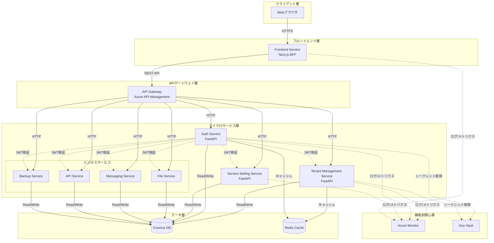
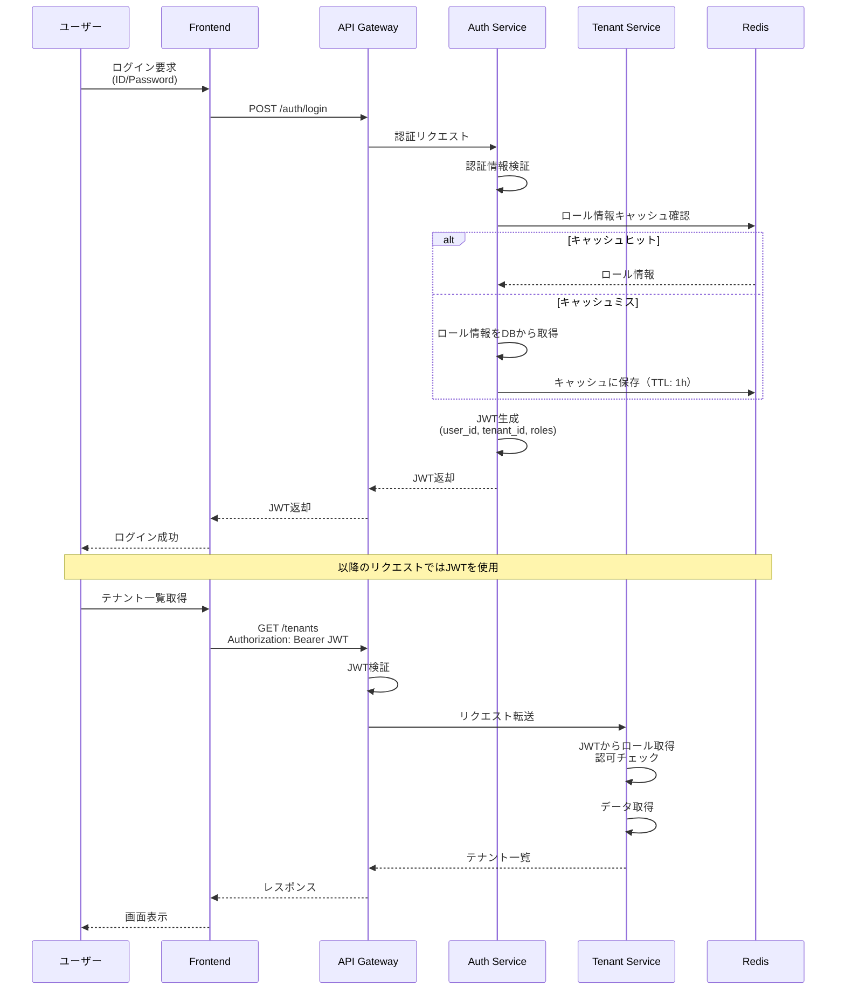
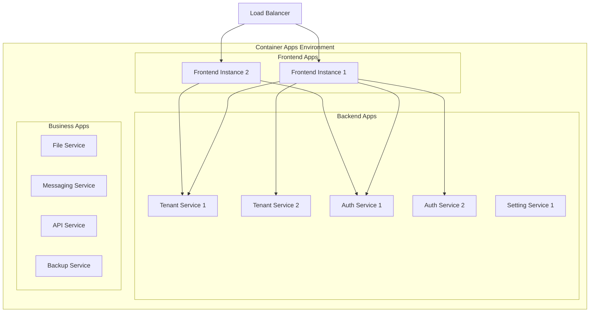

# アーキテクチャ概要

## ドキュメント情報

| 項目 | 内容 |
|------|------|
| 文書バージョン | 1.0.0 |
| 作成日 | 2026-02-01 |
| 準拠規格 | ISO/IEC/IEEE 29148, IEEE 1016 |
| 対象システム | マルチテナント管理アプリケーション |

## 1. はじめに

### 1.1 目的

本ドキュメントは、複数サービスを提供する会社の管理アプリケーションのマイクロサービスアーキテクチャを定義します。本システムは、テナント管理、認証認可、サービス利用設定を統合的に管理するSaaSプラットフォームです。

### 1.2 範囲

本アーキテクチャは以下の範囲をカバーします：

- フロントエンドアプリケーション（BFF含む）
- 4つのコアマイクロサービス
- 4つのモックサービス
- データストア（Cosmos DB）
- 認証認可基盤
- マイクロサービス間通信
- インフラストラクチャ（Azure）

### 1.3 対象読者

- ソフトウェアアーキテクト
- 開発エンジニア（フロントエンド/バックエンド）
- インフラエンジニア
- セキュリティエンジニア
- プロジェクトマネージャー

## 2. システム概要

### 2.1 ビジネス要件

本システムは以下のビジネス要件を満たします：

1. **マルチテナント管理**: 複数の顧客（テナント）を一元管理
2. **柔軟なサービス提供**: テナントごとに利用可能なサービスを動的に設定
3. **統合認証基盤**: すべてのサービスで共通の認証認可機構を使用
4. **ロールベースアクセス制御**: サービスごとに細粒度の権限管理
5. **特権テナント**: システム全体を管理する特別なテナントの存在

### 2.2 アーキテクチャスタイル

本システムは**マイクロサービスアーキテクチャ**を採用します。

**採用理由:**
- 各サービスの独立したデプロイとスケーリング
- サービスごとの技術スタック選択の柔軟性
- 障害の局所化
- チーム間の独立した開発

**トレードオフ:**
- 分散システムの複雑性増加
- サービス間通信のオーバーヘッド
- データ整合性の管理が複雑化

## 3. システム構成

### 3.1 全体アーキテクチャ図



### 3.2 コンポーネント一覧

#### 3.2.1 コアサービス

| サービス名 | 責務 | 技術スタック | ポート |
|-----------|------|-------------|--------|
| Frontend Service | ユーザーインターフェース、BFF | Next.js 14, React 18 | 3000 |
| Tenant Management Service | テナント・ユーザー管理 | Python 3.11, FastAPI | 8001 |
| Auth Service | 認証・認可、JWT発行 | Python 3.11, FastAPI | 8002 |
| Service Setting Service | サービス利用設定 | Python 3.11, FastAPI | 8003 |

#### 3.2.2 ビジネスサービス（モック）

| サービス名 | 責務 | ポート |
|-----------|------|--------|
| File Service | ファイル管理 | 8101 |
| Messaging Service | メッセージング | 8102 |
| API Service | 外部API連携 | 8103 |
| Backup Service | バックアップ管理 | 8104 |

#### 3.2.3 共通インフラストラクチャ

| コンポーネント | 役割 |
|--------------|------|
| Azure API Management | APIゲートウェイ、レート制限、監視 |
| Cosmos DB | マルチテナントデータストア（NoSQL） |
| Redis Cache | セッション、JWT検証キャッシュ |
| Azure Monitor | ログ集約、メトリクス収集 |
| Azure Key Vault | シークレット管理 |
| Azure Container Apps | コンテナホスティング |

## 4. アーキテクチャ特性

### 4.1 非機能要件

#### 4.1.1 パフォーマンス

- **応答時間**: 
  - 認証リクエスト: < 500ms (P95)
  - データ取得API: < 1s (P95)
  - データ更新API: < 2s (P95)
- **スループット**: 
  - 1000 req/sec（ピーク時）
  - 500 req/sec（通常時）

#### 4.1.2 スケーラビリティ

- 水平スケーリング対応（すべてのマイクロサービス）
- テナント数: 最大10,000テナント
- ユーザー数: テナントあたり最大1,000ユーザー

#### 4.1.3 可用性

- SLA: 99.9%（月間ダウンタイム < 43分）
- マルチリージョン対応（将来拡張）
- 自動フェイルオーバー

#### 4.1.4 セキュリティ

- HTTPS/TLS 1.3必須
- JWTベース認証（RS256署名）
- ロールベースアクセス制御（RBAC）
- データ暗号化（保存時・転送時）
- ゼロトラスト原則

#### 4.1.5 保守性

- マイクロサービスごとの独立デプロイ
- CI/CDパイプライン自動化
- Infrastructure as Code（Bicep）
- ログの集中管理
- 分散トレーシング

## 5. 設計原則

### 5.1 マイクロサービス境界の定義

各マイクロサービスは**ドメイン駆動設計（DDD）**の境界づけられたコンテキスト（Bounded Context）に基づいて分割します：

1. **Tenant Context**: テナント・ユーザーのライフサイクル管理
2. **Auth Context**: 認証・認可・権限管理
3. **Service Setting Context**: サービス利用設定の管理
4. **Business Service Contexts**: 各ビジネス機能（ファイル、メッセージング等）

### 5.2 データ所有権

- **データベース per サービス**: 各マイクロサービスが独自のデータストアを持つ
- **Cosmos DBコンテナ分離**: サービスごとに専用のコンテナを使用
- **結果整合性**: サービス間のデータ同期は結果整合性を許容

### 5.3 通信パターン

#### 5.3.1 同期通信

- REST API（HTTP/JSON）を使用
- APIゲートウェイ経由でのルーティング
- サーキットブレーカーパターンの実装

#### 5.3.2 認証フロー



### 5.4 エラーハンドリング

- **統一エラーレスポンス形式**:
```json
{
  "error": {
    "code": "TENANT_NOT_FOUND",
    "message": "指定されたテナントが見つかりません",
    "details": {
      "tenant_id": "tenant-123"
    },
    "timestamp": "2026-02-01T10:30:00Z",
    "trace_id": "abc-def-ghi"
  }
}
```

- **HTTPステータスコード標準**:
  - 200: 成功
  - 201: 作成成功
  - 400: バリデーションエラー
  - 401: 認証エラー
  - 403: 認可エラー
  - 404: リソース未発見
  - 409: 競合
  - 500: 内部エラー
  - 503: サービス利用不可

## 6. 技術スタック詳細

### 6.1 フロントエンド

```yaml
フレームワーク: Next.js 14 (App Router)
UI ライブラリ: React 18
状態管理: React Context API / TanStack Query
スタイリング: Tailwind CSS
型チェック: TypeScript 5.3
テスト: Jest, React Testing Library
```

### 6.2 バックエンド

```yaml
フレームワーク: FastAPI 0.109
言語: Python 3.11
非同期処理: asyncio, aiohttp
バリデーション: Pydantic v2
ORM: なし（Cosmos DB SDKを直接使用）
テスト: pytest, pytest-asyncio
```

### 6.3 データストア

```yaml
プライマリDB: Azure Cosmos DB (NoSQL API)
  - パーティションキー戦略: tenant_id
  - 整合性レベル: Session
  - 自動スケーリング: 有効

キャッシュ: Azure Cache for Redis
  - バージョン: 7.0
  - 永続化: RDB + AOF
  - TTL戦略: 用途別に設定
```

### 6.4 インフラストラクチャ

```yaml
IaC: Bicep
コンテナ化: Docker
オーケストレーション: Azure Container Apps
APIゲートウェイ: Azure API Management
監視: Azure Monitor + Application Insights
シークレット管理: Azure Key Vault
CI/CD: GitHub Actions
```

## 7. デプロイメントアーキテクチャ

### 7.1 環境構成

| 環境 | 用途 | スケール |
|------|------|---------|
| Development | 開発・単体テスト | 最小構成 |
| Staging | 結合テスト・UAT | 本番相当 |
| Production | 本番運用 | 自動スケーリング |

### 7.2 デプロイメント戦略

- **ブルー/グリーンデプロイメント**: ダウンタイムゼロ
- **カナリアリリース**: 段階的なトラフィック移行
- **ロールバック**: 自動または手動での即座の復旧

### 7.3 Container Apps構成



## 8. セキュリティアーキテクチャ

### 8.1 多層防御

1. **ネットワーク層**: Azure Virtual Network、NSG
2. **アプリケーション層**: API Management、WAF
3. **認証層**: JWT、OAuth 2.0準拠
4. **認可層**: RBAC、テナント分離
5. **データ層**: 暗号化、アクセス制御

### 8.2 ゼロトラストモデル

- すべてのリクエストで認証・認可を検証
- マイクロサービス間通信でもJWT検証
- 最小権限の原則
- ネットワークセグメンテーション

## 9. オブザーバビリティ

### 9.1 ログ戦略

```yaml
ログレベル:
  - ERROR: エラー、例外
  - WARN: 警告、非推奨機能使用
  - INFO: 重要なビジネスイベント
  - DEBUG: デバッグ情報（dev環境のみ）

ログフォーマット: JSON構造化ログ
必須フィールド:
  - timestamp
  - level
  - service_name
  - trace_id
  - tenant_id（該当する場合）
  - user_id（該当する場合）
  - message
```

### 9.2 メトリクス

**ゴールデンシグナル**:
- **Latency**: リクエスト応答時間
- **Traffic**: リクエスト数/秒
- **Errors**: エラーレート
- **Saturation**: リソース使用率

### 9.3 分散トレーシング

- Application Insightsによる自動トレーシング
- トレースID伝播（W3C Trace Context標準）
- サービス間依存関係の可視化

## 10. 今後の拡張性

### 10.1 短期（3-6ヶ月）

- イベント駆動アーキテクチャへの移行準備（Azure Service Bus導入）
- マルチリージョン対応の設計
- より高度なキャッシュ戦略

### 10.2 中期（6-12ヶ月）

- GraphQL APIの追加提供
- サービスメッシュ導入（Dapr）
- ML/AIサービスの統合

### 10.3 長期（12ヶ月以上）

- エッジコンピューティング対応
- リアルタイム機能強化（WebSocket、Server-Sent Events）
- プラグインアーキテクチャ

## 11. 関連ドキュメント

- [コンポーネント詳細設計](./components/README.md)
- [データモデル設計](./data/data-model.md)
- [API設計](./api/api-design.md)
- [セキュリティ設計](./security/authentication-flow.md)
- [インフラストラクチャ設計](./infrastructure/infrastructure.md)

## 12. 変更履歴

| バージョン | 日付 | 変更内容 | 作成者 |
|-----------|------|---------|--------|
| 1.0.0 | 2026-02-01 | 初版作成 | Architecture Team |
