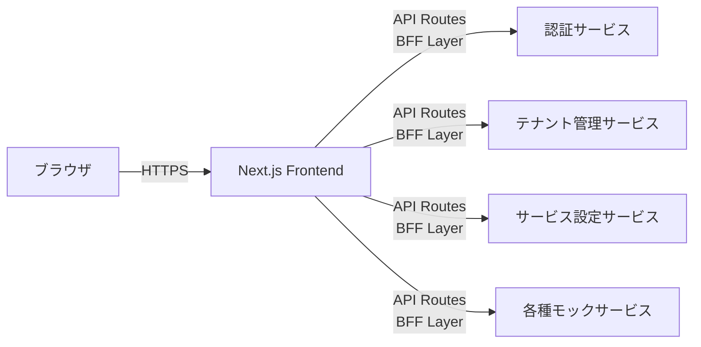
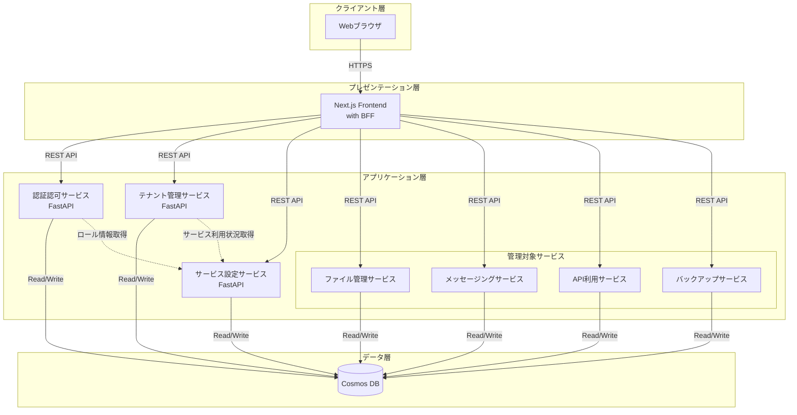
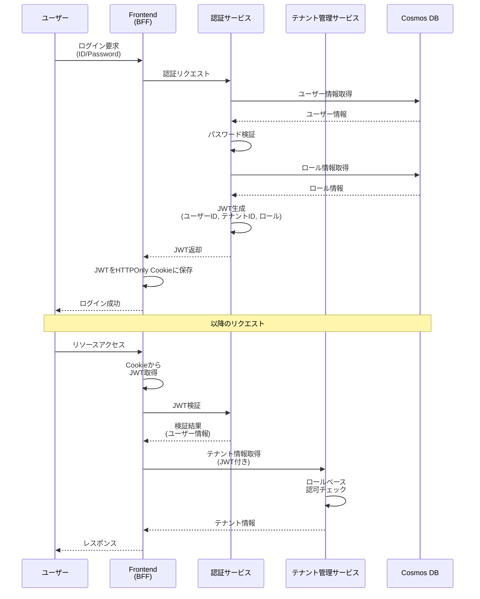
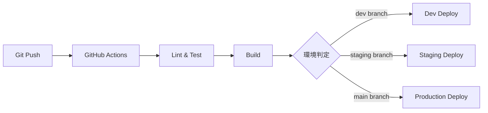

# システムアーキテクチャ概要

## ドキュメント情報
- バージョン: 1.0.0
- 最終更新日: 2026-02-01
- 対象システム: マルチテナント管理アプリケーション

## 1. システム概要

本システムは、複数のサービスを提供する会社が、各テナント（クライアント企業）に対してサービスの利用管理を行うためのマルチテナント管理アプリケーションです。特権テナント（管理会社自身）が、通常テナント（クライアント企業）のユーザー、権限、サービス利用状況を一元管理します。

### 1.1 システムの目的
- テナント及びテナント所属ユーザーの管理
- サービス利用状況の管理と制御
- ロールベースのアクセス制御（RBAC）による柔軟な権限管理
- 最小限のコストで運用可能なクラウドネイティブアーキテクチャ

### 1.2 主要な特徴
- **マイクロサービスアーキテクチャ**: 各ドメインを独立したサービスとして疎結合に構成
- **特権テナント制御**: 管理会社が特権テナントとして全体を管理
- **BFFパターン**: Next.jsのAPI Routesを活用したBackend for Frontend構成
- **コスト最適化**: Azure Cosmos DBとApp Serviceを活用した最小コスト構成
- **スケーラビリティ**: 将来的なサービス追加を容易にする拡張可能な設計

## 2. アーキテクチャスタイル

### 2.1 マイクロサービスアーキテクチャ
本システムは以下の理由からマイクロサービスアーキテクチャを採用しています：

- **ドメイン分離**: テナント管理、認証認可、サービス設定の各ドメインを独立して開発・運用
- **技術柔軟性**: バックエンドはPython/FastAPI、フロントエンドはNext.jsと最適な技術を選択
- **独立デプロイ**: 各サービスを個別にデプロイ可能で、影響範囲を限定
- **スケーラビリティ**: 負荷に応じて特定サービスのみをスケール可能

### 2.2 BFFパターン
フロントエンドアプリケーションは、Next.jsのAPI Routesを使用したBFFパターンを採用：

**BFFパターンの利点**:
- フロントエンドに最適化されたAPIインターフェース
- バックエンドサービスの複雑性を隠蔽
- 認証トークンの安全な管理（サーバーサイド処理）
- APIゲートウェイの役割を果たし、ルーティングとオーケストレーション

## 3. システム構成図

### 3.1 全体アーキテクチャ

### 3.2 認証認可フロー

## 4. コンポーネント一覧

### 4.1 コアサービス

| サービス名 | 技術スタック | 責務 | データストア |
|----------|------------|------|------------|
| Frontend | Next.js 14+, React | UI提供、BFF層 | - |
| 認証認可サービス | Python 3.11+, FastAPI | ユーザー認証、JWT発行/検証、ロール管理 | Cosmos DB (auth container) |
| テナント管理サービス | Python 3.11+, FastAPI | テナント・ユーザー管理 | Cosmos DB (tenant container) |
| サービス設定サービス | Python 3.11+, FastAPI | テナント毎のサービス利用設定 | Cosmos DB (service-setting container) |

### 4.2 管理対象サービス（モック）

| サービス名 | 主要機能 | ロール例 |
|----------|---------|---------|
| ファイル管理サービス | ファイルアップロード・ダウンロード・管理 | 管理者、編集者、閲覧者 |
| メッセージングサービス | メッセージ送受信、チャネル管理 | 管理者、メンバー、閲覧者 |
| API利用サービス | 外部API利用状況の監視・制御 | 管理者、開発者、閲覧者 |
| バックアップサービス | データバックアップ・リストア | 管理者、オペレーター、閲覧者 |

## 5. 技術スタック詳細

### 5.1 フロントエンド
- **フレームワーク**: Next.js 14 (App Router)
- **UI言語**: TypeScript
- **UIライブラリ**: React 18
- **状態管理**: React Context API / TanStack Query
- **スタイリング**: Tailwind CSS / CSS Modules
- **認証**: JWT (HTTPOnly Cookie)

### 5.2 バックエンド
- **フレームワーク**: FastAPI 0.100+
- **言語**: Python 3.11+
- **非同期処理**: asyncio, httpx
- **バリデーション**: Pydantic v2
- **認証**: JWT (python-jose)
- **CORS**: FastAPI middleware

### 5.3 データストア
- **データベース**: Azure Cosmos DB (NoSQL API)
- **パーティション戦略**: テナントIDによるパーティショニング
- **整合性レベル**: Session (デフォルト) - コストと性能のバランス

### 5.4 共通ライブラリ
- **パッケージ名**: common
- **言語**: Python 3.11+
- **主要モジュール**:
  - **認証 (common.auth)**: JWT生成・検証、認証Middleware、ロールベース認可デコレータ
  - **データベース (common.database)**: Cosmos DB接続管理（シングルトン）、BaseRepositoryクラス（テナント分離強制）
  - **ロギング (common.logging)**: 構造化ログ（JSON形式）、Application Insights統合
  - **モデル (common.models)**: 基底BaseModel、標準ErrorResponse
  - **ミドルウェア (common.middleware)**: エラーハンドリング、リクエストID生成、CORS設定
  - **ユーティリティ (common.utils)**: バリデーター、ヘルパー関数（パスワードハッシュ化等）
- **ビジネス価値**:
  - 各サービスの開発時間を30-40%削減
  - コードレビュー時間を50%削減、セキュリティリスクを70%低減
  - バグ修正時間を60%削減
  - オンボーディング期間を2週間短縮
  - テストカバレッジ80%以上を保証
- **セキュリティ機能**:
  - BaseRepositoryによる3層のテナント分離チェック（パーティションキー強制、クエリ内テナントIDフィルタ検証、パラメータ検証）
  - セキュリティ違反の自動検知とアラート
  - パラメータ化クエリによるインジェクション防止
  - ログ内機密情報の自動マスキング

### 5.5 インフラストラクチャ
- **ホスティング**: Azure App Service (B1プラン - 最小コスト構成)
- **IaC**: Azure Bicep
- **CI/CD**: GitHub Actions
- **監視**: Azure Application Insights (基本監視)

## 6. データパーティション戦略

### 6.1 Cosmos DB コンテナ設計

各サービスは専用のコンテナを持ち、テナントIDをパーティションキーとして使用します：

| コンテナ名 | パーティションキー | 主要エンティティ |
|----------|----------------|---------------|
| auth | /tenantId | User, Role, RoleAssignment |
| tenant | /tenantId | Tenant, TenantUser, Domain |
| service-setting | /tenantId | ServiceAssignment, ServiceConfig |
| file-service | /tenantId | File, Folder |
| messaging-service | /tenantId | Message, Channel |
| api-service | /tenantId | APIKey, Usage |
| backup-service | /tenantId | BackupJob, BackupHistory |

**設計理由**:
- テナント単位でデータを分離し、マルチテナンシーを実現
- 同一テナントのデータを同じパーティションに配置し、クエリ効率を最大化
- クロスパーティションクエリを最小化してコスト削減

### 6.2 特権テナントの扱い
- 特権テナントも通常テナントと同じコンテナに格納
- `isPrivileged: true` フラグで識別
- アプリケーション層で削除・編集の制限を実装

## 7. セキュリティ設計

### 7.1 認証方式
- **プライマリ**: JWT (JSON Web Token)
- **トークン保存**: HTTPOnly Cookie (XSS対策)
- **トークン有効期限**: 1時間 (設定可能)
- **リフレッシュトークン**: Phase 2で実装予定

### 7.2 認可方式
- **RBAC (Role-Based Access Control)**: ロールベースのアクセス制御
- **サービス横断ロール管理**: 各サービスが独自のロールセットを定義
- **動的ロール取得**: 認証サービスが各サービスのロール情報を動的に取得

### 7.3 通信セキュリティ
- **HTTPS必須**: 全ての通信をTLS 1.2以上で暗号化
- **CORS設定**: フロントエンドドメインのみ許可
- **APIキー**: サービス間通信には共有秘密鍵を使用（環境変数管理）

### 7.4 データセキュリティ
- **パスワードハッシュ化**: bcrypt (cost factor: 12)
- **機密情報暗号化**: Azure Key Vaultを使用（Phase 2）
- **監査ログ**: 重要操作のログ記録

## 8. スケーラビリティとパフォーマンス

### 8.1 非機能要件（定量的指標）

#### 8.1.1 パフォーマンス要件
- **API応答時間（P95）**: 200ms以下（単一パーティションクエリ）
- **API応答時間（P95）**: 500ms以下（クロスパーティションクエリ）
- **ページ初期表示（FCP）**: 1.5秒以内
- **ページ完全表示（LCP）**: 2.5秒以内
- **最大同時リクエスト**: 1000 req/sec（App Serviceプランあたり）
- **最大同時ユーザー**: 500ユーザー（初期構成）
- **データベース操作**: 400 RU/s（平均）、4000 RU/s（ピーク時）

#### 8.1.2 スケーラビリティ要件
- **テナント数**: 最大100テナント（Phase 1）
- **ユーザー数**: テナントあたり最大500ユーザー
- **データ容量**: テナントあたり50GB（標準プラン）
- **成長予測**: 年間20%増を想定したスケーリング計画

#### 8.1.3 可用性要件
- **SLA**: 99.9%（年間ダウンタイム8.76時間以内）
- **RTO（目標復旧時間）**: 1時間
- **RPO（目標復旧時点）**: 1時間
- **計画メンテナンス**: 月1回、最大2時間（深夜時間帯）
- **部分的機能停止の扱い**: 認証サービス以外の停止は可用性にカウントしない

### 8.2 スケーリング戦略
- **水平スケーリング**: Azure App Serviceのオートスケール機能
  - CPU使用率70%で自動スケールアウト
  - 最小1インスタンス、最大3インスタンス（Phase 1）
- **データベーススケーリング**: Cosmos DBのRU自動スケール（最小400RU/s、最大4000RU/s）
- **CDN**: 静的アセットはNext.jsの最適化機能を活用

### 8.3 パフォーマンス最適化
- **キャッシュ戦略**: Next.jsのデータフェッチキャッシュ（最小構成のためRedis不使用）
- **クエリ最適化**: パーティションキーを必ず含むクエリ設計
- **接続プーリング**: FastAPIの非同期DB接続プーリング

### 8.4 効率性の考慮
- **ページネーション**: 大規模リスト取得時の継続トークン使用
- **遅延読み込み**: フロントエンドでの段階的データ取得
- **最小データ転送**: 必要なフィールドのみを返却

## 9. 可用性と運用

### 9.1 可用性目標
- **SLA**: 99.9% (Azure App ServiceとCosmos DBの標準SLA)
- **RTO**: 1時間
- **RPO**: 1時間

### 9.2 監視とロギング
- **Application Insights**: エラー監視、パフォーマンス監視
- **構造化ログ**: JSON形式のログ出力
- **ヘルスチェック**: 各サービスの /health エンドポイント

### 9.3 バックアップとリカバリ
- **Cosmos DB自動バックアップ**: 継続的バックアップモード（30日保持）
- **アプリケーションコード**: GitHubリポジトリ管理
- **インフラコード**: Bicepテンプレートでの再現性確保

## 10. デプロイメント戦略

### 10.1 環境構成
- **開発環境**: DevContainer（ローカル開発）
- **ステージング環境**: Azure (検証用)
- **本番環境**: Azure (本番用)

### 10.2 CI/CDパイプライン

### 10.3 デプロイメント戦略
- **ブルーグリーンデプロイ**: App Serviceのスロット機能を使用
- **データベースマイグレーション**: スキーマレスなCosmos DBのため最小限
- **ロールバック**: 前バージョンスロットへのスワップ

## 11. コスト最適化

### 11.1 最小コスト構成

#### 11.1.1 前提条件
- **想定テナント数**: 10テナント
- **想定ユーザー数**: テナントあたり平均50ユーザー（合計500ユーザー）
- **想定トラフィック量**: 100,000 リクエスト/月
- **データ量**: 合計10GB
- **リージョン**: Japan East（東日本）
- **稼働時間**: 24時間365日

#### 11.1.2 コスト内訳
| リソース | プラン | 月額概算 (USD) | 備考 |
|---------|-------|----------------|------|
| App Service (Frontend) | B1 | $13 | 1インスタンス |
| App Service (Backend Services) x4 | B1 | $52 | 各サービス1インスタンス |
| Cosmos DB | 最小400RU/s自動スケール | $24 | 平均400RU/s想定 |
| Application Insights | 基本監視 | $5 | 5GB/月まで無料枠内 |
| **合計** | | **$94** | |

#### 11.1.3 成長シナリオ別コスト予測

| シナリオ | テナント数 | ユーザー数 | 月額概算 (USD) |
|---------|----------|----------|----------------|
| 最小構成（現在） | 10 | 500 | $94 |
| 中規模（6ヶ月後） | 30 | 1,500 | $180 |
| 大規模（1年後） | 100 | 5,000 | $420 |

**注**: 大規模シナリオではApp Service Planのスケールアップ（S1）とCosmos DB RU増加を想定

### 11.2 コスト削減施策
- **共有App Serviceプラン**: 複数サービスを同一プランで実行可能（最大$26削減）
- **キャッシュ最小化**: Redisなどの追加キャッシュ層を排除
- **自動スケール**: 負荷に応じたRU自動調整（夜間は最小RUに縮小）
- **開発環境共有**: DevContainerでのローカル開発（Azure コスト削減）
- **データ保持ポリシー**: 古いログの自動削除（TTL設定）

## 12. 将来的な拡張性

### 12.1 Phase 2以降の考慮事項
- **API Gateway導入**: Azure API Managementでの統一管理
- **イベント駆動**: Azure Service Busを使った非同期連携
- **キャッシュ層**: Redis導入による高速化
- **マルチリージョン**: グローバル展開時のCosmos DBマルチリージョン構成

### 12.2 新規サービス追加の容易性
- **プラグアブル設計**: 新サービスは同じパターンで追加可能
- **ロール自動統合**: サービス設定サービス経由で自動的にロール情報を統合
- **独立デプロイ**: 既存サービスに影響なく新サービスをリリース

## 13. 設計原則

### 13.1 アーキテクチャ原則
1. **疎結合**: サービス間の依存を最小化し、REST APIで連携
2. **高凝集**: 各サービスは明確なドメイン責務を持つ
3. **単一責務**: 1サービス1ドメイン原則
4. **API First**: OpenAPI仕様を先に定義し、契約駆動開発
5. **クラウドネイティブ**: Azure PaaS サービスを最大活用

### 13.2 開発原則
1. **12-Factor App**: 設定の環境変数化、ステートレス設計
2. **DRY (Don't Repeat Yourself)**: 共通処理のライブラリ化
3. **KISS (Keep It Simple, Stupid)**: 過度な抽象化を避け、シンプルに保つ
4. **YAGNI (You Aren't Gonna Need It)**: 現在必要な機能のみを実装

## 14. 参照ドキュメント

本アーキテクチャの詳細については、以下のドキュメントを参照してください：

- [コンポーネント設計](./components/README.md)
- [データモデル設計](./data/README.md)
- [API設計](./api/README.md)
- [セキュリティ設計](./security/README.md)
- [デプロイメント設計](./deployment/README.md)

## 15. 変更履歴

| バージョン | 日付 | 変更内容 | 作成者 |
|----------|------|---------|--------|
| 1.0.0 | 2026-02-01 | 初版作成 | Architecture Team |
| 1.1.0 | 2026-02-01 | 非機能要件の定量化、コスト見積もり前提条件の明確化（アーキテクチャレビュー対応） | Architecture Team |
| 1.2.0 | 2026-02-01 | 共通ライブラリの技術スタックセクションを追加、主要モジュールとビジネス価値を明記 | Architecture Team |
