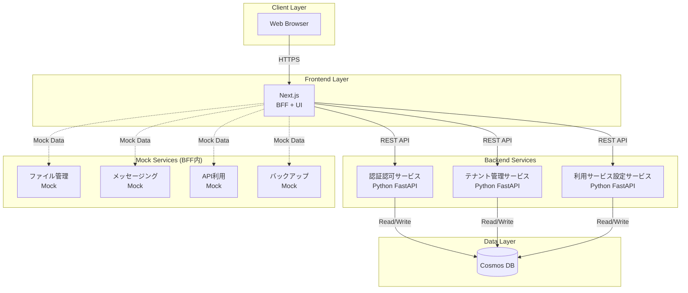
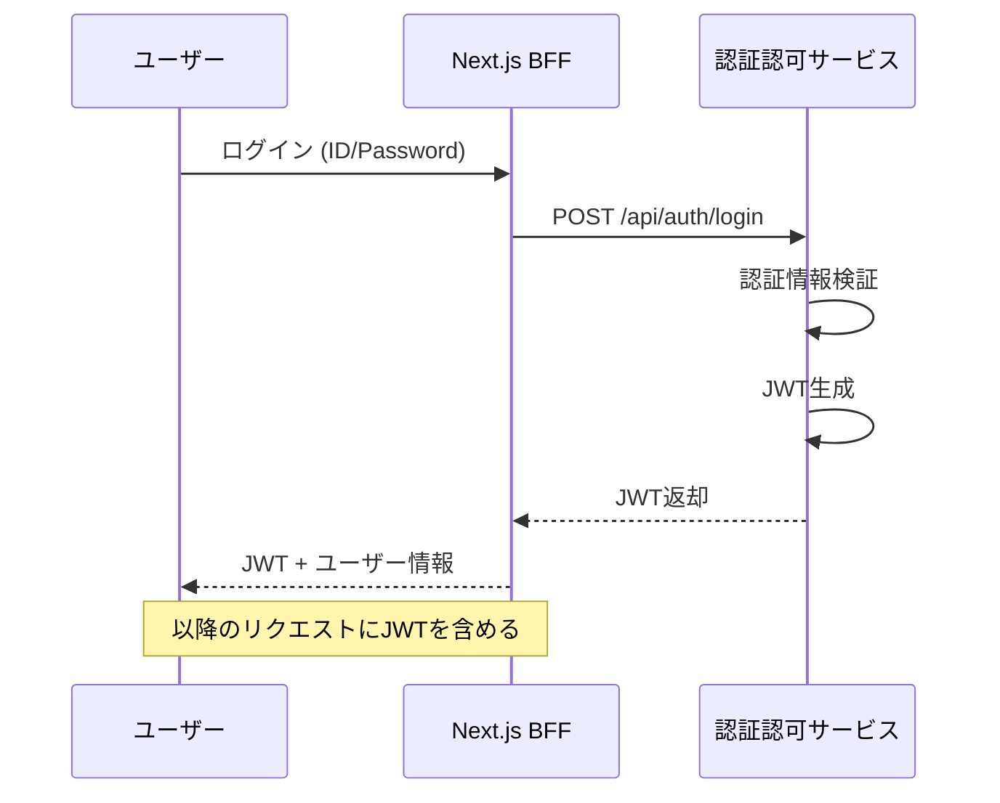
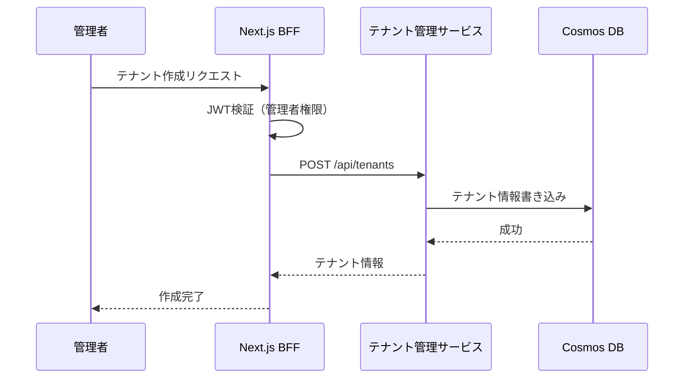
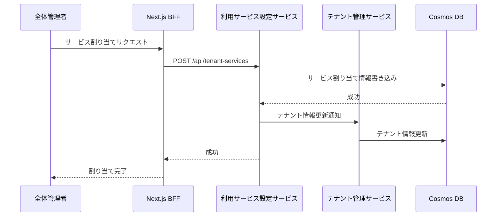
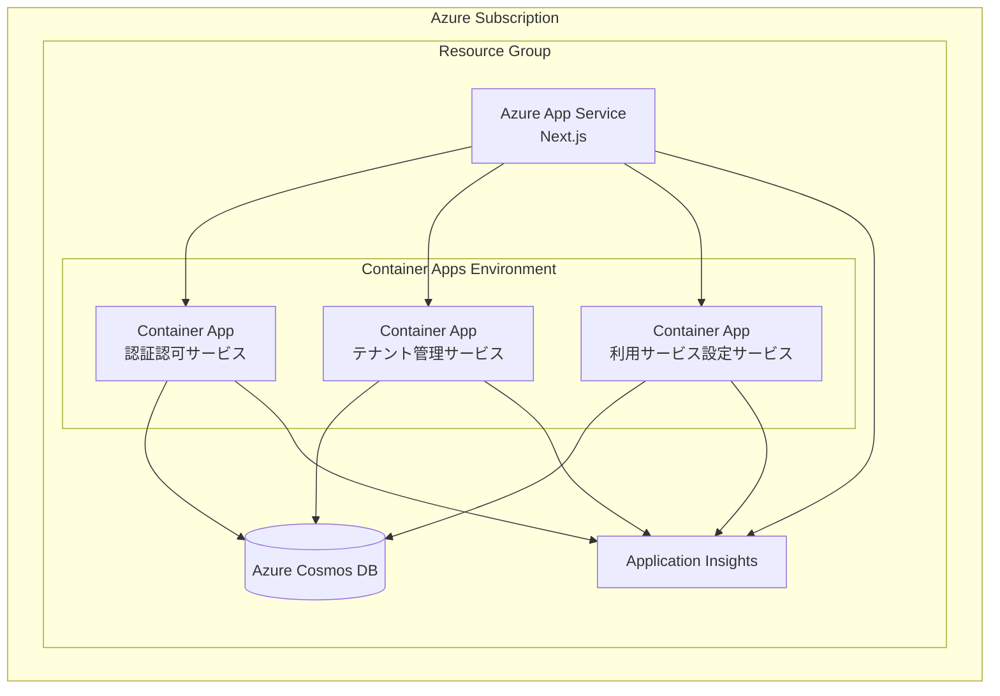

# アーキテクチャ概要

## ドキュメント情報

- **バージョン**: 1.0.0
- **最終更新日**: 2024年
- **ステータス**: Draft

---

## 1. システム概要

本システムは、複数サービスを提供する会社の管理アプリケーションのPoCです。
テナント管理、ユーザー認証認可、サービス割り当て機能を提供し、マイクロサービスアーキテクチャで構成されています。

### 1.1 目的

- テナントとユーザーのライフサイクル管理
- ロールベースのアクセス制御（RBAC）
- テナントごとのサービス利用設定
- 特権テナントによる全体管理

### 1.2 対象ユーザー

- **全体管理者**: 特権テナントに所属し、すべての機能にアクセス可能
- **管理者**: 通常のテナント管理とユーザー管理が可能
- **閲覧者**: 情報の参照のみ可能

---

## 2. アーキテクチャスタイル

本システムは**マイクロサービスアーキテクチャ**を採用し、以下の設計原則に基づいています：

- **疎結合**: 各サービスは独立してデプロイ・スケール可能
- **BFF (Backend for Frontend)**: フロントエンドは専用のBFF層を経由してバックエンドサービスにアクセス
- **ドメイン駆動設計**: 各サービスは明確なビジネスドメインに対応
- **シンプル設計**: PoCのため、必要最小限の構成で構築

---

## 3. システム構成図

---

## 4. 技術スタック

### 4.1 フロントエンド

| 技術 | 用途 |
|------|------|
| **React** | UI構築 |
| **Next.js** | フレームワーク、BFF機能、SSR |
| **TypeScript** | 型安全性 |

### 4.2 バックエンド

| 技術 | 用途 |
|------|------|
| **Python 3.11+** | プログラミング言語 |
| **FastAPI** | Webフレームワーク |
| **Pydantic** | データバリデーション |
| **Azure SDK for Python** | Cosmos DB接続 |

### 4.3 データストア

| 技術 | 用途 |
|------|------|
| **Azure Cosmos DB** | NoSQLデータベース（API for NoSQL） |

### 4.4 インフラストラクチャ

| 技術 | 用途 |
|------|------|
| **Azure Bicep** | IaC（Infrastructure as Code） |
| **Azure App Service** | アプリケーションホスティング |
| **Azure Container Apps** | コンテナホスティング（オプション） |

---

## 5. 主要コンポーネント

### 5.1 Frontend (Next.js)

- **役割**: ユーザーインターフェース提供とBFF機能
- **責務**:
  - React UIコンポーネントのレンダリング
  - バックエンドサービスへのAPIリクエスト集約
  - モックサービスのデータ返却
  - JWT認証トークンの管理
  - クライアントサイドルーティング

### 5.2 認証認可サービス

- **役割**: ユーザー認証と認可情報の管理
- **責務**:
  - ユーザーの登録・更新・削除
  - ID/パスワード認証
  - JWT発行と検証
  - ロール情報の管理
  - 他サービスからのロール情報収集

### 5.3 テナント管理サービス

- **役割**: テナントとテナント所属ユーザーの管理
- **責務**:
  - テナントのCRUD操作
  - テナントへのユーザー紐付け
  - 特権テナントの保護
  - テナントドメイン管理
  - テナント利用サービス情報の参照

### 5.4 利用サービス設定サービス

- **役割**: テナントごとのサービス利用設定
- **責務**:
  - テナントへのサービス割り当て
  - サービス利用状況の管理
  - サービス一覧の提供

### 5.5 モックサービス (BFF内)

- **役割**: 実サービスのモック実装
- **対象サービス**:
  - ファイル管理サービス
  - メッセージングサービス
  - API利用サービス
  - バックアップサービス

---

## 6. データフロー

### 6.1 認証フロー

### 6.2 テナント作成フロー

### 6.3 サービス割り当てフロー

---

## 7. 認証・認可モデル

### 7.1 認証方式

- **方式**: JWT (JSON Web Token) ベース認証
- **トークン有効期限**: 24時間（設定可能）
- **リフレッシュトークン**: PoCのため未実装

### 7.2 認可モデル

#### ロール定義

| サービス | ロール | 権限 |
|---------|--------|------|
| **共通** | 全体管理者 | すべての操作が可能 |
| **テナント管理** | 管理者 | 通常テナントのCRUD |
| **テナント管理** | 閲覧者 | テナント情報の参照のみ |
| **認証認可** | 全体管理者 | ユーザーの登録・削除 |
| **認証認可** | 閲覧者 | ユーザー情報の参照のみ |
| **利用サービス設定** | 全体管理者 | サービス割り当て可能 |
| **利用サービス設定** | 閲覧者 | 情報の参照のみ |
| **ファイル管理** | 管理者 | ファイルのアップロード・削除 |
| **ファイル管理** | ユーザー | ファイルの閲覧・ダウンロード |
| **メッセージング** | 管理者 | メッセージの送信・削除 |
| **メッセージング** | ユーザー | メッセージの閲覧 |
| **API利用** | 管理者 | API設定の変更 |
| **API利用** | ユーザー | API利用のみ |
| **バックアップ** | 管理者 | バックアップの実行・復元 |
| **バックアップ** | 閲覧者 | バックアップ状況の参照 |

#### 特権テナント

- システムに1つのみ存在
- 削除・編集不可
- 全体管理者のみが所属ユーザーを管理可能
- 本システムへのログインは特権テナント所属ユーザーのみ

---

## 8. セキュリティ考慮事項

### 8.1 認証セキュリティ

- パスワードはハッシュ化して保存（bcrypt使用）
- JWTには秘密鍵による署名を実施
- トークンには必要最小限の情報のみ含める

### 8.2 API セキュリティ

- すべてのAPIエンドポイントでJWT検証
- ロールベースでアクセス制御
- CORS設定による不正アクセス防止

### 8.3 データセキュリティ

- Cosmos DBへのアクセスはマネージドIDまたは接続文字列
- 機密情報は環境変数で管理
- PoCのため暗号化は最小限（Cosmos DB標準暗号化のみ）

---

## 9. 開発環境

### 9.1 ローカル開発環境

本プロジェクトはVS CodeのDev Containers機能を使用したDocker環境で開発を行います。

**主要コンポーネント**:
- **DevContainer**: Python 3.11 + Node.js 18.x + Azure CLI
- **Cosmos DB Emulator**: ローカルデータベース環境
- **ポート**: 3000 (Next.js), 8001-8003 (FastAPI), 8081 (Cosmos DB)

詳細は [開発環境設計](./development-environment.md) を参照してください。

---

## 10. デプロイメント構成

### 10.1 Azure リソース構成

### 10.2 環境構成

| 環境 | 用途 | デプロイ方式 | 詳細 |
|------|------|------------|------|
| **Development** | 開発環境（DevContainer） | ローカル実行 | [開発環境設計](./development-environment.md) |
| **Production** | 本番環境 | Azure デプロイ | [デプロイメント設計](./deployment.md) |

---

## 11. スケーラビリティとパフォーマンス

### 11.1 PoCの制約

- **キャッシュ**: Redis等は使用せず、最小限の構成
- **スケーリング**: 手動スケーリングのみ（オートスケール未実装）
- **パフォーマンス**: 小規模利用を想定

### 11.2 データベース設計

- Cosmos DBのパーティションキー設計により、テナント単位でのデータ分離
- RU（Request Unit）は最小構成（400 RU/s）

---

## 12. モニタリングとロギング

### 12.1 ログ戦略

- Application Insights による統合ログ
- 各サービスの標準出力をログとして収集
- エラーログとアクセスログを記録

### 12.2 メトリクス

- APIレスポンスタイム
- エラーレート
- Cosmos DB のRU消費量

---

## 13. 制約と前提

### 13.1 PoCとしての制約

- エンタープライズレベルのセキュリティは未実装
- 高可用性構成は未実装
- ディザスタリカバリは未実装
- 詳細な監視・アラートは未実装

### 13.2 技術的制約

- 最小コストでの構築
- シンプルな構成
- 必要最小限の機能実装

---

## 14. 関連ドキュメント

- [開発環境設計](./development-environment.md)
- [コンポーネント設計](./components/README.md)
- [データ設計](./data/data-model.md)
- [API設計](./api/api-specification.md)
- [デプロイメント設計](./deployment.md)

---

## 15. 用語集

| 用語 | 説明 |
|------|------|
| **テナント** | システムを利用する組織単位 |
| **特権テナント** | システム管理を行う特別なテナント |
| **BFF** | Backend for Frontend。フロントエンド専用のバックエンド層 |
| **JWT** | JSON Web Token。認証トークン形式 |
| **RBAC** | Role-Based Access Control。ロールベースアクセス制御 |
| **PoC** | Proof of Concept。概念実証 |
| **RU** | Request Unit。Cosmos DBの処理能力単位 |

---

## 変更履歴

| バージョン | 日付 | 変更内容 | 作成者 |
|-----------|------|---------|-------|
| 1.1.0 | 2024 | 開発環境セクション追加 | Architecture Agent |
| 1.0.0 | 2024 | 初版作成 | Architecture Agent |
