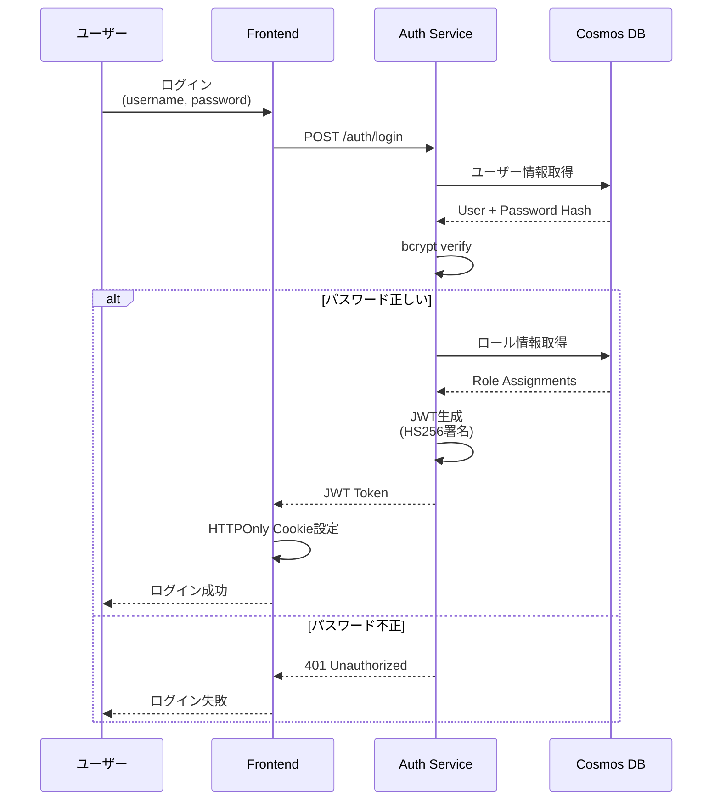
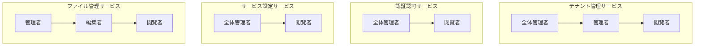

# セキュリティ設計

## ドキュメント情報
- バージョン: 1.0.0
- 最終更新日: 2026-02-01
- 関連: [システムアーキテクチャ概要](../overview.md)

## 1. セキュリティ概要

### 1.1 セキュリティ目標
本システムのセキュリティ設計は、以下の目標を達成します：

- **機密性 (Confidentiality)**: 認可されたユーザーのみがデータにアクセス可能
- **完全性 (Integrity)**: データの改ざん防止と検出
- **可用性 (Availability)**: 正当なユーザーが必要なときにサービスを利用可能
- **説明責任 (Accountability)**: 全ての操作が監査可能

### 1.2 セキュリティ原則
- **ゼロトラスト**: 全てのリクエストを検証、内部ネットワークも信用しない
- **最小権限の原則**: 必要最小限の権限のみを付与
- **多層防御**: 複数のセキュリティ層で保護
- **セキュアバイデフォルト**: デフォルト設定で安全を確保

### 1.3 脅威モデル
以下の脅威からシステムを保護します：

| 脅威分類 | 具体的な脅威 | 対策 |
|---------|------------|------|
| 認証攻撃 | パスワード推測、総当たり攻撃 | パスワードポリシー、レート制限 |
| 認可攻撃 | 権限昇格、横断的アクセス | RBAC、テナント分離 |
| インジェクション | SQLインジェクション、XSS | パラメータ化クエリ、入力検証 |
| セッション攻撃 | セッションハイジャック、CSRF | HTTPOnly Cookie、CSRFトークン |
| データ漏洩 | 不正アクセス、内部犯行 | 暗号化、監査ログ |
| DoS/DDoS | サービス妨害攻撃 | レート制限、オートスケール |

### 1.4 STRIDE脅威分析

STRIDE (Spoofing, Tampering, Repudiation, Information Disclosure, Denial of Service, Elevation of Privilege) モデルに基づく体系的な脅威分析を実施します。

#### 1.4.1 S - Spoofing（なりすまし）
| 脅威 | 影響 | 対策 | 実装状況 |
|-----|------|------|---------|
| JWT偽造 | テナント横断アクセス | HS256署名、秘密鍵厳格管理 | ✅ 実装済み |
| API キー漏洩 | 不正API利用 | キーのハッシュ保存、定期ローテーション | ⚠️ ローテーション未実装（Phase 2） |
| セッションハイジャック | ユーザーなりすまし | HTTPOnly Cookie、Secure属性 | ✅ 実装済み |
| パスワードリセット悪用 | アカウント乗っ取り | メール検証、ワンタイムトークン | ❌ Phase 2実装予定 |
| サービス間認証偽装 | 内部サービスへの不正アクセス | 共有秘密鍵、相互TLS | ⚠️ 共有秘密鍵のみ実装 |

**対策の詳細**:
- JWT署名検証を全エンドポイントで必須化
- 秘密鍵は環境変数で管理、Azure Key Vaultへ移行予定（Phase 2）
- Cookie属性: `httpOnly=true, secure=true, sameSite=strict`

#### 1.4.2 T - Tampering（改ざん）
| 脅威 | 影響 | 対策 | 実装状況 |
|-----|------|------|---------|
| JWT改ざん | 権限昇格 | 署名検証 | ✅ 実装済み |
| リクエストパラメータ改ざん | 不正データ作成 | Pydanticバリデーション | ✅ 実装済み |
| データベース直接アクセス | データ破壊 | RBAC、監査ログ | ⚠️ Cosmos DB RBAC未設定 |
| ログ改ざん | 証拠隠滅 | ログの改ざん防止機構 | ⚠️ Application Insightsで自動保護 |
| 設定ファイル改ざん | システム制御奪取 | 読み取り専用マウント、署名検証 | ❌ Phase 2で実装予定 |

**対策の詳細**:
- 全入力をPydantic v2でバリデーション
- Cosmos DBへのアクセスはアプリケーション層経由のみ
- 設定変更は監査ログに記録

#### 1.4.3 R - Repudiation（否認）
| 脅威 | 影響 | 対策 | 実装状況 |
|-----|------|------|---------|
| 操作の否認 | 責任追跡不可 | 包括的な監査ログ | ✅ 実装済み |
| ログイン履歴の否認 | 不正アクセスの証明困難 | IPアドレス、タイムスタンプ記録 | ✅ 実装済み |
| データ削除の否認 | 削除の責任回避 | 削除前後の状態を監査ログに記録 | ✅ 実装済み |
| ログの否認 | 改ざん検知不能 | ログの暗号学的署名 | ❌ Phase 3で実装予定 |

**対策の詳細**:
- 全ての重要操作（CRUD、ロール変更、テナント操作）を監査ログに記録
- ログに含める情報: ユーザーID、テナントID、操作内容、変更前後の値、IPアドレス、タイムスタンプ
- 監査ログの保持期間: 7年（コンプライアンス要件）

#### 1.4.4 I - Information Disclosure（情報漏洩）
| 脅威 | 影響 | 対策 | 実装状況 |
|-----|------|------|---------|
| テナント横断クエリ | 他社データ閲覧 | パーティションキー強制、テナントID検証 | ⚠️ アプリ層のみ、DB層なし |
| ログ内の機密情報 | パスワード等の漏洩 | ログフィルタリング、マスキング | ❌ Phase 2で実装予定 |
| エラーメッセージ詳細 | システム情報漏洩 | 汎用エラーメッセージ | ⚠️ 本番環境で要設定 |
| APIレスポンス過剰 | 不要な情報漏洩 | フィールド制限、最小権限 | ✅ 実装済み |
| バックアップデータ漏洩 | 大量データ流出 | 暗号化、アクセス制御 | ✅ Cosmos DB自動暗号化 |
| ブラウザキャッシュ | 機密情報残留 | Cache-Control ヘッダー | ⚠️ 要確認 |

**特にクリティカルな対策**:

**テナント横断アクセス防止**:
```python
async def get_users(tenant_id: str, current_user: User) -> List[User]:
    """ユーザー一覧取得（テナント分離強制）"""
    # 1. 特権テナント以外は自テナントのみアクセス可能
    if current_user.tenant_id != "tenant_privileged":
        if current_user.tenant_id != tenant_id:
            raise HTTPException(
                status_code=403,
                detail="Cross-tenant access denied"
            )
    
    # 2. パーティションキーでフィルタリング（必須）
    query = "SELECT * FROM c WHERE c.tenantId = @tenant_id AND c.type = 'user'"
    parameters = [{"name": "@tenant_id", "value": tenant_id}]
    
    users = await container.query_items(
        query=query,
        parameters=parameters,
        partition_key=tenant_id  # 単一パーティションクエリ強制
    )
    
    return [User(**u) for u in users]
```

**ログマスキング（Phase 2）**:
```python
import re

def mask_sensitive_data(log_message: str) -> str:
    """ログ内の機密情報をマスキング"""
    # パスワードフィールド
    log_message = re.sub(
        r'"password"\s*:\s*"[^"]*"',
        '"password": "***MASKED***"',
        log_message
    )
    # クレジットカード番号
    log_message = re.sub(
        r'\b\d{4}[-\s]?\d{4}[-\s]?\d{4}[-\s]?\d{4}\b',
        '****-****-****-****',
        log_message
    )
    # メールアドレスの一部マスキング
    log_message = re.sub(
        r'([a-zA-Z0-9._%+-]{1,3})[a-zA-Z0-9._%+-]*@',
        r'\1***@',
        log_message
    )
    return log_message
```

#### 1.4.5 D - Denial of Service（サービス拒否）
| 脅威 | 影響 | 対策 | 実装状況 |
|-----|------|------|---------|
| API flood攻撃 | サービス停止 | レート制限（5req/min for login, 100req/min for others） | ✅ 実装済み |
| 大量データクエリ | RU枯渇、パフォーマンス低下 | ページネーション強制、最大件数制限 | ⚠️ 一部エンドポイントのみ |
| ファイルアップロード爆弾 | ストレージ枯渇 | サイズ制限、テナント別クォータ | ❌ クォータ未実装（Phase 2） |
| CPU集約的処理 | リソース枯渇 | タイムアウト、複雑度制限 | ⚠️ タイムアウトのみ |
| 接続プール枯渇 | 新規接続不可 | 接続数制限、タイムアウト | ✅ 実装済み |
| Cosmos DB RU消費 | データベース停止 | 自動スケール、アラート | ✅ 実装済み |

**対策の詳細**:
- レート制限: SlowAPI使用、IP/ユーザー単位で制限
- ページネーション: 全リストエンドポイントで最大100件/ページ
- ファイルサイズ制限: 最大10MB/ファイル（設定可能）
- クエリタイムアウト: 2秒（単一パーティション）、10秒（クロスパーティション）

```python
from slowapi import Limiter
from slowapi.util import get_remote_address

limiter = Limiter(key_func=get_remote_address)

@app.post("/auth/login")
@limiter.limit("5/minute")  # 認証は厳しく
async def login(request: Request):
    pass

@app.get("/api/users")
@limiter.limit("100/minute")  # 通常APIは緩く
async def list_users(request: Request, page_size: int = 20):
    if page_size > 100:
        raise HTTPException(400, "Maximum page size is 100")
    pass
```

#### 1.4.6 E - Elevation of Privilege（権限昇格）
| 脅威 | 影響 | 対策 | 実装状況 |
|-----|------|------|---------|
| ロール割り当て改ざん | 管理者権限取得 | ロール変更の監査ログ、全体管理者のみ許可 | ✅ 実装済み |
| 特権テナント編集 | システム管理者権限 | isPrivilegedフラグチェック、編集・削除禁止 | ✅ 実装済み |
| パスワードリセット悪用 | アカウント乗っ取り | メール検証、ログ記録 | ❌ Phase 2実装予定 |
| APIエンドポイント直接呼び出し | 認可バイパス | 全エンドポイントで認証・認可チェック | ✅ 実装済み |
| JWT Claim改ざん | 権限偽装 | 署名検証、Claim検証 | ✅ 実装済み |
| SQL/NoSQLインジェクション | データベース制御 | パラメータ化クエリ、入力検証 | ✅ 実装済み |

**特権テナント保護の実装**:
```python
async def update_tenant(tenant_id: str, data: TenantUpdateRequest, current_user: User):
    """テナント更新（特権テナント保護）"""
    tenant = await tenant_repository.get(tenant_id)
    
    # 特権テナントは編集不可
    if tenant.is_privileged:
        raise HTTPException(
            status_code=403,
            detail="Privileged tenant cannot be modified"
        )
    
    # 権限チェック
    if not current_user.has_role("管理者", "tenant-management"):
        raise HTTPException(status_code=403, detail="Admin role required")
    
    # 監査ログ記録
    await log_audit(
        action="tenant.update",
        target_type="tenant",
        target_id=tenant_id,
        user=current_user,
        changes=data.dict(exclude_unset=True)
    )
    
    return await tenant_repository.update(tenant_id, data)
```

### 1.5 脅威の優先度

| 優先度 | STRIDE分類 | 対応状況 |
|-------|-----------|---------|
| 🔴 Critical | テナント横断アクセス (I) | ⚠️ 要強化 |
| 🔴 Critical | 特権昇格 (E) | ✅ 対策済み |
| 🟠 High | JWT偽造 (S) | ✅ 対策済み |
| 🟠 High | DoS攻撃 (D) | ⚠️ 部分的対策 |
| 🟡 Medium | ログ内機密情報漏洩 (I) | ❌ Phase 2対応 |
| 🟡 Medium | データ改ざん (T) | ✅ 対策済み |
| 🟢 Low | 操作否認 (R) | ✅ 対策済み |

## 2. 認証 (Authentication)

### 2.1 認証方式

#### 2.1.1 JWT (JSON Web Token)
本システムの主要な認証方式としてJWTを採用します。

**JWT構造**:
```
Header.Payload.Signature
```

**Headerサンプル**:
```json
{
  "alg": "HS256",
  "typ": "JWT"
}
```

**Payloadサンプル**:
```json
{
  "sub": "user_550e8400-e29b-41d4-a716-446655440000",
  "username": "admin@example.com",
  "tenant_id": "tenant_123",
  "roles": [
    {
      "service": "tenant-management",
      "role": "管理者"
    },
    {
      "service": "auth-service",
      "role": "全体管理者"
    }
  ],
  "iat": 1706179800,
  "exp": 1706183400,
  "jti": "jwt_abc123xyz"
}
```

**JWT発行フロー**:


### 2.2 パスワード管理

#### 2.2.1 パスワードポリシー
```python
# パスワード要件
PASSWORD_MIN_LENGTH = 12
PASSWORD_REQUIRE_UPPERCASE = True
PASSWORD_REQUIRE_LOWERCASE = True
PASSWORD_REQUIRE_DIGIT = True
PASSWORD_REQUIRE_SPECIAL_CHAR = True
PASSWORD_SPECIAL_CHARS = "!@#$%^&*()_+-=[]{}|;:,.<>?"

# 検証関数
def validate_password(password: str) -> bool:
    if len(password) < PASSWORD_MIN_LENGTH:
        return False
    if PASSWORD_REQUIRE_UPPERCASE and not any(c.isupper() for c in password):
        return False
    if PASSWORD_REQUIRE_LOWERCASE and not any(c.islower() for c in password):
        return False
    if PASSWORD_REQUIRE_DIGIT and not any(c.isdigit() for c in password):
        return False
    if PASSWORD_REQUIRE_SPECIAL_CHAR and not any(c in PASSWORD_SPECIAL_CHARS for c in password):
        return False
    return True
```

**パスワードポリシー**:
- 最小長: 12文字
- 大文字、小文字、数字、特殊文字を各1文字以上含む
- 過去3世代のパスワードは再利用不可（Phase 2）
- 90日ごとの変更推奨（Phase 2）

#### 2.2.2 パスワードハッシュ化
```python
import bcrypt

def hash_password(password: str) -> str:
    """bcryptでパスワードをハッシュ化"""
    salt = bcrypt.gensalt(rounds=12)  # cost factor: 12
    hashed = bcrypt.hashpw(password.encode('utf-8'), salt)
    return hashed.decode('utf-8')

def verify_password(password: str, hashed: str) -> bool:
    """パスワード検証"""
    return bcrypt.checkpw(
        password.encode('utf-8'),
        hashed.encode('utf-8')
    )
```

**ハッシュアルゴリズム**: bcrypt
**Cost Factor**: 12（計算コストとパフォーマンスのバランス）

### 2.3 JWT管理

#### 2.3.1 JWT生成
```python
import jwt
from datetime import datetime, timedelta

SECRET_KEY = os.getenv("JWT_SECRET_KEY")
ALGORITHM = "HS256"
ACCESS_TOKEN_EXPIRE_MINUTES = 60

def create_access_token(data: dict) -> str:
    """アクセストークン生成"""
    to_encode = data.copy()
    expire = datetime.utcnow() + timedelta(minutes=ACCESS_TOKEN_EXPIRE_MINUTES)
    to_encode.update({
        "exp": expire,
        "iat": datetime.utcnow(),
        "jti": str(uuid.uuid4())  # JWT ID
    })
    encoded_jwt = jwt.encode(to_encode, SECRET_KEY, algorithm=ALGORITHM)
    return encoded_jwt
```

#### 2.3.2 JWT検証
```python
def decode_access_token(token: str) -> dict:
    """トークン検証とデコード"""
    try:
        payload = jwt.decode(token, SECRET_KEY, algorithms=[ALGORITHM])
        return payload
    except jwt.ExpiredSignatureError:
        raise HTTPException(
            status_code=401,
            detail="Token has expired"
        )
    except jwt.JWTError:
        raise HTTPException(
            status_code=401,
            detail="Invalid token"
        )
```

#### 2.3.3 トークン保存（Frontend）
```typescript
// Next.js API Route での HTTPOnly Cookie 設定
export async function POST(request: Request) {
  const { username, password } = await request.json();
  
  // バックエンド認証
  const response = await fetch(`${AUTH_SERVICE_URL}/auth/login`, {
    method: 'POST',
    body: JSON.stringify({ username, password }),
  });
  
  const { accessToken } = await response.json();
  
  // HTTPOnly Cookie に保存（XSS対策）
  const cookieOptions = {
    httpOnly: true,      // JavaScriptからアクセス不可
    secure: true,        // HTTPS必須
    sameSite: 'strict',  // CSRF対策
    maxAge: 3600,        // 1時間
    path: '/',
  };
  
  cookies().set('auth_token', accessToken, cookieOptions);
  
  return NextResponse.json({ success: true });
}
```

### 2.4 認証失敗時の保護

#### 2.4.1 レート制限
```python
from slowapi import Limiter
from slowapi.util import get_remote_address

limiter = Limiter(key_func=get_remote_address)

@app.post("/auth/login")
@limiter.limit("5/minute")  # 1分間に5回まで
async def login(request: Request, credentials: LoginRequest):
    # ログイン処理
    pass
```

#### 2.4.2 アカウントロックアウト
```python
MAX_LOGIN_ATTEMPTS = 5
LOCKOUT_DURATION_MINUTES = 30

async def check_login_attempts(username: str) -> bool:
    """ログイン試行回数チェック"""
    attempts = await redis.get(f"login_attempts:{username}")
    if attempts and int(attempts) >= MAX_LOGIN_ATTEMPTS:
        # ロックアウト時間チェック
        lockout_time = await redis.ttl(f"login_attempts:{username}")
        if lockout_time > 0:
            raise HTTPException(
                status_code=429,
                detail=f"Account locked. Try again in {lockout_time} seconds"
            )
    return True

async def record_failed_login(username: str):
    """ログイン失敗を記録"""
    key = f"login_attempts:{username}"
    await redis.incr(key)
    await redis.expire(key, LOCKOUT_DURATION_MINUTES * 60)
```

**注意**: Phase 1ではRedisを使用せず、Cosmos DBで簡易実装。Phase 2でRedis導入時に最適化。

## 3. 認可 (Authorization)

### 3.1 RBAC (Role-Based Access Control)

#### 3.1.1 ロール階層
本システムは、サービスごとに独立したロールセットを持ちます：



#### 3.1.2 ロールチェック実装
```python
from functools import wraps
from typing import List

def require_role(service_id: str, required_roles: List[str]):
    """ロールベース認可デコレータ"""
    def decorator(func):
        @wraps(func)
        async def wrapper(*args, current_user: User, **kwargs):
            # ユーザーのロールを取得
            user_roles = [
                r.role_name for r in current_user.roles
                if r.service_id == service_id
            ]
            
            # 必要なロールを持っているかチェック
            if not any(role in required_roles for role in user_roles):
                raise HTTPException(
                    status_code=403,
                    detail=f"Requires one of: {', '.join(required_roles)}"
                )
            
            return await func(*args, current_user=current_user, **kwargs)
        return wrapper
    return decorator

# 使用例
@router.post("/tenants")
@require_role("tenant-management", ["管理者", "全体管理者"])
async def create_tenant(
    tenant_data: TenantCreateRequest,
    current_user: User = Depends(get_current_user)
):
    # テナント作成処理
    pass
```

#### 3.1.3 リソースレベル認可
特定のリソースへのアクセスをテナント単位で制御：

```python
async def check_tenant_access(
    user: User,
    tenant_id: str,
    required_permission: str
) -> bool:
    """テナントリソースへのアクセスチェック"""
    # 特権テナントのユーザーは全テナントアクセス可
    if user.tenant_id == "tenant_privileged":
        return True
    
    # 同一テナントのリソースのみアクセス可
    if user.tenant_id != tenant_id:
        raise HTTPException(
            status_code=403,
            detail="Access denied to tenant resources"
        )
    
    # ロールに基づくパーミッションチェック
    return user.has_permission(required_permission)
```

### 3.2 テナント分離

#### 3.2.1 マルチテナンシー実装
Cosmos DBのパーティションキーを使用したデータ分離：

```python
async def get_users(tenant_id: str, current_user: User) -> List[User]:
    """ユーザー一覧取得（テナント分離）"""
    # アクセスチェック
    await check_tenant_access(current_user, tenant_id, "users:read")
    
    # パーティションキーでフィルタリング
    query = "SELECT * FROM c WHERE c.tenantId = @tenant_id AND c.type = 'user'"
    parameters = [{"name": "@tenant_id", "value": tenant_id}]
    
    users = await container.query_items(
        query=query,
        parameters=parameters,
        partition_key=tenant_id  # 単一パーティションクエリ
    )
    
    return [User(**u) for u in users]
```

#### 3.2.2 クロステナントアクセス防止
```python
class TenantSecurityMiddleware:
    """テナントセキュリティミドルウェア"""
    
    async def __call__(self, request: Request, call_next):
        # JWTからテナントID取得
        token = request.cookies.get("auth_token")
        if token:
            payload = decode_access_token(token)
            request.state.user_tenant_id = payload.get("tenant_id")
        
        # リクエスト処理
        response = await call_next(request)
        
        return response

def verify_tenant_access(resource_tenant_id: str, request: Request):
    """リソースのテナントIDとユーザーのテナントIDを照合"""
    user_tenant_id = getattr(request.state, "user_tenant_id", None)
    
    # 特権テナントは全アクセス可
    if user_tenant_id == "tenant_privileged":
        return True
    
    # 同一テナントのみアクセス可
    if user_tenant_id != resource_tenant_id:
        raise HTTPException(
            status_code=403,
            detail="Cross-tenant access denied"
        )
    
    return True
```

### 3.3 特権テナントの保護

#### 3.3.1 特権テナント操作制限
```python
async def update_tenant(
    tenant_id: str,
    data: TenantUpdateRequest,
    current_user: User
) -> Tenant:
    """テナント更新（特権テナント保護）"""
    tenant = await tenant_repository.get(tenant_id)
    
    # 特権テナントチェック
    if tenant.is_privileged:
        raise HTTPException(
            status_code=403,
            detail="Privileged tenant cannot be modified"
        )
    
    # 権限チェック
    if not current_user.has_role("管理者", "tenant-management"):
        raise HTTPException(status_code=403, detail="Admin role required")
    
    return await tenant_repository.update(tenant_id, data)

async def delete_tenant(tenant_id: str, current_user: User) -> None:
    """テナント削除（特権テナント保護）"""
    tenant = await tenant_repository.get(tenant_id)
    
    # 特権テナントは削除不可
    if tenant.is_privileged:
        raise HTTPException(
            status_code=403,
            detail="Privileged tenant cannot be deleted"
        )
    
    await tenant_repository.delete(tenant_id)
```

#### 3.3.2 特権テナントユーザー管理
```python
async def add_user_to_tenant(
    tenant_id: str,
    user_id: str,
    current_user: User
) -> TenantUser:
    """テナントへのユーザー追加"""
    tenant = await tenant_repository.get(tenant_id)
    
    # 特権テナントの場合、全体管理者のみ操作可能
    if tenant.is_privileged:
        if not current_user.has_role("全体管理者", "tenant-management"):
            raise HTTPException(
                status_code=403,
                detail="Only global admin can modify privileged tenant users"
            )
    else:
        # 通常テナントは管理者でOK
        if not current_user.has_role("管理者", "tenant-management"):
            raise HTTPException(
                status_code=403,
                detail="Admin role required"
            )
    
    return await tenant_repository.add_user(tenant_id, user_id)
```

## 4. データセキュリティ

### 4.1 暗号化

#### 4.1.1 保存時の暗号化（Encryption at Rest）
- **Cosmos DB**: Azure Cosmos DBのデフォルト暗号化（AES-256）を使用
- **Blob Storage**: Azure Storage Service Encryption (SSE) を有効化
- **秘密鍵管理**: Azure Key Vault（Phase 2）

#### 4.1.2 転送時の暗号化（Encryption in Transit）
- **TLS 1.2以上**: 全ての通信をHTTPSで暗号化
- **証明書管理**: Azure App Serviceのマネージド証明書

```nginx
# TLS設定例（Azure App Serviceデフォルト）
ssl_protocols TLSv1.2 TLSv1.3;
ssl_ciphers 'ECDHE-ECDSA-AES128-GCM-SHA256:ECDHE-RSA-AES128-GCM-SHA256';
ssl_prefer_server_ciphers off;
```

#### 4.1.3 機密情報の暗号化
APIキーやトークンはハッシュ化して保存：

```python
import hashlib

def hash_api_key(api_key: str) -> str:
    """APIキーをSHA-256でハッシュ化"""
    return hashlib.sha256(api_key.encode()).hexdigest()

def generate_api_key() -> tuple[str, str]:
    """APIキー生成（平文とハッシュを返却）"""
    # プレフィックス + ランダム文字列
    key = f"ak_live_{secrets.token_urlsafe(32)}"
    key_hash = hash_api_key(key)
    
    # 平文は一度だけユーザーに表示、ハッシュはDBに保存
    return key, key_hash

def verify_api_key(provided_key: str, stored_hash: str) -> bool:
    """APIキー検証"""
    return hash_api_key(provided_key) == stored_hash
```

### 4.2 PII（個人識別情報）の保護

#### 4.2.1 PII分類
| データ | 分類 | 保護レベル |
|-------|------|----------|
| パスワード | 高機密 | bcryptハッシュ |
| メールアドレス | PII | Cosmos DB暗号化 |
| 氏名 | PII | Cosmos DB暗号化 |
| IPアドレス | PII | ログのみ、90日保持 |
| ユーザーID | 非PII | 暗号化不要 |

#### 4.2.2 GDPR対応
```python
async def delete_user_data(user_id: str, tenant_id: str):
    """ユーザーデータの完全削除（GDPR Right to be Forgotten）"""
    # 1. ユーザーエンティティ削除
    await user_repository.delete(user_id, tenant_id)
    
    # 2. ロール割り当て削除
    await role_repository.delete_by_user(user_id, tenant_id)
    
    # 3. 監査ログの匿名化
    await audit_repository.anonymize_user(user_id, tenant_id)
    
    # 4. 各サービスのユーザーデータ削除
    await file_service.delete_user_files(user_id, tenant_id)
    await messaging_service.delete_user_messages(user_id, tenant_id)
    
    logger.info(f"User data deleted: {user_id} (GDPR compliance)")
```

### 4.3 入力検証とサニタイゼーション

#### 4.3.1 Pydanticバリデーション
```python
from pydantic import BaseModel, EmailStr, validator, constr

class UserCreateRequest(BaseModel):
    username: EmailStr  # 自動でメールアドレスバリデーション
    email: EmailStr
    password: constr(min_length=12)  # 最小12文字
    displayName: constr(min_length=1, max_length=100)
    tenantId: constr(regex=r'^tenant_[a-zA-Z0-9]+$')
    
    @validator('password')
    def validate_password_strength(cls, v):
        """パスワード強度検証"""
        if not any(c.isupper() for c in v):
            raise ValueError('Password must contain uppercase letter')
        if not any(c.islower() for c in v):
            raise ValueError('Password must contain lowercase letter')
        if not any(c.isdigit() for c in v):
            raise ValueError('Password must contain digit')
        if not any(c in "!@#$%^&*()_+-=" for c in v):
            raise ValueError('Password must contain special character')
        return v
    
    @validator('displayName')
    def sanitize_display_name(cls, v):
        """XSS対策：HTMLタグを除去"""
        import bleach
        return bleach.clean(v, tags=[], strip=True)
```

#### 4.3.2 SQLインジェクション対策
Cosmos DBのパラメータ化クエリを使用：

```python
# 安全なクエリ（パラメータ化）
query = "SELECT * FROM c WHERE c.tenantId = @tenant_id AND c.username = @username"
parameters = [
    {"name": "@tenant_id", "value": tenant_id},
    {"name": "@username", "value": username}
]
results = container.query_items(query=query, parameters=parameters)

# ❌ 危険なクエリ（文字列結合）
# query = f"SELECT * FROM c WHERE c.username = '{username}'"  # 絶対NG
```

### 4.4 セキュアな設定管理

#### 4.4.1 環境変数での秘密情報管理
```python
# config.py
from pydantic import BaseSettings

class Settings(BaseSettings):
    # 秘密情報は環境変数から取得
    jwt_secret_key: str
    cosmos_db_connection_string: str
    service_shared_secret: str
    
    # デフォルト値を持つ設定
    jwt_algorithm: str = "HS256"
    jwt_expire_minutes: int = 60
    
    class Config:
        env_file = ".env"
        env_file_encoding = "utf-8"

settings = Settings()
```

#### 4.4.2 .envファイル（開発環境のみ）
```bash
# .env (Gitに含めない！)
JWT_SECRET_KEY=your-super-secret-key-here
COSMOS_DB_CONNECTION_STRING=AccountEndpoint=https://...
SERVICE_SHARED_SECRET=shared-secret-between-services
```

#### 4.4.3 本番環境の秘密情報管理
Azure App Serviceのアプリケーション設定（環境変数）を使用：

```bash
# Azure CLIで設定
az webapp config appsettings set \
  --name myapp \
  --resource-group myresourcegroup \
  --settings \
    JWT_SECRET_KEY="$RANDOM_SECRET" \
    COSMOS_DB_CONNECTION_STRING="$COSMOS_CONNECTION"
```

## 5. ネットワークセキュリティ

### 5.1 CORS (Cross-Origin Resource Sharing)

```python
from fastapi.middleware.cors import CORSMiddleware

app.add_middleware(
    CORSMiddleware,
    allow_origins=[
        "https://app.example.com",  # フロントエンドのみ許可
    ],
    allow_credentials=True,  # Cookie送信を許可
    allow_methods=["GET", "POST", "PUT", "DELETE", "OPTIONS"],
    allow_headers=["Authorization", "Content-Type"],
    max_age=86400,  # プリフライトリクエストのキャッシュ時間
)
```

### 5.2 レート制限

```python
from slowapi import Limiter, _rate_limit_exceeded_handler
from slowapi.util import get_remote_address
from slowapi.errors import RateLimitExceeded

limiter = Limiter(key_func=get_remote_address)
app.state.limiter = limiter
app.add_exception_handler(RateLimitExceeded, _rate_limit_exceeded_handler)

# エンドポイント別のレート制限
@app.post("/auth/login")
@limiter.limit("5/minute")  # 認証は厳しく
async def login(request: Request):
    pass

@app.get("/api/users")
@limiter.limit("100/minute")  # 一般APIは緩く
async def list_users(request: Request):
    pass
```

### 5.3 DDoS対策
- **Azure Front Door**: L7レベルのDDoS保護（Phase 2）
- **Azure DDoS Protection**: ネットワークレベル保護（Phase 2）
- **レート制限**: アプリケーションレベルでの制限

## 6. アプリケーションセキュリティ

### 6.1 XSS (Cross-Site Scripting) 対策

#### 6.1.1 フロントエンド
```typescript
// Reactは自動でエスケープ
function UserProfile({ user }: { user: User }) {
  // 安全：自動エスケープ
  return <div>{user.displayName}</div>;
  
  // ❌ 危険：dangerouslySetInnerHTMLは避ける
  // return <div dangerouslySetInnerHTML={{ __html: user.bio }} />;
  
  // ✅ 必要な場合はサニタイズライブラリ使用
  import DOMPurify from 'dompurify';
  const cleanBio = DOMPurify.sanitize(user.bio);
  return <div dangerouslySetInnerHTML={{ __html: cleanBio }} />;
}
```

#### 6.1.2 セキュリティヘッダー
```python
from fastapi.middleware.trustedhost import TrustedHostMiddleware

# セキュリティヘッダー追加ミドルウェア
@app.middleware("http")
async def add_security_headers(request: Request, call_next):
    response = await call_next(request)
    response.headers["X-Content-Type-Options"] = "nosniff"
    response.headers["X-Frame-Options"] = "DENY"
    response.headers["X-XSS-Protection"] = "1; mode=block"
    response.headers["Strict-Transport-Security"] = "max-age=31536000; includeSubDomains"
    response.headers["Content-Security-Policy"] = "default-src 'self'"
    return response
```

### 6.2 CSRF (Cross-Site Request Forgery) 対策

#### 6.2.1 SameSite Cookie
```typescript
// Next.js BFF でのCookie設定
cookies().set('auth_token', token, {
  httpOnly: true,
  secure: true,
  sameSite: 'strict',  // CSRF対策の主要設定
  maxAge: 3600,
  path: '/',
});
```

#### 6.2.2 CSRFトークン（Phase 2）
```python
# 状態変更操作にCSRFトークンを要求
from fastapi_csrf_protect import CsrfProtect

@app.post("/tenants")
async def create_tenant(
    request: Request,
    tenant_data: TenantCreateRequest,
    csrf_protect: CsrfProtect = Depends()
):
    await csrf_protect.validate_csrf(request)
    # テナント作成処理
```

### 6.3 依存関係の脆弱性管理

#### 6.3.1 定期的な脆弱性スキャン
```yaml
# .github/workflows/security-scan.yml
name: Security Scan
on:
  schedule:
    - cron: '0 0 * * *'  # 毎日実行
  push:
    branches: [main]

jobs:
  scan:
    runs-on: ubuntu-latest
    steps:
      - uses: actions/checkout@v3
      
      # Python依存関係スキャン
      - name: Run Safety check
        run: |
          pip install safety
          safety check --json
      
      # Node.js依存関係スキャン
      - name: Run npm audit
        run: npm audit
      
      # コンテナイメージスキャン
      - name: Run Trivy
        uses: aquasecurity/trivy-action@master
        with:
          scan-type: 'fs'
          scan-ref: '.'
```

#### 6.3.2 依存関係の最小化
```python
# requirements.txt（最小限の依存関係）
fastapi==0.104.1
uvicorn[standard]==0.24.0
pydantic==2.4.2
python-jose[cryptography]==3.3.0
passlib[bcrypt]==1.7.4
azure-cosmos==4.5.1
httpx==0.25.0
```

## 7. 監査とロギング

### 7.1 監査ログ

#### 7.1.1 監査対象操作
- ユーザーの作成・更新・削除
- ロールの割り当て・削除
- テナントの作成・更新・削除
- サービスの割り当て・削除
- 認証の成功・失敗
- 権限エラー（403 Forbidden）

#### 7.1.2 監査ログ実装
```python
class AuditLog(BaseModel):
    id: str
    tenant_id: str
    type: str = "audit_log"
    action: str  # "user.create", "tenant.delete", "auth.login" など
    target_type: str  # "user", "tenant", "role" など
    target_id: str
    performed_by: str  # ユーザーID
    performed_by_name: str
    changes: Optional[dict] = None
    result: str  # "success", "failure"
    error_message: Optional[str] = None
    ip_address: str
    user_agent: str
    timestamp: datetime

async def log_audit(
    action: str,
    target_type: str,
    target_id: str,
    user: User,
    request: Request,
    changes: Optional[dict] = None,
    result: str = "success",
    error_message: Optional[str] = None
):
    """監査ログ記録"""
    audit_log = AuditLog(
        id=f"audit_{uuid.uuid4()}",
        tenant_id=user.tenant_id,
        action=action,
        target_type=target_type,
        target_id=target_id,
        performed_by=user.id,
        performed_by_name=user.display_name,
        changes=changes,
        result=result,
        error_message=error_message,
        ip_address=request.client.host,
        user_agent=request.headers.get("user-agent", "unknown"),
        timestamp=datetime.utcnow()
    )
    
    await audit_repository.create(audit_log)
    logger.info(f"Audit: {action} on {target_type}:{target_id} by {user.username}")

# 使用例
@router.delete("/users/{user_id}")
async def delete_user(
    user_id: str,
    current_user: User = Depends(get_current_user),
    request: Request = None
):
    # ユーザー削除
    deleted_user = await user_service.delete(user_id)
    
    # 監査ログ記録
    await log_audit(
        action="user.delete",
        target_type="user",
        target_id=user_id,
        user=current_user,
        request=request,
        changes={"username": deleted_user.username}
    )
    
    return {"success": True}
```

### 7.2 セキュリティログ

#### 7.2.1 構造化ログ
```python
import logging
import json
from datetime import datetime

class JSONFormatter(logging.Formatter):
    """JSON形式のログフォーマッター"""
    def format(self, record):
        log_data = {
            "timestamp": datetime.utcnow().isoformat(),
            "level": record.levelname,
            "logger": record.name,
            "message": record.getMessage(),
            "module": record.module,
            "function": record.funcName,
            "line": record.lineno,
        }
        
        # 追加フィールド
        if hasattr(record, "user_id"):
            log_data["user_id"] = record.user_id
        if hasattr(record, "tenant_id"):
            log_data["tenant_id"] = record.tenant_id
        if hasattr(record, "ip_address"):
            log_data["ip_address"] = record.ip_address
        
        return json.dumps(log_data)

# ロガー設定
handler = logging.StreamHandler()
handler.setFormatter(JSONFormatter())
logger = logging.getLogger("security")
logger.addHandler(handler)
logger.setLevel(logging.INFO)
```

#### 7.2.2 セキュリティイベントのログ
```python
# 認証失敗
logger.warning(
    "Authentication failed",
    extra={
        "user_id": user_id,
        "ip_address": request.client.host,
        "reason": "invalid_password"
    }
)

# 権限エラー
logger.warning(
    "Authorization failed",
    extra={
        "user_id": current_user.id,
        "tenant_id": current_user.tenant_id,
        "required_role": "管理者",
        "action": "tenant.delete"
    }
)

# 疑わしいアクティビティ
logger.error(
    "Suspicious activity detected",
    extra={
        "user_id": user_id,
        "ip_address": request.client.host,
        "activity": "multiple_tenant_access_attempts"
    }
)
```

### 7.3 ログの保持と分析

#### 7.3.1 Application Insights連携
```python
from applicationinsights import TelemetryClient

# Application Insights初期化
instrumentation_key = os.getenv("APPINSIGHTS_INSTRUMENTATIONKEY")
tc = TelemetryClient(instrumentation_key)

# カスタムイベント送信
tc.track_event(
    "UserLogin",
    properties={
        "user_id": user.id,
        "tenant_id": user.tenant_id,
        "ip_address": request.client.host
    }
)

# メトリクス送信
tc.track_metric("LoginAttempts", 1)
tc.flush()
```

#### 7.3.2 ログ保持ポリシー
| ログタイプ | 保持期間 | 理由 |
|----------|---------|------|
| 監査ログ | 7年 | コンプライアンス要件 |
| セキュリティログ | 1年 | インシデント調査 |
| アクセスログ | 90日 | パフォーマンス分析 |
| デバッグログ | 7日 | 問題解決後は不要 |

## 8. インシデント対応

### 8.1 セキュリティインシデント検知

#### 8.1.1 異常検知アラート
```yaml
# Azure Monitor アラートルール例
alerts:
  - name: "Multiple failed logins"
    condition: "failedLoginCount > 10 in 5 minutes"
    severity: "High"
    action: "Send email to security team"
  
  - name: "Privilege escalation attempt"
    condition: "403 errors on admin endpoints"
    severity: "Critical"
    action: "Send SMS to on-call engineer"
  
  - name: "Unusual data access"
    condition: "Cross-tenant access attempts"
    severity: "High"
    action: "Lock account and notify"
```

### 8.2 インシデント対応手順

1. **検知**: 自動アラートまたは手動報告
2. **初期対応**: 
   - 影響範囲の特定
   - 必要に応じてアカウントロック
   - 侵害されたトークンの無効化
3. **調査**: 
   - 監査ログの分析
   - 影響を受けたデータの特定
4. **封じ込め**: 
   - 脆弱性の修正
   - システムの復旧
5. **事後対応**: 
   - インシデントレポート作成
   - 再発防止策の実施

## 9. セキュリティチェックリスト

### 9.1 開発フェーズ
- [ ] 全てのAPIエンドポイントに認証を実装
- [ ] 全ての状態変更操作に認可チェック
- [ ] パスワードをbcryptでハッシュ化
- [ ] 機密情報を環境変数で管理
- [ ] 入力バリデーションをPydanticで実装
- [ ] SQLインジェクション対策（パラメータ化）
- [ ] XSS対策（自動エスケープ、CSPヘッダー）
- [ ] CSRF対策（SameSite Cookie）

### 9.2 デプロイフェーズ
- [ ] HTTPS必須設定
- [ ] TLS 1.2以上を強制
- [ ] セキュリティヘッダーの設定
- [ ] CORS設定の確認
- [ ] レート制限の有効化
- [ ] Application Insightsの有効化
- [ ] 秘密情報をAzure App Service設定に移行

### 9.3 運用フェーズ
- [ ] 定期的な脆弱性スキャン
- [ ] 依存パッケージの更新
- [ ] 監査ログの定期的なレビュー
- [ ] アクセス権限の定期的な見直し
- [ ] インシデント対応訓練

## 10. 参照
- [システムアーキテクチャ概要](../overview.md)
- [コンポーネント設計](../components/README.md)
- [API設計](../api/README.md)
- [OWASP Top 10](https://owasp.org/www-project-top-ten/)
- [Azure セキュリティベストプラクティス](https://docs.microsoft.com/azure/security/)

## 11. 変更履歴

| バージョン | 日付 | 変更内容 | 関連仕様 |
|----------|------|---------|----------|
| 1.0.0 | 2026-02-01 | 初版作成 | - |
| 1.1.0 | 2026-02-01 | STRIDE脅威分析の追加、攻撃シナリオと対策の体系化（アーキテクチャレビュー対応） | [アーキテクチャレビュー001](../review/architecture-review-001.md) |
