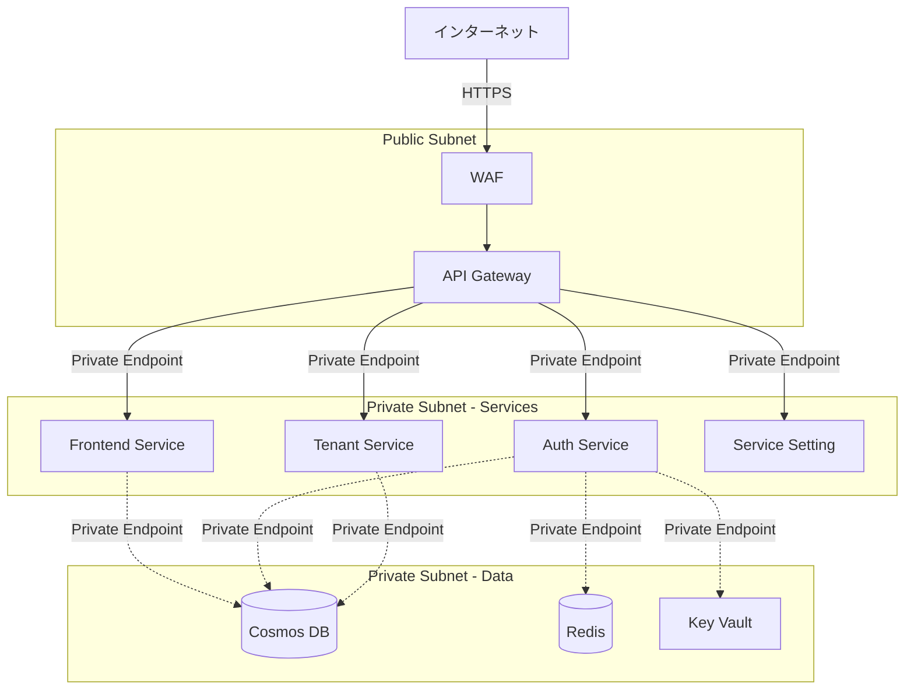

# セキュリティ考慮事項

## 1. 概要

本ドキュメントは、マルチテナント管理アプリケーションのセキュリティ要件と対策を定義します。ゼロトラストの原則に基づき、多層防御戦略を採用します。

### 1.1 セキュリティ原則

1. **ゼロトラスト**: すべてのリクエストを検証
2. **最小権限の原則**: 必要最小限の権限のみ付与
3. **深層防御**: 複数のセキュリティ層を実装
4. **セキュアバイデフォルト**: デフォルトで安全な設定
5. **継続的監視**: リアルタイムの脅威検出

## 2. 脅威モデル

### 2.1 STRIDE分析

| 脅威 | 説明 | 対策 |
|------|------|------|
| **Spoofing（なりすまし）** | ユーザーや システムのなりすまし | JWT認証、マルチファクター認証（将来） |
| **Tampering（改ざん）** | データやトークンの不正変更 | RS256署名、TLS、入力検証 |
| **Repudiation（否認）** | 操作の否認 | 監査ログ、トレーサビリティ |
| **Information Disclosure（情報漏洩）** | 機密情報の不正取得 | 暗号化、アクセス制御、データマスキング |
| **Denial of Service（サービス妨害）** | サービスの利用不可 | レート制限、自動スケーリング |
| **Elevation of Privilege（権限昇格）** | 不正な権限取得 | RBAC、最小権限、検証と監視 |

### 2.2 攻撃シナリオと対策

#### シナリオ1: クレデンシャル攻撃

**攻撃手法:**
- ブルートフォース攻撃
- パスワードスプレー攻撃
- クレデンシャルスタッフィング

**対策:**
```python
# アカウントロックアウト実装
LOCKOUT_THRESHOLD = 5  # 5回失敗でロック
LOCKOUT_DURATION = 1800  # 30分間

async def check_lockout(username: str):
    key = f"login_attempts:{username}"
    attempts = await redis.get(key)
    
    if attempts and int(attempts) >= LOCKOUT_THRESHOLD:
        remaining_time = await redis.ttl(key)
        raise AccountLockedException(remaining_time)

async def record_failed_login(username: str):
    key = f"login_attempts:{username}"
    await redis.incr(key)
    await redis.expire(key, LOCKOUT_DURATION)

# レート制限
@limiter.limit("5 per minute")
async def login_endpoint():
    pass
```

#### シナリオ2: セッションハイジャック

**攻撃手法:**
- トークン盗聴
- XSS経由のトークン窃取
- MITM攻撃

**対策:**
- HTTPS必須（TLS 1.3）
- HTTPOnlyクッキー
- Secure属性
- SameSite属性
- 短命トークン（8時間）
- Content Security Policy（CSP）

```javascript
// Frontend: Cookie設定
document.cookie = "session=xxx; Secure; HttpOnly; SameSite=Strict"
```

```python
# Backend: CSPヘッダー設定
@app.middleware("http")
async def add_security_headers(request: Request, call_next):
    response = await call_next(request)
    response.headers["Content-Security-Policy"] = (
        "default-src 'self'; "
        "script-src 'self' 'unsafe-inline'; "
        "style-src 'self' 'unsafe-inline'; "
        "img-src 'self' data: https:; "
        "font-src 'self' data:; "
        "connect-src 'self' https://api.example.com"
    )
    response.headers["X-Frame-Options"] = "DENY"
    response.headers["X-Content-Type-Options"] = "nosniff"
    response.headers["Strict-Transport-Security"] = "max-age=31536000; includeSubDomains"
    return response
```

#### シナリオ3: SQLインジェクション（Cosmos DB）

**攻撃手法:**
- パラメータ化されていないクエリ

**対策:**
```python
# 悪い例
query = f"SELECT * FROM c WHERE c.username = '{username}'"

# 良い例
query = "SELECT * FROM c WHERE c.username = @username"
parameters = [{"name": "@username", "value": username}]

items = container.query_items(
    query=query,
    parameters=parameters,
    enable_cross_partition_query=False
)
```

#### シナリオ4: XSS（Cross-Site Scripting）

**攻撃手法:**
- 反射型XSS
- 格納型XSS
- DOM-based XSS

**対策:**
```typescript
// Frontend: 入力サニタイゼーション
import DOMPurify from 'dompurify'

const sanitizedInput = DOMPurify.sanitize(userInput)

// Reactでの安全な表示
<div>{sanitizedInput}</div>  // 自動エスケープ
```

```python
# Backend: 出力エスケープ
from markupsafe import escape

safe_text = escape(user_input)
```

#### シナリオ5: CSRF（Cross-Site Request Forgery）

**攻撃手法:**
- 正規ユーザーのセッションを利用した不正リクエスト

**対策:**
```typescript
// CSRFトークン生成・検証
import { generateToken, verifyToken } from '@/lib/csrf'

// リクエスト送信時
const csrfToken = generateToken()
headers['X-CSRF-Token'] = csrfToken

// サーバー側検証
const isValid = verifyToken(token, session)
```

#### シナリオ6: テナント間データ漏洩

**攻撃手法:**
- パーティションキーの不正操作
- 権限チェックの不備

**対策:**
```python
async def get_resource(resource_id: str, current_user: dict):
    # 必ずテナントIDでフィルタリング
    resource = await repository.get(
        resource_id,
        partition_key=current_user["tenant_id"]  # 必須
    )
    
    if not resource:
        raise ResourceNotFoundError()
    
    # テナントIDの二重チェック
    if resource.tenant_id != current_user["tenant_id"]:
        raise UnauthorizedError()
    
    return resource
```

## 3. 認証・認可セキュリティ

### 3.1 パスワード管理

#### パスワードハッシュ化

```python
from passlib.context import CryptContext

pwd_context = CryptContext(
    schemes=["bcrypt"],
    deprecated="auto",
    bcrypt__rounds=12  # コスト係数
)

def hash_password(password: str) -> str:
    return pwd_context.hash(password)

def verify_password(plain: str, hashed: str) -> bool:
    return pwd_context.verify(plain, hashed)
```

#### パスワードポリシー

```python
import re

def validate_password(password: str) -> tuple[bool, str]:
    """パスワードポリシー検証"""
    
    if len(password) < 8:
        return False, "パスワードは8文字以上である必要があります"
    
    if not re.search(r"[A-Z]", password):
        return False, "大文字を1文字以上含める必要があります"
    
    if not re.search(r"[a-z]", password):
        return False, "小文字を1文字以上含める必要があります"
    
    if not re.search(r"[0-9]", password):
        return False, "数字を1文字以上含める必要があります"
    
    if not re.search(r"[!@#$%^&*(),.?\":{}|<>]", password):
        return False, "特殊文字を1文字以上含める必要があります"
    
    # 辞書攻撃対策（一般的なパスワードのブラックリスト）
    common_passwords = ["Password123!", "Admin123!", ...]
    if password in common_passwords:
        return False, "一般的なパスワードは使用できません"
    
    return True, "OK"
```

### 3.2 JWT セキュリティ

#### 安全なJWT設定

```python
# 設定
JWT_ALGORITHM = "RS256"  # HS256ではなくRS256を使用
JWT_EXPIRATION_HOURS = 8  # 短命トークン
JWT_ISSUER = "auth-service"
JWT_AUDIENCE = "api-services"

# JWT生成
def create_jwt(user_id: str, tenant_id: str, roles: list) -> str:
    payload = {
        "sub": user_id,
        "tenant_id": tenant_id,
        "roles": roles,
        "iat": datetime.utcnow(),
        "exp": datetime.utcnow() + timedelta(hours=JWT_EXPIRATION_HOURS),
        "iss": JWT_ISSUER,
        "aud": JWT_AUDIENCE,
        "jti": str(uuid.uuid4())  # JWT ID（リプレイ攻撃対策）
    }
    
    return jwt.encode(payload, private_key, algorithm=JWT_ALGORITHM)

# JWT検証
def verify_jwt(token: str) -> dict:
    try:
        payload = jwt.decode(
            token,
            public_key,
            algorithms=[JWT_ALGORITHM],
            audience=JWT_AUDIENCE,
            issuer=JWT_ISSUER
        )
        
        # ブラックリストチェック
        if await redis.exists(f"blacklist:{payload['jti']}"):
            raise InvalidTokenError("Token has been revoked")
        
        return payload
    except jwt.ExpiredSignatureError:
        raise TokenExpiredError()
    except jwt.JWTError as e:
        raise InvalidTokenError(str(e))
```

## 4. データセキュリティ

### 4.1 データ暗号化

#### 保存時の暗号化

```yaml
Cosmos DB:
  暗号化: Azure Storage Service Encryption (自動)
  アルゴリズム: AES-256
  鍵管理: Microsoft管理鍵 or Customer管理鍵

Redis Cache:
  転送時暗号化: TLS 1.2+
  保存時暗号化: 有効

Azure Key Vault:
  すべてのシークレット: FIPS 140-2 Level 2準拠
```

#### フィールドレベル暗号化

```python
from cryptography.fernet import Fernet
from app.core.config import settings

class FieldEncryption:
    def __init__(self):
        self.cipher = Fernet(settings.FIELD_ENCRYPTION_KEY)
    
    def encrypt(self, plaintext: str) -> str:
        """フィールド暗号化"""
        return self.cipher.encrypt(plaintext.encode()).decode()
    
    def decrypt(self, ciphertext: str) -> str:
        """フィールド復号化"""
        return self.cipher.decrypt(ciphertext.encode()).decode()

# 使用例: APIキー暗号化
api_key_plain = "sk_live_abc123..."
api_key_encrypted = field_encryption.encrypt(api_key_plain)

# DBに保存
integration.api_key = api_key_encrypted
```

#### データマスキング

```python
def mask_sensitive_data(data: dict) -> dict:
    """機密データのマスキング"""
    masked = data.copy()
    
    # メールアドレス
    if "email" in masked:
        email = masked["email"]
        username, domain = email.split("@")
        masked["email"] = f"{username[0]}***@{domain}"
    
    # パスワード
    if "password" in masked:
        masked["password"] = "***"
    
    # APIキー
    if "api_key" in masked:
        key = masked["api_key"]
        masked["api_key"] = f"{key[:4]}...{key[-4:]}"
    
    return masked

# ログ出力時
logger.info("User data", extra={"user": mask_sensitive_data(user_dict)})
```

### 4.2 個人情報保護（GDPR対応）

#### データ最小化

```python
# JWTに必要最小限の情報のみ含める
payload = {
    "sub": user_id,          # ユーザーID（必須）
    "tenant_id": tenant_id,  # テナントID（必須）
    "roles": roles,          # ロール（必須）
    # email, full_nameなどは含めない
}
```

#### Right to be Forgotten

```python
async def delete_user_data(user_id: str):
    """ユーザーデータの完全削除（GDPR対応）"""
    
    # 1. ユーザーレコード削除
    await user_repo.delete(user_id)
    
    # 2. 関連データの削除
    await tenant_user_repo.delete_by_user_id(user_id)
    await role_repo.delete_by_user_id(user_id)
    
    # 3. ログの匿名化（削除ではなく匿名化）
    await audit_log_repo.anonymize_user_logs(user_id)
    
    # 4. キャッシュのクリア
    await redis.delete(f"user:{user_id}")
    await redis.delete(f"roles:{user_id}")
    
    # 5. JWTの無効化
    # ユーザーのすべてのアクティブセッションを無効化
    await invalidate_user_sessions(user_id)
```

#### データアクセスログ

```python
async def log_data_access(
    user_id: str,
    resource_type: str,
    resource_id: str,
    action: str
):
    """個人情報アクセスログ（GDPR監査用）"""
    log_entry = {
        "timestamp": datetime.utcnow(),
        "user_id": user_id,
        "resource_type": resource_type,
        "resource_id": resource_id,
        "action": action,
        "ip_address": get_client_ip(),
        "user_agent": get_user_agent()
    }
    await audit_log_repo.create(log_entry)
```

## 5. ネットワークセキュリティ

### 5.1 TLS/SSL

```yaml
必須設定:
  - TLS 1.3 または TLS 1.2
  - TLS 1.0/1.1 無効化
  - 強力な暗号スイート
  - HSTS有効化

推奨暗号スイート:
  - TLS_AES_256_GCM_SHA384
  - TLS_CHACHA20_POLY1305_SHA256
  - TLS_AES_128_GCM_SHA256
```

### 5.2 API Gateway設定

```yaml
Azure API Management:
  認証:
    - JWT検証
    - クライアント証明書（オプション）
  
  レート制限:
    - 認証済み: 1000 req/hour
    - 特権テナント: 5000 req/hour
  
  IP制限:
    - 許可リスト（オプション）
    - 特定国からのアクセス制限
  
  WAF（Web Application Firewall）:
    - OWASP Top 10対策
    - SQLインジェクション対策
    - XSS対策
    - DDoS Protection
```

### 5.3 ネットワーク分離



## 6. アプリケーションセキュリティ

### 6.1 入力検証

```python
from pydantic import BaseModel, validator, EmailStr, constr

class CreateUserRequest(BaseModel):
    username: constr(min_length=3, max_length=50, regex="^[a-zA-Z0-9_-]+$")
    email: EmailStr
    password: constr(min_length=8)
    full_name: constr(max_length=100)
    
    @validator('username')
    def username_must_not_be_reserved(cls, v):
        reserved_names = ['admin', 'root', 'system']
        if v.lower() in reserved_names:
            raise ValueError('予約語は使用できません')
        return v
    
    @validator('password')
    def password_must_be_strong(cls, v):
        is_valid, message = validate_password(v)
        if not is_valid:
            raise ValueError(message)
        return v
```

### 6.2 出力エンコーディング

```python
from markupsafe import escape
import json

def safe_json_response(data: dict) -> str:
    """安全なJSON応答"""
    # XSS対策: HTMLタグをエスケープ
    safe_data = escape_recursive(data)
    return json.dumps(safe_data)

def escape_recursive(obj):
    """再帰的にHTMLエスケープ"""
    if isinstance(obj, dict):
        return {k: escape_recursive(v) for k, v in obj.items()}
    elif isinstance(obj, list):
        return [escape_recursive(item) for item in obj]
    elif isinstance(obj, str):
        return escape(obj)
    else:
        return obj
```

### 6.3 依存関係管理

```yaml
脆弱性スキャン:
  ツール:
    - Dependabot（GitHub）
    - Snyk
    - Safety（Python）
  
  頻度:
    - PR時: 自動スキャン
    - 週次: 定期スキャン
  
  対応:
    - Critical: 24時間以内
    - High: 1週間以内
    - Medium: 1ヶ月以内
```

```bash
# requirements.txt
fastapi==0.109.0  # バージョン固定
pydantic==2.5.0
python-jose[cryptography]==3.3.0
passlib[bcrypt]==1.7.4

# 脆弱性チェック
pip install safety
safety check --json
```

## 7. 監視とインシデント対応

### 7.1 セキュリティ監視

```yaml
監視項目:
  認証:
    - ログイン失敗率
    - アカウントロックアウト数
    - パスワードリセット要求数
  
  認可:
    - 403エラー率
    - 権限昇格試行
  
  異常検知:
    - 異常なトラフィックパターン
    - 大量のAPIコール
    - 深夜の管理操作
  
  インフラ:
    - 不正なIP からのアクセス
    - TLS/SSL証明書の期限
    - サービス間通信の異常
```

### 7.2 アラート設定

```python
# Azure Monitor アラートルール（疑似コード）
alert_rules = [
    {
        "name": "High Login Failure Rate",
        "condition": "login_failed_count > 100 in 5 minutes",
        "severity": "Critical",
        "action": "notify_security_team"
    },
    {
        "name": "Unusual Data Access Pattern",
        "condition": "data_access_rate > baseline * 3",
        "severity": "High",
        "action": "notify_security_team"
    },
    {
        "name": "Potential SQL Injection",
        "condition": "request_contains_sql_pattern",
        "severity": "Critical",
        "action": "block_and_notify"
    }
]
```

### 7.3 インシデント対応計画

```yaml
フェーズ1: 検知
  - 自動アラート
  - SIEM（Security Information and Event Management）
  - 異常検知AI

フェーズ2: 分析
  - ログ分析
  - 影響範囲特定
  - 重要度評価

フェーズ3: 封じ込め
  - 該当アカウントの無効化
  - IPブロック
  - サービス隔離

フェーズ4: 根絶
  - 脆弱性の修正
  - パッチ適用
  - 設定変更

フェーズ5: 復旧
  - サービス復旧
  - データ復旧
  - 監視強化

フェーズ6: 事後対応
  - インシデントレポート作成
  - 再発防止策の実施
  - チェックリスト更新
```

## 8. コンプライアンス

### 8.1 セキュリティ基準

```yaml
準拠規格:
  - ISO 27001: 情報セキュリティマネジメント
  - SOC 2 Type II: サービス組織統制
  - GDPR: EU一般データ保護規則
  - PCI DSS: 決済カードデータセキュリティ（将来）
```

### 8.2 セキュリティチェックリスト

- [ ] すべてのAPIエンドポイントで認証必須
- [ ] ロールベースアクセス制御（RBAC）実装
- [ ] パスワードポリシー適用
- [ ] JWT有効期限設定（8時間）
- [ ] HTTPS/TLS 1.3必須
- [ ] 入力検証実装
- [ ] 出力エスケープ実装
- [ ] SQLインジェクション対策
- [ ] XSS対策
- [ ] CSRF対策
- [ ] レート制限実装
- [ ] 監査ログ記録
- [ ] データ暗号化（保存時・転送時）
- [ ] シークレットはKey Vaultで管理
- [ ] 定期的な脆弱性スキャン
- [ ] セキュリティパッチ適用プロセス

## 9. セキュリティテスト

### 9.1 ペネトレーションテスト

```yaml
頻度: 四半期ごと
範囲:
  - 認証・認可メカニズム
  - APIエンドポイント
  - データベースアクセス
  - ネットワーク境界

テスト項目:
  - OWASP Top 10
  - 認証バイパス
  - 権限昇格
  - データ漏洩
  - DDoS耐性
```

### 9.2 セキュリティユニットテスト

```python
# tests/security/test_auth_security.py
import pytest

@pytest.mark.security
async def test_sql_injection_prevention():
    """SQLインジェクション対策テスト"""
    malicious_input = "admin' OR '1'='1"
    response = await client.post(
        "/api/v1/auth/login",
        json={"username": malicious_input, "password": "any"}
    )
    assert response.status_code == 401

@pytest.mark.security
async def test_xss_prevention():
    """XSS対策テスト"""
    xss_payload = "<script>alert('XSS')</script>"
    response = await client.post(
        "/api/v1/tenants",
        json={"name": "test", "display_name": xss_payload},
        headers={"Authorization": f"Bearer {admin_token}"}
    )
    
    tenant = response.json()
    # エスケープされているか確認
    assert "&lt;script&gt;" in tenant["display_name"]
    assert "<script>" not in tenant["display_name"]

@pytest.mark.security
async def test_rate_limiting():
    """レート制限テスト"""
    for _ in range(1001):  # 制限を超える
        response = await client.get(
            "/api/v1/tenants",
            headers={"Authorization": f"Bearer {token}"}
        )
    
    assert response.status_code == 429

@pytest.mark.security
async def test_tenant_isolation():
    """テナント分離テスト"""
    # テナントAのユーザー
    tenant_a_response = await client.get(
        "/api/v1/files",
        headers={"Authorization": f"Bearer {tenant_a_token}"}
    )
    
    # テナントBのファイルは含まれないことを確認
    files = tenant_a_response.json()["files"]
    assert not any(f["tenant_id"] == "tenant-b" for f in files)
```

## 10. セキュリティ教育

### 10.1 開発者向けトレーニング

```yaml
必須トピック:
  - Secure Coding Practices
  - OWASP Top 10
  - 認証・認可ベストプラクティス
  - データ保護とプライバシー
  - インシデント対応手順

頻度: 四半期ごと
形式: オンライン + ハンズオン
```

### 10.2 セキュアコーディングガイドライン

- [OWASP Secure Coding Practices](https://owasp.org/www-project-secure-coding-practices-quick-reference-guide/)
- プロジェクト固有のセキュリティベストプラクティス
- コードレビューチェックリスト

## 11. 関連ドキュメント

- [認証認可フロー](./authentication-flow.md)
- [API設計](../api/api-design.md)
- [インフラストラクチャ設計](../infrastructure/infrastructure.md)
