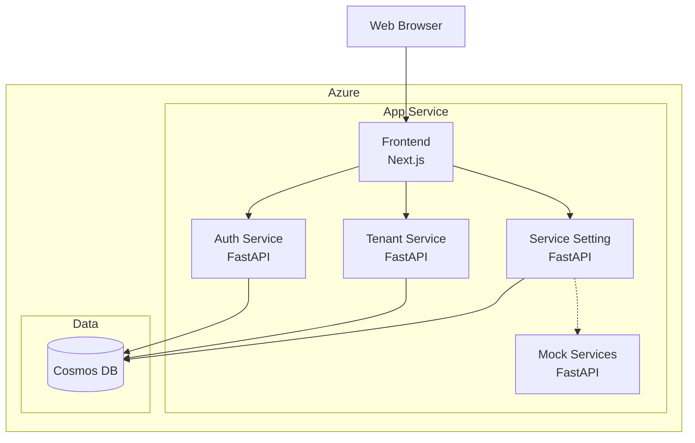

# アーキテクチャ設計

このフォルダにはシステム全体のアーキテクチャ設計に関するドキュメントが格納されています。

## ドキュメント一覧

| ドキュメント | 説明 |
|-------------|------|
| [認証フロー](./authentication-flow.md) | JWT認証の詳細フロー、トークン管理 |
| [データベース設計](./database-design.md) | Cosmos DB設計方針、パーティション戦略 |
| [API設計ガイドライン](./api-guidelines.md) | REST API設計の共通ルール |

## システム構成図

## 技術選定理由

### フロントエンド: Next.js

- **BFF (Backend for Frontend)** パターンの実現
- SSR/SSGによるパフォーマンス最適化
- React エコシステムの活用

### バックエンド: FastAPI (Python)

- 高速な開発サイクル
- 自動ドキュメント生成 (OpenAPI)
- 非同期処理のサポート
- 型ヒントによるコード品質向上

### データベース: Cosmos DB

- マネージドサービスによる運用負荷軽減
- グローバル分散対応
- 柔軟なスキーマ設計
- マイクロサービス毎のコンテナ分離

### IaC: Bicep

- Azure ネイティブの IaC
- ARM テンプレートより簡潔な記述
- VS Code による強力なツーリング支援
