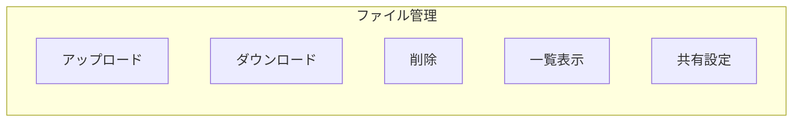
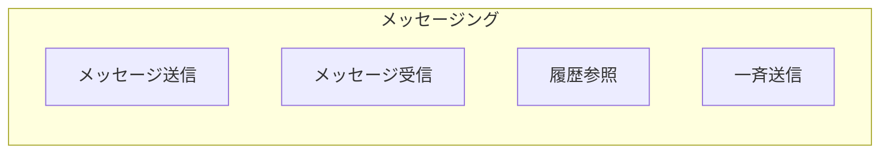
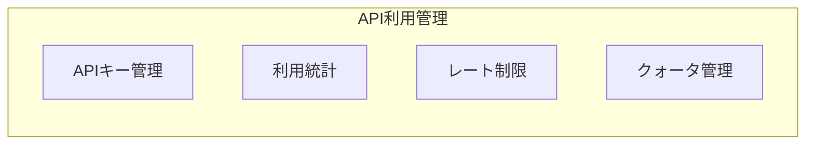
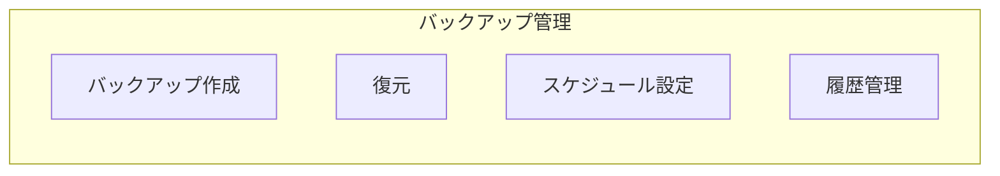
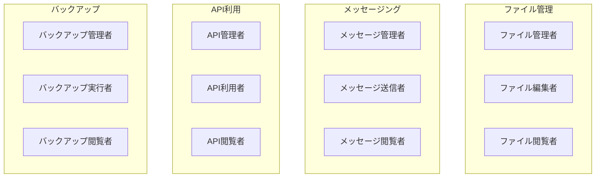

# モックサービス仕様書

**最終更新**: 2026-01-24  
**ステータス**: Draft

## 概要

本番環境で使用される外部サービスをシミュレートするためのモックサービス群です。開発・テスト時にサービス連携機能を検証できるように、必要最小限のAPIを提供します。

## モックサービス一覧

| サービス名 | サービスID | 説明 |
|-----------|-----------|------|
| ファイル管理サービス | file-management | ファイルのアップロード、ダウンロード、管理 |
| メッセージングサービス | messaging | メッセージの送受信 |
| API利用サービス | api-usage | API利用状況の管理 |
| バックアップサービス | backup | データバックアップと復元 |

## サービス詳細

---

### ファイル管理サービス (file-management)

#### 役割
ユーザーやテナントが所有するファイルを管理します。

#### ロール定義

| ロール | 説明 | 権限 |
|-------|------|------|
| ファイル管理者 | ファイル管理の全権限 | 全ファイル操作、設定変更が可能 |
| ファイル編集者 | ファイルの編集権限 | ファイルのアップロード、編集、削除が可能 |
| ファイル閲覧者 | 参照専用 | ファイルの参照、ダウンロードのみ可能 |

#### 機能概要



#### API エンドポイント

| メソッド | エンドポイント | 説明 |
|---------|---------------|------|
| GET | `/api/files` | ファイル一覧取得 |
| POST | `/api/files` | ファイルアップロード |
| GET | `/api/files/{id}` | ファイルダウンロード |
| DELETE | `/api/files/{id}` | ファイル削除 |
| GET | `/api/roles` | ロール情報取得 |

---

### メッセージングサービス (messaging)

#### 役割
ユーザー間、テナント間でのメッセージ送受信機能を提供します。

#### ロール定義

| ロール | 説明 | 権限 |
|-------|------|------|
| メッセージ管理者 | メッセージ管理の全権限 | 全メッセージの参照、設定変更が可能 |
| メッセージ送信者 | メッセージ送受信権限 | メッセージの送受信が可能 |
| メッセージ閲覧者 | 参照専用 | 自分宛メッセージの閲覧のみ可能 |

#### 機能概要



#### API エンドポイント

| メソッド | エンドポイント | 説明 |
|---------|---------------|------|
| GET | `/api/messages` | メッセージ一覧取得 |
| POST | `/api/messages` | メッセージ送信 |
| GET | `/api/messages/{id}` | メッセージ詳細取得 |
| DELETE | `/api/messages/{id}` | メッセージ削除 |
| GET | `/api/roles` | ロール情報取得 |

---

### API利用サービス (api-usage)

#### 役割
外部公開APIの利用状況を監視・管理します。

#### ロール定義

| ロール | 説明 | 権限 |
|-------|------|------|
| API管理者 | API管理の全権限 | APIキー発行、利用制限設定が可能 |
| API利用者 | API利用権限 | APIの利用、利用状況の参照が可能 |
| API閲覧者 | 参照専用 | 利用状況の参照のみ可能 |

#### 機能概要



#### API エンドポイント

| メソッド | エンドポイント | 説明 |
|---------|---------------|------|
| GET | `/api/keys` | APIキー一覧取得 |
| POST | `/api/keys` | APIキー発行 |
| DELETE | `/api/keys/{id}` | APIキー無効化 |
| GET | `/api/usage` | 利用統計取得 |
| GET | `/api/roles` | ロール情報取得 |

---

### バックアップサービス (backup)

#### 役割
テナントデータのバックアップと復元を管理します。

#### ロール定義

| ロール | 説明 | 権限 |
|-------|------|------|
| バックアップ管理者 | バックアップ管理の全権限 | バックアップ・復元の全操作が可能 |
| バックアップ実行者 | バックアップ実行権限 | バックアップ作成、スケジュール設定が可能 |
| バックアップ閲覧者 | 参照専用 | バックアップ履歴の参照のみ可能 |

#### 機能概要



#### API エンドポイント

| メソッド | エンドポイント | 説明 |
|---------|---------------|------|
| GET | `/api/backups` | バックアップ一覧取得 |
| POST | `/api/backups` | バックアップ作成 |
| POST | `/api/backups/{id}/restore` | バックアップから復元 |
| DELETE | `/api/backups/{id}` | バックアップ削除 |
| GET | `/api/schedules` | スケジュール一覧取得 |
| PUT | `/api/schedules` | スケジュール更新 |
| GET | `/api/roles` | ロール情報取得 |

---

## 共通仕様

### ロール情報API

全てのモックサービスは以下の形式でロール情報を返却します。

**エンドポイント**: `GET /api/roles`

**レスポンス例**:
```json
{
  "serviceId": "file-management",
  "serviceName": "ファイル管理サービス",
  "roles": [
    {
      "id": "file-admin",
      "name": "ファイル管理者",
      "description": "ファイル管理の全権限"
    },
    {
      "id": "file-editor",
      "name": "ファイル編集者",
      "description": "ファイルの編集権限"
    },
    {
      "id": "file-viewer",
      "name": "ファイル閲覧者",
      "description": "参照専用"
    }
  ]
}
```

### モックレスポンス

開発時は以下のようなスタブレスポンスを返却します:

- 成功レスポンス: HTTP 200 + ダミーデータ
- エラーレスポンス: HTTP 4xx/5xx + エラーメッセージ
- 遅延シミュレーション: 設定により任意の遅延を付加可能

## ロール一覧サマリー



| サービス | 管理者 | 編集者/実行者 | 閲覧者 |
|---------|-------|--------------|-------|
| ファイル管理 | ファイル管理者 | ファイル編集者 | ファイル閲覧者 |
| メッセージング | メッセージ管理者 | メッセージ送信者 | メッセージ閲覧者 |
| API利用 | API管理者 | API利用者 | API閲覧者 |
| バックアップ | バックアップ管理者 | バックアップ実行者 | バックアップ閲覧者 |
