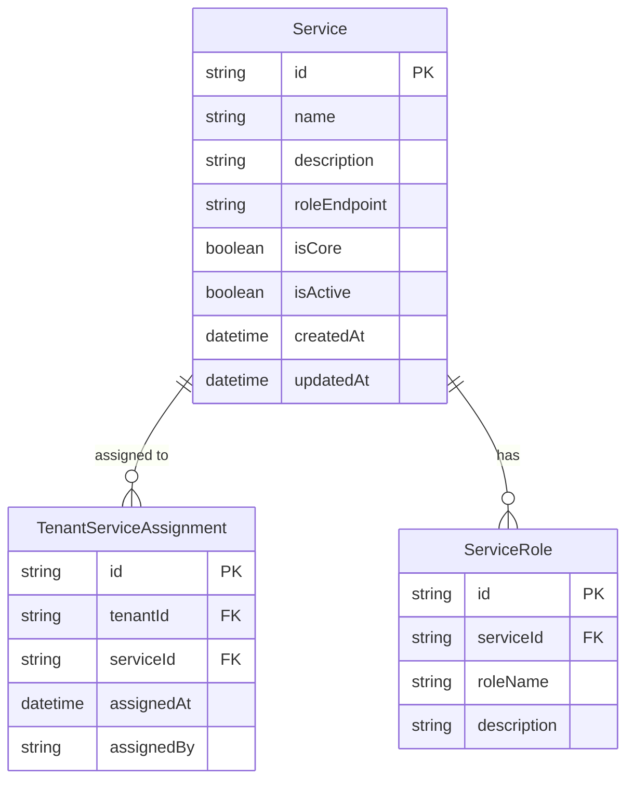
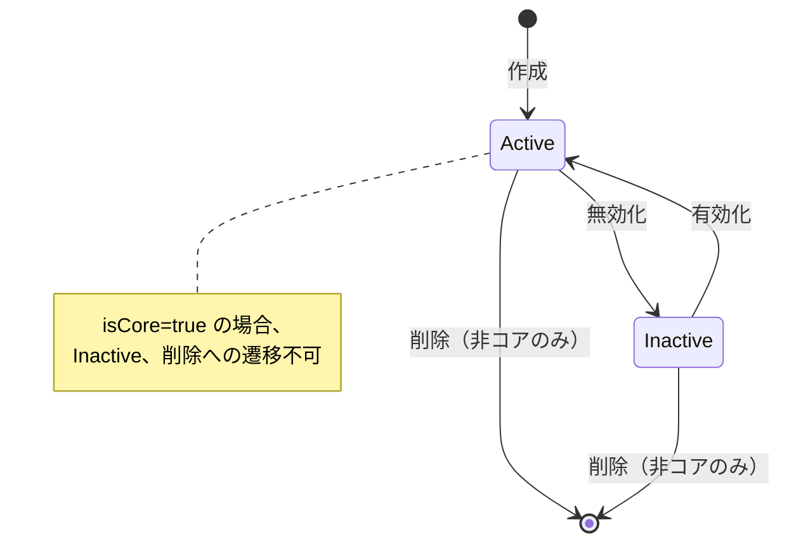
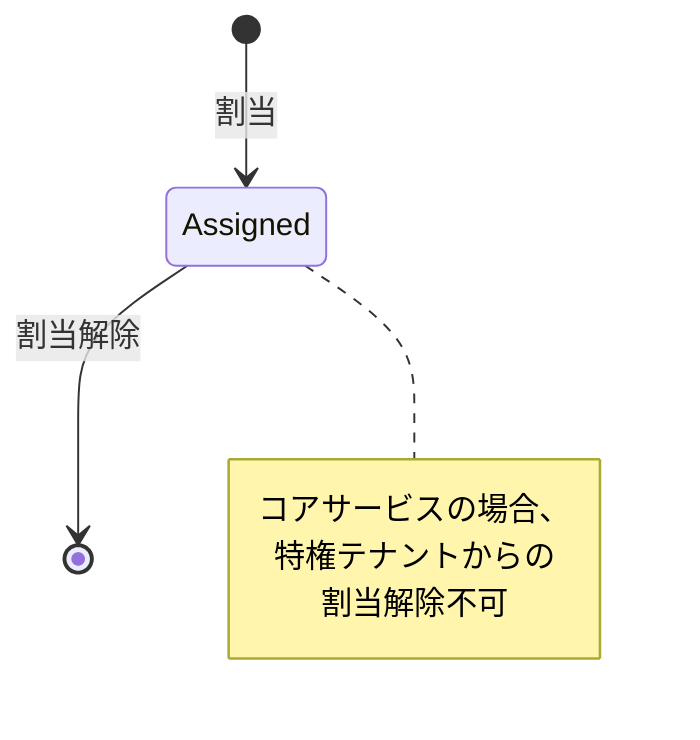

# 利用サービス設定サービス データモデル

**サービス名**: 利用サービス設定サービス  
**データベース**: Cosmos DB  
**最終更新**: 2026-01-24

## エンティティ関連図



## エンティティ定義

### Service (サービス)

システムで提供されるサービスの定義を保持します。

| フィールド | 型 | 必須 | 説明 |
|-----------|-----|------|------|
| id | string | Yes | サービスID (例: file-management) |
| name | string | Yes | サービス名（表示用） |
| description | string | No | サービス説明 |
| roleEndpoint | string | Yes | ロール情報取得エンドポイントURL |
| isCore | boolean | Yes | コアサービスフラグ（削除不可） |
| isActive | boolean | Yes | アクティブフラグ |
| createdAt | datetime | Yes | 作成日時 |
| updatedAt | datetime | Yes | 更新日時 |

**ビジネスルール**:
- `isCore = true` のサービスは削除不可
- `isActive = false` のサービスは新規割当不可
- コアサービス: user-management, auth, service-setting

```json
{
  "id": "file-management",
  "name": "ファイル管理サービス",
  "description": "ファイルのアップロード、ダウンロード、管理機能を提供",
  "roleEndpoint": "http://file-management-service/api/roles",
  "isCore": false,
  "isActive": true,
  "createdAt": "2026-01-01T00:00:00Z",
  "updatedAt": "2026-01-01T00:00:00Z"
}
```

### TenantServiceAssignment (テナントサービス割当)

テナントへのサービス割当情報を管理します。

| フィールド | 型 | 必須 | 説明 |
|-----------|-----|------|------|
| id | string | Yes | レコードID (UUID) |
| tenantId | string | Yes | テナントID |
| serviceId | string | Yes | サービスID |
| assignedAt | datetime | Yes | 割当日時 |
| assignedBy | string | Yes | 割当実行ユーザーID |

**ビジネスルール**:
- 同一テナント・同一サービスの組み合わせは一意
- 特権テナントにはコアサービスが自動割当

```json
{
  "id": "tsa-001",
  "tenantId": "tenant-002",
  "serviceId": "file-management",
  "assignedAt": "2026-01-15T10:00:00Z",
  "assignedBy": "user-001"
}
```

### ServiceRole (サービスロール)

各サービスで定義されるロール情報を保持します（キャッシュ用）。

| フィールド | 型 | 必須 | 説明 |
|-----------|-----|------|------|
| id | string | Yes | レコードID (UUID) |
| serviceId | string | Yes | サービスID |
| roleName | string | Yes | ロール名 |
| description | string | No | ロール説明 |

**ビジネスルール**:
- 各サービスの `/api/roles` エンドポイントから定期同期
- 同一サービス内でロール名は一意

```json
{
  "id": "sr-001",
  "serviceId": "file-management",
  "roleName": "ファイル管理者",
  "description": "ファイルの全操作が可能"
}
```

## 初期データ

### コアサービス

システム稼働時に必ず存在するサービス:

```json
[
  {
    "id": "user-management",
    "name": "テナント管理サービス",
    "description": "テナントとユーザーの管理",
    "roleEndpoint": "http://user-management-service/api/roles",
    "isCore": true,
    "isActive": true
  },
  {
    "id": "auth",
    "name": "認証認可サービス",
    "description": "ユーザー認証と権限管理",
    "roleEndpoint": "http://auth-service/api/roles",
    "isCore": true,
    "isActive": true
  },
  {
    "id": "service-setting",
    "name": "利用サービス設定サービス",
    "description": "テナントへのサービス割当管理",
    "roleEndpoint": "http://service-setting-service/api/roles",
    "isCore": true,
    "isActive": true
  }
]
```

### モックサービス

開発・テスト用のモックサービス:

```json
[
  {
    "id": "file-management",
    "name": "ファイル管理サービス",
    "description": "ファイルのアップロード、ダウンロード、管理",
    "roleEndpoint": "http://mock-services/api/file-management/roles",
    "isCore": false,
    "isActive": true
  },
  {
    "id": "messaging",
    "name": "メッセージングサービス",
    "description": "メッセージの送受信",
    "roleEndpoint": "http://mock-services/api/messaging/roles",
    "isCore": false,
    "isActive": true
  },
  {
    "id": "api-usage",
    "name": "API利用サービス",
    "description": "API利用状況の管理",
    "roleEndpoint": "http://mock-services/api/api-usage/roles",
    "isCore": false,
    "isActive": true
  },
  {
    "id": "backup",
    "name": "バックアップサービス",
    "description": "データバックアップと復元",
    "roleEndpoint": "http://mock-services/api/backup/roles",
    "isCore": false,
    "isActive": true
  }
]
```

## インデックス設計

### Serviceコンテナ

| インデックス | フィールド | 用途 |
|-------------|-----------|------|
| Primary | id | 主キー検索 |
| Secondary | isActive | アクティブサービス絞り込み |
| Secondary | isCore | コアサービス絞り込み |

### TenantServiceAssignmentコンテナ

| インデックス | フィールド | 用途 |
|-------------|-----------|------|
| Primary | id | 主キー検索 |
| Composite | tenantId, serviceId | 一意性保証 |
| Secondary | tenantId | テナント別割当検索 |
| Secondary | serviceId | サービス別割当検索 |

## 状態遷移

### サービス状態



### サービス割当状態


