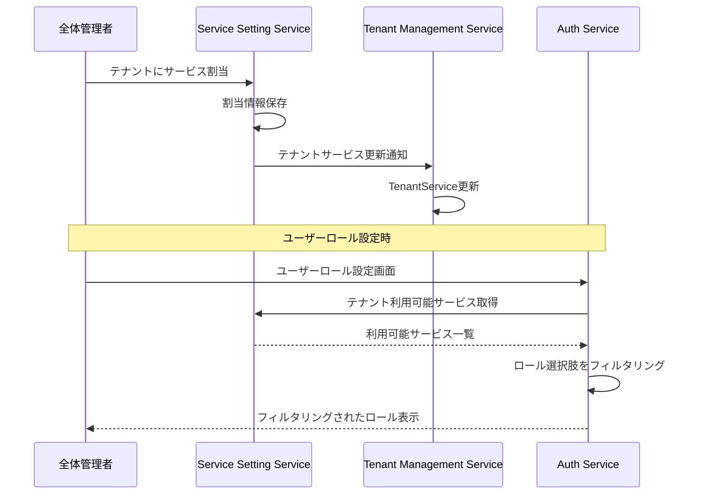

# 利用サービス設定サービス仕様書

**サービス名**: 利用サービス設定サービス (Service Setting Service)  
**リポジトリ**: ws-demo-poly4  
**技術スタック**: FastAPI (Python)  
**データベース**: Cosmos DB  
**最終更新**: 2026-01-24  
**ステータス**: Draft

## 概要

各テナントで使用できるサービスを設定・管理するサービスです。テナントに対してサービスを割り当てることで、そのテナントのユーザーが該当サービスを利用できるようになります。

## ロール定義

| ロール | 説明 | 権限 |
|-------|------|------|
| 全体管理者 | サービス割当の全権限 | テナントへのサービス割当が可能 |
| 閲覧者 | 参照専用 | 情報の参照のみ可能 |

## サービス割当フロー

## ユーザーシナリオ

### US-1: サービス設定一覧表示 (Priority: P1) 🎯 MVP

管理者として、テナント毎のサービス割当状況を一覧で確認できる。

**受入条件**:
1. **Given** 閲覧者以上のロール, **When** サービス設定一覧画面を開く, **Then** 以下の情報が表示される
   - テナント名
   - 割当済みサービス一覧
   - 最終更新日
2. **Given** サービス設定一覧, **When** テナント名で検索する, **Then** 該当テナントのみ表示される

### US-2: サービス割当 (Priority: P1) 🎯 MVP

全体管理者として、テナントに利用可能なサービスを割り当てることができる。

**受入条件**:
1. **Given** 全体管理者ロール, **When** テナントのサービス編集画面を開く, **Then** 利用可能なサービス一覧がチェックボックスで表示される
2. **Given** サービス編集画面, **When** サービスにチェックを入れて保存する, **Then** そのサービスがテナントに割り当てられる
3. **Given** サービス編集画面, **When** サービスのチェックを外して保存する, **Then** そのサービスの割当が解除される

### US-3: サービス割当解除 (Priority: P2)

全体管理者として、テナントからサービス割当を解除できる。

**受入条件**:
1. **Given** 全体管理者ロール, **When** サービス割当を解除する, **Then** そのサービスが利用不可となる
2. **Given** サービス割当解除時, **When** 該当サービスのロールを持つユーザーがいる場合, **Then** 警告が表示される

### US-4: サービス一覧管理 (Priority: P2)

全体管理者として、システムで提供するサービスの一覧を管理できる。

**受入条件**:
1. **Given** 全体管理者ロール, **When** サービス管理画面を開く, **Then** 登録済みサービス一覧が表示される
2. **Given** サービス管理画面, **When** 新規サービスを追加する, **Then** そのサービスがテナントに割当可能となる

## 機能要件

### FR-001: サービス割当管理

- システムはテナントへのサービス割当機能を提供しなければならない
- システムはサービス割当の変更をテナント管理サービスに通知しなければならない
- システムは割当解除時に影響を受けるユーザー数を表示しなければならない

### FR-002: サービス管理

- システムは利用可能なサービスの一覧を管理できなければならない
- 各サービスはサービスID、サービス名、説明、ロール情報エンドポイントを持つ

### FR-003: テナントサービス情報提供

- システムはテナントが利用可能なサービス一覧を取得するAPIを提供しなければならない
- このAPIは認証認可サービスからのロールフィルタリングに使用される

### FR-004: ロール情報提供

- システムは自サービスで定義されるロール情報をAPIで提供しなければならない

## API エンドポイント

詳細は [API仕様書](./api-spec.md) を参照。

| メソッド | エンドポイント | 説明 | 認証 |
|---------|---------------|------|------|
| GET | `/api/services` | サービス一覧取得 | Bearer Token |
| GET | `/api/services/{id}` | サービス詳細取得 | Bearer Token |
| POST | `/api/services` | サービス追加 | Bearer Token (全体管理者) |
| PUT | `/api/services/{id}` | サービス更新 | Bearer Token (全体管理者) |
| DELETE | `/api/services/{id}` | サービス削除 | Bearer Token (全体管理者) |
| GET | `/api/tenants/{tenantId}/services` | テナント利用可能サービス取得 | Bearer Token |
| PUT | `/api/tenants/{tenantId}/services` | テナントサービス割当更新 | Bearer Token (全体管理者) |
| GET | `/api/roles` | ロール情報取得（他サービス連携用） | Internal |

## 連携サービス

利用サービス設定で管理するサービス一覧:

| サービスID | サービス名 | 説明 |
|-----------|-----------|------|
| user-management | テナント管理サービス | テナント・ユーザー管理 |
| auth | 認証認可サービス | 認証・認可管理 |
| service-setting | 利用サービス設定サービス | 本サービス |
| file-management | ファイル管理サービス | ファイル管理（モック） |
| messaging | メッセージングサービス | メッセージ送受信（モック） |
| api-usage | API利用サービス | API管理（モック） |
| backup | バックアップサービス | バックアップ管理（モック） |

## 成功基準

- **SC-001**: サービス割当変更は5秒以内に全関連サービスに反映される
- **SC-002**: テナントサービス一覧取得は1秒以内にレスポンスを返す
- **SC-003**: 権限のないユーザーによる割当変更は100%拒否される
