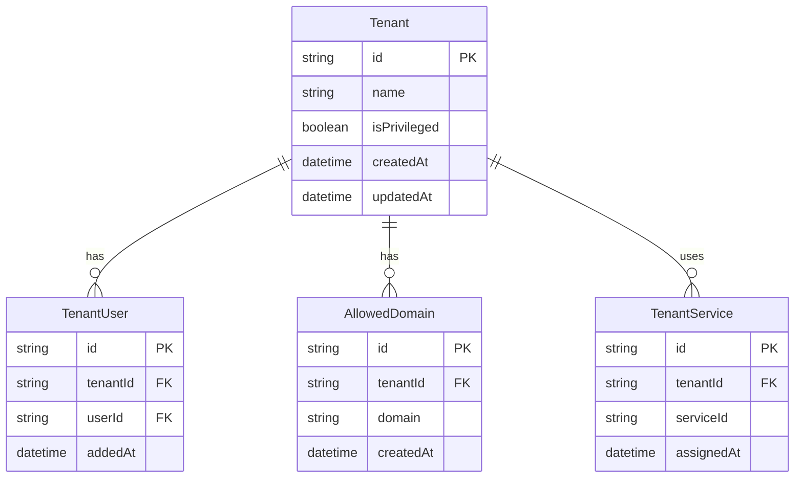
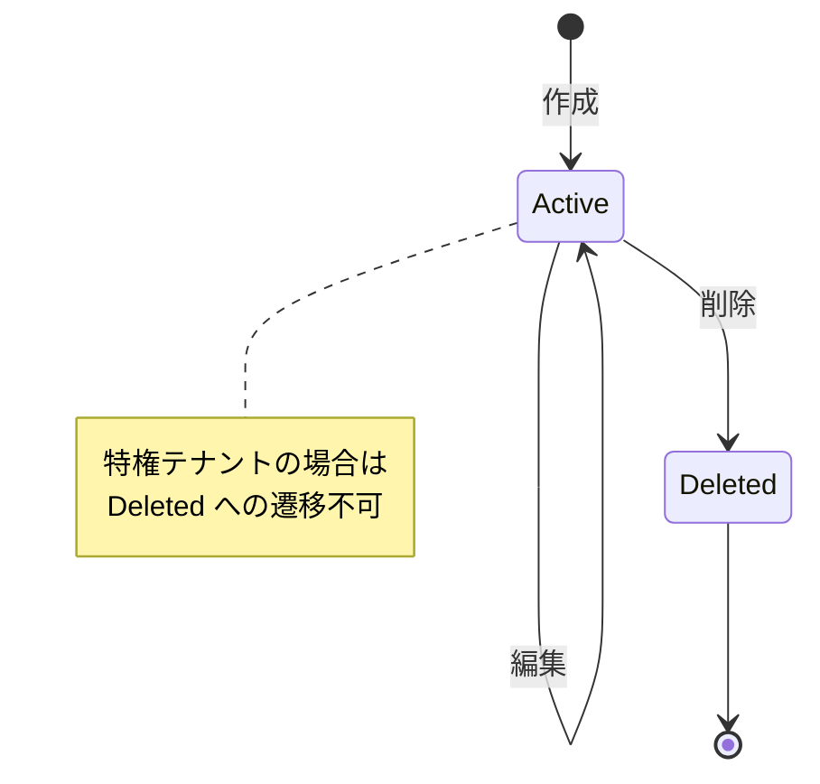

# テナント管理サービス データモデル

**サービス名**: テナント管理サービス  
**データベース**: Cosmos DB  
**最終更新**: 2026-01-24

## エンティティ関連図



## エンティティ定義

### Tenant (テナント)

テナントの基本情報を保持します。

| フィールド | 型 | 必須 | 説明 |
|-----------|-----|------|------|
| id | string | Yes | テナントID (UUID) |
| name | string | Yes | テナント名 |
| isPrivileged | boolean | Yes | 特権テナントフラグ |
| createdAt | datetime | Yes | 作成日時 |
| updatedAt | datetime | Yes | 更新日時 |

**ビジネスルール**:
- `isPrivileged = true` のテナントは削除・編集不可
- テナント名は一意でなければならない

```json
{
  "id": "tenant-001",
  "name": "特権管理テナント",
  "isPrivileged": true,
  "createdAt": "2026-01-01T00:00:00Z",
  "updatedAt": "2026-01-01T00:00:00Z"
}
```

### TenantUser (テナントユーザー)

テナントとユーザーの関連を管理します。

| フィールド | 型 | 必須 | 説明 |
|-----------|-----|------|------|
| id | string | Yes | レコードID (UUID) |
| tenantId | string | Yes | テナントID |
| userId | string | Yes | ユーザーID（認証認可サービス管理） |
| addedAt | datetime | Yes | 追加日時 |

**ビジネスルール**:
- 同一テナント・同一ユーザーの組み合わせは一意
- 特権テナントへのユーザー追加は全体管理者のみ

```json
{
  "id": "tu-001",
  "tenantId": "tenant-001",
  "userId": "user-001",
  "addedAt": "2026-01-15T10:00:00Z"
}
```

### AllowedDomain (許可ドメイン)

テナントに所属可能なユーザーのメールドメインを管理します。

| フィールド | 型 | 必須 | 説明 |
|-----------|-----|------|------|
| id | string | Yes | レコードID (UUID) |
| tenantId | string | Yes | テナントID |
| domain | string | Yes | 許可ドメイン (例: "example.com") |
| createdAt | datetime | Yes | 作成日時 |

**ビジネスルール**:
- ドメインは正規表現 `^[a-zA-Z0-9][a-zA-Z0-9-]*\.[a-zA-Z]{2,}$` に合致すること
- 同一テナント内でドメインは一意

```json
{
  "id": "ad-001",
  "tenantId": "tenant-002",
  "domain": "example.com",
  "createdAt": "2026-01-10T09:00:00Z"
}
```

### TenantService (テナントサービス)

テナントが利用可能なサービスの割当を管理します。

| フィールド | 型 | 必須 | 説明 |
|-----------|-----|------|------|
| id | string | Yes | レコードID (UUID) |
| tenantId | string | Yes | テナントID |
| serviceId | string | Yes | サービスID |
| assignedAt | datetime | Yes | 割当日時 |

**ビジネスルール**:
- 同一テナント・同一サービスの組み合わせは一意
- サービス割当は利用サービス設定サービスから更新される

```json
{
  "id": "ts-001",
  "tenantId": "tenant-002",
  "serviceId": "file-management",
  "assignedAt": "2026-01-20T14:00:00Z"
}
```

## インデックス設計

### Tenantコンテナ

| インデックス | フィールド | 用途 |
|-------------|-----------|------|
| Primary | id | 主キー検索 |
| Secondary | name | テナント名検索 |
| Secondary | isPrivileged | 特権テナント絞り込み |

### TenantUserコンテナ

| インデックス | フィールド | 用途 |
|-------------|-----------|------|
| Primary | id | 主キー検索 |
| Composite | tenantId, userId | 一意性保証・テナント別ユーザー検索 |
| Secondary | userId | ユーザー別所属テナント検索 |

## 状態遷移

### テナントライフサイクル


