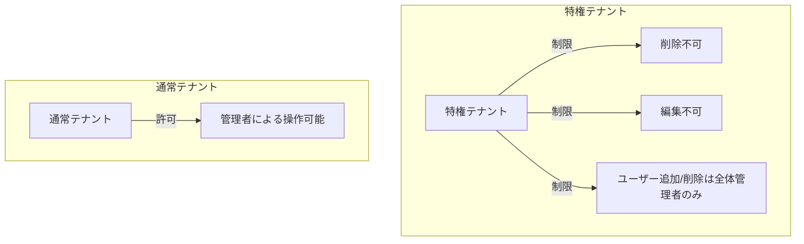

# テナント管理サービス仕様書

**サービス名**: テナント管理サービス (User Management Service)  
**リポジトリ**: ws-demo-poly2  
**技術スタック**: FastAPI (Python)  
**データベース**: Cosmos DB  
**最終更新**: 2026-01-24  
**ステータス**: Draft

## 概要

テナントとテナントに所属するユーザーの管理を行うサービスです。特権テナントと通常テナントを区別し、ロールベースのアクセス制御を提供します。

## ロール定義

| ロール | 説明 | 権限 |
|-------|------|------|
| 全体管理者 | システム全体の管理者 | 特権テナントを含む全テナントの操作が可能 |
| 管理者 | 通常のテナント管理者 | 通常テナントの追加・削除・編集が可能 |
| 閲覧者 | 参照専用ユーザー | テナント情報の参照のみ可能 |

## 特権テナント

### 特権テナントの制約

1. **削除不可**: システムに必ず1つ存在する必要がある
2. **編集不可**: テナント名等の基本情報は変更できない
3. **ユーザー管理制限**: ユーザーの追加・削除は「全体管理者」ロールのみ実行可能

## ユーザーシナリオ

### US-1: テナント一覧表示 (Priority: P1) 🎯 MVP

管理者として、管理対象のテナント一覧を確認し、各テナントの状況を把握できる。

**受入条件**:
1. **Given** ユーザーがログインしている, **When** テナント一覧画面を開く, **Then** 以下の情報が一覧表示される
   - テナント名
   - テナントユーザー数
   - 作成日
   - 利用サービス
2. **Given** 閲覧者ロールのユーザー, **When** テナント一覧を表示する, **Then** 新規作成・編集ボタンは非表示となる
3. **Given** 管理者ロールのユーザー, **When** テナント一覧を表示する, **Then** 新規作成・編集ボタンが表示される

### US-2: テナント詳細編集 (Priority: P1) 🎯 MVP

管理者として、テナントの詳細情報を編集できる。

**受入条件**:
1. **Given** 管理者ロールのユーザー, **When** 通常テナントの詳細画面を開く, **Then** 以下を編集できる
   - テナント名
   - 所属ユーザー
   - 利用サービス設定
   - ユーザードメイン
2. **Given** 管理者ロールのユーザー, **When** 特権テナントの詳細画面を開く, **Then** 編集フォームは非活性となる
3. **Given** 全体管理者ロールのユーザー, **When** 特権テナントのユーザー管理を行う, **Then** ユーザーの追加・削除が可能

### US-3: テナント新規作成 (Priority: P2)

管理者として、新規テナントを作成できる。

**受入条件**:
1. **Given** 管理者ロールのユーザー, **When** テナント新規作成フォームを入力して送信する, **Then** 新規テナントが作成される
2. **Given** 新規テナント作成時, **When** 必須項目が未入力, **Then** バリデーションエラーが表示される

### US-4: テナントへのユーザー追加 (Priority: P2)

管理者として、既存ユーザーをテナントに追加できる。

**受入条件**:
1. **Given** テナント詳細画面, **When** ユーザー追加ボタンをクリックする, **Then** 認証認可サービスのユーザー一覧から選択できる
2. **Given** ユーザー選択ダイアログ, **When** ユーザーを選択して追加する, **Then** そのユーザーがテナントに追加される

### US-5: ユーザードメイン管理 (Priority: P3)

管理者として、テナントに許可するメールドメインを設定できる。

**受入条件**:
1. **Given** テナント詳細画面, **When** ユーザードメインを追加する, **Then** そのドメインが許可リストに追加される
2. **Given** ドメイン許可リスト, **When** 許可されていないドメインのユーザーを追加しようとする, **Then** 警告が表示される

## 機能要件

### FR-001: テナント管理

- システムはテナントの一覧表示機能を提供しなければならない
- システムはテナントの作成・更新・削除機能を提供しなければならない（権限に応じて）
- システムは特権テナントに対する削除・編集を禁止しなければならない

### FR-002: ユーザー所属管理

- システムはテナントへのユーザー追加機能を提供しなければならない
- システムは認証認可サービスで管理されているユーザーを参照できなければならない
- システムは特権テナントへのユーザー追加は全体管理者のみに制限しなければならない

### FR-003: ドメイン管理

- システムはテナントごとに許可ユーザードメインを設定できなければならない
- システムはドメイン設定に基づくユーザー追加時の検証を行わなければならない

### FR-004: ロール情報提供

- システムは自サービスで定義されるロール情報をAPIで提供しなければならない
- ロール情報は認証認可サービスから参照される

## API エンドポイント

詳細は [API仕様書](./api-spec.md) を参照。

| メソッド | エンドポイント | 説明 |
|---------|---------------|------|
| GET | `/api/tenants` | テナント一覧取得 |
| GET | `/api/tenants/{id}` | テナント詳細取得 |
| POST | `/api/tenants` | テナント作成 |
| PUT | `/api/tenants/{id}` | テナント更新 |
| DELETE | `/api/tenants/{id}` | テナント削除 |
| GET | `/api/tenants/{id}/users` | テナント所属ユーザー取得 |
| POST | `/api/tenants/{id}/users` | テナントへユーザー追加 |
| DELETE | `/api/tenants/{id}/users/{userId}` | テナントからユーザー削除 |
| GET | `/api/tenants/{id}/domains` | 許可ドメイン取得 |
| PUT | `/api/tenants/{id}/domains` | 許可ドメイン更新 |
| GET | `/api/roles` | ロール情報取得（他サービス連携用） |

## 成功基準

- **SC-001**: テナント一覧は100件まで2秒以内に表示できる
- **SC-002**: テナント作成・更新操作は3秒以内に完了する
- **SC-003**: 特権テナントへの不正操作は100%拒否される
- **SC-004**: ロール権限チェックが100%正確に動作する
