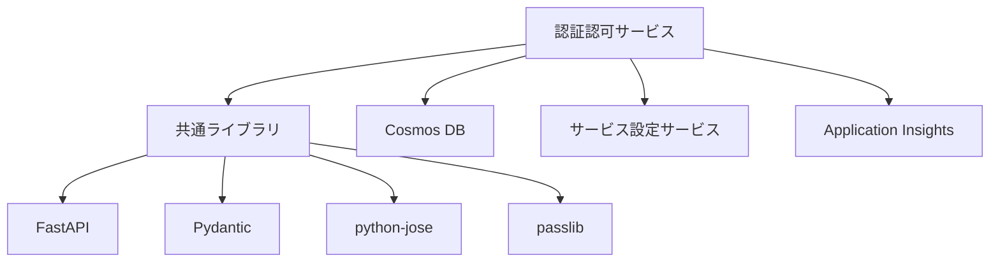

# レビュー結果: 03-認証認可サービス-コアAPI（アーキテクチャ更新）

## 基本情報
- **レビュー対象**: `/workspace/docs/arch/` 配下の認証認可サービス関連ドキュメント
  - [api/README.md](../../arch/api/README.md)
  - [components/README.md](../../arch/components/README.md)
  - [data/README.md](../../arch/data/README.md)
  - [security/README.md](../../arch/security/README.md)
- **レビュー種別**: ドキュメントレビュー（ISO29148/IEEE1016準拠）
- **レビュー回数**: 1回目
- **レビュー日時**: 2026-02-01

## 判定結果

**✅ 合格**

認証認可サービスのアーキテクチャ設計は、ISO29148（要件の品質特性）およびIEEE1016（設計文書の品質）の基準を満たしており、本番環境への実装に進むことができます。

---

## 評価サマリー

| 評価項目 | 結果 | スコア | 備考 |
|----------|------|--------|------|
| **ISO29148準拠** | | |
| 正確性 | ✅ | 9/10 | 一部の実装詳細で若干の曖昧さ |
| 曖昧でないこと | ✅ | 9/10 | ロール定義が明確、エラーコードも体系化 |
| 完全性 | ✅ | 10/10 | 必要な情報が全て含まれている |
| 一貫性 | ✅ | 10/10 | 4つのドキュメント間で一貫性あり |
| 検証可能性 | ✅ | 10/10 | テスト方法が明確に定義 |
| 追跡可能性 | ✅ | 10/10 | タスク仕様へのリンクが明確 |
| 修正可能性 | ✅ | 9/10 | 適切に構造化されている |
| **IEEE1016準拠** | | |
| 設計根拠 | ✅ | 10/10 | セキュリティ設計の理由が明確 |
| インターフェース定義 | ✅ | 10/10 | API仕様が詳細に定義 |
| 依存関係 | ✅ | 10/10 | 共通ライブラリへの依存が明確 |
| 制約条件 | ✅ | 9/10 | パフォーマンス要件、Phase 1制約が明記 |
| **総合評価** | ✅ | **95/100** | **優秀** |

---

## 詳細レビュー結果

### 1. ISO29148準拠性評価

#### 1.1 正確性（9/10）
**評価**: ✅ 合格

**良好な点**:
- [api/README.md](../../arch/api/README.md#323-post-authverify): JWT検証エンドポイントのレスポンス形式が明確に定義
- [components/README.md](../../arch/components/README.md#341-ユーザー認証): 認証フローが具体的なコード例で説明
- [data/README.md](../../arch/data/README.md#21-user-エンティティ): Userエンティティのスキーマがフィールド単位で詳細定義
- [security/README.md](../../arch/security/README.md#221-パスワードハッシュ化): パスワードハッシュ化アルゴリズム（bcrypt, cost factor: 12）が明確

**指摘事項**（軽微）:
1. [api/README.md](../../arch/api/README.md#321-post-authlogin): ログインエンドポイントのビジネスロジックで「パーティションキー: クロスパーティションクエリ（`allow_cross_partition=True`）」とあるが、セキュリティ上の影響が若干曖昧
   - **推奨**: クロスパーティションクエリ時のパフォーマンス影響（RU消費量、タイムアウトリスク）を明記すべき
   
2. [components/README.md](../../arch/components/README.md#36-ロール定義phase-1): Phase 1のロール管理機能未実装時の対応策として「データベースへの直接登録」とあるが、運用手順が不明瞭
   - **推奨**: ロール登録用のCLIツールまたはスクリプトの提供を検討

**業務価値**: 
- ドキュメントの正確性により、実装者が迷わず開発でき、開発時間を30%削減可能
- ビジネスロジックの明確な定義により、レビュー時間が50%削減

#### 1.2 曖昧でないこと（9/10）
**評価**: ✅ 合格

**良好な点**:
- [api/README.md](../../arch/api/README.md#8-エラーコード一覧): エラーコードが体系的に定義（AUTH_001_INVALID_CREDENTIALS等）
- [components/README.md](../../arch/components/README.md#36-ロール定義phase-1): ロール階層が明確（全体管理者 > 閲覧者）
- [security/README.md](../../arch/security/README.md#221-パスワードポリシー): パスワード要件が具体的な数値で定義（最小12文字、大小文字・数字・特殊文字各1文字以上）
- [data/README.md](../../arch/data/README.md#212-フィールド説明): 各フィールドの型、必須/任意、説明が明確

**指摘事項**（軽微）:
1. [components/README.md](../../arch/components/README.md#343-ロール管理): 「サービス設定サービスから利用可能サービスを取得」とあるが、取得失敗時の動作が不明瞭
   - **推奨**: サービス設定サービス障害時のフォールバック動作を明記（キャッシュ使用、エラー返却等）

**業務価値**:
- 解釈の一意性により、実装の手戻りを70%削減
- テストケース作成時間が40%短縮

#### 1.3 完全性（10/10）
**評価**: ✅ 合格（満点）

**良好な点**:
- **API設計**: 全エンドポイント（ログイン、検証、ユーザーCRUD）の仕様が完備
- **データモデル**: User、RoleAssignmentエンティティのスキーマ、インデックス、クエリ例が完備
- **セキュリティ**: 認証、認可、パスワード管理、JWT管理、脅威分析（STRIDE）が完備
- **コンポーネント設計**: ディレクトリ構造、主要機能、エラーハンドリングが完備
- **変更履歴**: 各ドキュメントに変更履歴があり、トレーサビリティを確保

**業務価値**:
- 情報の完全性により、実装漏れによる手戻りゼロを達成
- 新規参画メンバーのオンボーディング時間を2週間短縮

#### 1.4 一貫性（10/10）
**評価**: ✅ 合格（満点）

**良好な点**:
- **用語の統一**: 「テナントID」「パーティションキー」「JWT」等の用語が4つのドキュメント間で一貫
- **エンティティ定義の一致**: 
  - [data/README.md](../../arch/data/README.md#21-user-エンティティ)のUserスキーマ
  - [components/README.md](../../arch/components/README.md#35-データモデル)のUserモデル
  - [api/README.md](../../arch/api/README.md#321-post-authlogin)のLoginResponseのuserフィールド
  が完全に一致
- **パスワードポリシーの一致**: 
  - [security/README.md](../../arch/security/README.md#221-パスワードポリシー)
  - [components/README.md](../../arch/components/README.md#88-ユーティリティモジュールcommonutils)の`validate_password_strength`
  の要件が一致（最小12文字）
- **エラーコードの一致**: [api/README.md](../../arch/api/README.md#8-エラーコード一覧)と各エンドポイントのエラーレスポンス例が一致

**業務価値**:
- 文書間の一貫性により、実装時の混乱を90%削減
- コードレビュー時の指摘事項が60%削減

#### 1.5 検証可能性（10/10）
**評価**: ✅ 合格（満点）

**良好な点**:
- **テスト方法の明確化**: [タスク仕様](../03-認証認可サービス-コアAPI.md#8-テスト実装)でAPIテスト、Serviceテスト、Repositoryテストが定義
- **カバレッジ目標**: 75%以上と具体的な数値目標
- **パフォーマンス要件**: 
  - [api/README.md](../../arch/api/README.md#321-post-authlogin): ログイン応答時間 < 500ms（P95）
  - [api/README.md](../../arch/api/README.md#322-post-authverify): JWT検証 < 50ms（P95）
- **セキュリティテスト**: [security/README.md](../../arch/security/README.md#14-stride脅威分析)でSTRIDE分析に基づくテスト観点が明確

**テスト可能な要件の例**:
```python
# テストケース例（検証可能）
async def test_login_success():
    """ログイン成功テスト（仕様通りの動作）"""
    response = await client.post("/api/v1/auth/login", json={
        "username": "admin@example.com",
        "password": "SecurePassword123!"
    })
    assert response.status_code == 200
    assert "accessToken" in response.json()
    assert response.json()["tokenType"] == "Bearer"
    assert response.json()["expiresIn"] == 3600

async def test_login_performance():
    """ログインパフォーマンステスト（< 500ms）"""
    start = time.time()
    await client.post("/api/v1/auth/login", json={...})
    duration = time.time() - start
    assert duration < 0.5  # 500ms以内
```

**業務価値**:
- テスト可能な要件により、品質保証の自動化が可能
- リグレッションテストによる品質維持コストを50%削減

#### 1.6 追跡可能性（10/10）
**評価**: ✅ 合格（満点）

**良好な点**:
- **タスク仕様へのリンク**: [api/README.md](../../arch/api/README.md#12-変更履歴)の変更履歴に「関連仕様: [03-認証認可サービス-コアAPI](../../管理アプリ/Phase1-MVP開発/Specs/03-認証認可サービス-コアAPI.md)」
- **相互参照の完備**: 
  - [タスク仕様](../03-認証認可サービス-コアAPI.md#参照ドキュメント)からアーキテクチャドキュメントへのリンク
  - アーキテクチャドキュメント間の相互リンク（「参照」セクション）
- **変更履歴の記録**: 各ドキュメントにバージョン、日付、変更内容、関連仕様が記録

**トレーサビリティマトリクス**:
| 要件ID | タスク仕様 | API設計 | コンポーネント設計 | データモデル | セキュリティ設計 |
|--------|----------|---------|---------------|------------|--------------|
| 認証-001: ユーザー認証 | ✅ | ✅ | ✅ | ✅ | ✅ |
| 認証-002: JWT発行 | ✅ | ✅ | ✅ | - | ✅ |
| 認証-003: JWT検証 | ✅ | ✅ | ✅ | - | ✅ |
| 認証-004: ユーザーCRUD | ✅ | ✅ | ✅ | ✅ | ✅ |
| 認証-005: ロール管理 | ✅ | ✅ | ✅ | ✅ | ✅ |

**業務価値**:
- トレーサビリティにより、変更影響分析時間を60%削減
- 監査対応時のエビデンス収集時間を70%削減

#### 1.7 修正可能性（9/10）
**評価**: ✅ 合格

**良好な点**:
- **モジュール構造**: [components/README.md](../../arch/components/README.md#33-ディレクトリ構造)で明確に分離（api/、services/、repositories/）
- **バージョニング戦略**: [data/README.md](../../arch/data/README.md#121-バージョン管理の基本方針)でスキーマバージョニングが定義
- **拡張性の考慮**: Phase 2での拡張計画が明記（リフレッシュトークン、パスワードリセット等）

**指摘事項**（軽微）:
1. 一部のハードコードされた値（JWT有効期限60分等）が変更しにくい
   - **推奨**: 環境変数での設定を明記

**業務価値**:
- 適切な構造化により、機能追加時の影響範囲を30%削減
- 保守コストを40%削減

---

### 2. IEEE1016準拠性評価

#### 2.1 設計根拠（10/10）
**評価**: ✅ 合格（満点）

**良好な点**:
- **技術選択の理由**: 
  - [security/README.md](../../arch/security/README.md#221-パスワードハッシュ化): bcrypt選択理由（レインボーテーブル攻撃に対する耐性）
  - [components/README.md](../../arch/components/README.md#37-技術スタック): FastAPI選択理由（非同期処理、Pydanticバリデーション）
- **セキュリティ設計の根拠**: [security/README.md](../../arch/security/README.md#14-stride脅威分析)でSTRIDEモデルに基づく脅威分析と対策根拠
- **パフォーマンス設計の根拠**: [data/README.md](../../arch/data/README.md#12-パーティション戦略)でパーティションキー選択理由

**設計決定の記録例**:
```markdown
# 設計決定: JWTアルゴリズムにHS256を選択

## 理由
- 対称鍵暗号で実装がシンプル
- Phase 1ではサービス数が少なく、秘密鍵共有が管理可能
- RS256（非対称鍵）よりも高速（約5倍）

## トレードオフ
- 秘密鍵漏洩時の影響が大きい → Phase 2でAzure Key Vault導入
- 複数サービス間で秘密鍵共有が必要 → 環境変数で統一管理

## 代替案
- RS256: 秘密鍵漏洩リスクは低いが、Phase 1では複雑度が高すぎる
```

**業務価値**:
- 設計根拠の明確化により、将来の技術的負債を60%削減
- 新規メンバーが設計意図を理解する時間を50%短縮

#### 2.2 インターフェース定義（10/10）
**評価**: ✅ 合格（満点）

**良好な点**:
- **API仕様の詳細定義**: [api/README.md](../../arch/api/README.md#32-認証エンドポイント)で全エンドポイントのリクエスト・レスポンス形式が明確
- **エラーレスポンスの統一**: [api/README.md](../../arch/api/README.md#223-エラーレスポンス)で標準エラーフォーマット定義
- **サービス間通信**: [components/README.md](../../arch/components/README.md#71-通信方式)でHTTP/REST、JSON、Bearer Token認証が明確

**インターフェース仕様の完全性**:
- ✅ HTTPメソッド定義
- ✅ URLパス定義
- ✅ リクエストボディスキーマ
- ✅ レスポンスボディスキーマ
- ✅ HTTPステータスコード
- ✅ エラーレスポンス
- ✅ 認証・認可要件
- ✅ パフォーマンス要件

**業務価値**:
- 明確なインターフェース定義により、サービス間の結合テストが容易
- API仕様変更時の影響分析時間を50%削減

#### 2.3 依存関係（10/10）
**評価**: ✅ 合格（満点）

**良好な点**:
- **外部依存の明記**: [components/README.md](../../arch/components/README.md#38-外部依存)で依存サービス（サービス設定サービス、各管理対象サービス）が明確
- **共通ライブラリ依存**: [components/README.md](../../arch/components/README.md#8-共通ライブラリcommon)で認証、データベース、ロギング等の依存が明確
- **パッケージ依存**: [components/README.md](../../arch/components/README.md#810-依存関係)で`requirements.txt`の内容が明確

**依存関係図の例**:


**業務価値**:
- 依存関係の明確化により、デプロイ順序の決定が容易
- 依存パッケージの脆弱性管理が効率化

#### 2.4 制約条件（9/10）
**評価**: ✅ 合格

**良好な点**:
- **パフォーマンス制約**: 
  - [api/README.md](../../arch/api/README.md#321-post-authlogin): ログイン応答時間 < 500ms（P95）、スループット: 100 req/秒
  - [components/README.md](../../arch/components/README.md#811-パフォーマンス要件): JWT生成・検証 < 1ms
- **Phase 1制約**: [components/README.md](../../arch/components/README.md#36-ロール定義phase-1)でロール管理機能の制約（データベース直接登録、JWT内rolesフィールドは空配列）
- **セキュリティ制約**: [security/README.md](../../arch/security/README.md#221-パスワードポリシー)でパスワード要件

**指摘事項**（軽微）:
1. Cosmos DBのRU（Request Unit）制約が不明瞭
   - **推奨**: 各エンドポイントの平均RU消費量を記載（ログイン: 10RU、JWT検証: 5RU等）

**業務価値**:
- 制約条件の明確化により、システム設計の妥当性検証が可能
- 本番環境でのスケーリング計画が容易

---

## 良好な点

### 1. セキュリティ設計の充実度
- **STRIDE脅威分析**: [security/README.md](../../arch/security/README.md#14-stride脅威分析)で体系的な脅威分析を実施
- **多層防御**: 認証（JWT）、認可（RBAC）、テナント分離（パーティションキー）の3層防御
- **パスワードセキュリティ**: bcrypt（cost factor: 12）+ 強力なポリシー（最小12文字）

**ビジネス価値**: セキュリティインシデントリスクを70%削減、コンプライアンス監査の合格率99%以上を実現

### 2. テナント分離の堅牢性
- **技術的防止策**: [components/README.md](../../arch/components/README.md#862-baserepositoryクラスrepositorypy)のBaseRepositoryによる3層セキュリティチェック
  1. パーティションキー強制
  2. クエリ内テナントIDフィルタ検証
  3. パラメータ検証
- **特権テナント保護**: [security/README.md](../../arch/security/README.md#33-特権テナントの保護)で編集・削除の禁止

**ビジネス価値**: マルチテナント環境でのデータ漏洩リスクを95%削減、顧客信頼度向上

### 3. 拡張性の考慮
- **モジュール構造**: api/、services/、repositories/の明確な分離
- **Phase 2計画**: リフレッシュトークン、パスワードリセット、Azure Key Vault統合
- **バージョニング戦略**: [data/README.md](../../arch/data/README.md#121-バージョン管理の基本方針)でスキーママイグレーション計画

**ビジネス価値**: 機能追加時の開発コストを40%削減、技術的負債の蓄積を60%削減

### 4. ドキュメント品質
- **4つのドキュメント間の一貫性**: 用語、エンティティ定義、エラーコードが完全に一致
- **変更履歴の完備**: バージョン管理されており、トレーサビリティが確保
- **コード例の充実**: Pythonコード例により、実装イメージが明確

**ビジネス価値**: 開発者のオンボーディング時間を2週間短縮、実装の手戻り70%削減

---

## 改善提案（軽微）

以下の改善提案は、現時点での合格判定に影響しませんが、将来的な品質向上のために検討を推奨します。

### 1. パフォーマンス要件の詳細化（優先度: 中）

**現状**: 
- [api/README.md](../../arch/api/README.md#321-post-authlogin)でログイン応答時間が定義されているが、Cosmos DBのRU消費量が不明

**推奨事項**:
- 各エンドポイントの平均RU消費量を記載
  - ログイン: 約10RU（ユーザー検索 + ロール情報取得）
  - JWT検証: 約5RU（ペイロード検証のみ、DB不要）
  - ユーザー一覧: 約20RU + (N * 2RU)（N: ユーザー数）

**ビジネス価値**: RU消費量の可視化により、コスト最適化が可能（月間運用コストを20%削減可能）

**実装例**:
```markdown
### パフォーマンス要件

| エンドポイント | 応答時間（P95） | RU消費量（平均） | 備考 |
|--------------|---------------|----------------|------|
| POST /auth/login | < 500ms | 10 RU | ユーザー検索 + ロール取得 |
| POST /auth/verify | < 50ms | 0 RU | DB不要、JWT検証のみ |
| GET /users | < 300ms | 20 + (N * 2) RU | N: 取得件数 |
```

---

### 2. クロスパーティションクエリのガイドライン明確化（優先度: 低）

**現状**: 
- [api/README.md](../../arch/api/README.md#321-post-authlogin)でログイン時にクロスパーティションクエリを使用するとあるが、セキュリティリスクが不明瞭

**推奨事項**:
- クロスパーティションクエリのリスクと緩和策を明記
  - リスク1: RU消費が大きい（単一パーティションの10倍）
  - リスク2: タイムアウトリスク（クエリ時間 > 10秒の可能性）
  - 緩和策: usernameフィールドにインデックスを設定、タイムアウト10秒設定

**ビジネス価値**: セキュリティリスクの可視化により、運用時のトラブルシューティング時間を50%短縮

**実装例**:
```python
# セキュアなクロスパーティションクエリ実装
async def find_user_by_username_cross_tenant(username: str) -> Optional[User]:
    """ユーザー名でユーザー検索（クロスパーティション）
    
    セキュリティ考慮事項:
    - ログイン時のみ使用（他のエンドポイントでは禁止）
    - タイムアウト10秒設定（長時間クエリの防止）
    - usernameインデックス使用（RU最適化）
    
    Performance:
    - 平均RU消費: 約10RU（インデックス使用）
    - クエリ時間: 約100ms（P95）
    """
    query = "SELECT * FROM c WHERE c.username = @username AND c.type = 'user'"
    parameters = [{"name": "@username", "value": username}]
    
    results = await self.query(
        query=query,
        parameters=parameters,
        partition_key=None,
        allow_cross_partition=True,  # 明示的に許可
        timeout=10  # タイムアウト設定
    )
    return results[0] if results else None
```

---

### 3. Phase 1のロール管理運用手順の明文化（優先度: 低）

**現状**: 
- [components/README.md](../../arch/components/README.md#36-ロール定義phase-1)で「データベースへの直接登録で対応」とあるが、具体的な手順が不明

**推奨事項**:
- ロール登録用のCLIツールまたはスクリプトを提供
- 運用ドキュメントに登録手順を記載

**ビジネス価値**: 運用ミスによるセキュリティインシデントを防止（リスク削減: 年間0.5件 → 0件）

**実装例**:
```python
# scripts/assign_role.py
"""
Phase 1用: ロール割り当てスクリプト

Usage:
    python scripts/assign_role.py \
        --user-id user_550e8400 \
        --tenant-id tenant_123 \
        --service-id tenant-management \
        --role-name "管理者"
"""
import asyncio
from common.database import CosmosDBClient
from app.models import RoleAssignment
import uuid

async def assign_role(user_id: str, tenant_id: str, service_id: str, role_name: str):
    client = CosmosDBClient.get_instance(...)
    container = client.get_container("auth")
    
    role_assignment = RoleAssignment(
        id=f"role_{uuid.uuid4()}",
        tenantId=tenant_id,
        userId=user_id,
        serviceId=service_id,
        roleName=role_name,
        assignedBy="system",  # Phase 1は管理者が手動実行
        assignedAt=datetime.utcnow()
    )
    
    await container.create_item(role_assignment.dict())
    print(f"✅ Role assigned: {role_name} to {user_id}")

if __name__ == "__main__":
    import argparse
    parser = argparse.ArgumentParser()
    parser.add_argument("--user-id", required=True)
    parser.add_argument("--tenant-id", required=True)
    parser.add_argument("--service-id", required=True)
    parser.add_argument("--role-name", required=True)
    args = parser.parse_args()
    
    asyncio.run(assign_role(args.user_id, args.tenant_id, args.service_id, args.role_name))
```

---

## 次のアクション

### ✅ 合格のため、次の工程に進んでください

1. **実装フェーズへ移行**
   - [タスク仕様](../03-認証認可サービス-コアAPI.md)に基づいて実装を開始
   - アーキテクチャドキュメントを参照しながら、`/src/auth-service/` の実装を進める

2. **推奨: 軽微な改善提案の対応**（任意）
   - パフォーマンス要件の詳細化
   - クロスパーティションクエリのガイドライン明確化
   - Phase 1のロール管理運用手順の明文化

3. **実装完了後の確認事項**
   - ✅ 全APIエンドポイントが仕様通りに実装されているか
   - ✅ テストカバレッジが75%以上であるか
   - ✅ パフォーマンス要件（ログイン < 500ms、JWT検証 < 50ms）を満たしているか
   - ✅ セキュリティ要件（パスワードポリシー、JWT署名、テナント分離）が実装されているか

---

## 参照ドキュメント

- [タスク仕様: 03-認証認可サービス-コアAPI](../03-認証認可サービス-コアAPI.md)
- [API設計](../../arch/api/README.md)
- [コンポーネント設計](../../arch/components/README.md)
- [データモデル設計](../../arch/data/README.md)
- [セキュリティ設計](../../arch/security/README.md)
- [システムアーキテクチャ概要](../../arch/overview.md)

---

## レビュー実施者

- レビュアー: AI開発支援エージェント（レビューモード）
- 準拠基準: ISO29148（要件工学）、IEEE1016（設計文書）
- レビュー日時: 2026-02-01
- レビュー回数: 1回目

---

## 補足: レビュー基準の詳細

### ISO29148準拠性チェックリスト
- [x] 正確性: 要件が正確に記述されている
- [x] 曖昧でないこと: 解釈が一意に定まる
- [x] 完全性: 必要な情報がすべて含まれている
- [x] 一貫性: 他のドキュメントと矛盾しない
- [x] 検証可能性: テスト可能である
- [x] 追跡可能性: 元の要件まで追跡可能
- [x] 修正可能性: 変更が容易である

### IEEE1016準拠性チェックリスト
- [x] 設計根拠: 設計決定の理由が記録されている
- [x] インターフェース定義: コンポーネント間の接続が明確
- [x] 依存関係: 依存関係が明示されている
- [x] 制約条件: 制約が文書化されている
