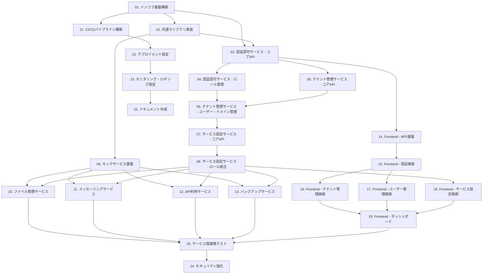

# 開発タスク一覧: Phase1 MVP開発

## 概要
- **アプリ名**: 管理アプリ
- **開発プラン**: Phase1-MVP開発
- **開始日**: 2026-02-01
- **最終更新**: 2026-02-01
- **目標**: マルチテナント管理アプリケーションのMVP (Minimum Viable Product) を構築する

## タスク一覧

| 順序 | タスク名 | ステータス | 開始日 | 完了日 | 備考 |
|------|----------|------------|--------|--------|------|
| 01 | インフラ基盤構築 | ✅ 完了 | 2026-02-01 | 2026-02-01 | Bicepテンプレート、Cosmos DB、テスト完了 |
| 02 | 共通ライブラリ実装 | ✅ 完了 | 2026-02-01 | 2026-02-01 | 認証Middleware、ロガー、バリデーション、カバレッジ78% |
| 03 | 認証認可サービス - コアAPI | 未着手 | - | - | JWT発行・検証、ユーザー管理 |
| 04 | 認証認可サービス - ロール管理 | 未着手 | - | - | ロール割り当て、統合API |
| 05 | テナント管理サービス - コアAPI | 未着手 | - | - | テナントCRUD、特権テナント保護 |
| 06 | テナント管理サービス - ユーザー・ドメイン管理 | 未着手 | - | - | TenantUser、Domain管理 |
| 07 | サービス設定サービス - コアAPI | 未着手 | - | - | サービスカタログ、割り当て |
| 08 | サービス設定サービス - ロール統合 | 未着手 | - | - | 各サービスロール情報集約 |
| 09 | モックサービス基盤 | 未着手 | - | - | 共通パターン実装 |
| 10 | ファイル管理サービス | 未着手 | - | - | File/Folder管理 |
| 11 | メッセージングサービス | 未着手 | - | - | Channel/Message管理 |
| 12 | API利用サービス | 未着手 | - | - | APIKey/Usage管理 |
| 13 | バックアップサービス | 未着手 | - | - | BackupJob/History管理 |
| 14 | Frontend - BFF基盤 | 未着手 | - | - | Next.js基本設定、認証Middleware |
| 15 | Frontend - 認証画面 | 未着手 | - | - | ログイン/ログアウト |
| 16 | Frontend - テナント管理画面 | 未着手 | - | - | テナント一覧・詳細・編集 |
| 17 | Frontend - ユーザー管理画面 | 未着手 | - | - | ユーザー一覧・詳細・ロール管理 |
| 18 | Frontend - サービス設定画面 | 未着手 | - | - | サービス割り当て画面 |
| 19 | Frontend - ダッシュボード | 未着手 | - | - | 集約データ表示 |
| 20 | サービス間連携テスト | 未着手 | - | - | 統合テスト、E2Eテスト |
| 21 | CI/CDパイプライン構築 | 未着手 | - | - | GitHub Actions設定 |
| 22 | デプロイメント設定 | 未着手 | - | - | App Service設定、環境変数 |
| 23 | モニタリング・ロギング設定 | 未着手 | - | - | Application Insights、アラート |
| 24 | セキュリティ強化 | 未着手 | - | - | レート制限、CORS、セキュリティヘッダー |
| 25 | ドキュメント作成 | 未着手 | - | - | API仕様書、運用手順書 |

## 現在の作業状況
- **現在のタスク**: タスク02完了、次はタスク03（認証認可サービス - コアAPI）
- **現在のサブ工程**: -

## 依存関係グラフ

## マイルストーン

### M1: 基盤完成 (タスク01-02完了)
- インフラが構築され、共通ライブラリが利用可能
- 各サービスの開発を開始できる状態

### M2: コアサービス完成 (タスク03-08完了)
- 認証認可、テナント管理、サービス設定の基本機能が動作
- モックサービスの実装準備が整う

### M3: バックエンド完成 (タスク09-13完了)
- 全てのバックエンドサービスがAPIを提供
- フロントエンド開発の準備が整う

### M4: フロントエンド完成 (タスク14-19完了)
- ユーザーが全機能を利用可能なUI完成
- 統合テストの準備が整う

### M5: MVP完成 (全タスク完了)
- 本番環境にデプロイ可能
- ユーザーへの提供準備が完了

## リスク管理

| リスク | 影響度 | 対策 | 担当 |
|-------|--------|------|------|
| Cosmos DB操作の学習コスト | 中 | 事前にサンプル実装、ドキュメント参照 | Backend開発者 |
| サービス間連携の複雑性 | 高 | 共通パターン確立、早期統合テスト | 全員 |
| Next.js BFFパターンの習熟 | 中 | プロトタイプ作成、サンプル実装 | Frontend開発者 |
| Azure環境の構築遅延 | 高 | 並行してローカル開発環境で実装 | DevOps担当 |
| セキュリティ要件の追加 | 中 | Phase 2で対応可能な設計 | アーキテクト |

## 実装方針

### 開発環境
- **ローカル開発**: DevContainer (Cosmos DB Emulator使用)
- **ステージング**: Azure環境 (検証用)
- **本番**: Azure環境

### 開発順序の原則
1. **下から上へ**: インフラ → バックエンド → フロントエンド
2. **コアから拡張へ**: 必須機能 → 拡張機能
3. **独立性の確保**: 並行開発可能なタスクを明確化

### テスト戦略
- **単体テスト**: 各タスクで実装 (pytest, Jest)
- **統合テスト**: タスク20で実施
- **E2Eテスト**: タスク20で実施
- **カバレッジ目標**: 70%以上

## 履歴
- 2026-02-01: 初版作成、25タスクを定義
