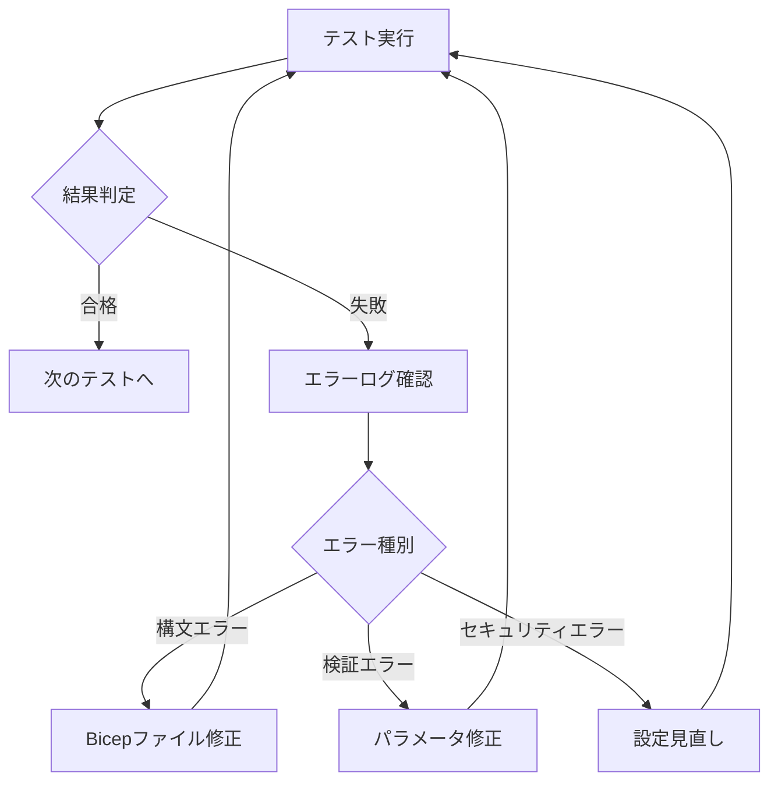

# インフラ基盤構築 テストプラン

## ドキュメント情報
- **バージョン**: 1.0.0
- **作成日**: 2026-02-01
- **対象タスク**: [01-インフラ基盤構築](../../../docs/管理アプリ/Phase1-MVP開発/01-インフラ基盤構築.md)
- **対象仕様書**: [01-インフラ基盤構築 仕様書](../../../docs/管理アプリ/Phase1-MVP開発/Specs/01-インフラ基盤構築.md)

---

## 1. テスト概要

### 1.1 テストの目的

本テストプランは、Bicepテンプレートで構築されるAzureインフラ基盤の品質を保証することを目的とする。具体的には：

- **構文の正確性**: Bicepテンプレートとパラメータファイルの構文エラーがないこと
- **ベストプラクティス準拠**: Azureのセキュリティとパフォーマンスのベストプラクティスに準拠していること
- **機能的正確性**: 仕様書に定義された受け入れ基準を満たすこと
- **デプロイ可能性**: 全環境で正常にデプロイできること

### 1.2 テスト戦略

#### ISTQB準拠のテスト技法

| テスト技法 | 適用範囲 | 目的 |
|-----------|---------|------|
| **同値分割法** | パラメータ値、環境名、リソース名 | 有効・無効な入力を分類してテスト |
| **境界値分析** | リソース名の文字数、SKU値、RU値 | 境界条件でのエラーを検出 |
| **デシジョンテーブル** | 環境ごとのパラメータ組み合わせ、セキュリティ設定 | 複雑な条件の網羅的テスト |
| **状態遷移テスト** | デプロイ→更新→削除のライフサイクル | 状態遷移の正確性を確認 |

#### テストレベル

```
┌─────────────────────────────────────────────┐
│ レベル1: 静的解析テスト                        │
│ - Bicep Linter                              │
│ - 構文チェック                                │
│ - パラメータファイル検証                       │
└─────────────────────────────────────────────┘
              ↓
┌─────────────────────────────────────────────┐
│ レベル2: ARM検証テスト                        │
│ - ARM Template生成確認                       │
│ - Azure Deployment Validation               │
│ - What-If分析                                │
└─────────────────────────────────────────────┘
              ↓
┌─────────────────────────────────────────────┐
│ レベル3: セキュリティテスト                    │
│ - HTTPS設定確認                              │
│ - TLS バージョン確認                          │
│ - Key Vault設定確認                          │
└─────────────────────────────────────────────┘
              ↓
┌─────────────────────────────────────────────┐
│ レベル4: スクリプト統合テスト                  │
│ - deploy.sh 実行テスト                       │
│ - validate.sh 実行テスト                     │
│ - destroy.sh 実行テスト                      │
└─────────────────────────────────────────────┘
```

### 1.3 テストスコープ

#### 対象範囲

✅ **テスト対象**
- Bicepテンプレート（main.bicep + modules/）
- パラメータファイル（dev, staging, production）
- デプロイスクリプト（deploy.sh, validate.sh, destroy.sh）
- セキュリティ設定（HTTPS, TLS, Key Vault）
- リソース間の依存関係

❌ **テスト対象外（MVP段階）**
- 実際のAzure環境へのデプロイ（CI/CD構築後に自動化）
- パフォーマンステスト
- 負荷テスト
- 本番環境の費用分析

### 1.4 合格基準

#### 全体の合格基準

- ✅ **必須テスト（Priority: 高）**: 100% 合格
- ✅ **推奨テスト（Priority: 中）**: 90% 以上合格
- ⚠️ **オプションテスト（Priority: 低）**: 80% 以上合格

#### カテゴリ別合格基準

| カテゴリ | 必須合格率 |
|---------|----------|
| 構文・Linter | 100% |
| パラメータ検証 | 100% |
| セキュリティ | 100% |
| ARM検証 | 90% |
| スクリプト実行 | 90% |

---

## 2. テスト環境

### 2.1 ローカル開発環境

| 項目 | 要件 | 確認方法 |
|-----|------|---------|
| **OS** | Linux (Dev Container) | `uname -a` |
| **Azure CLI** | 2.50.0 以上 | `az --version` |
| **Bicep CLI** | 0.20.0 以上 | `az bicep version` |
| **Bash** | 5.0 以上 | `bash --version` |

### 2.2 Azure環境

| 環境 | 用途 | テストレベル |
|-----|------|------------|
| **Development** | ローカル開発 | Linter + ARM検証のみ |
| **Staging** | 統合テスト | 全テスト実行 |
| **Production** | 本番環境 | Phase1では構築しない |

### 2.3 テストツール

| ツール | バージョン | 用途 |
|-------|----------|------|
| **Azure CLI** | 2.50+ | Bicepビルド、デプロイ、検証 |
| **Bicep CLI** | 0.20+ | Linter、ARM Template生成 |
| **Bash** | 5.0+ | テストスクリプト実行 |
| **ShellCheck** | 0.8+ | シェルスクリプト静的解析 |

---

## 3. テストアプローチ

### 3.1 自動化戦略

#### 自動化可能なテスト（優先）


**自動化のメリット**
- 🚀 高速なフィードバックループ
- 🔄 CI/CDパイプラインへの統合が容易
- 📊 一貫性のあるテスト結果

#### 手動テスト（最小限）

- Azure Portal での視覚的確認
- コスト見積もりの確認
- Application Insights ダッシュボードの動作確認

### 3.2 テストデータ

#### 3.2.1 パラメータ同値分割

| パラメータ | 有効な同値クラス | 無効な同値クラス |
|-----------|---------------|----------------|
| **environment** | dev, staging, production | test, prod, DEV, "" |
| **location** | japaneast, eastus | tokyo, invalid, "" |
| **SKU name** | B1, S1, P1V2 | A1, Z9, "" |
| **リソース名** | 3-24文字、英数字とハイフン | 2文字以下、25文字以上、特殊文字 |

#### 3.2.2 境界値テスト対象

| 項目 | 最小値 | 境界値- | 境界値+ | 最大値 | 無効値 |
|-----|-------|--------|--------|-------|-------|
| **リソース名長** | 3 | 2 → ❌ | 3 → ✅ | 24 | 25 → ❌ |
| **Cosmos RU** | 400 | 399 → ❌ | 400 → ✅ | 1000000 | 1000001 → ❌ |
| **SKU Capacity** | 1 | 0 → ❌ | 1 → ✅ | 10 | 11 → ❌ |

#### 3.2.3 デシジョンテーブル: 環境とセキュリティ設定

| テストID | Environment | HTTPS | TLS 1.2+ | Key Vault | Backup | 期待結果 |
|---------|------------|-------|----------|-----------|--------|---------|
| DT-01 | dev | ✅ | ✅ | ✅ | ✅ | ✅ Pass |
| DT-02 | staging | ✅ | ✅ | ✅ | ✅ | ✅ Pass |
| DT-03 | production | ✅ | ✅ | ✅ | ✅ | ✅ Pass |
| DT-04 | dev | ❌ | - | - | - | ❌ Fail |
| DT-05 | staging | ✅ | ❌ | - | - | ❌ Fail |

### 3.3 リスクベースのテスト優先順位

| リスク | 影響度 | 発生確率 | 優先度 | テスト戦略 |
|-------|-------|---------|-------|----------|
| **セキュリティ設定不備** | 高 | 中 | 🔴 最高 | 全設定を自動テスト |
| **デプロイ失敗** | 高 | 低 | 🟠 高 | What-If分析で事前検証 |
| **コストオーバーラン** | 高 | 中 | 🟠 高 | SKU設定の境界値テスト |
| **リソース名の衝突** | 中 | 低 | 🟡 中 | 一意性チェック |
| **パラメータの不一致** | 中 | 中 | 🟡 中 | 全環境での検証 |

---

## 4. テスト実行計画

### 4.1 テスト実行順序

```bash
# Phase 1: 静的解析（所要時間: 2-3分）
./tests/validation-tests.sh

# Phase 2: デプロイ前検証（所要時間: 5-10分）
./tests/deployment-tests.sh --whatif

# Phase 3: セキュリティ検証（所要時間: 3-5分）
./tests/security-tests.sh

# Phase 4: 統合テスト（所要時間: 全体で10-15分）
./tests/run-tests.sh --all
```

### 4.2 テストスケジュール

| フェーズ | タイミング | 実行者 | 所要時間 |
|---------|----------|-------|---------|
| **ローカル開発** | コード変更時 | 開発者 | 2-3分 |
| **プルリクエスト** | PR作成時 | CI/CD | 5-10分 |
| **デプロイ前** | デプロイ直前 | 運用チーム | 10-15分 |
| **定期実行** | 週次 | CI/CD | 15-20分 |

### 4.3 エラー時の対応フロー



---

## 5. テストケース概要

詳細なテストケースは [test-cases.md](./test-cases.md) を参照。

### 5.1 カテゴリ別テストケース数

| カテゴリ | 総ケース数 | 自動化 | 手動 |
|---------|----------|-------|------|
| **Linter・構文** | 8 | 8 | 0 |
| **パラメータ検証** | 6 | 6 | 0 |
| **ARM Template検証** | 4 | 4 | 0 |
| **セキュリティ** | 7 | 6 | 1 |
| **スクリプト実行** | 6 | 5 | 1 |
| **統合テスト** | 3 | 2 | 1 |
| **合計** | **34** | **31** | **3** |

### 5.2 優先度別分布

| 優先度 | ケース数 | パーセンテージ |
|-------|---------|--------------|
| 🔴 高（必須） | 22 | 65% |
| 🟠 中（推奨） | 9 | 26% |
| 🟢 低（オプション） | 3 | 9% |

---

## 6. テスト成果物

### 6.1 テストスクリプト

| ファイル | 目的 | 自動化レベル |
|---------|------|------------|
| [run-tests.sh](./run-tests.sh) | テスト実行のメインエントリポイント | 完全自動化 |
| [validation-tests.sh](./validation-tests.sh) | Bicep Linter、構文チェック | 完全自動化 |
| [deployment-tests.sh](./deployment-tests.sh) | What-If分析、デプロイ前検証 | 完全自動化 |
| [security-tests.sh](./security-tests.sh) | セキュリティ設定の検証 | 完全自動化 |

### 6.2 テスト結果レポート

#### 出力形式

```
=== テスト実行結果 ===
日時: 2026-02-01 12:34:56
環境: staging

[✓] Linter・構文テスト: 8/8 合格
[✓] パラメータ検証: 6/6 合格
[✓] ARM検証: 4/4 合格
[!] セキュリティテスト: 6/7 合格 (1件警告)
[✓] スクリプト実行: 5/6 合格

総合結果: 29/31 合格 (93.5%)
判定: ✅ PASS (90%以上)
```

### 6.3 ドキュメント

- [テスト設計書](./test-plan.md) - 本ドキュメント
- [テストケース一覧](./test-cases.md) - 全テストケースの詳細
- [テスト実行ガイド](./README.md) - テストの実行方法（作成予定）

---

## 7. 制約・前提条件

### 7.1 技術的制約

- **Azure CLI認証**: テスト実行前に `az login` が必要
- **サブスクリプション権限**: デプロイ検証には Contributor 権限が必要
- **ネットワーク**: Azure APIへのアクセスが必要
- **実行環境**: Dev Container または Linux 環境を前提

### 7.2 MVP段階の制約

- ⚠️ **Production環境のテストなし**: Phase1ではStaging環境のみテスト
- ⚠️ **実デプロイは手動**: CI/CDパイプライン構築後に自動化
- ⚠️ **パフォーマンステスト未実施**: 後続フェーズで実施

### 7.3 テスト実施の前提条件

- ✅ Azure サブスクリプションが有効
- ✅ 開発環境（Dev Container）が正常に起動
- ✅ Azure CLI がインストール済み（2.50.0+）
- ✅ テスト担当者がAzureの基本知識を保有

---

## 8. 品質目標（ISTQB品質特性）

### 8.1 機能適合性

| 項目 | 目標 | 測定方法 |
|-----|------|---------|
| **機能完全性** | 仕様書の受け入れ基準100%実装 | 受け入れテスト |
| **機能正確性** | デプロイ成功率 100% | What-If分析 + 検証テスト |
| **機能適切性** | MVP要件を満たす最小構成 | コスト見積もり |

### 8.2 セキュリティ

| 項目 | 目標 | 測定方法 |
|-----|------|---------|
| **機密性** | Key Vault使用率 100% | Key Vault設定確認 |
| **整合性** | HTTPS強制率 100% | App Service設定確認 |
| **真正性** | TLS 1.2以上 100% | TLS設定確認 |

### 8.3 信頼性

| 項目 | 目標 | 測定方法 |
|-----|------|---------|
| **成熟性** | 構文エラー 0件 | Linter実行 |
| **可用性** | Staging環境デプロイ成功率 95%+ | デプロイログ |
| **障害許容性** | バックアップ有効化率 100% | Cosmos DB設定確認 |

---

## 9. 次のステップ

### 9.1 テスト実装フェーズ

1. ✅ **テストプラン策定** ← 現在のフェーズ
2. 🔲 **テストスクリプト実装**: スケルトンから実装コードを追加
3. 🔲 **ローカル実行**: 開発環境でテスト実行
4. 🔲 **CI/CD統合**: GitHub ActionsまたはAzure Pipelinesに統合
5. 🔲 **継続的改善**: テスト結果を元にカバレッジ向上

### 9.2 CI/CD統合後の自動化（Phase2以降）

```yaml
# GitHub Actions例
- name: Run Infrastructure Tests
  run: |
    cd infra/tests
    ./run-tests.sh --all
```

---

## 10. 参考資料

### 10.1 内部ドキュメント

- [インフラ基盤構築仕様書](../../../docs/管理アプリ/Phase1-MVP開発/Specs/01-インフラ基盤構築.md)
- [アーキテクチャ概要](../../../docs/arch/overview.md)
- [デプロイメント設計](../../../docs/arch/deployment/README.md)

### 10.2 外部リソース

- [ISTQB Foundation Level Syllabus](https://www.istqb.org/)
- [Azure Bicep Documentation](https://docs.microsoft.com/azure/azure-resource-manager/bicep/)
- [Azure Well-Architected Framework](https://docs.microsoft.com/azure/architecture/framework/)
- [Bicep Best Practices](https://docs.microsoft.com/azure/azure-resource-manager/bicep/best-practices)

---

## 変更履歴

| バージョン | 日付 | 変更内容 | 承認者 |
|----------|------|---------|--------|
| 1.0.0 | 2026-02-01 | 初版作成 | - |
